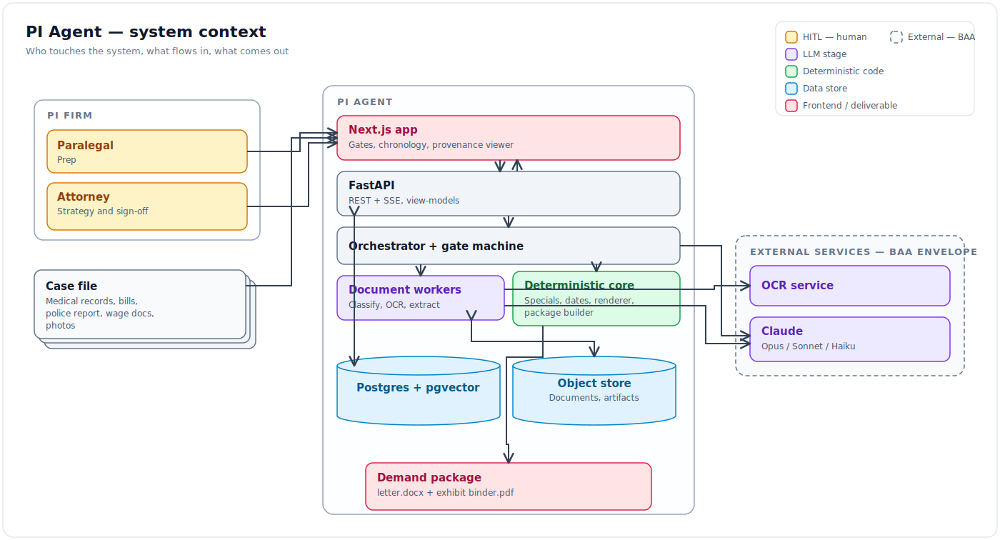
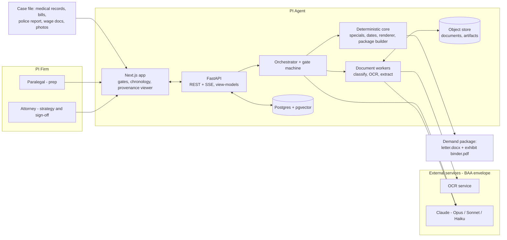
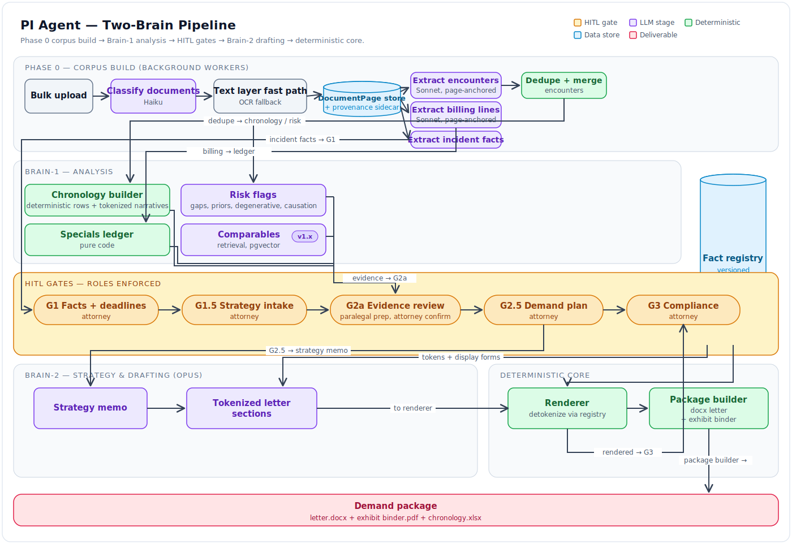
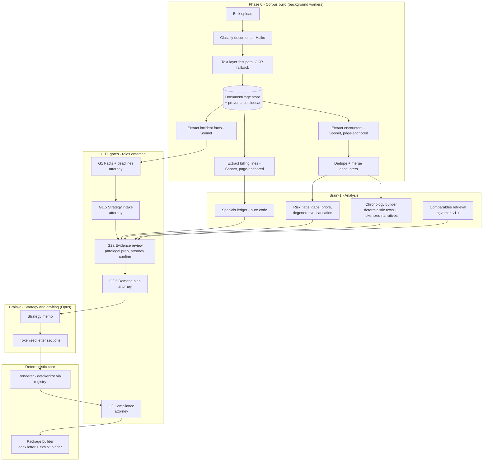
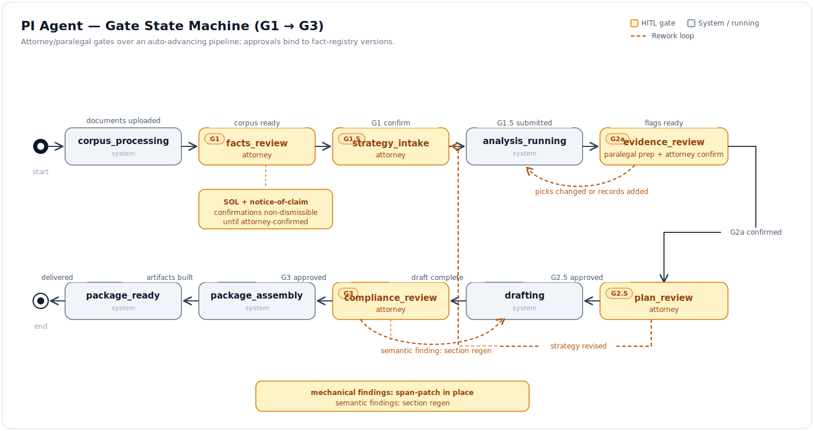
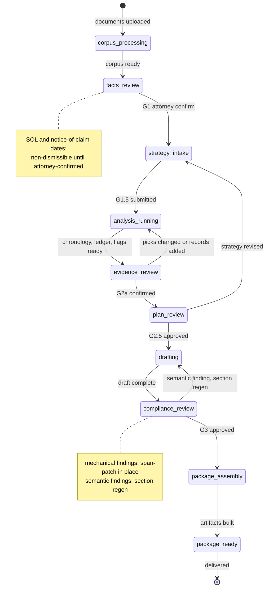
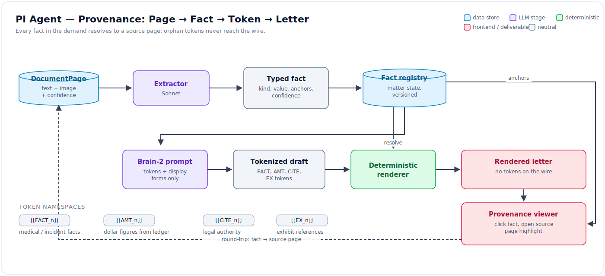
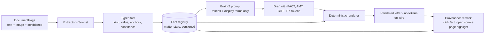
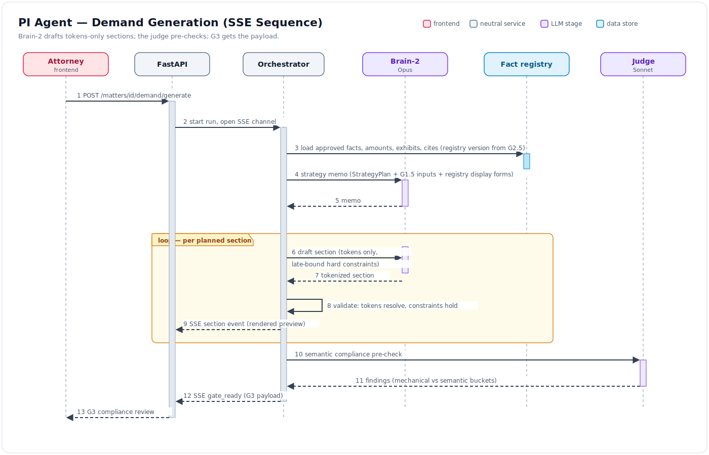
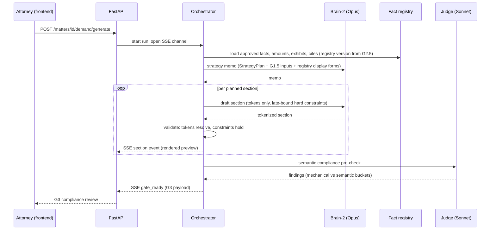

# PI Agent — High-Level Design

- **Status:** DRAFT for founder review · **Date:** 2026-07-03
- Companion docs: [00_vision_and_scope.md](./00_vision_and_scope.md) (why),
  [04_data_model_and_contracts.md](./04_data_model_and_contracts.md) (schemas/APIs),
  [05_implementation_plan.md](./05_implementation_plan.md) (how/when).

---

## 1. Design invariants

These are the PI edition of the TM system contract's core invariants. They are binding on
every module; the future `docs/system_contract.md` of the new repo starts from this list.

1. **The product is a gated copilot.** The system prepares; humans approve. No artifact
   leaves the system without passing its gate.
2. **Provenance or it doesn't ship.** Every factual assertion in any output resolves to
   one or more `(document, page)` anchors. Orphaned facts fail G3 — sentinel + log, never
   the wire.
3. **The LLM never does arithmetic.** Specials totals, wage loss, demand math, date math
   (SOL, treatment gaps) are pure code. LLM output references `[[AMT_*]]` tokens only.
4. **Deadlines are deterministic and attorney-confirmed.** SOL and notice-of-claim dates
   come from the jurisdiction rules table; the attorney confirms at G1; warnings are
   non-dismissible until confirmed.
5. **Tokenize or omit.** Anything the LLM could fabricate — provider names, diagnoses,
   dates of service, dollar amounts, legal citations, exhibit references — enters prompts
   and leaves drafts only as tokens resolved from the fact registry. Adverse facts are
   tokens too; stance is metadata, not a separate channel.
6. **Adverse facts: surface always, volunteer never.** Treatment gaps, priors, degenerative
   findings, prior claims are always shown to the attorney with required disposition
   (address / omit-with-rationale / need-more-records). They never appear in the letter
   without disposition = address, and are never silently dropped.
7. **PHI stays inside the BAA envelope.** Every external egress (LLM, OCR, storage, email,
   error tracking) is on a maintained BAA inventory. No PHI to non-BAA endpoints, including
   client-side analytics on matter pages.
8. **Role-gated sign-off.** Paralegals prepare (chronology edits, picks, dispositions
   prep); only attorneys approve G1, G1.5, G2.5, G3. Enforced server-side.
9. **Attorney final + auditable.** Overrides are `requires_override` (allowed, logged with
   reason) vs `unavailable` (hard stop). Every gate action records actor, role, payload hash.
10. **Extracted facts, human elections, and derived state stay separate.** Corpus
    extractions (what the records say), attorney/paralegal inputs (what humans decided),
    and derived artifacts (chronology, drafts) live in distinct stores; derived state is
    always rebuildable from the first two.
11. **The UI displays state; it does not invent it.** AI overlays exist only in view-models
    on the wire; frontend submissions never echo overlays back.
12. **Per-matter AI cost is metered and capped** — from day 1, on by default.
13. **Semantic checks are LLM checks; deterministic checks are code.** No code-side
    normalizers/allowlists patching semantic LLM output — fix the prompt or gate it.
14. **Silent wrong output requires diagnostics before fixes.** Per-matter run logs
    (ingest / extraction / rules / drafting) are written for every phase; debugging starts
    from logs.

## 2. System context

Mermaid source

## 3. Two-Brain pipeline

Same separation as the TM system: **Brain-1** turns raw documents into verified, anchored
structure; **Brain-2** turns attorney-approved structure into persuasive prose. A
**deterministic core** sits between and beneath both — everything money, dates, and
rendering.

Mermaid source

### Model tiering (TM model-assignment principles, unchanged)

| Role | Model | Work |
|---|---|---|
| Strategist / Drafter (Brain-2) | Opus | Strategy memo, letter sections, valuation narrative |
| Extractor (Brain-1) | Sonnet | Encounter/billing/incident extraction, chronology narratives, semantic compliance checks |
| Light lookups | Haiku | Document classification, dedup hints, routing fallback triage |

Structured outputs with retry everywhere (JSON extraction converges on retry); no tier
downgrades without an A/B on fixtures.

## 4. Gate machine

Mermaid source

| Gate | State | Role | Reviews / decides | Produces |
|---|---|---|---|---|
| G1 | `facts_review` | Attorney | Incident facts, parties, coverage, **SOL + notice deadlines** | Confirmed `CaseFacts`, deadline confirmations |
| G1.5 | `strategy_intake` | Attorney | Liability theory, injury framing, emphasis notes, anchor amount, venue posture | `StrategyInputs` (verbatim attorney signal to Brain-2) |
| G2a | `evidence_review` | Paralegal prep → attorney confirm | Chronology edits, exhibit include/exclude (page-level), **risk-flag dispositions**, comparables picks | Approved evidence set + fact registry freeze for drafting |
| G2.5 | `plan_review` | Attorney | Section plan, demand amount, deadline type (time-limited vs open) | `StrategyPlan` — the drafting contract |
| G3 | `compliance_review` | Attorney | Deterministic panel (tokens, totals, anchors) + semantic findings | Approved draft → package build |

Notes:
- **Late-arriving records** (common: a missing provider's records show up) re-enter at
  `corpus_processing` and force `evidence_review` again; the gate machine treats the fact
  registry as versioned, and G2.5/G3 approvals bind to a registry version.
- G1.5 is the **highest quality-per-hour surface** (TM input-gate-leverage lesson):
  attorney strategy inputs are structured, preflighted (v1.x), and passed to Brain-2
  verbatim as signal — not paraphrased away.

## 5. Provenance architecture

Mermaid source

- **Token namespaces:** `[[FACT_n]]` (medical/incident facts), `[[AMT_n]]` (all dollar
  figures — resolved from the ledger), `[[CITE_n]]` (legal authority), `[[EX_n]]`
  (exhibit references). Single registry, one namespace per matter (TM doctrine-fit lesson:
  one token namespace, segregated legends caused pain).
- **Registry entry:** `{token_id, kind, value, display_form, anchors[{doc_id, page, bbox?}],
  status: verified|unverified, source: extractor|attorney|rules}`.
- **Wire discipline:** nothing token-shaped reaches the frontend; orphans render as a
  sentinel and log loudly (port of the TM no-citation-tokens-in-UI rule).
- **Three-lane partition (TM carry-over):** `fact_registry` (tokenized truth) /
  `exhibit_appendix` (the binder: real documents with Bates numbers) /
  `intelligence_layer` (Brain-1 analysis, comparables, valuation context — advisory only).

## 6. Jurisdiction rules layer

Port of the TM routing architecture: **lawyer-audited YAML, engineer-owned Python.**

- **YAML (legal cofounder audits):** per state × claim type — SOL, notice-of-claim
  deadlines (gov-entity traps), comparative fault regime (pure / modified 50 / modified 51),
  billed-vs-paid rule for medicals (e.g., CA *Howell* line — verify), damages caps,
  PIP/no-fault flags, time-limited-demand statutes (e.g., GA O.C.G.A. § 9-11-67.1, FL
  presuit regime — **verify every statutory detail before the YAML ships**; TM lesson:
  fabricated foundational cites).
- **Python (engineering):** `HybridEngine` port — rules-first lookup at MVP; the LLM
  fallback for unmatched situations lands v1.x (feature F2), every fallback logged with a
  typed `diagnostic.kind` the frontend can trust.
- Rules **surface as gate content** (G1 deadline confirmations, G2.5 letter-structure
  requirements), never as silent behavior changes.

## 7. Risk-flag subsystem (adverse facts)

| Flag kind | Detection | Default severity |
|---|---|---|
| `treatment_gap` | Date math over encounters (e.g., >30 days pre-MMI) | high |
| `preexisting_condition` / `prior_claim` | Extractor labels + intake answers | high |
| `degenerative_finding` | Imaging-report language labels | medium |
| `causation_ambiguity` | Mechanism vs injury mismatch heuristics + extractor | high |
| `liability_weakness` | Police report fault indicators against client | high |
| `low_property_damage` | Damage estimate vs injury severity | medium |
| `third_party_phi` | Other patients' info detected in records | high (redaction path) |

Dispositions at G2a: `address_in_letter` / `omit_with_rationale` / `need_more_records`.
High-severity flags block G2a confirm until dispositioned by the attorney. Flags carry
anchors like any fact — the attorney sees the page, not a paraphrase.

## 8. Demand generation sequence

Mermaid source

SSE vocabulary and payload shapes: [04_data_model_and_contracts.md](./04_data_model_and_contracts.md) §4.
No internal-reasoning events on the wire (TM rule, carried).

## 9. Rework loops

- **Mechanical G3 finding** (wrong amount reference, broken anchor, missing required
  statutory term): span-patch the rendered section in place; no LLM regen.
- **Semantic G3 finding** (unsupported causation claim, tone/strategy drift, volunteered
  adverse fact): regen that section with the finding appended to hard constraints.
- **Registry drift** (late records after G2.5): approvals bind to registry versions;
  drift invalidates downstream approvals explicitly — never silently.

## 10. What Brain-1 explicitly is NOT

Brain-1 does not draft, does not value the case, does not decide what to emphasize. It
extracts, assembles, flags, and retrieves. Valuation and emphasis are attorney judgments
made at G1.5/G2.5 with Brain-1's evidence in front of them (TM lesson: determinizable →
gate; open-ended synthesis → agent loop; interpretive judgment → attorney).

## 11. TM concepts deliberately not carried

- Trademark doctrine modules (DuPont factor machinery, §2(e)(1) packet system, elections)
  — PI has no examiner doctrine to route; the analog (injury/liability typology) stays as
  YAML + strategy inputs until real cases demand more.
- TMEP RAG (dormant there, no analog corpus worth building yet).
- Per-cited-mark consent, foundational-citation floors, coverage-gap expansion,
  TSDR/CourtListener integrations (replaced by comparables corpus, v1.x).
- Single-artifact assumption: the TM system produces one response document; PI's package
  builder is multi-artifact from day 1.
