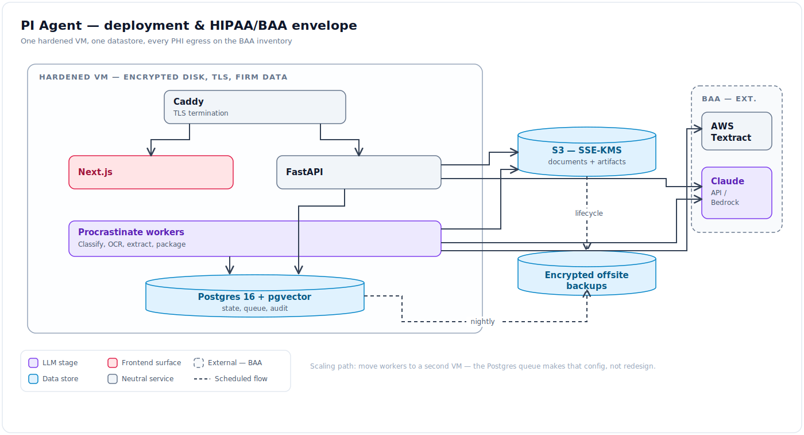
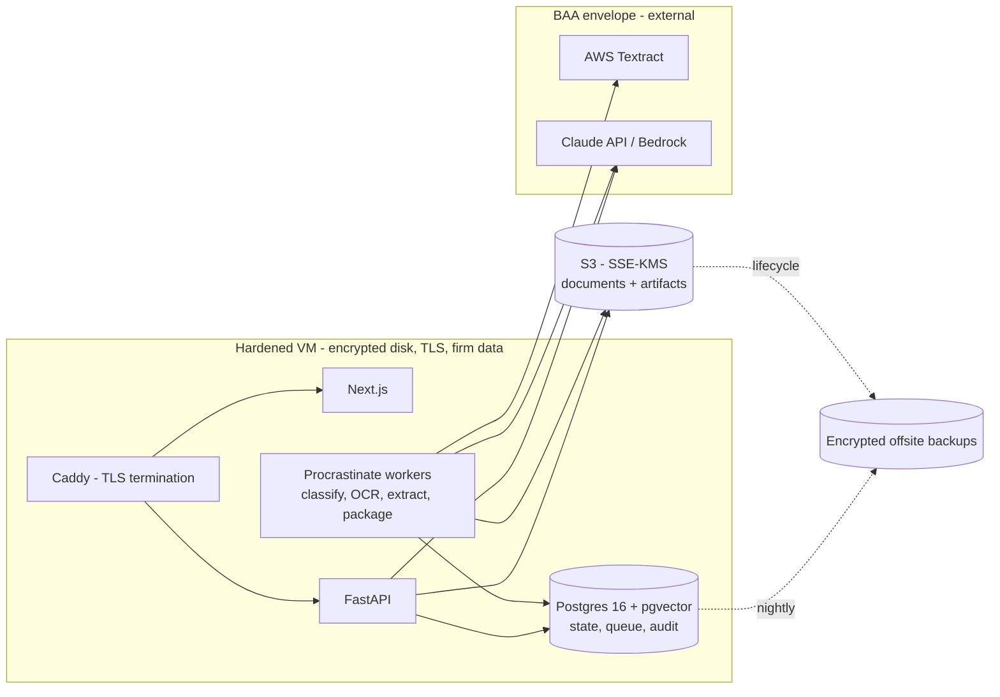

# PI Agent — Tech Stack

- **Status:** DRAFT for founder review · **Date:** 2026-07-03
- Bias: **boring, minimal, and already-proven in the TM system**. New technology enters
  only where PI genuinely differs (OCR scale, PHI, docx output).

## 1. Decisions at a glance

| Layer | Choice | Why | Alternatives considered |
|---|---|---|---|
| Backend | Python 3.12 + FastAPI + Pydantic v2 | Direct pattern reuse from TM backend (routes, SSE, view-models) | — |
| Background jobs | **Procrastinate** (Postgres-backed queue) | Phase 0 OCR/extraction can't run in-request; Postgres-only keeps infra to one datastore | Celery+Redis (more ops), arq (adds Redis) |
| Database | Postgres 16 + **pgvector** | Matter state, queue, audit, comparables retrieval — one engine (TM pgvector pattern) | Dedicated vector DB (unjustified) |
| Migrations | Alembic | Standard | — |
| Object store | S3 (SSE-KMS) prod / MinIO dev | Case files are GBs; BAA available; presigned upload/download | Filesystem (no durability story) |
| OCR / doc parsing | **pdfplumber text-layer fast path → AWS Textract fallback**; Tesseract for dev | Textract is HIPAA-eligible, strong on tables (bills); fast path keeps cost down | Google Document AI, Azure Doc Intelligence (bake-off in Spike S1) |
| Semantic extraction | Claude **Sonnet** structured outputs; vision on image-only pages | Extractor tier per TM model-assignment principles | Fine-tuned extraction models (later, if cost demands) |
| Strategy / drafting | Claude **Opus** | Strategist/drafter tier — don't downgrade without A/B | — |
| Light lookups | Claude **Haiku** | Classification, dedup hints, routing triage | — |
| LLM access | Anthropic w/ BAA + zero-data-retention, or **Bedrock** if AWS-centric | PHI in prompts requires BAA; abstract behind provider layer (port `core/llm_provider.py` + telemetry hooks) | Direct API without BAA (not permissible) |
| Frontend | Next.js 15 + TypeScript + Tailwind + shadcn/ui | Matches TM frontend; team velocity | — |
| FE data | TanStack Query + `fetch-event-source` SSE | Matches TM SSE patterns | — |
| PDF viewing | pdf.js (react-pdf) + custom highlight overlay | Provenance viewer needs page render + anchor boxes | Commercial viewers (Apryse) if pdf.js perf fails on 2,000-page binders |
| Letter output | python-docx | Attorneys edit in Word — non-negotiable deliverable format | HTML→docx converters (fidelity risk) |
| Binder output | pypdf (collation, bookmarks) + reportlab (Bates stamping) | Deterministic, no external service | — |
| Auth | fastapi-users (argon2, TOTP) self-hosted | Avoids a BAA dependency for the identity layer at MVP | Auth0 w/ BAA (cost), Clerk (no BAA) |
| Backend tests | pytest (+ hypothesis for the money engine), `INTEGRATION_TESTS=0` flag pattern | TM test discipline carried | — |
| FE tests | Vitest + RTL + jsdom | TM frontend stack carried | — |
| Deploy | Docker Compose on one hardened VM; Caddy for TLS | TM single-VM simplicity; HIPAA hardening checklist below | ECS/Fly when >1 VM justified |
| Error tracking | Self-hosted GlitchTip (or Sentry w/ scrubbing + self-host) | No PHI to third-party trackers | SaaS Sentry (only with aggressive scrub + review) |

## 2. What we port from the TM codebase (starting points, not dependencies)

Copy-adapt into the new repo; do **not** import across repos.

| TM source | Becomes |
|---|---|
| `trademark_agent_backend/app/engine/orchestrator.py` (+ gate machine) | `engine/orchestrator.py`, PI gate states |
| `trademark_agent_backend/app/engine/routing/` (`HybridEngine` at `engines/hybrid.py:60`, YAML rules, diagnostics) | `rules/` jurisdiction engine |
| `trademark_agent_backend/app/engine/case_name_tokenizer.py` + renderer path | generalized fact tokenizer/renderer (`FACT/AMT/CITE/EX`) |
| `trademark_agent_backend/app/engine/exhibits/` + `evidence_appendix/` | `package/` exhibit binder builder |
| `trademark_agent_backend/app/engine/compliance.py` + correction splicer | G3 compliance panel (span-patch vs regen) |
| `trademark_agent_backend/app/engine/strategy_plan_emit.py` | G2.5 `StrategyPlan` emit |
| `trademark_agent_backend/core/llm_provider.py` + `app/core/llm_telemetry.py` + `app/core/matter_budget.py` | provider layer + metering, **wired ON from day 1** (TM lesson: partial wiring undercounts) |
| `trademark_agent_backend/app/api/sse_utils.py` + `view_models.py` | SSE + view-model wire discipline |
| `trademark_agent_backend/app/assistant_lite/` | in-matter assistant (v1.x) |
| `docs/system_contract.md` + `docs/module_contracts/` + `trademark_agent_backend/CONTRACTS.md` (drift matrix) + `make verify` gate | same doc architecture, PI content |

## 3. HIPAA envelope (architectural constraint, not paperwork)

The single biggest environmental difference from trademark work (public data) — this shapes
vendor choice, logging, evals, and deploy.

1. **BAA inventory** (a checked-in doc, updated on any new egress): cloud provider, LLM
   provider (Anthropic enterprise ZDR or Bedrock), OCR service, backup target, error
   tracker, transactional email. Nothing touches PHI unless it's on the list.
2. **Encryption:** TLS everywhere; encrypted disks; S3 SSE-KMS; encrypted offsite backups.
3. **Access controls + audit:** firm tenancy enforced at the query layer; append-only audit
   table for gate actions, artifact builds, document/page reads (access-log requirement).
4. **Minimum necessary in prompts:** extraction prompts get pages, not the whole corpus;
   drafting gets registry display forms, not raw records.
5. **Eval fixtures are de-identified:** safe-harbor de-identification pipeline (automated
   scrub + mandatory manual pass) before any pilot matter becomes a golden fixture. No live
   PHI in the repo, CI, or eval logs.
6. **Third-party-patient PHI:** records routinely contain other patients' pages —
   `third_party_phi` risk flag routes to redaction/exclusion before binder build.
7. **No PHI in client-side telemetry:** no third-party analytics scripts on matter pages.
8. **Retention/deletion:** per-matter export + deletion honoring legal holds (v1.x feature
   G8, but schema designed for it from M0 — deletion keys by matter).

## 4. Deployment

Mermaid source

Scaling path (only when a real bottleneck appears): move workers to a second VM; the
Postgres queue makes that a config change, not a redesign.

## 5. Cost model (order-of-magnitude, per demand)

| Stage | Basis | Estimate |
|---|---|---|
| OCR | ~500 pages avg; text-layer fast path covers 40–70%; Textract on remainder (tables mode on bills only) | $1–8 |
| Extraction (Sonnet) | ~300–800K input tokens across pages | $2–6 |
| Chronology narratives (Sonnet) | per-encounter summaries | $1–3 |
| Strategy + drafting (Opus) | memo + 6–10 sections + regens | $3–10 |
| Compliance judge (Sonnet) | semantic pre-check | <$1 |
| **Total COGS target** | | **≤ $25** |

Metering (invariant 12) makes actuals visible per matter from the first pilot; treat these
numbers as hypotheses the meter will correct.

## 6. Explicit non-goals

- No Kubernetes, no microservices, no event bus — one API process, one worker pool, one DB.
- No Redis unless the Postgres queue measurably fails.
- No fine-tuned models at MVP — prompt + structured-output retries first.
- No case-management features (calendaring beyond deadline confirm, tasks, billing).

## 7. Repository strategy

**New repository (`pi-agent`), copy-adapt the TM patterns; do not share code.**

- The HIPAA envelope, corpora, deploy target, and acquirer story all differ — coupling the
  exit asset (TM) to an experiment (PI) is downside without upside.
- **Chassis extraction** (shared gate machine / tokenizer / telemetry package) is deferred
  under the rule of three: extract when a third vertical exists, not before. The port table
  in §2 is the interim contract for what "the chassis" is.
- This plans folder stays in the TM repo (it's where planning lives today); the code does not.

## 8. Open stack decisions (resolve during M0–M1)

1. **OCR vendor** — Spike S1 bake-off: Textract vs Google Document AI vs Azure DI on 3 real
   record sets (faxed, handwritten, clean EMR exports). Decision metric: page text coverage,
   bill-table fidelity, $/1K pages, BAA terms.
2. **LLM access path** — Anthropic direct (enterprise ZDR + BAA) vs Bedrock. Decide with the
   BAA paperwork, started at M0 (longest lead time in the plan).
3. **pdf.js performance** on 1,000+ page binders — if the viewer chokes, evaluate Apryse
   before building workarounds.
4. **Hosting region/account structure** — single AWS account vs separated prod account
   (lean toward separated for audit surface).
