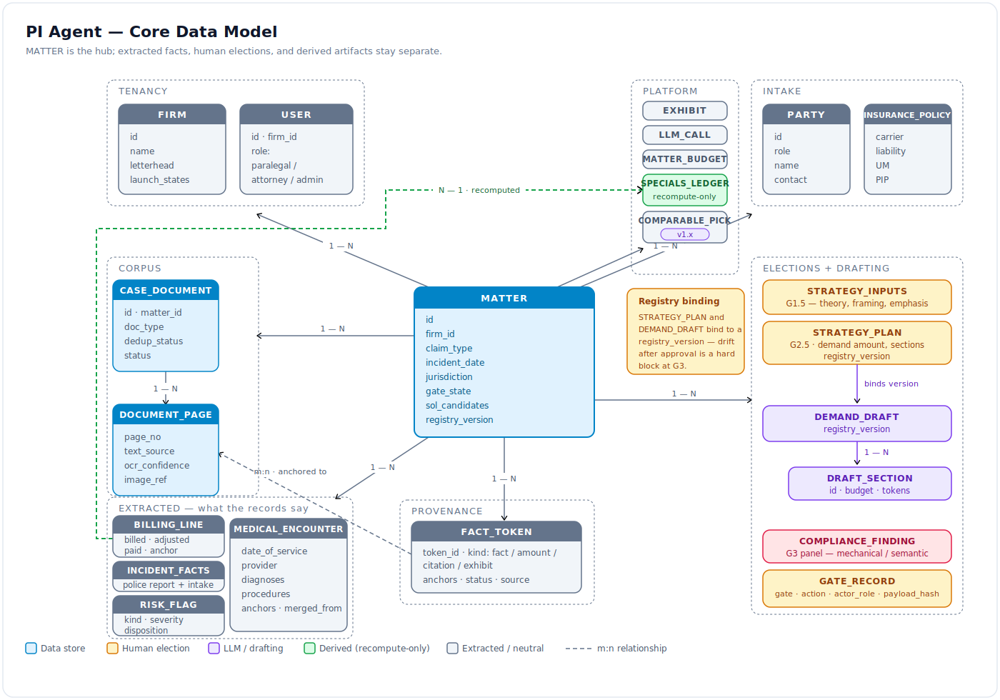
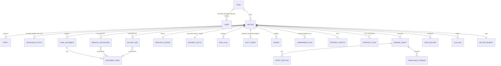

# PI Agent — Data Model, API Surface & Module Contracts

- **Status:** DRAFT for founder review · **Date:** 2026-07-03
- This is the low-level companion to [01_high_level_design.md](./01_high_level_design.md).
  Field lists are design-level — the implementing PR finalizes types; the invariants here
  are binding.

## 1. Entity model



<details>
<summary>Mermaid source</summary>



</details>

## 2. Core schemas (design sketch)

```python
class Matter:
    id: UUID; firm_id: UUID
    client_display_name: str
    claim_type: Literal["mva"]              # MVP: motor vehicle only
    incident_date: date; jurisdiction: str   # state code; venue county
    gate_state: GateState                    # the state machine enum
    sol_candidates: list[DeadlineCandidate]  # rules-computed; attorney-confirmed at G1
    registry_version: int                    # bumped on any fact-registry change

class CaseDocument:
    id: UUID; matter_id: UUID
    doc_type: Literal["medical_record","bill","police_report","wage_doc","photo","insurance_corr","other"]
    source_label: str                        # e.g. "Memorial Ortho records pull #2"
    page_count: int; dedup_status: Literal["unique","duplicate_of","partial_overlap"]
    status: Literal["uploaded","classified","ocr_done","extracted","failed"]

class DocumentPage:
    id: UUID; document_id: UUID; page_no: int
    text: str; text_source: Literal["text_layer","ocr"]; ocr_confidence: float | None
    image_ref: str                           # object-store key

class MedicalEncounter:
    id: UUID; matter_id: UUID
    date_of_service: date; provider: str; facility: str
    encounter_type: str                      # ER, imaging, PT, ortho, surgery, ...
    complaints: list[str]; findings: list[str]
    diagnoses: list[CodedItem]               # ICD-10 + text
    procedures: list[CodedItem]              # CPT + text
    work_status: str | None
    narrative_tokenized: str                 # Brain-1 summary, tokens only
    anchors: list[PageAnchor]                # ≥1 required
    merged_from: list[UUID]                  # dedup provenance

class BillingLine:
    id: UUID; matter_id: UUID
    provider: str; date_of_service: date; code: str | None
    billed: Money; adjusted: Money | None; paid: Money | None; outstanding: Money | None
    category: str                            # ER, imaging, PT, pharmacy, ...
    anchor: PageAnchor

class FactToken:
    token_id: str                            # FACT_12 / AMT_3 / CITE_2 / EX_5
    matter_id: UUID; registry_version: int
    kind: Literal["fact","amount","citation","exhibit"]
    value: JsonValue; display_form: str
    anchors: list[PageAnchor]
    status: Literal["verified","unverified"]
    source: Literal["extractor","attorney","rules"]

class RiskFlag:
    id: UUID; matter_id: UUID
    kind: RiskKind; severity: Literal["low","medium","high"]
    anchors: list[PageAnchor]; detail: str
    disposition: Literal["address_in_letter","omit_with_rationale","need_more_records"] | None
    disposition_by: UUID | None; disposition_rationale: str | None

class StrategyPlan:                          # G2.5 output — the drafting contract
    version: int; registry_version: int      # approvals bind to a registry version
    demand_amount: Money; demand_type: Literal["open","time_limited"]
    sections: list[PlannedSection]           # id, purpose, facts/amounts/cites budget
    emphasis_directives: list[str]           # from G1.5, preflighted

class GateRecord:
    matter_id: UUID; gate: str; action: Literal["approve","reject","override","edit"]
    actor_id: UUID; actor_role: str
    payload_hash: str; override_reason: str | None; created_at: datetime
```

Schema invariants (enforced in code + Tier-1 evals):

1. `MedicalEncounter.anchors` and `BillingLine.anchor` are non-empty — an unanchored
   extraction is a bug, not data.
2. `SPECIALS_LEDGER` is a **derived view** — always recomputable from `BILLING_LINE`;
   never hand-edited (corrections edit billing lines, ledger recomputes).
3. `DEMAND_DRAFT`, `STRATEGY_PLAN` carry `registry_version`; a version mismatch at G3 is a
   hard block ("records changed since plan approval").
4. Extracted facts / human elections / derived artifacts live in separate tables — derived
   rows are rebuildable (HLD invariant 10).
5. All money is integer cents + currency; all arithmetic in the ledger engine.

## 3. API surface (REST + SSE)

View-model discipline carried from TM: AI overlays exist only in `view_models` on
responses; submissions never echo overlays back.

| Method & path | Purpose | Notes |
|---|---|---|
| `POST /api/matters` | Create matter | Returns deadline candidates immediately |
| `GET /api/matters/{id}` | Matter + gate state view-model | |
| `POST /api/matters/{id}/documents/bulk` | Register uploads → presigned S3 PUTs | Resumable |
| `POST /api/matters/{id}/phase0/run` | **SSE** — classify/OCR/extract progress | Re-entrant for late records |
| `GET /api/matters/{id}/documents/{doc}/pages/{n}` | Page text + image URL | Provenance viewer backend |
| `GET /api/matters/{id}/gates/current` | Typed payload for the active gate | One endpoint, payload discriminated by gate |
| `POST /api/matters/{id}/gates/{gate}/submit` | Approve / reject / edit / override | Role-checked server-side; writes `GateRecord` |
| `POST /api/matters/{id}/analysis/run` | **SSE** — Brain-1 (chronology, ledger, flags) | |
| `POST /api/matters/{id}/demand/generate` | **SSE** — Brain-2 (memo, sections, G3 payload) | Binds to `StrategyPlan.version` |
| `GET /api/matters/{id}/artifacts` | letter.docx, binder.pdf, chronology.xlsx | Presigned downloads |
| `GET /api/matters/{id}/provenance/{token_id}` | Anchors for a fact | Click-through |
| `POST /api/matters/{id}/assistant/query` | **SSE** — read-only Q&A (v1.x) | Page-cited answers |
| `GET /api/matters/{id}/budget` | Spend vs cap | |

## 4. SSE event vocabulary

| Event | Emitted during | Payload core |
|---|---|---|
| `status` | all runs | `{phase, step, counts}` — progress only |
| `doc_state` | phase0 | `{document_id, status, pages_done}` |
| `section` | demand generation | `{section_id, rendered_preview}` — rendered, never tokenized |
| `gate_ready` | any run completing into a gate | `{gate, payload_version}` |
| `artifact_ready` | package build | `{artifact_kind, url}` |
| `budget_warning` | any | `{spent, cap}` at 80% |
| `error` | any | typed, user-safe message |

Rules: no `agent_reasoning`/`agent_thinking` events (TM rule — leaks design, unused by UI);
`currentStep` stays on the owning gate for the whole stream — the frontend uses an
`isRunning` flag, not step churn (TM `currentStep`/`isResearching` lesson).

## 5. Module map (backend)

```
pi_agent_backend/
  app/
    api/            # routes, sse_utils, view_models — wire discipline lives here
    core/           # config, llm_telemetry, matter_budget, audit
    corpus/         # phase0: upload, classify, ocr, page store, extract, dedupe
    engine/
      orchestrator.py   # gate machine + run coordination
      brain1/           # chronology builder, risk flags, comparables (v1.x)
      brain2/           # strategy memo, section drafter, prompt assembly
      compliance/       # G3 panel: deterministic checks + semantic judge + span-patch
      tokenizer/        # fact registry, token namespaces, renderer
    rules/          # jurisdiction YAML + hybrid engine + diagnostics
    money/          # specials ledger, wage loss, demand math (pure, property-tested)
    package/        # docx letter, exhibit binder, Bates, redaction
    assistant_lite/ # v1.x, read-only
    models/         # schemas.py — single source for shared types
  core/             # llm_provider.py (ported pattern: provider abstraction + hooks)
  tests/
docs/
  system_contract.md          # starts from HLD §1 invariants
  module_contracts/           # one per module below
CONTRACTS.md                  # drift matrix + gate (make verify)
```

Module contracts to write at M0 (one page each, TM `docs/module_contracts/` convention —
vocabulary, boundary, what may import what):

`corpus.ingest` · `corpus.extraction` · `engine.orchestrator` · `engine.brain2` ·
`engine.compliance` · `engine.tokenizer` · `rules.jurisdiction` · `money.ledger` ·
`package.builder` · `api.view_models` · `core.llm_telemetry` · `core.matter_budget`

Level-2 component designs (responsibility, boundaries, types, failure modes, tests) live in
[components/](./components/README.md); end-to-end dynamics in [system_flows/](./system_flows/README.md).

Ownership boundaries (day-1 versions):

- Only `engine/tokenizer` mints tokens; only `package/` + `api/view_models` render them.
- Only `money/` performs arithmetic on `Money`.
- Only `rules/` reads jurisdiction YAML; consumers receive typed decisions + diagnostics.
- `corpus/` never imports from `engine/` (extraction is upstream of analysis).
- Nothing imports `api/` except `main.py`.

## 6. Frontend surface map

| Surface | Gate | Key components |
|---|---|---|
| Matter dashboard | — | gate stepper, deadline banner (non-dismissible pre-G1), budget chip |
| Document center | Phase 0 | upload, classification review, dedup queue, low-confidence queue (v1.x) |
| Facts & deadlines | G1 | incident facts form, coverage table, deadline confirmations |
| Strategy intake | G1.5 | structured strategy form (theory, framing, anchor amount, emphasis notes) |
| Evidence workbench | G2a | chronology grid (editable), specials ledger grid, risk-flag panel w/ dispositions, exhibit picker (page-level), comparables picks (v1.x) |
| Demand plan | G2.5 | section plan editor, demand amount, deadline type |
| Compliance review | G3 | finding list (mechanical/semantic buckets), letter preview w/ provenance click-through |
| Package | post-G3 | artifact downloads, provenance report (v1.x) |
