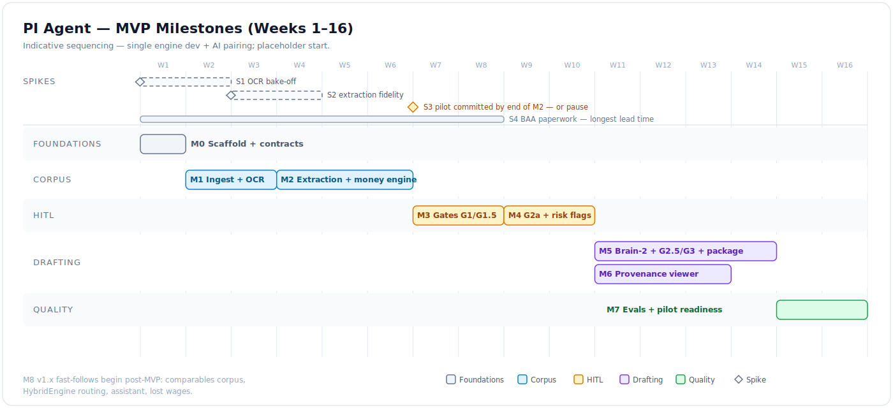
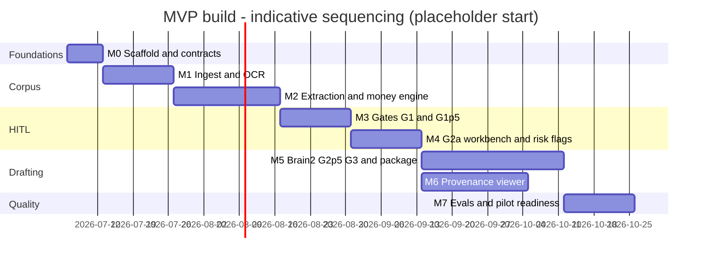

# PI Agent — Low-Level Implementation Plan

- **Status:** DRAFT for founder review · **Date:** 2026-07-03
- Scope: MVP as drawn in [02_feature_list.md](./02_feature_list.md) (MVA, adult plaintiff,
  pre-litigation demand, 3–5 launch states). Assumes: single engine dev + AI pairing,
  data cofounder on corpora/fixtures, legal cofounder on rules/SME review.
- Durations are indicative, not commitments; the gantt start date is a placeholder.

## 0. De-risking spikes (before/while M1)

| Spike | Question | Method | Kill criterion |
|---|---|---|---|
| **S1 OCR bake-off** | Can we get ≥98% usable page text + faithful bill tables at ≤$8/case? | Textract vs Google DocAI vs Azure DI on 3 real record sets (faxed, handwritten, clean EMR) | No vendor ≥95% page coverage on the faxed set → MVP narrows to text-layer + clean-scan cases |
| **S2 Encounter extraction fidelity** | Does Sonnet + structured outputs hit ≥95% encounter recall with correct anchors? | 50-page gold-labeled sample; measure recall/precision/anchor accuracy | <90% recall after prompt iteration → add a page-classification pre-pass, re-scope M2 |
| **S3 Pilot firm** | Do we have a committed design partner with real MVA files? | Legal cofounder recruits (IP-firm playbook → PI referral network) | No pilot by end of M2 → pause build (vision doc §8 decision point) |
| **S4 BAA paperwork** | Anthropic ZDR+BAA or Bedrock; Textract BAA; hosting account | Start at M0 — longest lead time | Blocks first PHI processing, not development (fixtures are synthetic until signed) |

> **2026-07-03 update:** under the adopted captive-firm model
> ([07](./07_captive_firm_model.md)), **S3 is superseded — the captive firm is the
> pilot** — and launch states collapse to **Arizona only**. A parallel legal track
> (M-1: ethics counsel, ABS application, AZ attorney hire) runs alongside M0–M2; see
> [08 §5](./08_seed_plan_and_budget.md) for the merged timeline.

## 1. Milestones

### M0 — Repo scaffold & contracts (week 1)

- New repo `pi-agent`: backend/frontend skeletons, Docker Compose (Postgres+pgvector,
  MinIO, worker), Alembic, CI (pytest, vitest, lint), `make verify` (tests + contracts
  drift check, TM `hub-check` pattern).
- Docs from day 1: `AGENTS.md` hub, `docs/system_contract.md` seeded from
  [01_high_level_design.md](./01_high_level_design.md) §1, empty
  `docs/module_contracts/` stubs for the 12 modules in
  [04_data_model_and_contracts.md](./04_data_model_and_contracts.md) §5, `CONTRACTS.md`
  drift matrix.
- Port + wire: `core/llm_provider.py` pattern, `llm_telemetry`, `matter_budget` —
  **metering ON before the first LLM call is written** (TM lesson).
- Auth skeleton (fastapi-users), firm tenancy, role model, append-only audit table.
- **Exit:** `make verify` green; the **module-contract bundle** is merged — Pydantic
  schemas + enums as code, Alembic baseline migration, the gate-transition guard table,
  idempotency-key scheme, audit event schema, and API contract tests for
  [04 §3](./04_data_model_and_contracts.md) ([10 §5](./10_implementation_readiness.md)
  checklist); a matter can be created via API with deadline candidates computed from a
  stub rules table.

### M1 — Ingest & corpus (weeks 2–3)

- Bulk upload → presigned S3, upload sessions, resumability.
- Classifier (Haiku, structured output) + manual reclassification endpoint.
- Page pipeline: pdfplumber text-layer fast path → OCR fallback adapter (vendor per S1;
  Tesseract adapter for dev/CI) → `DocumentPage` store with confidence + image refs.
- Dedup: page-hash exact + shingled fuzzy overlap → `dedup_status`, quarantine queue.
- Phase 0 SSE run (`status`, `doc_state` events), re-entrant for late documents.
- **Exit:** a real 500-page case file ingests unattended to a browsable page store;
  dupes quarantined; per-page provenance intact.

### M2 — Extraction & deterministic cores (weeks 4–6)

- Encounter extractor (Sonnet, structured outputs, page anchors); encounter merge
  (same-visit resolution across record pulls, `merged_from` provenance).
- Billing-line extractor (Textract table output + Sonnet reconciliation).
- `money/` ledger engine: categories, billed/adjusted/paid rollups, jurisdiction
  billed-vs-paid flag — pure functions, **hypothesis property tests** (permutation
  invariance, category sums = grand total, cents-exact).
- Chronology builder: deterministic row assembly + tokenized per-encounter narratives;
  fact registry v1 (`FACT`/`AMT` namespaces, versioning).
- Incident-facts extractor (police report).
- **Exit (Tier-1 evals):** on 2 gold fixtures — encounter recall ≥95%, ledger reconciles
  to the penny, every encounter/billing line anchored, chronology has zero unregistered
  claims.

### M3 — Gate machine & G1/G1.5 (weeks 7–8)

- Orchestrator + gate state machine (port TM pattern), `GateRecord` audit,
  `requires_override` vs `unavailable` semantics.
- Jurisdiction rules v1 (launch states only): SOL, notice-of-claim, comparative fault,
  billed-vs-paid — YAML schema + loader + diagnostics; legal-cofounder audit workflow
  (every YAML row carries a source citation marked `verify` until audited).
- G1 UI: incident facts, coverage, **non-dismissible deadline confirmations**.
- G1.5 UI: structured strategy intake (theory, framing, anchor amount, emphasis notes).
- **Exit:** matter flows `corpus_processing → facts_review → strategy_intake →
  analysis_running` with full audit trail; deadline confirm enforced server-side.

### M4 — G2a evidence workbench & risk flags (weeks 9–10)

- Risk-flag engine: `treatment_gap` (date math), `preexisting`/`prior_claim`/
  `degenerative_finding`/`causation_ambiguity` (extractor labels), `low_property_damage`,
  `third_party_phi`; severity + anchors; disposition workflow (attorney-required on high).
- G2a UI: editable chronology grid, specials ledger grid (edits go to billing lines,
  ledger recomputes), exhibit picker with page-level include/exclude, risk-flag panel.
- Registry freeze on G2a confirm (`registry_version` bump discipline).
- **Exit:** paralegal preps and attorney confirms G2a on a fixture matter; high-severity
  flags block until dispositioned; exhibit picks drive a draft binder manifest.

### M5 — Brain-2, G2.5/G3, package (weeks 11–14)

- `StrategyPlan` emit (rules + Opus; TM `strategy_plan_emit` pattern) + G2.5 plan editor.
- Section drafter (Opus): tokens-only output, late-bound hard constraints per section;
  validator (tokens resolve, constraints hold); SSE `section` events (rendered previews).
- G3 compliance panel: deterministic checks (all tokens resolve; every `AMT` matches the
  ledger; anchors live; exhibit refs exist; statutory required terms present when a
  time-limited rule is active) + semantic judge (Sonnet: unsupported causation, strategy
  drift, volunteered adverse facts) — findings bucketed **span-patch vs section-regen**.
- `package/`: python-docx letter (letterhead slot), pypdf binder (bookmarks, exhibit
  index, Bates stamping), chronology.xlsx export; artifacts to object store.
- **Exit:** end-to-end demand on a fixture matter — G1→G3 → letter.docx + binder.pdf with
  zero unresolved tokens and ledger-exact numbers.

### M6 — Provenance viewer (weeks 11–13, overlaps M5)

- pdf.js page viewer + anchor highlight overlay; fact click-through from chronology,
  G3 preview, and risk flags; `GET /provenance/{token_id}` wiring.
- Anchor-integrity Tier-1 check (every rendered fact round-trips to a live page).
- Provenance report export (E4 — promoted to MVP: the per-demand audit artifact).
- **Exit:** click any fact in the G3 preview → correct source page with highlight, on the
  1,000-page fixture, in <2s.

### M7 — Evals, hardening, pilot readiness (weeks 15–16)

- Golden fixtures: 3 de-identified pilot matters (safe-harbor scrub pipeline + manual
  pass) — fixture policy per TM fixtures-from-live-cases discipline.
- Tier-1 suite in CI (anchors, ledger, tokens, SOL math, dedup precision); Tier-1.5
  LLM-rubric judges (chronology completeness vs gold, narrative faithfulness, letter
  rubric); Tier-2 SME grading loop **against run logs** (grade-against-logs discipline).
- HIPAA checklist audit (BAA inventory complete, audit-log coverage, backup restore
  drill); load test: 2,000-page matter through Phase 0.
- Pilot onboarding: firm letterhead template, launch-state YAML audited.
- **Exit:** pilot firm runs a real matter with founder supervision.

### M8 — v1.x fast-follows (post-MVP, ordered)

1. Comparables corpus + retrieval (public verdict data + firm's closed cases; pgvector).
2. HybridEngine letter-structure routing (port `app/engine/routing/` wholesale).
3. `assistant_lite` port (read-only, page-cited).
4. Lost-wages module; redaction assist; low-confidence page queue; strategy-note preflight.
   (Provenance report moved to MVP — E4, built in M6.)

Mermaid source

## 2. Team split

| Owner | Workstream |
|---|---|
| Engine dev (you) | M0–M6 build; eval harness |
| Data cofounder | S1 OCR bake-off corpus; gold labeling for S2/M2; fixture scrub pipeline; comparables corpus (M8) |
| Legal cofounder | S3 pilot recruitment; jurisdiction YAML authorship + audit (every entry source-cited and verified — no unverified statutory claims ship); SME rubric + Tier-2 grading; demand-letter quality bar |

## 3. Risk register

| Risk | Exposure | Mitigation |
|---|---|---|
| OCR quality on faxed/handwritten records | MVP viability | S1 kill criterion; confidence scores + review queue; narrow intake if needed |
| Encounter dedup/merge precision | Chronology trust | `merged_from` provenance; fixture metric; quarantine over silent merge |
| Demand quality below incumbent bar | Pilot churn | Tier-1.5 rubric + legal-cofounder grading before pilot sees output; G1.5 signal richness |
| BAA lead time | Pilot start date | S4 starts at M0; synthetic fixtures until signed |
| Fabricated statutory/rule content | Malpractice-grade | Rules YAML requires verified source citations (TM verify-foundational-citations lesson); tokenize-or-omit for `CITE` |
| Scope creep toward case management | Timeline | Vision §9 non-goals; feature list is the fence |
| Strategic-fit ambiguity (second vertical vs chassis-proof) | Wasted build | Decision gate at end of M1 (vision §8) |

## 4. Definition of done (every milestone)

1. `make verify` green (tests + contract drift gate).
2. New/changed module contracts updated in the same PR (contract-first-change discipline).
3. Tier-1 evals extended for any new deterministic invariant.
4. Per-matter run logs written for any new phase (log-to-per-case-files discipline).
5. No lint regressions (frontend baseline file, TM pattern).

## 5. Open questions

*Original items 1–3 are superseded by the captive-firm adoption
([07 §5](./07_captive_firm_model.md)): strategic fit → decided ([00 §8](./00_vision_and_scope.md),
funding two-track in [08](./08_seed_plan_and_budget.md)/[09](./09_bootstrap_abs_path.md));
launch states → **Arizona only**; pilot economics → the captive firm is the pilot.*

1. Naming/trademark check on the product name before anything customer-facing.
2. Gate M-1 blockers (ethics counsel, equity split, Bao's role, TM↔NewCo IP separation) —
   tracked with owners in [10_implementation_readiness.md](./10_implementation_readiness.md).
3. Case-model validation (fee / CPA) with Phoenix PI operators before either funding track
   commits ([08 §3](./08_seed_plan_and_budget.md), [09 §9](./09_bootstrap_abs_path.md)).
