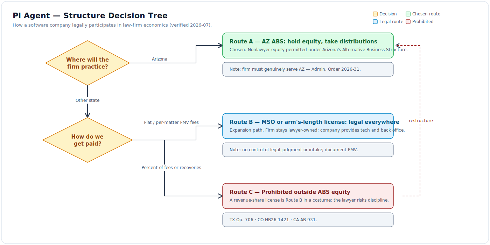
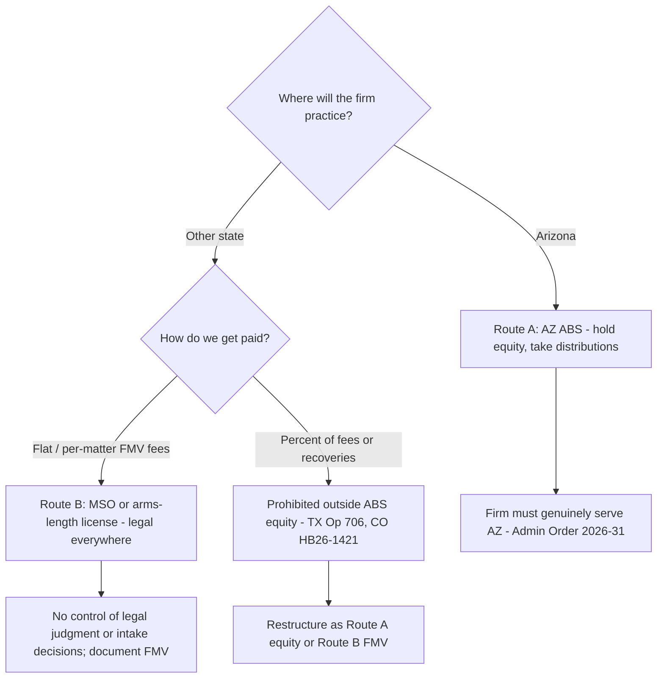
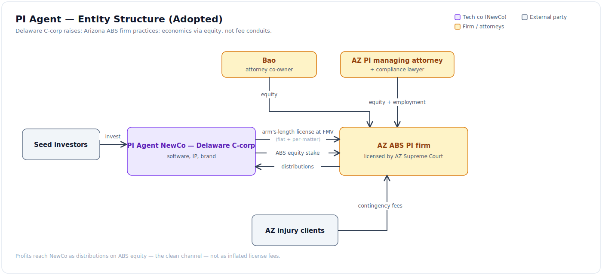
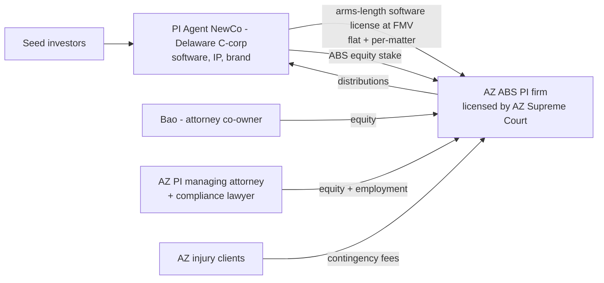

# PI Agent — Captive Firm Model (ABS / MSO Structure)

- **Status:** DIRECTION ADOPTED 2026-07-03 (founders + Bao) — structure pending ethics counsel
- **Regulatory facts verified by web recon 2026-07-03**; statute/opinion cites dated inline.
- ⚠️ **Nothing here is legal advice. Gate M-1 (below) — a legal-ethics specialist who does
  these deals papers the structure before any entity is formed.**

## 1. Thesis

Instead of selling demand software into EvenUp's market ([06](./06_competitive_landscape.md)),
we capture the demand-side economics directly: **found a personal-injury law firm, run it
on our software, and participate in its profits through a legal structure.** A signed MVA
case yields a $5–15K contingency fee; software that cuts prep cost and settlement latency
changes the firm's unit economics — worth far more than a $299/mo seat. This also
dissolves two of the plan's open risks: the pilot firm (S3 — the captive firm *is* the
pilot) and the comparables cold start (we own the outcomes data).

Precedent that this exact shape works: **Justpoint** (tech co + captive Arizona ABS
mass-tort firm, approved July 2025), **Eudia** and **Manifest** (AI-native firms under AZ
ABS), **Crosby** (Sequoia/Index/Lux-backed tech co + affiliated law firm, $85.8M raised),
**KPMG Law US** (first Big Four ABS, Feb 2025). No software company was found extracting
profits from *someone else's* existing firm — everyone founds their own captive firm.
Bao's instinct ("establish a firm") is the version that exists in the wild.

## 2. The three legal routes ("possible in some states," made precise)

### Route A — Own equity in the firm: Arizona ABS ✅ (chosen)

- Arizona abolished Rule 5.4 (2021). Nonlawyers may hold equity in a licensed
  **Alternative Business Structure**. ~151 ABS entities licensed by early 2026;
  **PI is the #1 practice area** among them (ABS Committee Annual Report CY2024).
- Requirements (ACJA § 7-209, as amended by Admin. Order 2026-31, eff. 2026-03-18):
  Arizona-licensed **Compliance Lawyer** on staff; background checks for anyone with >10%
  ownership or decision authority; AZ entity registration; Committee interview within 60
  days of complete application; Supreme Court approval; semi-annual compliance audits.
- Costs: ~$9K application + ~$9K/yr renewal (Regular ABS; Admin. Order 2025-138 fee
  schedule) + ethics counsel to paper it. License runs ~2 years, renewable, non-transferable.
- PI precedents: Justpoint Law LLP (first US PI/mass-tort ABS), Esquire Law (Fortress
  holds a disclosed 20% economic interest — Bloomberg Law 2025-08-27), Shine Lawyers,
  Law Bear (pending 2026-04).
- **2026 tightening to respect:** Admin. Order 2026-31 targets lead-gen-shell ABSs and
  requires licensure benefits to flow to Arizona — the firm must *genuinely practice in
  Arizona*, not be a national referral conduit.

### Route B — MSO (any state): legal, extraction method regulated ⚠️ (expansion path)

Firm stays 100% lawyer-owned; a management company (ours) provides tech, back office,
marketing under a Management Services Agreement. This is how PE is rolling up PI right now
(~a dozen MSO deals closed 2025, ~70 reported in pipeline; Rafi Law Services MSO raised
$125M at ~$450M valuation, 2026-03).

Hard rails (all 2025–2026, all verified):
- **Texas Opinion 706 (2025-02):** percentage-of-revenue MSO fee = prohibited fee-sharing
  *even if the MSO never practices law*. Flat, cost-plus, headcount/volume-tiered FMV fees
  are the compliant shapes.
- **Colorado HB26-1421 (signed 2026-06-03, eff. 2026-08-12):** statutory ban on MSO fees
  scaled to legal fees/revenue/profit/outcome, **with a substance-over-form anti-relabeling
  clause** and a private right of action.
- **California AB 931 (operative 2026-01-01):** bans CA-lawyer fee-sharing with
  out-of-state-ABS-affiliated lawyers; MSO carve-out only for flat-fee, no lead-payment,
  no recovery-scaling arrangements. (Under federal constitutional challenge — don't plan
  on it dying.)
- **Illinois SB3812/HB5487:** passed both chambers 2026-05-31, on the Governor's desk.
  **South Carolina Op. 25-02 (2026-03-13):** SC lawyers may not co-counsel with, own, or
  split fees with an ABS.
- "Control creep" doctrine (healthcare MSO precedent): formally compliant MSAs drift into
  de facto control → keep case strategy, client advice, and intake decisions contractually
  and actually with the lawyers.

### Route C — "License the software at fat fees and strip the profits" ❌

A software license priced as a percentage of firm revenue — or at multiples of fair market
value — is Route B wearing a costume. Texas Op. 706's bright line plus Colorado's
substance-over-form clause reach it; the lawyer risks discipline and the contract risks
unenforceability. **The honest version of this idea is Route A (equity distributions) or
Route B (FMV fees). We do not do Route C.**

### Decision tree

Mermaid source

## 3. Recommended structure

Mermaid source

- **NewCo (Delaware C-corp):** the venture-backable entity. Owns software + IP. VC money
  lands here. Licenses software to the firm at documented FMV — keeps the SaaS option open
  for licensing to *other* firms later (dual track).
- **The firm (AZ ABS):** NewCo holds an equity stake (size per ethics counsel + VC
  diligence; Fortress/Esquire at 20% is the public comp; Justpoint's split is undisclosed).
  Bao and the AZ managing attorney hold the rest. Profits reach NewCo as **distributions on
  ABS equity** — the clean channel — not as inflated license fees.
- **Key hires:** an **Arizona PI trial lawyer** (managing attorney; can dual-hat as
  Compliance Lawyer initially) is the scarce hire — PI is won on intake and reputation,
  not drafting. Bao is IP-side; his role is owner/strategist, not PI practitioner.
- **Why the attorney-gate architecture matters legally:** our G1–G3 design is structural
  evidence for Rule 5.4(c) professional independence — the software cannot ship a demand
  an attorney didn't approve. That goes in the ABS application.

## 4. Multistate reality (and what we don't do)

- An AZ ABS is authorized for **Arizona practice**. The national-expansion trick — AZ ABS
  fee-shares with local firms everywhere — is exactly what CA AB 931, CO HB26-1421,
  IL (pending), SC Op. 25-02, and Arizona's own 2026-31 order are closing, after the
  Arizona Republic found half of ABS licensees operating out of state (2026-02).
- **v1 = Arizona cases only.** Phoenix metro is a top-10 PI market; that's enough for
  proof. Expansion options, in order: (a) Utah-style / Washington-pilot states as they
  open (WA applications opened 2025-10), (b) MSO satellites with FMV fees in target
  states, (c) license the software to independent firms (SaaS dual track).
- PI venue follows the accident: an AZ firm serves AZ crashes. No referral-fee network.

## 5. What this changes in the build plan

| Plan element | Was ([05](./05_implementation_plan.md)) | Now |
|---|---|---|
| S3 pilot-firm spike | Recruit external design partner; pause without one | **Superseded — the captive firm is the pilot** |
| Jurisdiction rules v1 | 3–5 launch states | **Arizona only** (deep: SOL, comparative fault, UM/UIM, AZ solicitation rules) |
| Tenancy | Multi-firm from M0 | **Operationally** single-tenant (one firm row, no signup/switch UI); **every table carries `firm_id` with scoped-session enforcement from day one — no single-tenant schema or query shortcuts** ([platform_core](./components/platform_core.md)) |
| North-star metric | Attorney-accepted demand ≤30 min touch | **Firm unit economics:** fee per case vs (CPA + servicing cost + COGS); settlement cycle time |
| Comparables corpus | Licensing problem | **Our own resolved cases** feed it from month ~13 |
| New workstream | — | **Intake & marketing ops** (CPA tracking, signed-case funnel, AZ-compliant solicitation) — v1.x |
| New workstream | — | **Treatment monitoring** (H6) — natural when the client is ours; EvenUp validated it |
| New gate M-1 | — | Ethics counsel engagement + ABS application (parallel with M0–M2) |

Software milestones M0–M7 stand as written; the ABS licensing track runs in parallel
(timeline in [08_seed_plan_and_budget.md](./08_seed_plan_and_budget.md)).

## 6. Risk register (structure-specific)

| Risk | Exposure | Mitigation |
|---|---|---|
| Regulatory backlash momentum (CA/CO/IL/SC 2025-26) | Expansion paths narrow | AZ-native posture; no referral network; conservative fee structures; monitor WA/IN/TN pilots |
| AZ tightening (AO 2026-31) | License denial/non-renewal | Genuinely Arizona-serving firm: AZ clients, AZ staff, AZ marketing |
| Control creep (MSA/ownership blur) | 5.4(c) violation; discipline for our lawyers | Lawyers own case strategy + intake decisions; ethics committee; documented independence; our gate architecture |
| Solicitation/barratry in intake ops | Criminal exposure (analogs: TX Penal Code 38.12) | AZ-rules-compliant marketing only; no pay-per-signed-case lead deals without counsel sign-off |
| Key person: AZ managing attorney | Firm can't operate | Recruit before entity filing; succession named in ABS app; equity vesting |
| Malpractice flowing to NewCo | Deep-pocket target | Firm-level malpractice cover; corporate separateness hygiene; no NewCo staff practicing law |
| VC diligence on structure | Deal risk | Paper Bao's role/equity early; IP assignment of this design suite + any TM-chassis code from the TM company to NewCo (formal license or clean-room) |
| Cautionary comp | Slater & Gordon wrote off AUD $1B+ on PI roll-up | Don't buy firms; grow one organically with software economics |

## 7. Gates before money is spent

1. **M-1a:** Engage legal-ethics counsel with live MSO/ABS deal flow (the Holland &
   Knight-caliber ethics groups advising the current wave). Output: structure memo, equity
   split, MSA/license terms, ABS application plan.
2. **M-1b:** AZ PI managing-attorney search opens immediately (longest lead time after BAA).
3. **M-1c:** Bao's role papered: equity, time commitment, conflicts with Power Patent.
4. **M-1d:** IP separation: TM company formally licenses/assigns the PI design suite and
   any ported chassis code to NewCo at incorporation (VC diligence trap otherwise).

## 8. Open questions

1. Equity split NewCo / Bao / managing attorney — ethics counsel + VC norms drive this.
2. Does NewCo hold ABS equity directly or via a holding entity (Fortress used "CF ESQ
   Holdco")? Counsel call.
3. Which cofounders go full-time into NewCo, and what happens to TM-asset ownership —
   must be clean before a term sheet ([08 §6](./08_seed_plan_and_budget.md)).
4. Utah sandbox (sunsets 2027-08) as a second-state hedge — probably not worth the
   contraction risk; revisit if WA pilot matures.
