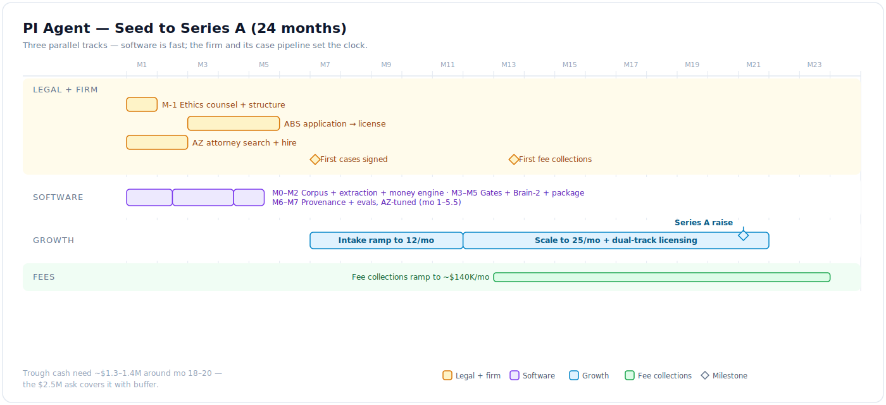
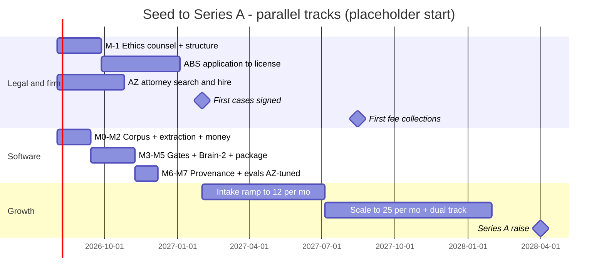

# PI Agent — Seed Plan & Budget (VC Path)

- **Status:** DRAFT for founder review · **Date:** 2026-07-03
- Premise: **2 founders full-time + senior engineering help in India**, captive-firm model
  per [07](./07_captive_firm_model.md). All figures are planning estimates — every
  assumption is listed so it can be attacked line by line (VCs will).
- Headline: **raise $2.5M seed** (floor $1.5M, comfort $3.5M). Peak cash need is
  ~$1.3–1.4M around month 18–20; the buffer covers ABS timing, CPA, and fee-size risk.
- Sibling track: [09_bootstrap_abs_path.md](./09_bootstrap_abs_path.md) — the same firm
  with **zero outside capital** (~$300–450K founder float, slower ramp). Decision table in
  [09 §7](./09_bootstrap_abs_path.md); the choice stays open until Gate M-1 money moves.

## 1. The one-sentence answer

The software costs almost nothing — **~$50–60K cash to a working MVP** (founders unpaid,
2–3 India engineers, ~4 months) and ~$600K fully loaded over 24 months. What costs money
is **the law firm and its case pipeline**: an AZ PI managing attorney, case staff,
marketing at $500–3,000 per signed case, and a **working-capital J-curve** — contingency
fees collect ~7 months after a case signs, so the firm burns for ~13 months before revenue.

## 2. Team plan

| Role | Where | Loaded cost | Start |
|---|---|---|---|
| 2 founders (product/engine + ops/GTM) | US | $100K/yr each ($60K in lean case) | mo 1 |
| 3 senior engineers | India (EOR) | ~$50K/yr each (market: $40–70K senior, 2026) | mo 2 (+1 at mo 15) |
| AZ PI managing attorney (dual-hats ABS Compliance Lawyer) | Phoenix | ~$190K/yr | mo 4 (search opens mo 1) |
| Case manager | Phoenix | ~$70K/yr | mo 6 |
| Case support ×2 (+2 at mo 16) | India/PH | ~$16K/yr each | mo 10 |
| Intake (offshore + phone stack) | offshore | ~$18K/yr | mo 8 |

**India strategy:** senior-only bar (3 strong > 6 average), EOR via Deel/Remote
(~$600/person/mo), 3–4 hr overlap window enforced. **PHI boundary:** offshore engineers
work on de-identified fixtures and infra only (matches the HIPAA envelope in
[03 §3](./03_tech_stack.md)); offshore *case support* on live files is standard in US PI
and legal with BAAs/safeguards — turn that on at ~mo 9 with counsel sign-off, not before.

## 3. 24-month budget (base case)

| Category | Year 1 | Year 2 | Notes |
|---|---|---|---|
| Founders (2) | $200K | $200K | $100K each |
| Engineering (India + EOR) | $137K | $175K | 3 eng → 4 |
| AZ managing attorney | $144K | $192K | from mo 4 |
| Case staff (mgr, support, intake) | $56K | $138K | ramps with volume |
| Legal & regulatory | $100K | $9K | ethics counsel + structure $85K, ABS app $9K, entity/IP $15K; yr-2 renewal |
| Insurance + office (Phoenix) | $27K | $36K | malpractice, cyber, small office |
| Infra (LLM, OCR, cloud) + tools/G&A | $54K | $90K | COGS ≤$25/demand at this volume is noise |
| **Marketing / case acquisition** | $75K | $390K | ramp $8K→$15K/mo yr 1; $25K→$40K/mo yr 2 |
| Case cost advances | $9K | $35K | ~$150/case (records, reports) |
| **Total gross burn** | **~$800K** | **~$1.25M** | **24-mo gross ≈ $2.05M** |
| Fee collections (firm) | ~$0 | **~$800K** | see case model below |
| **Net 24-mo need** | | | **≈ $1.25M** · trough ≈ $1.3–1.4M at mo 18–20 |

### Case model behind the revenue line (attack these numbers)

| Assumption | Value | Sensitivity |
|---|---|---|
| Blended CPA per signed case | $1,100 | Phoenix LSA/referral mix; TV pushes it up |
| Signing ramp | 5/mo (mo 7) → 12/mo (mo 12) → 25/mo (mo 24) | ~57 cases yr 1, ~230 yr 2 |
| Avg pre-lit MVA settlement | $21K → fee (33⅓%) ≈ **$7K/case** | The single most important number — validate with AZ operators |
| Resolution yield | 80% (drops, referrals-out) | |
| Sign-to-collect cycle | ~7 months pre-lit | Our software's speed advantage attacks this directly |
| Month-24 run-rate | ~20 resolutions/mo ≈ **$140K/mo fee collections** | ≈ $1.7M annualized GMV-fees |

Unit economics at steady state: $7,000 fee − $1,100 CPA − ~$900 servicing (case staff
share) − <$25 COGS ≈ **~$5K contribution per case (~70%)** — that's the pitch: software
turns a labor business into a margin business, and we own the margin.

## 4. Raise scenarios

| Scenario | Raise | What it buys | What it proves |
|---|---|---|---|
| Lean | **$1.5M** | Founders at $60K, 2 engineers, marketing capped $20K/mo, ~18 mo | First collections + unit economics, but thin A story |
| **Base (recommended)** | **$2.5M** | Plan above + 40–70% buffer on the $1.3–1.4M trough | 24–26 mo: licensed ABS, $140K/mo run-rate, A-ready |
| Comfort | $3.5M | 5 engineers, SOC 2, marketing to $60K/mo, 2nd-state/2nd-firm exploration | Same proof, faster, 28–30 mo |

**Use of funds at $2.5M:** product & engineering $600K (24%) · firm operations $640K
(26%) · case acquisition $465K (19%) · legal & regulatory $135K (5%) · G&A $240K (10%) ·
contingency $420K (17%).

## 5. Timeline — three parallel tracks

Mermaid source

## 6. The VC narrative (and its honest frictions)

**Comp set (verified funding):** Crosby — tech co + affiliated law firm, $85.8M total
(Sequoia, Index, Lux, Bain). Eudia — AI-native ABS firm, $105M Series A (General
Catalyst). Manifest — $60M. Justpoint — $105M, captive AZ ABS in PI/mass tort.
EvenUp — $385M at $2B+ selling *to* firms. The "full-stack law firm" category is
funded and hot; PI demand-side is the largest fee pool in consumer law.

**Our differentiated claim:** the auditable, software-run firm — per-fact provenance,
deterministic money, attorney gates (which double as Rule 5.4(c) compliance evidence) —
plus an owned outcomes dataset from month 13 that no SaaS vendor gets.

**Targeting note:** EvenUp's investors (Bessemer, Bain, Lightspeed, SignalFire, B Capital,
Premji, REV/LexisNexis) are likely conflicted — SignalFire is in both EvenUp *and*
Justpoint, so check. Start with the full-stack-thesis firms (General Catalyst, Sequoia
scouts, Lux, Index, a16z) and PI-adjacent angels (exited firm owners).

**Frictions to resolve before a term sheet:**
1. **Fast & Modest conflict:** this is a venture bet — it lives in a **separate Delaware
   C-corp**; the TM asset stays on its no-VC exit path with clean IP separation
   ([07 §7](./07_captive_firm_model.md), gate M-1d).
2. **"Both of us":** modeled as 2 founders at $100K. If the second full-timer is Bao,
   his comp/equity sits partly in the firm entity — cap table changes, model barely does.
   Third-cofounder and TM-governance questions must be papered pre-raise.
3. **Regulatory beta:** VCs will price CA/CO/IL backlash risk — our answer is the
   AZ-native posture and equity-distribution (not fee-conduit) economics.
4. **Key-person risk:** the AZ managing attorney. Search starts before incorporation.

## 7. Series A bar (what $2.5M must prove by month ~22)

1. ABS licensed, ≥12 months operating, clean audits, zero discipline events.
2. ≥250 cases signed cumulative; ≥$120–150K/mo fee collections run-rate, growing.
3. Contribution margin ≥60% per case *including* acquisition cost.
4. Demand out <5 business days from records-complete, <2 attorney-hours per case,
   zero unanchored facts across every shipped demand (the auditable-demand proof).
5. Structured outcomes data on every resolved case (injury × treatment × venue × carrier
   × offer history) — the moat exhibit.
6. Dual-track signal: 1–2 independent firms licensing the software at FMV.

## 8. Kill criteria (say them out loud now)

- No AZ managing attorney hire by mo 4 → stop; the firm cannot exist.
- ABS not licensed by mo 9 → burn pauses to skeleton; reassess.
- Blended CPA sustained >$2,000 **and** avg fee <$5K by mo 15 → unit economics broken;
  fall back to dual-track SaaS with the working software.
- CO/IL-style statute lands **in Arizona** barring ABS distributions to nonlawyer equity →
  structural kill; unwind per counsel's pre-papered exit plan.
