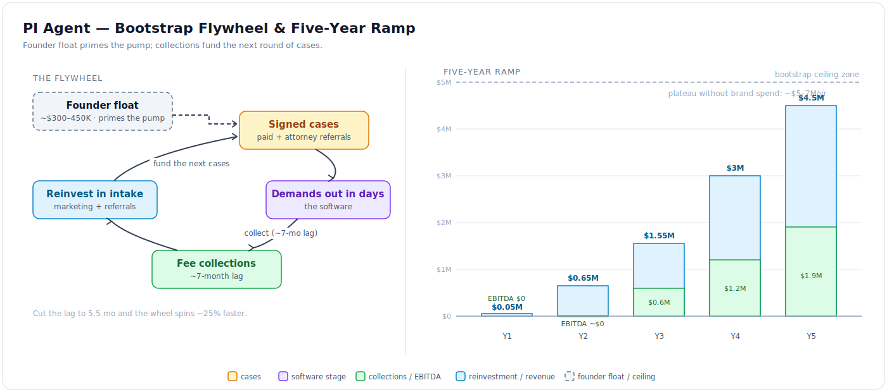

# PI Agent — Bootstrap ABS Track

- **Status:** DRAFT for founder review · **Date:** 2026-07-04
- Premise: same captive AZ ABS structure as [07](./07_captive_firm_model.md), **zero outside
  capital** — the sibling track to [08](./08_seed_plan_and_budget.md). Both tracks stay
  documented until the funding decision.
- All figures are planning estimates — validate with AZ PI operators. Shared unit-economics
  numbers are held identical to [08 §3](./08_seed_plan_and_budget.md) so the two tracks can be
  compared line by line.

## 1. The one-sentence answer

Same firm, different throttle: the founders float **~$300–450K** through the J-curve, keep
**100% of NewCo** (firm equity split with Bao + the AZ managing attorney per
[07 §3](./07_captive_firm_model.md)), and plateau around **$3–5M/yr firm revenue by years 4–5
without dilution**. This is the track consistent with the founders' standing "Fast & Modest"
philosophy — no VC, small team, a sellable asset — and it is the one to keep on the table right
up until the funded track's money starts to move.

## 2. Unit economics (shared engine, two acquisition channels)

The engine is identical to [08 §3](./08_seed_plan_and_budget.md): a signed pre-lit MVA case
settles at ~$21K → a 33⅓% contingency fee of **~$7K** (blended toward **~$7.5K** at scale);
**80% resolution yield** (drops, referrals-out); **~7-month** sign-to-collect; **<$25 COGS** per
demand at volume. What differs on the bootstrap track is where the signed cases come from — and
two channels, not one, carry the flywheel:

| Channel | Cash CPA | Net fee | Contribution / resolved case |
|---|---|---|---|
| **Paid** (LSA / Google / referral services) | ~$1,100 | ~$7K | **~$5K (~70%)** |
| **Attorney referrals** (immigration, family, criminal, workers-comp lawyers) | ~$0 | ~$4.7–5.25K | **~$3.8–4.3K** |

- **Paid** is the [08](./08_seed_plan_and_budget.md) number unchanged: ~$7K fee − ~$1,100 CPA
  − ~$900 servicing − <$25 COGS ≈ **~$5K contribution (~70%)**.
- **Attorney referrals** are the classic zero-capital PI bootstrap channel. A referring lawyer
  (immigration, family, criminal, workers-comp) sends a PI case for a **25–33% referral fee**;
  the net fee lands at **~$4.7–5.25K**, acquisition cash cost is **~$0**, and contribution is
  **~$3.8–4.3K**. Permitted in Arizona; the ABS makes the fee arrangement cleaner to paper. This
  is the **Year-1–2 backbone** — it fills the pipeline before a marketing budget exists.

## 3. Steady-state revenue table

The firm's economics at four sustained sign rates. Fees are computed at the **~$7.5K blended**
scale figure; EBITDA is banded at 40–50% (footnote below).

| Signed / mo | Resolved / mo (80%) | Fee revenue / yr (at ~$7.5K) | Firm EBITDA at 40–50% |
|---|---|---|---|
| 10 | 8 | ~$720K | $290–360K |
| 25 | 20 | ~$1.8M | $720–900K |
| 50 | 40 | ~$3.6M | $1.4–1.8M |
| 100 | 80 | ~$7.2M | $2.9–3.6M |

**Footnote — the 40–50% band is the software case, not the industry norm.** Traditional PI firms
run **25–35% EBITDA**. The 40–50% we underwrite comes from the software: one case manager carries
**150–200 files** against the industry's **60–80**, and demands go out in days, not weeks. Hitting
that band is not an assumption to defend — **it *is* the product proof**, the same north-star the
funded track measures ([07 §5](./07_captive_firm_model.md)).

## 4. The bootstrap ramp (years, not months)

- **Year 1 — build year.** Software runs **~$40–50K cash** (founders unpaid + 1–2 senior India
  engineers); lean ABS legal **~$50–60K**; the AZ managing attorney is recruited on an
  equity-heavy package. First cases land **~mo 7**, first collections **~mo 14**. Collected:
  **~$0–80K**.
- **Year 2 — flywheel starts.** Signings move **8 → 15/mo**, referral-heavy. Collections
  **~$550–700K**; the firm is roughly **breakeven** on a lean cost base.
- **Year 3.** **20–30/mo**; revenue **~$1.4–1.7M**; **$500–750K** distributable.
- **Years 4–5 — plateau.** **40–60/mo** with aggressive reinvestment; revenue **$3–5M/yr**,
  EBITDA **$1.2–2M**. Fee mix drifts to **$8–9K** as a minority of cases go to litigation
  (40% fees) and policy-limits cases land.
- **The ceiling, stated honestly.** Past **~$5–7M/yr** in Phoenix you enter the TV/billboard arms
  race against **$5M+/yr brand budgets** (the Lerner & Rowe class). The bootstrap answers to that
  wall are the same two the founders already favor: years of compounding, or exit.

## 5. Founder capital requirement: ~$300–450K

The total the founders must be prepared to float before collections cover opex.

| Line | Amount | Notes |
|---|---|---|
| Software build | $40–50K | founders unpaid + 1–2 senior India engineers |
| Lean ABS legal + fees | $50–60K | trimmed scope vs $100K funded ([08 §3](./08_seed_plan_and_budget.md)); **same ethics-counsel gate M-1** ([07 §7](./07_captive_firm_model.md)) |
| AZ attorney base salary float | ~$120K | partial-year; equity-heavy package |
| First-year marketing float | $60–90K | capped at what early collections can refund |
| Working-capital + living-cost buffer | remainder | founders at **$0 salary** |
| **Total** | **~$300–450K** | founder cash at risk; the whole delta vs the raise |

**Three shrink levers** pull the number toward the low end:

1. **Referral-channel-first** — near-zero cash CPA (see §2) defers the marketing float almost
   entirely into Year 2.
2. **Attorney equity-over-salary** — the ABS lets you grant **real firm equity**, not fake profit
   points, so the attorney's base can be small in exchange for a genuine ownership stake.
3. **Case-cost / marketing credit lines against signed-case inventory** — litigation-finance
   lenders will advance against signed cases at **15–20%+** rates. Expensive but **non-dilutive**;
   treat it as a **Year-2 accelerant only**, never as primary capital.

## 6. Channel strategy (bootstrap order of operations)

1. **Attorney-referral network — the backbone.** Mechanics: the referring lawyer takes **25–33%**;
   cases arrive **pre-screened** (a real intake filter someone else already ran). Target **20–40
   referring relationships**. Bao's professional network opens doors even though he is IP-side.
2. **LSAs + Google — funded by collections.** Capped at what collections can refund. **CPA
   guardrail $1,500** — above it, pause and rebalance toward referrals rather than spend through
   it.
3. **Niche wedges before brand.** Spanish-language intake; rideshare / delivery-driver niches;
   **speed-as-reputation** ("demand out in 5 days") for referrer stickiness — the referring lawyer
   keeps sending cases because ours close fast and clean.
4. **No TV / billboards on this track, period.** That is the arms race §4 refuses to enter.

## 7. Bootstrap vs VC — the decision table

| | **Bootstrap ABS** ([09](./09_bootstrap_abs_path.md)) | **VC path** ([08](./08_seed_plan_and_budget.md)) |
|---|---|---|
| Time to ~$3.6M run-rate | ~Year 4 | ~Month 24–30 |
| Founder ownership | **100% of NewCo** | ~60–70% post-seed |
| Personal cash at risk | **$300–450K** | ~$0 |
| Regulatory posture | reads as the genuinely **AZ-native small firm** Admin. Order 2026-31 wants | scale draws scrutiny |
| Ceiling | **~$5–7M/yr**, then exit-or-grind | multi-state + dual-track SaaS optionality |
| Thesis fit | **on-thesis** with Fast & Modest | a new venture bet |

The GTM, structure, software, and gates ([07](./07_captive_firm_model.md)) are **identical** across
both columns — the tracks differ only in **throttle and ownership**. And the switch between them
stays open **until Gate M-1 money is spent**; nothing here forecloses the raise, and nothing in
[08](./08_seed_plan_and_budget.md) forecloses bootstrapping.

## 8. Working-capital mechanics

The J-curve in words: **founder float primes the pump.** Every collected fee splits three ways —
**reinvest marketing | firm opex | distributions**. The **~7-month** lag means marketing spent in
month *N* returns cash in month **N+8–9** (the settlement cycle plus collection). For the first
~14 months the firm therefore burns before a single fee lands, which is exactly what the
~$300–450K float has to cover.

**Cycle-time is a first-class lever, not a footnote.** Cutting sign-to-collect from **7 to 5.5
months** — faster demands, tighter follow-up, which is precisely the software's job — pulls revenue
forward and shrinks the required float **roughly proportionally**. The wheel spins ~25% faster on
the same capital. Speed is the whole thesis paying rent twice: once in margin (§3), once here in
working capital.

## 9. Sensitivity grid (the two numbers that decide everything)

Contribution per resolved case = **fee − CPA − $900 servicing − $25 COGS**. The two axes are the
only inputs that meaningfully move the answer.

| | **CPA $800** | **CPA $1,400** | **CPA $2,000** |
|---|---|---|---|
| **Fee $5K** | ~$3.3K — thin | ~$2.7K — strained | ~$2.1K — **flywheel stalls** |
| **Fee $7K** | ~$5.3K — healthy | ~$4.7K — solid | ~$4.1K — workable |
| **Fee $9K** | ~$7.3K — **compounds fast** | ~$6.7K — strong | ~$6.1K — strong |

*(The shared base case — $7K fee, $1,100 CPA, ~$5K contribution per
[08 §3](./08_seed_plan_and_budget.md) — sits between the first two columns.)*

**Validation action.** A few thousand dollars of **structured interviews with Phoenix PI operators**
pins fee and CPA before *either* track commits capital — it is the same blocking item as
[README open item 4](./README.md). The grid shows why: the bottom-left corner ($5K fee + $2K CPA)
is the one cell where neither track works, and no amount of capital fixes a broken unit economic.

## 10. Kill and switch criteria

Said out loud now, in the style of [08 §8](./08_seed_plan_and_budget.md).

**Kill (this track dies first):**

- **No AZ managing attorney willing to take equity-heavy comp by mo 4** → this track dies before
  the funded one, because cash comp forces the raise.
- **Founder float breaches $450K before collections cover opex** → raise or wind down.
- **CPA sustained >$2K with fees <$5K by mo 15** → unit economics broken on *both* tracks →
  dual-track SaaS fallback with the working software.

**Switch to VC when:**

- the attorney requires **market cash comp**; or
- a competitor captive-firm play gets **funded loudly in AZ**; or
- **Year-2 collections <$400K**.

**Switch to "bootstrap stays" when:**

- **Year-2 collections >$700K at ≥45% margin** — the raise becomes optional forever.

---

Structure and legal rails in [07](./07_captive_firm_model.md); the funded variant of every number
here in [08](./08_seed_plan_and_budget.md).
