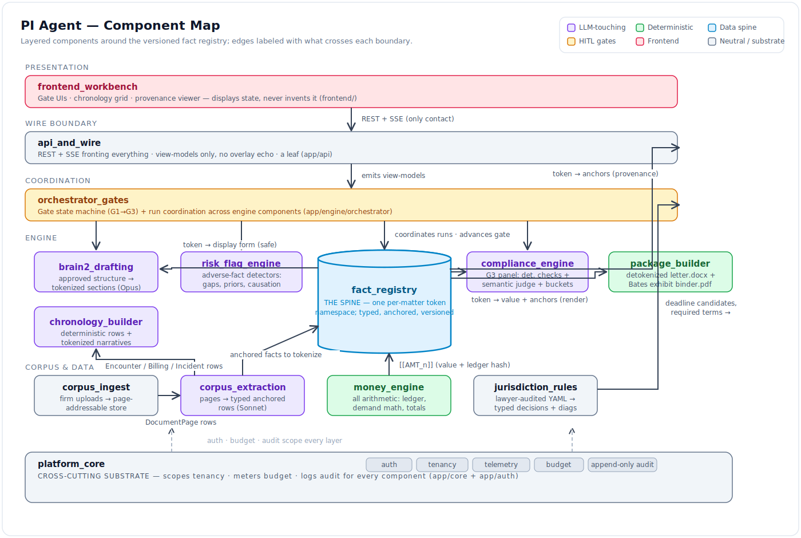

# PI Agent — Component Designs

- **Status:** DRAFT for founder review · **Date:** 2026-07-04

This folder is the **level-2 design** sitting under [01_high_level_design.md](../01_high_level_design.md)
(invariants, gate machine, pipeline) and [04_data_model_and_contracts.md](../04_data_model_and_contracts.md)
(schemas, API/SSE surface, module map). One doc per component; each refines — never
contradicts — the schemas in [04 §2](../04_data_model_and_contracts.md) and the ownership
boundaries in [04 §5](../04_data_model_and_contracts.md). These are *design* docs, not the
binding contracts: the one-page `docs/module_contracts/` files (vocabulary + import rules +
gate) are written at **M0** per [05 §M0](../05_implementation_plan.md) and are the
enforcement surface `make verify` checks. Where a design decision here would move a boundary
or a token, the contract doc and this doc change in the same pass.

## Component inventory

| Component | Planned module path | Responsibility (one line) | Primary invariants |
|---|---|---|---|
| [corpus_ingest](corpus_ingest.md) | `app/corpus/ingest` | Raw firm uploads → page-addressable, provenance-ready store | 2, 7, 14 |
| [corpus_extraction](corpus_extraction.md) | `app/corpus/extraction` | Pages → typed anchored rows (encounters, billing lines, incident facts) | 2, 5, 13 |
| [fact_registry](fact_registry.md) | `app/engine/tokenizer` | The spine: one per-matter token namespace of typed, anchored, verified facts | 2, 5, 10, 11 |
| [money_engine](money_engine.md) | `app/money` | All arithmetic: specials ledger, demand math, package totals | 3, 10 |
| chronology_builder | `app/engine/brain1/chronology` | Deterministic encounter rows + tokenized per-encounter narratives | 5, 10 |
| risk_flag_engine | `app/engine/brain1/risk` | Adverse-fact detection (gaps, priors, degenerative, causation) with anchors | 2, 6 |
| jurisdiction_rules | `app/rules` | Lawyer-audited YAML → typed deadline/fault/billed-vs-paid decisions + diagnostics | 4, 13 |
| orchestrator_gates | `app/engine/orchestrator` | Gate state machine + run coordination across engine components | 1, 8, 9 |
| brain2_drafting | `app/engine/brain2` | Approved structure → tokenized letter sections (Opus) | 1, 5 |
| compliance_engine | `app/engine/compliance` | G3 panel: deterministic checks + semantic judge + span-patch buckets | 2, 6, 11 |
| package_builder | `app/package` | Detokenized letter.docx + Bates-stamped exhibit binder.pdf | 2, 5 |
| api_and_wire | `app/api` | REST + SSE fronting everything; view-models only, no overlay echo | 11, 12 |
| platform_core | `app/core` + `app/auth` | Auth, tenancy, telemetry, budget, append-only audit | 7, 8, 9, 12 |
| frontend_workbench | `frontend/` | Gate UIs, chronology grid, provenance viewer; displays state, never invents it | 1, 11 |

## Dependency edges

Read as **from → to → what crosses the boundary.** No cycles: extraction is upstream of
analysis; `corpus/` never imports `engine/`; nothing imports `api/` except `main.py`.

| From | To | What crosses |
|---|---|---|
| corpus_ingest | corpus_extraction | `DocumentPage` rows (text + image ref + confidence) |
| corpus_extraction | fact_registry | Anchored typed facts to tokenize (encounters, incident facts) |
| corpus_extraction | chronology_builder / risk_flag_engine / money_engine | `MedicalEncounter` / `BillingLine` / `IncidentFacts` rows |
| money_engine | fact_registry | `[[AMT_n]]` facts (value + ledger hash) |
| jurisdiction_rules | orchestrator_gates | Deadline candidates (surface at G1) |
| jurisdiction_rules | money_engine | Billed-vs-paid flag per jurisdiction |
| jurisdiction_rules | brain2_drafting | Statutory required terms (time-limited demand) |
| jurisdiction_rules | compliance_engine | Required-terms presence checks |
| fact_registry | brain2_drafting | Token → display form (prompt-safe) |
| fact_registry | compliance_engine | Token → resolution (verify anchors, AMT vs ledger) |
| fact_registry | package_builder | Token → value + anchors (render resolution) |
| fact_registry | api_and_wire | Token → anchors (provenance click-through lookups) |
| orchestrator_gates | all engine components | Coordinates runs (analysis, drafting), advances gate state |
| api_and_wire | everything | Fronts the system; emits view-models + SSE, never overlays back |
| platform_core | all components | Auth/tenancy scope, telemetry, budget cap, audit sink |
| frontend_workbench | api_and_wire | The *only* backend contact (REST + SSE) |

## Ownership rules (restated from [04 §5](../04_data_model_and_contracts.md))

- **Only `engine/tokenizer` mints tokens.** No other component creates `[[FACT/AMT/CITE/EX]]`
  ids; `package/` + `api/view_models` only *render* them.
- **Only `money/` does arithmetic on `Money`.** The LLM references `[[AMT_*]]`; every total
  is pure code (invariant 3).
- **Only `rules/` reads jurisdiction YAML.** Consumers receive typed decisions + a
  `diagnostic.kind` they can trust — never raw YAML.
- **`corpus/` never imports `engine/`.** Extraction is strictly upstream of analysis.
- **Nothing imports `api/` except `main.py`.** The wire boundary is a leaf.
