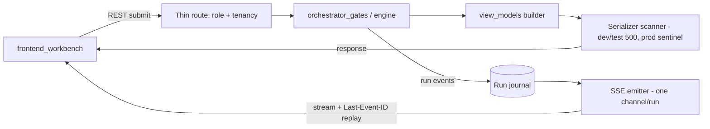

# Component — api_and_wire

- **Status:** DRAFT for founder review · **Date:** 2026-07-04
- **Planned module path:** `app/api` (`routes`, `sse_utils`, `view_models`)
- **Contract doc (M0):** `docs/module_contracts/api.view_models.md`
- Features: G4, E2, C7 · Milestone: [M3](../05_implementation_plan.md) onward · Refines
  [04 §3 API](../04_data_model_and_contracts.md), [04 §4 SSE](../04_data_model_and_contracts.md).

## 1. Responsibility

The **only wire surface** — every byte between backend and frontend crosses here. REST
endpoints + SSE streams **exactly per [04 §3–4](../04_data_model_and_contracts.md)**;
nothing else serializes to the frontend. Concretely:

- **View-model layer (invariant 11):** AI overlays exist **only in `view_models` on
  responses**; FE submissions never echo overlays back (a submit body carrying an overlay
  field is rejected).
- **Role middleware (invariant 8):** server-side authorization of gate actions — the server
  is the authority; a paralegal `POST`ing a G3 approve is refused regardless of UI state.
- **Tenancy scoping** injected at the query layer (with `platform_core`) — no route trusts a
  client-supplied `firm_id`.
- **Wire-discipline enforcement:** a **serializer-level scanner (dev/test builds)** ensures
  **nothing token-shaped serializes**; no internal-reasoning events; rendered previews only.
- **Gate payloads** discriminated by `gate` with a `payload_version`; a version skew with the
  FE is an explicit `409` → FE refetch.
- **SSE channel lifecycle:** one channel per run; reconnect with **`Last-Event-ID` replay**
  from the run journal.
- **Provenance endpoint** returns span→fact anchors; the rendered letter carries a **span map
  (span id → fact id) — never tokens**.

**NOT responsible for:** business logic (routes are thin); state transitions
(`orchestrator_gates`); rendering/detokenization (`package_builder`).

## 2. Boundary

| Direction | What | Peer component |
|---|---|---|
| consumes | Every engine component's typed outputs (facts, ledger, findings, artifacts) | all engine components |
| consumes | Gate-current payloads + transition results | orchestrator_gates.md |
| consumes | Auth/tenancy context, run journal, presign | platform_core.md |
| owns | REST route layer, `view_models`, SSE emitter + journal replay, serializer scanner | — |
| produces | HTTP responses (view-models, discriminated gate payloads) | frontend_workbench.md |
| produces | SSE streams (`status`, `doc_state`, `section`, `gate_ready`, `artifact_ready`, `budget_warning`, `error`) | frontend_workbench.md |
| produces | Provenance span→fact anchor lookups | frontend_workbench.md (viewer) |

Import rule ([04 §5](../04_data_model_and_contracts.md)): **nothing imports `api/` except
`main.py`** — the wire boundary is a leaf.

## 3. Key types & fields

```python
class GateEnvelope:                            # GET /gates/current response
    gate: GateState                            # discriminant
    payload_version: int                       # FE compares; mismatch → 409
    view_model: JsonValue                      # gate-specific; overlays live ONLY here
    role_affordances: RoleAffordances          # what THIS actor may do (server-authoritative)

class RenderedLetterView:                      # G3 preview + provenance click-through
    sections: list[RenderedSection]            # rendered text — no tokens
    span_map: dict[str, str]                    # span_id -> fact token_id (ids, never tokens)
    # GET /provenance/{token_id} -> {anchors: [{doc_id, page, bbox?}], verified: bool}

class SseEvent:
    id: int                                    # monotonic per channel — Last-Event-ID replay
    event: Literal["status","doc_state","section","gate_ready",
                   "artifact_ready","budget_warning","error"]
    data: JsonValue                            # rendered/typed; scanned in dev/test builds
```

Every submit endpoint validates against a **submission schema that forbids overlay fields**;
`RenderedSection` and `span_map` are response-only shapes and never appear in a request body.

## 4. Internal design

- **Thin routes, typed everywhere.** A route validates the request, checks role + tenancy,
  calls the owning engine component, and serializes a view-model. No branching business
  logic lives here (that is `orchestrator_gates`); routes are boring on purpose.
- **The serializer scanner (dev/test builds).** A recursive scan of every outbound payload
  for a token-shaped regex (`[[FACT/AMT/CITE/EX_n]]`). **Dev/test: 500 + loud log** — the
  bug is caught in CI, never shipped. **Prod: sentinel substitution + log** — an escaped
  token becomes a visible sentinel, never leaks a raw token to the UI (port of the TM
  no-citation-tokens-in-UI rule). This is the last line of the invariant-11 defense.
- **Submission-echo guard (invariant 11).** Submit schemas are closed (`extra="forbid`);
  any overlay-shaped field in a request body is a `422` — the FE physically cannot round-trip
  an AI overlay back as if it were user input.
- **Role middleware (invariant 8).** Each gate action maps to a required role
  (`paralegal`/`attorney`/`admin`); the check is server-side and precedes the handler. The
  FE's `role_affordances` are a *hint*; the server is the authority (matches the no-gray-out
  design rule — the FE may show the button, the server refuses the action).
- **SSE channel + journal replay.** One channel per run; every event is appended to a
  **run journal** with a monotonic `id`. On reconnect the client sends `Last-Event-ID`; the
  emitter replays the tail. `currentStep` stays on the owning gate for the whole stream — the
  FE drives off an `isRunning` flag, not step churn ([04 §4](../04_data_model_and_contracts.md)).
- **Payload-version skew.** `GET /gates/current` stamps `payload_version`; a submit against a
  stale version returns an explicit `409` carrying the fresh version → FE refetches. Never a
  silent overwrite (mirrors the registry-drift discipline).



## 5. Invariants enforced

- **8** — gate-action authorization is server-side; role is enforced here, not trusted from
  the client.
- **11** — overlays are response-only; the serializer scanner guarantees no token-shaped
  string escapes; submit schemas forbid overlay echo.
- **14** — every request is logged into per-matter run logs (with `platform_core`), so
  silent-wrong-output debugging starts from the wire log.

## 6. Failure modes & handling

| Failure | Detection | Handling |
|---|---|---|
| Token-shaped string in a payload | Serializer scanner | Dev/test: `500` + loud log (fails CI); prod: sentinel + log — **never ship the token** |
| SSE disconnect mid-run | Client `Last-Event-ID` on reconnect | Replay the journal tail; no duplicated/dropped events |
| Payload-version skew with FE | `payload_version` compare on submit | Explicit `409` + fresh version → FE refetch flow |
| Wrong-role gate action | Role middleware pre-handler | `403` with a typed authorization reason (FE renders inline, no gray-out) |
| Cross-tenant `firm_id` in request | Query-layer scoping (platform_core) | Ignored/refused; the client `firm_id` is never trusted |
| Overlay field in a submit body | Closed submit schema (`extra=forbid`) | `422`; the round-trip is structurally impossible |

## 7. Test strategy

- **Contract tests per endpoint** against [04 §3](../04_data_model_and_contracts.md) — every
  route's request/response shape and status codes pinned; drift fails CI.
- **Wire-scanner fixtures** — a planted `[[FACT_1]]` in a view-model must trigger the scanner
  (`500` in test builds); property: no fixture payload ever emits a token-shaped string.
- **Role matrix tests** — every (role × gate-action) cell asserted; e.g. a paralegal cannot
  approve G3; an attorney can; admin scope explicit.
- **SSE replay test** — drop a connection mid-run, reconnect with `Last-Event-ID` → the
  client observes the exact tail with no gaps or repeats.
- **Submission-echo test** — a submit body carrying an overlay field is rejected `422`; a
  clean body succeeds.

## 8. Open questions

1. SSE transport: keep `fetch-event-source` (FE) over server-sent events, or move long runs
   to a resumable protocol if reconnect storms appear at scale? (Journal replay is protocol
   agnostic — deferred.)
2. Run-journal retention: keep full event journals per run for replay + audit, or truncate
   after the run closes? (Ties to `platform_core` retention/G8; leaning keep-until-matter-
   deletion for the audit story.)
3. Prod sentinel visibility: should an escaped-token sentinel also raise an ops alert (not
   just a log line), given it means an invariant-11 breach reached prod? (Leaning yes.)
4. Provenance endpoint auth granularity: is a `token_id` lookup PHI access that must hit the
   audit log every call, or is the initial page-read the audited event? (Coordinate with
   `platform_core` PHI-access logging — likely audit on page fetch, not span lookup.)
