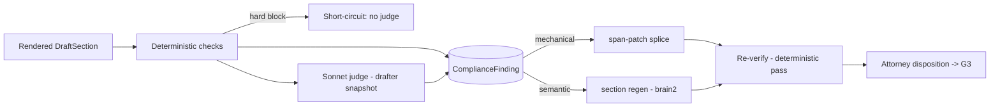

# Component — compliance_engine

- **Status:** DRAFT for founder review · **Date:** 2026-07-04
- **Planned module path:** `app/engine/compliance`
- **Contract doc (M0):** `docs/module_contracts/engine.compliance.md`
- Features: C6, E3, D7 · Milestone: [M5](../05_implementation_plan.md) · Refines
  [01 §9 rework](../01_high_level_design.md), [04 §2](../04_data_model_and_contracts.md).

## 1. Responsibility

The **G3 panel**. Runs two check families over a rendered `DEMAND_DRAFT` and emits typed
`ComplianceFinding`s the attorney dispositions before the draft can become a package.
**Deterministic checks (pure code):** every token resolves at the pinned `registry_version`;
every `[[AMT_n]]` matches the live `money_engine` ledger (snapshot hash re-verified, not
trusted); anchors are live (page exists, source document not `superseded`); `[[EX_n]]`
refs exist in the binder manifest; statutory required terms are present when a
`jurisdiction_rules` time-limited rule is active; risk dispositions are respected (nothing
`address_in_letter` missing; no adverse fact present without disposition = `address` —
invariant 6); prose totals == ledger totals. **Semantic checks (Sonnet judge):** the judge
sees the drafter's **exact prompt snapshot** (symmetry — same registry version, same hard
constraints) and flags unsupported causation claims, strategy drift vs `StrategyPlan`, tone
bounds. G3 approve requires **zero open blocking findings**.

**NOT responsible for:** drafting or regenerating prose (`brain2_drafting` does the regen,
this component only commands it); rendering/detokenization (`package_builder` +
`api_and_wire`); deciding **severity policy** for risk flags (`risk_flag_engine` owns that —
this component only checks the *disposition* was honored).

## 2. Boundary

| Direction | What | Peer component |
|---|---|---|
| consumes | `DraftSection[]` (rendered) + the drafter prompt snapshot | brain2_drafting.md |
| consumes | Token → resolution (anchors, verified status) | fact_registry.md |
| consumes | Ledger totals + snapshot hash (AMT re-verify) | money_engine.md |
| consumes | Binder manifest (EX ref existence) | package_builder.md |
| consumes | Time-limited required-terms list | jurisdiction_rules.md |
| consumes | Risk dispositions (address/omit/need-more) | risk_flag_engine.md |
| owns | `ComplianceFinding` + finding lifecycle | — |
| produces | G3 payload (findings, buckets) | api_and_wire.md |
| produces | span-patch commands / section-regen commands | package_builder.md · brain2_drafting.md |
| coordinated by | `compliance_review` entry; regen → `drafting` re-entry | orchestrator_gates.md |

## 3. Key types & fields

```python
class ComplianceFinding:
    id: UUID; draft_id: UUID; section_id: str; registry_version: int
    check_kind: CheckKind                  # orphan_token | amt_ledger_mismatch | dead_anchor |
                                           # missing_exhibit | missing_statutory_term |
                                           # undisposed_adverse | prose_total_mismatch |
                                           # unsupported_causation | strategy_drift | tone
    severity: Literal["blocking","advisory"]     # hard blocks are always blocking
    bucket: Literal["mechanical","semantic"]     # → span-patch vs section-regen
    detail: str; anchors: list[PageAnchor]       # what the attorney sees, not a paraphrase
    span: SpanRef | None                         # section span for a mechanical splice
    status: Literal["open","patched","regenerated","re_verified","dispositioned"]
    disposition: Literal["accept","override"] | None
    disposition_by: UUID | None; override_reason: str | None
```

Hard blocks (always `blocking`, never overridable to ship): `orphan_token`,
`amt_ledger_mismatch`, `dead_anchor`, `missing_exhibit`, `undisposed_adverse`,
`registry_version` mismatch. Semantic findings are `blocking` unless the attorney
dispositions `accept` with a logged rationale.

## 4. Internal design

- **Deterministic pass first, cheap and total.** All code checks run before the judge; a
  hard block short-circuits the semantic pass — no point paying for a judge on a draft that
  already fails a token check. Each check is an independent, unit-testable predicate over
  `(DraftSection, registry@version, ledger)`.
- **AMT re-verification (not trust).** The draft carries `[[AMT_n]]` display forms rendered
  earlier; the check re-resolves each against the **current** ledger snapshot hash and
  fails loudly on drift (`amt_ledger_mismatch`) — catches a ledger edit landing after
  render (invariant 3).
- **Judge symmetry (invariant 13).** The semantic judge is handed the drafter's exact
  prompt snapshot (`StrategyPlan` version, late-bound hard constraints, registry display
  forms). A **snapshot hash mismatch fails the run loudly** — drafter and judge must be
  looking at the same world, or the finding is meaningless (drift risk, TM
  pure-compliance-judge lesson).
- **Bucket routing (the correction fork).** Findings route by `check_kind`:
  **mechanical → span-patch** — a deterministic splice into the rendered section for an
  *enumerated* set (wrong `[[AMT_n]]` reference, broken `[[EX_n]]` ref, missing statutory
  term insertion). **semantic → section regen** — `brain2_drafting` re-runs that one
  section with the finding appended to hard constraints. **Conservative default = regen**:
  anything not on the mechanical enumeration buckets to semantic.
- **Finding lifecycle:** `open → (patched | regenerated) → re_verified → dispositioned`.
  **Re-verify always runs after a patch or regen** — a splice/regen re-enters the
  deterministic pass; a fix that introduces a new orphan is caught, never assumed clean.
- **No code-side semantic normalizers (invariant 13).** The judge's output is not
  post-filtered by regex/allowlist; a wrong semantic verdict is fixed in the judge prompt
  or gated, never patched in code.



## 5. Invariants enforced

- **2** — orphan tokens / dead anchors are hard G3 blocks; nothing unanchored ships.
- **3** — every `[[AMT_n]]` re-verified against the ledger snapshot hash at G3.
- **6** — no adverse fact in prose without disposition = `address`; `undisposed_adverse` is
  a hard block.
- **13** — semantic = the Sonnet judge; deterministic = code predicates; no regex patching
  of legal semantics on either side.

## 6. Failure modes & handling

| Failure | Detection | Handling |
|---|---|---|
| Patch-vs-regen misbucket | `check_kind` not in mechanical enumeration | Default to `semantic` (regen); span-patch only enumerated mechanical kinds |
| Judge/drafter snapshot drift | Snapshot hash mismatch | Fail the run loudly; do not emit findings against a stale prompt |
| AMT display form stale vs ledger | Re-resolve against current snapshot hash | `amt_ledger_mismatch` hard block; span-patch the reference |
| Span-patch introduces a new orphan | Mandatory re-verify pass | Catch as fresh finding; block until clean — never assume the fix is safe |
| Registry advanced since draft render | `registry_version` compare | Hard block ("records changed since draft"); force re-draft on new version |
| Judge returns malformed JSON | Structured-output retry (converges) | Retry; persistent failure surfaces as an `error`, not a silent pass |

## 7. Test strategy

- **Planted-violation fixtures per check kind** — one orphan token, one AMT/ledger mismatch,
  one dead anchor, one undisposed adverse fact, etc.; each must fire its exact `check_kind`
  and `severity`.
- **Bucket routing table exhaustively unit-tested** — every `check_kind` asserts its
  `bucket`; a new kind with no explicit mapping defaults to `semantic` (reg+ test guards
  the conservative default).
- **Re-verify-after-fix always runs** — property: a span-patch or regen that (mis)introduces
  a new orphan/AMT drift is caught on the mandatory re-verify pass, never dispositioned open.
- **Snapshot symmetry** — mutate the judge's snapshot vs the drafter's → run fails loudly;
  matching snapshots → judge runs.
- **Hard-block gate** — a draft with any hard-block finding cannot reach `package_assembly`
  (orchestrator gate assertion).

## 8. Decisions (2026-07-04)

Recorded in [10_implementation_readiness.md](../10_implementation_readiness.md) §4:

1. **Missing statutory term = mechanical, insert-at-anchor.** The `jurisdiction_rules` pack
   supplies the canonical verified text block; the span-patcher splices it at the
   plan-designated section anchor — treated like a token resolution, no LLM. Regen is the
   fallback only when the plan marks the term as requiring prose integration (rule-pack
   flag, not a judgment made at G3 time).
2. **Attorney-overridden semantic findings DO enter the E4 provenance report** as audited
   judgment calls — the AI-vs-attorney disagreement is exactly what the auditable-demand
   posture exists to surface (`package_builder` E4 carries a `judgment_calls` section).
3. **Judge tier: Sonnet at MVP.** It mirrors the Opus drafter via the shared prompt
   snapshot, not via matched capability; any tier change requires a fixture A/B first
   (model-assignment discipline).
4. **Frontend renders both splits** — mechanical/semantic *and* blocking/advisory — as a
   G3 acceptance requirement on `frontend_workbench` (four visual states, not two).
