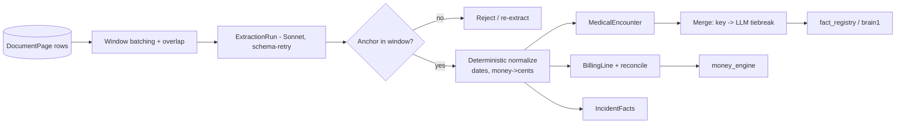

# Component: corpus_extraction

- **Status:** DRAFT for founder review · **Date:** 2026-07-04
- **Planned module path:** `app/corpus/extraction` (from [04 §5](../04_data_model_and_contracts.md))
- **Contract doc (M0):** `docs/module_contracts/corpus.extraction.md`
- Features: B1–B3, B6 (encounters, merge, billing, incident facts) · Milestone: [M2](../05_implementation_plan.md)

## 1. Responsibility

Turn `DocumentPage` rows into **typed, page-anchored, deterministically-normalized facts**:
`MedicalEncounter` (with cross-pull merge), `BillingLine` (Textract table output reconciled
by Sonnet), and per-matter `IncidentFacts` (police/incident report). Every emitted row or
field carries ≥1 anchor validated against the exact prompt window it came from — an anchor
citing a page the model never saw is *rejected* (anti-fabrication). Extraction is where raw
records become structured; it does **no arithmetic, no chronology assembly, no token
minting** — it hands anchored rows to the analysis components and the registry.

**NOT responsible for:** chronology assembly (chronology_builder); any `Money` arithmetic or
rollups (money_engine); minting `[[FACT/AMT]]` tokens (fact_registry); deciding what enters
the letter (attorney gates).

## 2. Boundary

| Direction | Item | Counterpart component |
|---|---|---|
| consumes | `DocumentPage` rows (active text, image ref, confidence, `zero_text`) | corpus_ingest |
| consumes | OCR table structures (bill grids) | corpus_ingest / External OCR |
| owns | `MedicalEncounter`, `BillingLine`, `IncidentFacts`, `ExtractionRun` | — |
| produces | Anchored `MedicalEncounter` / `IncidentFacts` rows | fact_registry, chronology_builder, risk_flag_engine |
| produces | Anchored `BillingLine` rows | money_engine (ledger source of truth) |
| produces | `status` SSE (per-doc extraction progress, gaps) | api_and_wire → frontend_workbench |

## 3. Key types & fields

Extends [04 §2](../04_data_model_and_contracts.md) `MedicalEncounter` / `BillingLine`; adds
the run record and per-field confidence/anchor detail.

```python
class PageAnchor:                            # shared, validated at extraction
    doc_id: UUID; page: int; bbox: BBox | None
    window_id: str                           # the ExtractionRun window this anchor was emitted IN
    field: str | None                        # per-field anchoring (e.g. "diagnoses[0]")

class MedicalEncounter:                       # extends 04 §2
    # ... date_of_service, provider, facility, encounter_type, complaints,
    #     findings, diagnoses[CodedItem], procedures[CodedItem], work_status ...
    field_confidence: dict[str, float]        # per-field, not one blanket score
    anchors: list[PageAnchor]                 # ≥1 or it's a bug (schema inv 1)
    merged_from: list[UUID]                   # dedup provenance; retained after merge
    merge_basis: Literal["deterministic_key","llm_tiebreak"] | None

class BillingLine:                            # extends 04 §2
    # ... provider, date_of_service, code, billed/adjusted/paid/outstanding (Money) ...
    reconciliation: Literal["table_only","table+llm_agree","table+llm_diff"]
    anchor: PageAnchor                         # exactly one (schema inv 1)

class IncidentFacts:
    matter_id: UUID
    parties: list[Party]; citations_issued: list[str]
    narrative_tokenized: str; diagram_anchor: PageAnchor | None
    anchors: list[PageAnchor]

class ExtractionRun:
    id: UUID; matter_id: UUID; document_id: UUID
    window_id: str; window_pages: tuple[int,int]  # inclusive page span shown to the model
    prompt_version: str; model: str               # idempotency key: (document, window, prompt_version)
    status: Literal["ok","partial","failed"]
```

## 4. Internal design

**Page-window batching with overlap.** Records don't respect page boundaries — an ER
encounter can straddle pages 4–5. We batch pages into overlapping windows so no
encounter/table is split across a seam without a window that contains it whole. Each window
becomes one `ExtractionRun` (Sonnet, structured outputs, **schema-retry** — JSON extraction
converges on retry, [01 §3](../01_high_level_design.md)).

**Anchor validation (anti-fabrication).** Every anchor a model returns is checked: its
`(doc_id, page)` **must lie inside `window_pages`** of the run that produced it. An anchor
pointing outside the shown window is a fabrication signal → the row's anchor is rejected and
the field re-extracted / flagged. This is the extraction-time enforcement of invariant 2.

**Deterministic post-parse normalization only.** After the model returns, code normalizes
dates to `date`, money strings to integer cents, trims whitespace, maps codes. **No semantic
rewriting** — we never let code "clean up" a diagnosis or re-word a finding (invariant 13:
semantic = LLM, deterministic = code; no code-side normalizers on LLM output).

**Billing reconciliation.** Textract table extraction gives the grid; Sonnet reads the same
window and reconciles. Agreement → `table+llm_agree`. A cell-level diff (Textract says
`$1,200`, Sonnet reads `$1,290`) → `table+llm_diff` + low-confidence flag surfaced at G2a —
never silently pick one. Numbers are integer cents from here on; money_engine does the sums.

**Encounter merge (B2).** The same visit appears across record pulls. Merge is
**deterministic-first**: key on `(provider, date_of_service, encounter_type)`; exact-key
collisions merge. Ambiguous near-matches (same day, provider spelled two ways) go to an
**LLM tiebreak** (Sonnet), recording `merge_basis`. `merged_from` retains the source
encounter ids — the merge is provenance-preserving and reversible.

**Idempotent re-runs.** Keyed on `(document, window, prompt_version)`. Re-running the same
window with the same prompt version is a no-op; bumping the prompt version re-extracts and
supersedes. Enables late-record processing and prompt iteration without duplicating rows.



## 5. Invariants enforced

- **Inv 2 (≥1 anchor or bug).** Schema-level non-empty anchors on every row; anchors
  validated against the prompt window (fabricated anchors rejected before they persist).
- **Inv 5 (tokenize-or-omit feed).** Emits the raw typed facts fact_registry tokenizes;
  provider names / diagnoses / amounts exist here as data, entering prompts only as tokens.
- **Inv 13 (semantic=LLM, deterministic=code).** Only mechanical normalization post-parse; no
  allowlists or normalizers patching semantic model output — prompt/gate fixes instead.

## 6. Failure modes & handling

| Failure | Handling |
|---|---|
| Encounter split at window boundary | Overlapping windows guarantee a containing window; merge dedups the overlap-region duplicates |
| Table extraction misalignment (shifted columns) | Textract-vs-Sonnet reconciliation diff → `table+llm_diff` + low-confidence flag at G2a |
| Fabricated anchor (page outside window) | Rejected at validation; field re-extracted or flagged, never persisted |
| Partial document failure | Per-doc `ExtractionRun.status = partial/failed`; G2a evidence view shows the gap explicitly (no silent hole) |
| Over-merge (two real visits collapsed) | Deterministic key is conservative; LLM tiebreak only on near-matches; `merged_from` makes it reversible |
| `zero_text` / degraded page | Skipped for text extraction, surfaced as a coverage gap; image kept for anchor/exhibit use |

## 7. Test strategy (Tier-1)

- **Encounter recall ≥95%** vs gold fixtures (the [S2 / M2 exit](../05_implementation_plan.md)
  bar); precision + per-field anchor accuracy tracked alongside.
- **Anchor validity 100%.** Property test: every emitted anchor's `(doc, page)` lies within
  its run's `window_pages`; inject an out-of-window anchor → rejected.
- **Merge produces no duplicate chronology rows.** On multi-pull fixtures, the same visit
  across pulls collapses to one encounter; `merged_from` retains both sources.
- **Ledger reconciles to the penny downstream.** Billing lines feed money_engine; the golden
  fixture ledger total matches gold exactly (guards the cents-normalization path).
- **Idempotency.** Re-running a window with the same `prompt_version` yields byte-identical
  rows; a version bump supersedes without leaving orphans.

## 8. Open questions

- Optimal window size + overlap: too small fragments encounters and inflates LLM cost; too
  large blows the context budget and dilutes anchor precision. Tune on S2 sample.
- Do we need a cheap page-classification pre-pass (bill vs narrative vs imaging) before the
  extractor, per the [S2 kill-criterion fallback](../05_implementation_plan.md)? Only if
  recall stalls <90% after prompt iteration.
- LLM tiebreak on merge is a semantic call on provenance-critical data — acceptable given
  `merged_from` reversibility, but should the attorney see and confirm ambiguous merges at
  G2a rather than trusting the tiebreak silently?
- CPT/ICD coding: extract the code as-written vs validate against a code set? Leaning
  as-written + flag unknowns (validation is a semantic claim we shouldn't make in code).
