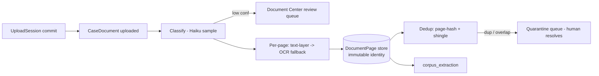

# Component: corpus_ingest

- **Status:** DRAFT for founder review · **Date:** 2026-07-04
- **Planned module path:** `app/corpus/ingest` (from [04 §5](../04_data_model_and_contracts.md))
- **Contract doc (M0):** `docs/module_contracts/corpus.ingest.md`
- Features: A2–A6 (uploads, classify, OCR, page store, dedup) · Milestone: [M1](../05_implementation_plan.md)

## 1. Responsibility

Turn raw firm uploads (100s of PDFs, faxed / scanned / clean-EMR, up to ~1 GB per matter)
into an **immutable, page-addressable, provenance-ready store**: every page has a stable
identity, extracted text (text-layer fast path or OCR fallback with per-page confidence),
an object-store image reference, and a dedup verdict. Ingest is the sole author of
`DocumentPage` — the anchor target every downstream fact resolves to. It is re-entrant: late
document pulls (a missing provider's records arriving after G2a) re-enter here and process
*only the new documents*, forcing the matter back through `evidence_review`
([01 §4 note](../01_high_level_design.md)).

**NOT responsible for:** semantic extraction of encounters/bills/incident facts
(corpus_extraction); PHI *redaction decisions* (surfaced here, dispositioned at G2a / by
package_builder); exhibit selection; any arithmetic or tokenization.

## 2. Boundary

| Direction | Item | Counterpart component |
|---|---|---|
| consumes | Upload registration + presigned-PUT requests | api_and_wire |
| consumes | OCR results (per-page text + confidence) | External OCR (Textract prod / Tesseract dev), via platform_core BAA inventory |
| owns | `CaseDocument`, `DocumentPage`, `UploadSession`, `DedupDecision` | — |
| produces | `DocumentPage` rows (text, image ref, confidence) | corpus_extraction |
| produces | `doc_state` SSE (`{document_id, status, pages_done}`) | api_and_wire → frontend_workbench |
| produces | Dedup + low-confidence review items | frontend_workbench (Document Center) |

## 3. Key types & fields

Extends [04 §2](../04_data_model_and_contracts.md) `CaseDocument` / `DocumentPage`; adds the
session and dedup records.

```python
class UploadSession:
    id: UUID; matter_id: UUID
    files: list[UploadSlot]                 # {filename, size, s3_key, presigned_put, received: bool}
    status: Literal["open","completing","committed","expired"]
    ttl_expires_at: datetime                # abandoned-session cleanup

class DocumentPage:                          # extends 04 §2
    # ... id, document_id, page_no, image_ref (immutable) ...
    text_versions: list[PageText]           # each {text, text_source, ocr_confidence, engine, prompt_ver, created_at}
    active_text_id: UUID                     # page IDENTITY is stable; re-OCR appends a version, never mutates
    zero_text: bool                          # image-only page flagged for review

class DedupDecision:
    id: UUID; matter_id: UUID; document_id: UUID
    status: Literal["unique","duplicate_of","partial_overlap"]  # mirrors CaseDocument.dedup_status
    against_document_id: UUID | None
    page_hash_matches: list[tuple[int,int]] # exact page-hash collisions (this_page, other_page)
    shingle_overlap: float | None           # fuzzy overlap score, partial_overlap band
    resolution: Literal["pending","kept","superseded"]  # HUMAN resolves; never auto-merge
```

Document lifecycle: `uploaded → classified → ocr_done → extracted → failed` (mirrors
`CaseDocument.status`). `extracted` is written by corpus_extraction (status is shared; the
transition is theirs), keeping ingest's write surface at everything up to and including
`ocr_done` / `failed`.

## 4. Internal design

**Upload sessions (A2).** Client registers a batch → we mint an `UploadSession` with one
presigned S3 PUT per file, resumable (client re-registers missing slots against the same
session). Commit is explicit; on commit each committed object becomes a `CaseDocument` in
`uploaded`. TTL sweep expires abandoned sessions and their orphan objects.

**Classifier (A3, Haiku).** Structured-output classification into the `doc_type` enum
(`medical_record | bill | police_report | wage_doc | photo | insurance_corr | other`) over
the first-N page sample. Low confidence routes to the Document Center review queue (feature
A7, v1.x) rather than guessing; a **manual reclassification endpoint** lets a human override
any verdict. Decision: classify cheaply on a sample, not the whole doc — full-doc reads are
the extractor's job, and misclass is recoverable in the UI.

**Page pipeline (A4/A5).** Per page: `pdfplumber` text-layer **fast path**; if the layer is
absent or thin (below a char-density floor), fall to the OCR adapter (Textract prod /
Tesseract dev/CI — the vendor is picked by spike [S1](../05_implementation_plan.md)). Every
page stores `ocr_confidence` and `text_source`. **Page identity is immutable**: a re-OCR
(better engine, later) *appends* a `PageText` version and moves `active_text_id` — anchors
that point at `(doc, page)` never break (invariant 10 rebuildability; supports invariant 2).

**Dedup (A6).** Two-stage, and it **never silently merges** (the double-counting failure mode
is what sinks specials totals): (1) exact **page-hash** collisions → `duplicate_of`
candidate; (2) **shingled fuzzy overlap** on normalized page text → `partial_overlap` band
(a re-pull that overlaps an earlier one but adds pages). Both land in a **quarantine /
resolution queue**; a human resolves `kept` vs `superseded` in the Document Center. Excluded
pages carry the verdict downstream so money_engine's ledger can drop `superseded` billing
lines from sums.



## 5. Invariants enforced

- **Inv 2 (provenance basis).** Ingest *is* the provenance floor: every `DocumentPage` is an
  addressable, immutable anchor target; no page → no fact can ship.
- **Inv 7 (PHI / BAA).** OCR runs only against BAA'd endpoints (platform_core's inventory);
  the object store is inside the envelope; `third_party_phi` pages are flagged (not scrubbed
  here — dispositioned downstream) so they never leak.
- **Inv 14 (run logs).** The ingest phase writes a per-matter run log (documents, page
  counts, OCR fallbacks, dedup verdicts) — debugging silent-corpus issues starts here.

## 6. Failure modes & handling

| Failure | Handling |
|---|---|
| OCR vendor down / rate-limited | Retry queue with backoff; degrade to text-layer-only, page flagged `ocr_degraded` so extraction knows confidence is partial |
| Password-protected / corrupt PDF | `CaseDocument.status = failed`; surfaced in Document Center with reason; never silently dropped |
| Image-only page (0 text after OCR) | `zero_text = true`, flagged; counts against the ≥98%-text acceptance ([A4](../02_feature_list.md)) |
| Abandoned upload session | TTL sweep → `expired`; orphan S3 objects garbage-collected |
| Classifier low confidence | Review queue (A7, v1.x); until then defaults to `other` and is reclassifiable |
| Late records arrive post-G2a | Re-enter at `corpus_processing`, process only new docs, force `evidence_review`; registry_version bumps downstream |

## 7. Test strategy (Tier-1)

- **Unattended ingest.** A fixture case-file (target: the 500-page set from [M1 exit](../05_implementation_plan.md))
  ingests with no human intervention to a browsable page store.
- **Dedup precision.** Planted exact-duplicate and partial-overlap document sets → every
  dupe quarantined, zero false merges (property: no billing line from a `superseded` page
  ever reaches a sum).
- **Page-identity stability.** Re-OCR a page → `active_text_id` moves, page `id` and
  `(doc, page)` anchor are unchanged; a pre-existing anchor still resolves (property test
  over random re-OCR sequences).
- **Text coverage.** ≥98% of pages on the clean-EMR fixture yield non-empty text; every page
  carries `text_source` + confidence.

## 8. Open questions

- Char-density floor for the text-layer→OCR handoff: fixed threshold vs per-doc adaptive?
  Faxed docs sometimes carry a garbage text layer that *passes* a naive density check.
- Shingle size + overlap threshold for `partial_overlap` — needs tuning against the S1 real
  record sets; too loose quarantines legitimate sequential pulls.
- Does the classifier sample need a page-type pass (a "records" PDF often bundles a bill
  page)? Deferred to corpus_extraction's per-page handling unless misclass rates demand it.
- Redaction envelope: do we OCR third-party-PHI pages at all, or hold them image-only until
  disposition? Leaning OCR-then-flag so the attorney can *read* what needs redacting.
