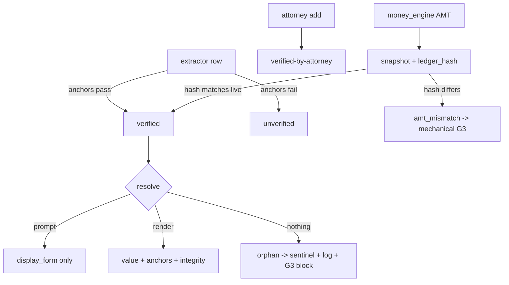

# Component: fact_registry

- **Status:** DRAFT for founder review · **Date:** 2026-07-04
- **Planned module path:** `app/engine/tokenizer` (from [04 §5](../04_data_model_and_contracts.md))
- **Contract doc (M0):** `docs/module_contracts/engine.tokenizer.md`
- Features: E1 (registry), E3 (anchor integrity), D3 (detokenizer) · Milestone: [M2](../05_implementation_plan.md) (v1) → [M5/M6](../05_implementation_plan.md)

## 1. Responsibility

**The spine.** One per-matter namespace of typed facts — `[[FACT_n]]`, `[[AMT_n]]`,
`[[CITE_n]]`, `[[EX_n]]` — each carrying `value`, `display_form`, anchors, verification
status, and source (`extractor | attorney | rules`). fact_registry is the **only** minter of
tokens ([04 §5](../04_data_model_and_contracts.md)) and the single resolution authority: it
answers *token → display form* for Brain-2 prompts (fabrication-safe) and *token →
value + anchors* for the renderer, provenance viewer, and compliance panel. It is
**versioned**: any post-freeze fact change bumps `registry_version`, and G2.5/G3 approvals
bind to a version (schema inv 3). It **freezes at G2a confirm**. Orphans (a token nothing
resolves) render as a sentinel and log loudly — they never reach the wire and hard-block G3.

**NOT responsible for:** *computing* values (money_engine owns arithmetic; the registry only
*stores* the `[[AMT]]` result + ledger hash); deciding what enters the letter (attorney
gates); extracting facts (corpus_extraction).

## 2. Boundary

| Direction | Item | Counterpart component |
|---|---|---|
| consumes | Anchored `MedicalEncounter` / `IncidentFacts` to tokenize | corpus_extraction |
| consumes | `[[AMT]]` facts (value + ledger hash) | money_engine |
| consumes | Attorney-added facts + dispositions (source=`attorney`) | orchestrator_gates (G1/G2a) |
| consumes | Rules-derived facts (deadlines, required terms; source=`rules`) | jurisdiction_rules |
| owns | `FactToken` (the versioned registry) | — |
| produces | Token → display form (prompt-safe) | brain2_drafting |
| produces | Token → resolution (verify + value) | compliance_engine |
| produces | Token → value + anchors (render) | package_builder |
| produces | Token → anchors (click-through) | api_and_wire → frontend_workbench |

## 3. Key types & fields

Extends [04 §2](../04_data_model_and_contracts.md) `FactToken`.

```python
class FactToken:                              # extends 04 §2
    token_id: str                             # FACT_12 / AMT_3 / CITE_2 / EX_5 — STABLE, never reused across versions
    matter_id: UUID; registry_version: int    # the version this row was written at
    kind: Literal["fact","amount","citation","exhibit"]
    value: JsonValue; display_form: str
    anchors: list[PageAnchor]
    status: Literal["verified","unverified","disputed"]   # disputed blocks G3
    source: Literal["extractor","attorney","rules"]
    # AMT-only linkage:
    ledger_ref: LedgerRef | None              # (ledger_line_set, category) into money_engine tables
    snapshot_value: Money | None              # value at mint time
    ledger_hash: str | None                   # hash of the billing-line-set the snapshot derived from

class RegistryVersion:
    matter_id: UUID; version: int
    frozen: bool                              # true from G2a confirm
    parent_version: int | None; change_reason: str  # what bumped it (late records, attorney edit)

class ResolutionResult:
    token_id: str
    outcome: Literal["ok","orphan","integrity_fail","amt_mismatch","unverified_block"]
    display_form: str | None; value: JsonValue | None; anchors: list[PageAnchor]
```

## 4. Internal design

**Single namespace, one mint point.** All four kinds share one per-matter id space; the
prefix (`FACT/AMT/CITE/EX`) is convention, resolution is uniform. This is the deliberate
TM doctrine-fit carry-over ([01 §5](../01_high_level_design.md)): *one* namespace with
metadata-tagged stance, not segregated legends (which caused pain).

**Two resolution modes.**
- *Prompt resolution* → `display_form` only (Brain-2 never sees raw provider names / cites /
  amounts; it emits the token back). Underpins invariant 5.
- *Render/provenance resolution* → `value + anchors`, with integrity checks run.

**Verified lifecycle.**
- `extractor`-minted → `verified` **iff** its anchors pass integrity (page exists, doc not
  superseded); otherwise `unverified`.
- `attorney`-added → `verified` (verified-by-attorney; `source=attorney` recorded so the
  provenance report distinguishes human assertions from record-derived ones).
- `disputed` → `unverified` and **blocks G3**.

**AMT tokens re-verify against the live ledger.** An `[[AMT]]` stores `ledger_ref` +
`snapshot_value` + `ledger_hash`. At resolution (G3 / render) the registry recomputes the
ledger hash for the referenced line-set and compares: a mismatch means billing lines changed
after the amount was minted → **mechanical G3 finding** (`amt_mismatch`), span-patchable to
the current value. The registry *reads* money_engine; it never sums (invariant 3).

**Versioning + freeze.** `registry_version` bumps on any post-freeze fact change (new
extractor row after G2a, attorney edit, late records). Approvals carry the version they were
made against; G3 comparing draft-`registry_version` to current is the schema-inv-3 hard block
("records changed since plan approval"). Token ids are **stable and never reused across
versions** — `FACT_12` means the same fact-slot forever; a superseded value is a new version
of that row, not a recycled id.

**Orphan policy.** A token in draft/render that resolves to nothing → `orphan`: emit a
sentinel string (never the raw token, never a guessed value — [04 §5](../04_data_model_and_contracts.md)
wire discipline), log loudly, and register a **hard G3 block**. Orphans are a bug surfaced,
not a value invented (invariant 11).



## 5. Invariants enforced

- **Inv 2 (provenance or it doesn't ship).** Every token carries anchors; render resolution
  runs anchor integrity; unanchored/broken → block, not wire.
- **Inv 5 (tokenize or omit).** Prompt resolution exposes only `display_form`; adverse facts
  are tokens with stance metadata, same namespace.
- **Inv 10 (derived rebuildable).** The registry is derived state — rebuildable from
  extractor rows + attorney elections + rules; versioning makes rebuilds addressable.
- **Inv 11 (UI displays, never invents).** Orphans → sentinel + loud log; nothing
  token-shaped crosses the wire; the registry never fabricates a missing value.

## 6. Failure modes & handling

| Failure | Handling |
|---|---|
| Anchor → superseded document | Integrity check fails at **G3** (not render time, per [E3](../02_feature_list.md)); status flips to a block, attorney sees it |
| Orphan token in draft | Sentinel + loud log + hard G3 block; section flagged for span-patch/regen |
| `[[AMT]]` snapshot ≠ live ledger | `amt_mismatch` mechanical finding; span-patch to current ledger value |
| Version race on concurrent edits | Optimistic lock on `registry_version`; last writer surfaces a conflict for human resolution (no silent overwrite) |
| Attorney-added fact with no anchor | Allowed but `source=attorney`, marked so the provenance report shows it is a human assertion, not record-derived |
| Stale approval (draft built on old version) | G3 version compare → hard block; no partial acceptance of a stale draft |

## 7. Test strategy (Tier-1)

- **100% token round-trip** on fixtures: every minted token resolves to `display_form` for
  prompts and to `value + anchors` for render; letter/chronology facts all round-trip (E2).
- **Version-binding blocks stale approvals** (property): approve at v_n, mutate a fact to
  v_{n+1}, attempt G3 on the v_n draft → hard block every time.
- **Orphan injection → sentinel + block:** inject an unresolvable token → wire carries a
  sentinel (never the token), log fires, G3 is blocked.
- **AMT re-verification:** mint `[[AMT]]`, edit an underlying billing line → resolution
  returns `amt_mismatch`; leave it untouched → `ok`.
- **Id stability:** across a version bump, `FACT_n` keeps its slot; superseded value is a new
  version row, id never recycled.

## 8. Open questions

- Freeze granularity: a single matter-level freeze at G2a, or per-fact freeze so late records
  can add facts without unfreezing verified ones? Leaning matter-level + explicit re-open on
  registry bump, matching the gate machine's version discipline.
- Should `[[CITE]]` (legal authority) integrity differ from fact anchors — cites resolve to a
  case/authority, not a `(doc, page)`? Likely a separate anchor kind; deferred to comparables
  work (B9, v1.x).
- Ledger-hash scope for `[[AMT]]`: hash the exact line-set, or the whole ledger? Line-set is
  tighter (fewer spurious mismatches) but needs money_engine to expose stable line-set ids.
- Concurrent-edit conflict UX: surface at the gate, or optimistic-lock error inline in the
  workbench grid? Depends on frontend_workbench's edit model.
