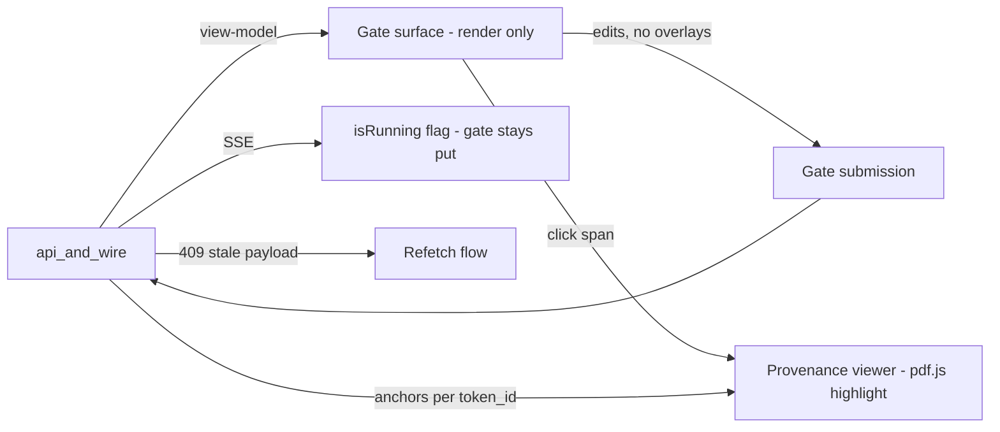

# Component — frontend_workbench

- **Status:** DRAFT for founder review · **Date:** 2026-07-04
- **Planned module path:** `frontend/` (Next.js app)
- **Contract doc (M0):** consumes `docs/module_contracts/api.view_models.md` (no FE-owned
  backend contract; the wire is the contract).
- Features: C2–C9, E2, G4 · Milestones: [M3–M6](../05_implementation_plan.md) · Refines
  [04 §6 frontend surface map](../04_data_model_and_contracts.md).

## 1. Responsibility

The **firm-facing UI**, one surface per gate, per [04 §6](../04_data_model_and_contracts.md).
It **displays backend state and captures human decisions** — it never invents state.
Surfaces:

- **Matter dashboard** — gate stepper, **non-dismissible deadline banner** (until G1
  confirm), budget chip.
- **Document center** — bulk upload with **resumable sessions**, classification review,
  **dedup quarantine queue**.
- **G1 facts & deadlines** form; **G1.5 strategy intake** (structured; attorney free-text
  preserved **verbatim**).
- **G2a evidence workbench** — editable **chronology grid** (overlay edits), **specials
  ledger grid** (edits route to `BillingLine` + recompute), **risk-flag panel** with
  dispositions (**high severity requires attorney**), **exhibit picker** with page-level
  include/exclude.
- **G2.5 plan editor** — sections, demand amount, deadline type.
- **G3 compliance review** — finding list bucketed **mechanical/semantic**, letter preview
  with **provenance click-through**.
- **Artifacts page** — downloads, provenance report.

**NOT responsible for:** inventing state — it **displays only** (invariant 11: view-models
in, submissions **without overlays** out); legal-reasoning display copy beyond the
backend-provided diagnostics (**the FE trusts `diagnostic.kind`**, it does not author legal
prose).

## 2. Boundary

| Direction | What | Peer component |
|---|---|---|
| consumes | Gate view-models (discriminated by `gate`, `payload_version`) | api_and_wire.md |
| consumes | SSE stream (`status`, `doc_state`, `section`, `gate_ready`, `artifact_ready`, `budget_warning`, `error`) | api_and_wire.md |
| consumes | Rendered letter + `span_map`; provenance anchors per `token_id` | api_and_wire.md |
| consumes | Page text + image URL (viewer) | api_and_wire.md |
| owns | Client UI state (grid overlays pre-submit, viewer highlight, `isRunning` flag) | — |
| produces | Gate submissions (approve/reject/edit/override) — **no overlay fields** | api_and_wire.md |
| produces | Billing-line edits (→ ledger recompute), risk dispositions, exhibit picks | api_and_wire.md |
| the ONLY backend contact | REST + SSE via `api_and_wire` | api_and_wire.md |

## 3. Key types & fields

Types are **client-side view shapes only** — the FE mints no domain state.

```typescript
// discriminated gate payload from GET /gates/current
type GateView =
  | { gate: "facts_review"; payload_version: number; view_model: FactsVM; role_affordances: Aff }
  | { gate: "evidence_review"; payload_version: number; view_model: EvidenceVM; role_affordances: Aff }
  | { gate: "compliance_review"; payload_version: number; view_model: ComplianceVM; role_affordances: Aff }
  /* ...one arm per GateState... */;

type ComplianceVM = {                    // G3
  findings: Finding[];                    // { bucket: "mechanical" | "semantic",
                                          //   severity: "blocking" | "advisory",
                                          //   diagnostic_kind: string, anchors, detail }
  letter: { sections: RenderedSection[]; span_map: Record<string, string> };  // span_id -> token_id
};

type RunState = { isRunning: boolean; gate: GateState };  // gate is stable during a stream
```

Submission payloads are **closed** — a submit body is `{action, edits}` only; it carries
**no `view_model`/overlay field** (the server rejects one, but the FE never constructs one).

## 4. Internal design

- **Displays state, never invents it (invariant 11).** Every surface renders a view-model;
  user edits are held as **local overlay state** and submitted as explicit `edits` — the FE
  never round-trips an AI overlay back as if it were input. TanStack Query owns fetch/cache;
  mutations submit and refetch.
- **SSE client (`fetch-event-source`), `isRunning` pattern.** During a run the surface stays
  on **the owning gate** — no step churn ([04 §4](../04_data_model_and_contracts.md)); an
  `isRunning` flag drives spinners/streamed previews. Optimistic UI **never fabricates
  completion**: only a `gate_ready`/`artifact_ready` event advances the view.
- **No gray-outs for legally-blocked actions (design rule).** Role-aware affordances, but a
  foreclosed action is **clickable**; the click surfaces an **inline legal/authorization
  reason** (from the backend diagnostic) and **blocks continue** — the server is the
  authority (invariant 8), the UI explains rather than hides.
- **G2a grids.** Chronology edits become overlay edits (the `chronology_builder` overlay
  store); specials-ledger edits **route to `BillingLine` and trigger recompute** — the FE
  never edits a total (invariant 3, the ledger is derived). The risk-flag panel enforces
  **attorney disposition on high severity** before G2a confirm (invariant 6, server-backed).
- **G3 provenance click-through.** The letter preview renders `RenderedSection`s; clicking a
  mapped span looks up `span_map[span_id] -> token_id`, fetches anchors, and drives the
  viewer highlight. **Findings show both splits** — mechanical/semantic *and*
  blocking/advisory — so the attorney sees what will span-patch vs regen.
- **Provenance viewer (`pdf.js`).** Page render + anchor highlight overlay; **<2s target on
  the 1,000-page fixture** ([05 M6](../05_implementation_plan.md)) via a **virtualized page
  list**; the Apryse fallback decision is staged at [03 §8](../03_tech_stack.md) if `pdf.js`
  chokes.
- **Accessibility + Spanish-intake readiness.** WCAG-minded components; a Spanish-language
  intake readiness note tracks the bootstrap-channel need ([09 §6](../09_bootstrap_abs_path.md)) —
  copy is externalized so intake surfaces can localize without a rewrite.



## 5. Invariants enforced

- **6** — the risk-flag UI requires attorney disposition on high-severity flags before G2a
  confirm; adverse facts are surfaced, never silently actioned.
- **8** — role-aware affordances, but the **server is the authority**; blocked actions
  explain (inline reason) rather than gray out; the UI never self-authorizes.
- **11** — view-models in, submissions **without overlays** out; the FE displays state and
  captures decisions, and mints no domain state of its own.

## 6. Failure modes & handling

| Failure | Detection | Handling |
|---|---|---|
| SSE drop mid-run | `fetch-event-source` disconnect | Reconnect + `Last-Event-ID` replay; optimistic UI **never fabricates completion** |
| Stale gate payload | `409` on submit (payload-version skew) | Refetch flow → re-render fresh `GateView`; no silent overwrite |
| Large-binder viewer perf | Page-count threshold on the 1,000-page fixture | Virtualized page list; Apryse fallback decision ([03 §8](../03_tech_stack.md)) |
| Token-shaped string in a payload | Should never occur (backend scanner) | Render backend sentinel as-is; log — the FE trusts the wire is token-free |
| Blocked action clicked | `403`/typed authorization diagnostic | Inline legal/authorization reason; block continue; no gray-out |
| Ledger edit desync | Recompute round-trip via `BillingLine` | Refetch ledger view after edit; the grid never shows a locally computed total |

## 7. Test strategy (Vitest + RTL)

- **RTL per gate surface** — each gate renders its view-model correctly (facts form,
  chronology grid, risk panel, plan editor, G3 finding list with both splits).
- **Wire-discipline test** — assert **submission payloads contain no overlay fields** (the
  round-trip guard, mirroring the backend `422`); grid edits serialize as `edits` only.
- **Role matrix rendering** — affordances render per role; a blocked action is **clickable**
  and surfaces the inline reason (no gray-out); attorney-only gates gate the submit.
- **Provenance round-trip e2e** — on a fixture, clicking a fact in the G3 preview opens the
  correct source page with the highlight (the E2 100%-round-trip acceptance).
- **SSE resilience** — a dropped stream reconnects and replays; the UI does not advance the
  gate until a real `gate_ready`.

## 8. Open questions

1. Specials-ledger grid edit latency: recompute round-trips to the backend on every cell
   edit, or batches on blur? (Leaning batch-on-blur; the ledger stays server-authoritative
   either way — no client-side totals.)
2. Provenance highlight fidelity when an anchor has no `bbox` (page-level only): highlight
   the whole page vs a "page N" banner? (Depends on extractor `bbox` coverage — coordinate
   with `corpus_extraction`.)
3. Spanish-intake scope at MVP vs v1.x: full localization or intake-surface-only strings?
   (Bootstrap-channel driven, [09 §6](../09_bootstrap_abs_path.md); externalize copy now,
   decide breadth later.)
4. Dashboard budget chip: live spend-vs-cap only, or per-stage hover breakdown from the
   `LLM_CALL` ledger? (Leaning simple chip at MVP.)
