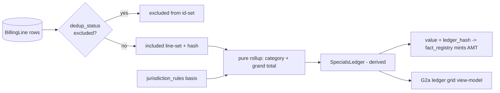

# Component: money_engine

- **Status:** DRAFT for founder review · **Date:** 2026-07-04
- **Planned module path:** `app/money` (from [04 §5](../04_data_model_and_contracts.md))
- **Contract doc (M0):** `docs/module_contracts/money.ledger.md`
- Features: B4 (specials ledger), B8 (wage loss, v1.x) · Milestone: [M2](../05_implementation_plan.md)

## 1. Responsibility

**All arithmetic on `Money`.** The specials ledger (a derived view over `BillingLine`:
category rollups; billed / adjusted / paid / outstanding columns; the jurisdiction
billed-vs-paid flag from jurisdiction_rules); demand math; wage loss (B8, v1.x); package
totals. Every function is **pure** — integer cents + currency in, integer cents out — with a
documented rounding policy. It emits `[[AMT]]` facts (value + ledger hash) to fact_registry;
the LLM references those tokens and **never computes a total** (invariant 3). The ledger is
**materialized and keyed by a billing-line-set hash**, invalidated on any `BillingLine`
change — corrections edit billing-line *rows*, the ledger recomputes; it is **never
hand-edited** (schema inv 2).

**NOT responsible for:** extraction (corpus_extraction owns `BillingLine`); letter text
(brain2_drafting); fee splits / disbursement (v2, and out of scope by policy).

## 2. Boundary

| Direction | Item | Counterpart component |
|---|---|---|
| consumes | `BillingLine` rows (billed/adjusted/paid, category, `dedup_status`, anchor) | corpus_extraction |
| consumes | Billed-vs-paid rule per jurisdiction | jurisdiction_rules |
| consumes | Attorney recategorization (writes back to `BillingLine.category`) | orchestrator_gates (G2a) |
| owns | `SpecialsLedger` (derived), rollup + demand-math functions, rounding policy | — |
| produces | `[[AMT]]` facts (value + `ledger_hash`) | fact_registry |
| produces | Ledger grid view-model (categories, columns, totals) | api_and_wire → frontend_workbench (G2a) |

## 3. Key types & fields

Refines [04 §2](../04_data_model_and_contracts.md) `SPECIALS_LEDGER` (derived view) and
`BillingLine`.

```python
Money = tuple[int, str]                       # (cents, currency) — no floats, ever

CATEGORY_TAXONOMY_V1 = (                       # fixed v1; recategorization writes to BillingLine.category
    "ER", "ambulance", "imaging", "PT/chiro", "ortho", "surgery", "pharmacy", "other",
)

class LedgerColumns:                           # per category and grand total
    billed: Money; adjusted: Money; paid: Money; outstanding: Money

class SpecialsLedger:                          # DERIVED — never persisted as source of truth
    matter_id: UUID
    line_set_hash: str                         # hash of the included BillingLine id-set + amounts
    by_category: dict[str, LedgerColumns]      # keys ⊆ CATEGORY_TAXONOMY_V1
    grand_total: LedgerColumns
    billed_vs_paid_basis: Literal["billed","paid"]  # from jurisdiction_rules (e.g. Howell line)
    demand_basis_total: Money                  # the figure demand math builds on, per basis

class DemandMath:
    specials: Money; wage_loss: Money | None   # B8 v1.x
    # general-damages multiplier / anchor is an ATTORNEY input (G1.5/G2.5), not computed here
    package_total: Money
    rounding: Literal["half_up"]               # documented; legal documents round-half-up

class LedgerRef:                               # what an [[AMT]] token points back to
    line_set: frozenset[UUID]; category: str | None
```

## 4. Internal design

**Pure functions, integer cents.** No floats anywhere — cents in, cents out. Currency travels
with every `Money`. **Rounding is round-half-up, documented** (legal documents; banker's
rounding would surprise a reader reconciling by hand). Rounding happens once, at the
presentation boundary, not per intermediate sum.

**Ledger as a derived view (schema inv 2).** The ledger is *computed* from the current
`BillingLine` set — it is never a table anyone edits. A **correction is a `BillingLine`
edit** (fix a paid amount, recategorize) which changes `line_set_hash`, which invalidates the
materialized ledger, which recomputes. There is no code path that writes a total directly.
This is the structural guarantee behind invariant 3: the only way to change a number is to
change an anchored source row.

**Materialization + invalidation.** The ledger is memoized on `line_set_hash` (the id-set +
amounts of included lines). Any `BillingLine` insert/edit/exclude changes the hash → cache
miss → recompute. The same hash is what an `[[AMT]]` token snapshots, so fact_registry can
detect drift (see [fact_registry §4](fact_registry.md)).

**Excluded lines never sum.** Lines whose page carries `dedup_status ∈ {duplicate_of,
superseded}` (from corpus_ingest's dedup resolution) are **excluded from the id-set** before
any rollup — the double-counting failure mode is structurally impossible, not filtered after
the fact.

**Billed-vs-paid basis.** jurisdiction_rules returns a typed `billed | paid` basis per
matter; `demand_basis_total` and every emitted `[[AMT]]` for the demand build on that basis.
The flag is *surfaced* (the G2a grid shows both columns) but the demand figure uses the
lawful basis — money_engine consumes the rule, never hardcodes the state law.

**Category taxonomy fixed at v1.** The eight-category set is closed for v1; **attorney
recategorization writes to `BillingLine.category`** (source-row edit → ledger recomputes),
never to the ledger. A new category is a taxonomy version bump, not an ad-hoc string.

**AMT emission.** For each figure the letter/plan needs (per-category specials, grand total,
demand total), money_engine hands fact_registry `{value, LedgerRef, ledger_hash}`;
fact_registry mints the `[[AMT_n]]`. money_engine does not mint tokens.



## 5. Invariants enforced

- **Inv 3 (LLM never does arithmetic).** Every total is a pure function of `BillingLine`
  rows; the LLM only references `[[AMT]]`. The design makes it impossible to "write a total"
  without editing an anchored source row.
- **Inv 10 (derived rebuildable).** The ledger is a derived view — always recomputable from
  `BillingLine`; never hand-edited (schema inv 2). Materialization is cache, not truth.

## 6. Failure modes & handling

| Failure | Handling |
|---|---|
| Duplicate billing lines double-counting | Excluded `dedup_status` lines are dropped from the id-set *before* rollup — never summed |
| Missing paid/adjusted values (bill only shows billed) | Column is `None`, not `0`; grid shows a gap; demand basis uses only present-and-lawful columns |
| Currency edge / mixed currency | Single-currency assumption for v1 (MVA, US); a mixed set is a hard error, not a silent coerce |
| Stale materialized ledger | `line_set_hash` mismatch → cache miss → recompute; `[[AMT]]` drift caught downstream by fact_registry |
| Attorney recategorizes into a non-taxonomy string | Rejected at the write; only `CATEGORY_TAXONOMY_V1` values accepted (taxonomy bump is a code change) |
| Rounding disagreement with a hand ledger | Documented round-half-up + rounding-once-at-presentation; the provenance report shows the pre-round cents |

## 7. Test strategy (Tier-1, hypothesis property tests)

- **Permutation invariance:** shuffling `BillingLine` order never changes any total (pure +
  order-independent).
- **Category sums = grand total:** ∀ fixtures, Σ category columns == grand-total columns, per
  column (billed/adjusted/paid/outstanding).
- **Excluded lines don't count:** adding a `duplicate_of`/`superseded` line leaves every total
  unchanged.
- **Cents-exact round-trip:** cents → display string → parse → cents is identity; no float
  drift; round-half-up honored at the boundary.
- **Golden reconciliation to the penny:** the [M2-exit](../05_implementation_plan.md) fixture
  ledgers match gold totals exactly (the acceptance bar for B3/B4).
- **Hash discipline:** identical line-sets → identical `line_set_hash`; any amount/membership
  change → different hash.

## 8. Open questions

- General-damages / pain-and-suffering: money_engine computes *nothing* here (it's an attorney
  anchor at G1.5/G2.5) — confirm the package total composition so the letter's demand figure
  is a pure sum of {specials basis, wage loss, attorney general-damages}, all from tokens.
- Wage-loss model (B8): hourly × missed-time vs documented-loss-statement — deterministic
  either way, but which anchored inputs are required (pay stubs, employer letter)? Deferred to
  v1.x scoping.
- Outstanding-balance semantics: is `outstanding = billed − paid − adjusted`, or a
  separately-extracted column? Leaning extracted-when-present, computed-as-fallback, flagged
  when they disagree (a reconciliation signal, not a silent compute).
- Line-set id exposure for `[[AMT]]` `ledger_ref`: stable ids for sub-totals (per category)
  require money_engine to name line-sets deterministically — coordinate with fact_registry's
  ledger-hash scope question.
