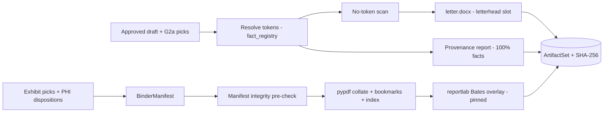

# Component — package_builder

- **Status:** DRAFT for founder review · **Date:** 2026-07-04
- **Planned module path:** `app/package`
- **Contract doc (M0):** `docs/module_contracts/package.builder.md`
- Features: D3–D6, E4 · Milestone: [M5](../05_implementation_plan.md) · Refines
  [01 §5 provenance](../01_high_level_design.md), [04 §2](../04_data_model_and_contracts.md).

## 1. Responsibility

Turn an **approved draft + G2a picks** into the deliverable artifacts, all derivable purely
from approved state (invariant 10):

- **`letter.docx`** (python-docx) — firm letterhead template slot; body is the **rendered**
  text from `fact_registry` resolution: **zero tokens survive into the artifact**
  (invariant 11) — a token reaching the docx is a build failure, not a cosmetic bug.
- **exhibit binder `.pdf`** — `pypdf` collation in manifest order, a bookmark per exhibit, a
  **generated exhibit index page**, **Bates stamping** via a `reportlab` overlay, page-level
  **include/exclude honored from the G2a picks**.
- **`chronology.xlsx`** — the `chronology_builder` rows + narratives, exported.
- **provenance report (feature E4, MVP)** — the per-demand audit artifact: every fact →
  source document/page + verification status. This is the positioning artifact
  ([06](../06_competitive_landscape.md)), not a v1.x nicety.

Redaction: v1 is **page-level exclusion** + a **`third_party_phi` disposition gate** (a
backstop for `risk_flag_engine` — undispositioned third-party-PHI pages **block the build**);
box-level redaction is v1.x (D6).

**NOT responsible for:** *what* is included (G2a picks + G3 approval decide that); prose
content (`brain2_drafting`); minting or resolving tokens beyond calling `fact_registry`
resolution; sending packages to carriers (out of scope v1).

## 2. Boundary

| Direction | What | Peer component |
|---|---|---|
| consumes | Approved `DEMAND_DRAFT` + `DraftSection[]` | brain2_drafting.md · compliance_engine.md |
| consumes | Token → value + anchors (render resolution) | fact_registry.md |
| consumes | Ledger totals (letter + xlsx figures) | money_engine.md |
| consumes | Exhibit picks + page include/exclude + PHI dispositions | frontend_workbench.md (G2a) · risk_flag_engine.md |
| consumes | Object store put/get; presign delegated | platform_core.md · api_and_wire.md |
| owns | `BinderManifest`, `ArtifactSet`, Bates numbering, provenance report | — |
| produces | `letter.docx`, `binder.pdf`, `chronology.xlsx`, `provenance_report.pdf` + SHA-256 manifest | api_and_wire.md (presigned downloads) |
| produces | binder manifest (EX existence) for the G3 check | compliance_engine.md |
| coordinated by | `package_assembly` after G3 approve | orchestrator_gates.md |

## 3. Key types & fields

```python
class BinderManifest:
    matter_id: UUID; version: int              # pinned; Bates numbering keys to this version
    entries: list[ExhibitEntry]                # ordered — collation order == index order
    # ExhibitEntry: {exhibit_token: "EX_5", document_id, included_pages: list[int],
    #                excluded_pages: list[int], bates_start: int, bates_end: int,
    #                phi_disposition: "cleared" | "excluded" | "pending"}

class ArtifactSet:
    matter_id: UUID
    draft_version: int; registry_version: int  # artifacts are versioned by (draft, registry)
    artifacts: list[Artifact]                   # {kind, object_key, sha256, byte_count}
    # kind: letter_docx | binder_pdf | chronology_xlsx | provenance_report_pdf
    built_at: datetime; built_by: UUID
```

Artifacts are keyed by `(draft_version, registry_version)` — a rebuild after registry drift
is a *new* `ArtifactSet`, never an overwrite; downloads resolve to a specific version.

## 4. Internal design

- **Detokenize-then-render (invariant 11).** The letter body is produced by resolving every
  token through `fact_registry` to its `value`/`display_form`; a **post-render scan asserts
  no token-shaped string survives** into the docx/pdf. Zero tokens in artifacts is a build
  invariant, enforced, not assumed.
- **Manifest-integrity pre-check (build-time, not delivery-time).** Before collation, every
  `included_page` is confirmed to exist in its `DocumentPage` store and no page is
  `superseded`. A missing/superseded page **fails the build** with a typed reason — the
  failure is loud and pre-delivery, never a silent gap in a shipped binder.
- **Bates stamping pinned to manifest version.** Numbering is assigned deterministically in
  manifest order and stored on `ExhibitEntry`; a rebuild at the same `BinderManifest.version`
  reproduces identical numbers — no collisions across rebuilds.
- **Deterministic bytes (diffable builds).** docx/pdf timestamps and embedded metadata are
  normalized so **same inputs → stable bytes**; two builds of the same `(draft, registry)`
  hash-match. This is what makes the golden-artifact tests meaningful.
- **Provenance report (E4).** Walks the rendered letter's span→fact map: for each rendered
  fact, emits `(display_form, source doc/page anchor, verified|unverified, source:
  extractor|attorney|rules)`. Property: **100% of rendered facts appear** — the report is
  the audit-completeness proof, so a rendered fact absent from the report is a build error.
- **Redaction gate.** Any `ExhibitEntry.phi_disposition == "pending"` blocks the build
  (backstop for `risk_flag_engine`'s G2a disposition). v1 honors page-level exclusion only;
  box redaction (D6) lands v1.x behind the same gate.



Storage: artifacts go to the object store via `platform_core`; presigned downloads are
issued by `api_and_wire` (`GET /artifacts`). Oversized binders: the `pdf.js` viewer perf
note ([03 §8](../03_tech_stack.md)) motivates a **chunked-binder option** for very large
exhibit sets.

## 5. Invariants enforced

- **2** — the provenance report is the per-demand proof that every rendered fact resolves to
  a live `(doc, page)` anchor.
- **10** — every artifact is derivable purely from approved state (`draft_version` +
  `registry_version`); nothing in a package is hand-authored.
- **11** — zero tokens in any artifact; a surviving token-shaped string fails the build.

## 6. Failure modes & handling

| Failure | Detection | Handling |
|---|---|---|
| Exhibit page missing/superseded at build | Manifest integrity pre-check | **Fail the build** with typed reason (not the delivery) — surfaces to the attorney |
| Token survives into docx/pdf | Post-render no-token scan | Fail the build (invariant 11); log the orphan token id loudly |
| Bates collision across rebuilds | Numbers pinned to `BinderManifest.version` | Deterministic re-assignment; identical numbers on same version |
| Undispositioned `third_party_phi` page | `phi_disposition == "pending"` | Redaction-disposition gate blocks the build until cleared/excluded |
| Oversized binder (1,000+ pages) | Byte/page-count threshold | Chunked-binder option ([03 §8](../03_tech_stack.md)); viewer paginates |
| Registry drifted since approval | `(draft, registry)` mismatch vs G3-approved | Refuse to build on a stale version; new `ArtifactSet` only after re-approval |

## 7. Test strategy

- **Golden-artifact hashes on fixtures** — same `(draft, registry)` inputs → byte-identical
  docx/pdf/xlsx (timestamp normalization asserted); the golden hash is the regression guard.
- **Index-matches-references** — every `[[EX_n]]` referenced in the rendered letter has a
  matching binder entry, index line, and bookmark; no dangling exhibit references.
- **Redaction-disposition gate** — a fixture with a `pending` third-party-PHI page fails the
  build; the same fixture with `excluded`/`cleared` builds.
- **Provenance-report completeness** — property: the report lists **100%** of rendered facts;
  a planted rendered fact omitted from the report fails the test.
- **Bates stability** — rebuild N times at a fixed manifest version → identical Bates ranges;
  a manifest reorder produces a new pinned numbering, not a collision.

## 8. Open questions

1. Letterhead template ingestion: a `.docx` template with a content-control slot per firm,
   or a per-firm config block? (Affects D4/D8; leaning template-with-slot for fidelity.)
2. Bates format per firm (prefix, zero-pad width, per-exhibit vs continuous) — config-driven,
   owned here; defaults need a legal-cofounder call.
3. Chunked-binder threshold and split policy (by exhibit boundary vs fixed page count) —
   deferred until the S1/M7 load test shows the real `pdf.js` ceiling ([03 §8](../03_tech_stack.md)).
4. Does the provenance report itself get Bates-stamped / included in the binder, or ship as
   a separate file-copy artifact? (Leaning separate — it is a work-product audit doc, not an
   exhibit sent to the carrier.)
