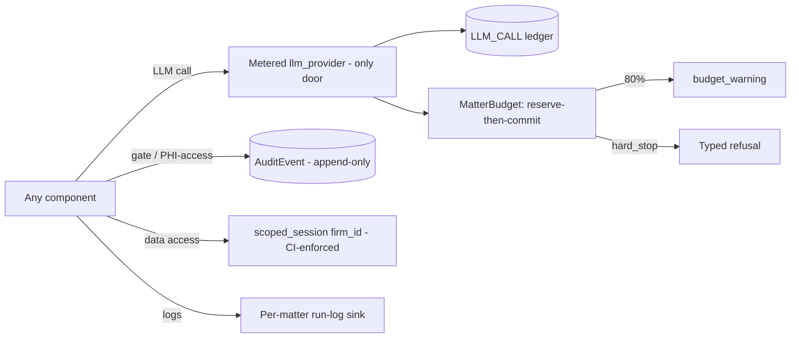

# Component — platform_core

- **Status:** DRAFT for founder review · **Date:** 2026-07-04
- **Planned module path:** `app/core` (+ `app/auth`)
- **Contract docs (M0):** `docs/module_contracts/core.llm_telemetry.md` ·
  `docs/module_contracts/core.matter_budget.md`
- Features: G1, G2, G3, G5, G8 · Milestone: [M0](../05_implementation_plan.md) · Refines
  [03 §3 HIPAA](../03_tech_stack.md), [04 §2](../04_data_model_and_contracts.md).

## 1. Responsibility

The **cross-cutting substrate** every other component stands on — auth, tenancy, audit,
metering, budget, config, storage, and the job queue. Concretely:

- **Auth** (`fastapi-users`; **argon2**; **TOTP**) + **firm tenancy** (every table
  firm-scoped; scoping enforced **centrally**, no per-query trust) + **role model**
  (`paralegal`/`attorney`/`admin`).
- **Append-only audit log** — gate actions (from `orchestrator_gates`), **PHI access**
  (document/page reads, artifact builds, exports) — satisfying the HIPAA access-log
  requirement ([03 §3](../03_tech_stack.md)).
- **`llm_provider` abstraction** (port of TM `core/llm_provider.py`) with a **per-call
  telemetry ledger** `LLM_CALL {matter, stage, model, tokens, cost}` over a stage enum:
  `classify · ocr_post · extract_encounter · extract_billing · chronology_narrative ·
  risk_flags · strategy_memo · draft_section · judge · assistant`.
- **Matter budget** — caps **ON by default**, `budget_warning` SSE at **80%**, hard-stop
  configurable (invariant 12; TM lesson: **wired from day 1, no undercounting** — every
  provider call goes through the metered client, no side doors).
- **Config + secrets**; **retention/deletion keyed by matter** (feature G8 v1.x, but the
  schema supports it from M0 — deletion keys by matter); **object-store adapter** (S3
  SSE-KMS, presigned URLs); **job-queue substrate** (Procrastinate on Postgres).

**NOT responsible for:** business rules, gate logic (`orchestrator_gates`), or wire shapes
(`api_and_wire`). It provides capability; it does not make product decisions.

## 2. Boundary

| Direction | What | Peer component |
|---|---|---|
| consumes | Gate-action + PHI-access events to audit | orchestrator_gates.md · api_and_wire.md · package_builder.md |
| consumes | Every LLM call (metered client is the only path) | all LLM-using components |
| owns | `User`, `Firm`, roles, `AuditEvent`, `LlmCall`, `MatterBudget`, object-store + queue adapters | — |
| produces | Auth/tenancy context (scoped session) | api_and_wire.md (+ all data access) |
| produces | Metered `llm_provider` client + `LLM_CALL` ledger rows | all LLM-using components |
| produces | `budget_warning` signal (at 80%) + hard-stop decision | api_and_wire.md (SSE) · orchestrator_gates.md |
| produces | Presigned URLs; per-matter run-log sinks (`AgentRunLogger` analog) | api_and_wire.md · package_builder.md · every phase |

## 3. Key types & fields

```python
class AuditEvent:                              # append-only; never updated/deleted
    id: UUID; firm_id: UUID; matter_id: UUID | None
    kind: Literal["gate_action","phi_access","artifact_build","export","auth"]
    actor_id: UUID; actor_role: str
    target: str                                # e.g. "document:{id}/page:{n}", "gate:G3"
    payload_hash: str | None; created_at: datetime

class LlmCall:                                 # the metering ledger (invariant 12)
    id: UUID; matter_id: UUID
    stage: LlmStage                            # the 10-value stage enum
    model: str; input_tokens: int; output_tokens: int; cost_cents: int
    provider: str; created_at: datetime

class MatterBudget:
    matter_id: UUID
    cap_cents: int; spent_cents: int; reserved_cents: int   # reserve-then-commit
    hard_stop: bool                            # configurable; caps ON by default
    warned_80: bool                            # idempotent 80% warning latch
```

Every firm-scoped table carries `firm_id`; the scoped-session helper injects the tenancy
predicate so no handler writes an unscoped query (see §4).

## 4. Internal design

- **Central tenancy (no per-query trust).** A `scoped_session(firm_id)` helper attaches the
  firm predicate at the query layer; raw unscoped `session` usage is **banned by a lint/CI
  rule**, so cross-firm reads are prevented *by construction*, not by reviewer vigilance.
- **The metered client is the only door (invariant 12).** `llm_provider` is the single call
  path; it writes an `LLM_CALL` row on **every** completion (tokens + cost) before returning.
  There is no unmetered provider handle anywhere — a **planted un-metered call fails CI**
  (meter-completeness test). This is the TM lesson made structural: partial wiring undercounts.
- **Budget: reserve-then-commit.** Before a call, reserve an estimate against
  `MatterBudget`; after, commit actuals and release the reservation. Concurrent runs on one
  matter therefore can't race past the cap (reservation accounting). At 80% emit
  `budget_warning` (idempotent latch); if `hard_stop`, refuse further calls with a typed
  error the orchestrator surfaces — not a silent stall.
- **Audit is not best-effort (invariant 9).** `AuditEvent` writes are synchronous and
  transactional with the action: **an audit-write failure fails the action**, it does not
  proceed unlogged. The log is append-only (no update/delete path exists in the API).
- **PHI-access logging (invariant 7 / [03 §3](../03_tech_stack.md)).** Every document/page
  read, artifact build, and export writes a `phi_access` `AuditEvent` — the HIPAA access-log
  requirement is met here, once, for all components that touch PHI.
- **BAA envelope (invariant 7).** The provider layer + object store + OCR adapter all point
  only at BAA'd endpoints from a checked-in inventory; a non-inventoried egress is a config
  error, not a runtime surprise. No PHI leaves the envelope.
- **Per-matter run logs (invariant 14).** An `AgentRunLogger` analog: every phase
  **dual-emits** the root logger **and** per-matter files (ingest/extraction/rules/drafting)
  — silent-wrong-output debugging starts from these logs (TM log-to-per-case-files discipline).
- **Retention/deletion keyed by matter (G8).** All matter-owned rows and object keys are
  reachable from `matter_id`, so deletion/export is a keyed sweep (honoring legal holds);
  the schema supports this from M0 even though the workflow ships v1.x.



## 5. Invariants enforced

- **7** — PHI stays in the BAA envelope (provider/store/OCR inventory) + a BAA-inventory
  pointer; no non-BAA egress.
- **9** — every gate/PHI/artifact action is audited append-only; audit-write failure fails
  the action.
- **12** — per-matter AI cost metered and capped, ON by default, wired from day 1 via the
  single metered client (no undercounting).
- **14** — per-matter run-log infrastructure (`AgentRunLogger` analog); every phase
  dual-emits root + per-matter files.

## 6. Failure modes & handling

| Failure | Detection | Handling |
|---|---|---|
| Budget-cap race across concurrent runs | Reserve-then-commit accounting | Reservation blocks over-spend before the call; no post-hoc overrun |
| Audit-log write failure | Transactional write with the action | **Fail the action, not the log** — audit is not best-effort |
| Unscoped raw query (tenancy bypass) | Lint/CI ban on bare `session` usage | CI fails; cross-firm reads prevented by construction |
| Un-metered LLM call path | Meter-completeness CI test | Planted unmetered call fails CI; the metered client is the only door |
| Non-BAA egress configured | Egress against the checked-in BAA inventory | Config error at startup, not a runtime PHI leak |
| Hard-stop reached mid-run | `spent + reserved ≥ cap` and `hard_stop` | Typed refusal surfaced by the orchestrator; run pauses, never silently stalls |

## 7. Test strategy

- **Cross-tenant isolation suite** — property: no query returns another firm's rows; the
  lint/CI rule blocks any unscoped `session` usage (construction-level, not spot-checked).
- **Meter completeness** — every LLM call path is metered; a **planted unmetered call fails
  CI**; ledger sums reconcile to a fixture run's known token/cost totals.
- **Audit coverage per action type** — each of gate-action / PHI-access / artifact-build /
  export writes exactly one append-only `AuditEvent`; an action that skips the log fails.
- **Budget accounting** — concurrent simulated runs on one matter cannot exceed the cap
  (reserve-then-commit property); the 80% warning latches once (idempotent).
- **PHI-access logging** — a document/page read emits a `phi_access` event with actor + target.

## 8. Open questions

1. Cost estimation for the reservation step: per-stage static estimates vs a rolling
   per-matter model? (Static-per-stage at MVP; the ledger corrects actuals — refine once real
   spend data exists, per the [03 §5](../03_tech_stack.md) cost hypotheses.)
2. Audit-log storage: same Postgres (simplest, one datastore) vs an append-only sink with
   WORM guarantees for stronger HIPAA posture? (Leaning Postgres at MVP; revisit at the M7
   HIPAA audit.)
3. Retention/deletion vs legal holds (G8): a matter under litigation hold must resist
   deletion — where does the hold flag live and who sets it? (Schema keys by matter from M0;
   the workflow + hold semantics are a v1.x design item.)
4. TOTP: mandatory for attorney (sign-off) roles at MVP, or configurable per firm?
