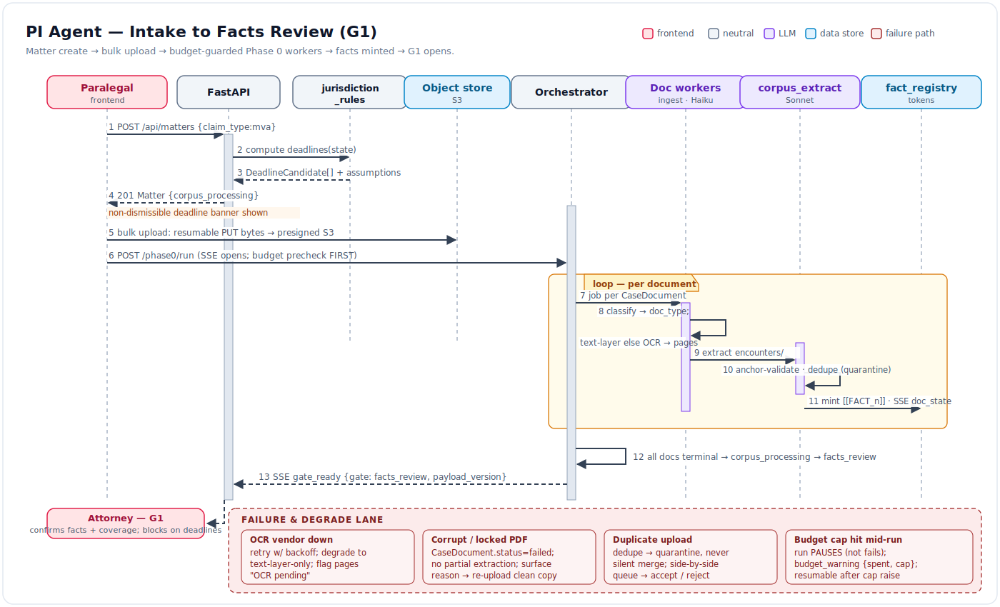
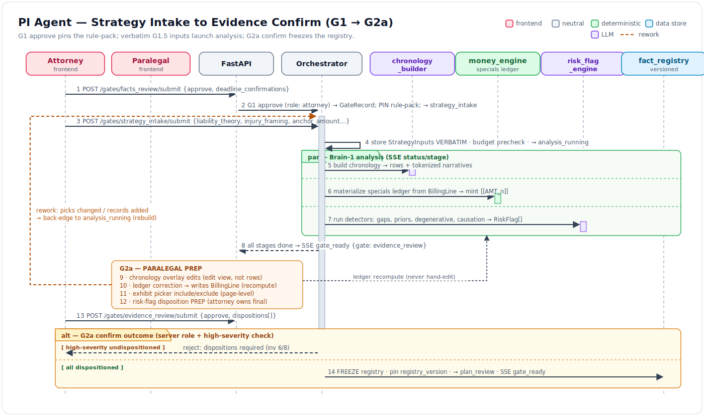
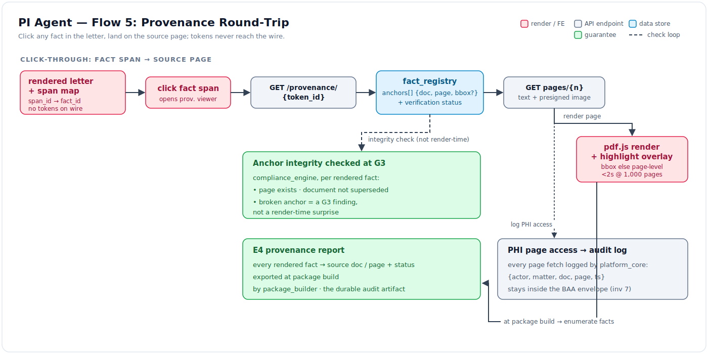

# PI Agent — System Flows (Level-2 Dynamic Design)

- **Status:** DRAFT · **Date:** 2026-07-04

These flow docs are the **level-2 dynamic design** for the PI Agent: they trace how a
matter moves through the [gate machine](../01_high_level_design.md) end to end, boundary by
boundary. Where the [component docs](../components/README.md) describe each module
statically (what it owns, what it may import), the flows describe *behavior over time* —
who calls whom, what data crosses each boundary, and which state transition or SSE event
results. Every flow uses the **exact** endpoints from
[`04_data_model_and_contracts.md` §3](../04_data_model_and_contracts.md) and the **exact**
SSE events from [`04` §4](../04_data_model_and_contracts.md); token namespaces
(`[[FACT_n]]` / `[[AMT_n]]` / `[[CITE_n]]` / `[[EX_n]]`) and gate states follow
[`01` §4–§5](../01_high_level_design.md). Invariant numbers cited throughout refer to
[`01` §1](../01_high_level_design.md).

Read order: 01 (this flow set is the dynamic view of that gate machine) → 04 (schemas,
API, SSE) → these flows → components for module internals.

## Flow index

| Flow | What it traces | Primary components touched | Diagram |
|---|---|---|---|
| [flow_01_intake_to_facts_review](./flow_01_intake_to_facts_review.md) | Matter creation → deadline compute → bulk upload → Phase 0 corpus build → **G1** (`corpus_processing`→`facts_review`) | [jurisdiction_rules](../components/jurisdiction_rules.md), [corpus_ingest](../components/corpus_ingest.md), [corpus_extraction](../components/corpus_extraction.md), [fact_registry](../components/fact_registry.md), [orchestrator_gates](../components/orchestrator_gates.md), [frontend_workbench](../components/frontend_workbench.md) |  |
| [flow_02_strategy_to_evidence_confirm](./flow_02_strategy_to_evidence_confirm.md) | **G1** approve → **G1.5** strategy intake → Brain-1 analysis → **G2a** paralegal prep + attorney confirm → registry freeze (`facts_review`→`plan_review`) | [orchestrator_gates](../components/orchestrator_gates.md), [chronology_builder](../components/chronology_builder.md), [money_engine](../components/money_engine.md), [risk_flag_engine](../components/risk_flag_engine.md), [fact_registry](../components/fact_registry.md), [frontend_workbench](../components/frontend_workbench.md) |  |
| [flow_03_demand_generation_to_package](./flow_03_demand_generation_to_package.md) | **G2.5** plan emit + approve → Brain-2 drafting → **G3** compliance → package build (`plan_review`→`package_ready`) | [orchestrator_gates](../components/orchestrator_gates.md), [brain2_drafting](../components/brain2_drafting.md), [compliance_engine](../components/compliance_engine.md), [fact_registry](../components/fact_registry.md), [package_builder](../components/package_builder.md) |  |
| [flow_04_late_records_rework](./flow_04_late_records_rework.md) | The invalidation cascade: new records arrive mid-matter → re-entrant Phase 0 → registry version bump → orchestrator invalidation matrix → delta re-confirm | [corpus_ingest](../components/corpus_ingest.md), [corpus_extraction](../components/corpus_extraction.md), [fact_registry](../components/fact_registry.md), [orchestrator_gates](../components/orchestrator_gates.md), [money_engine](../components/money_engine.md) |  |
| [flow_05_provenance_roundtrip](./flow_05_provenance_roundtrip.md) | Fact span → source page highlight; anchor-integrity at G3; the E4 provenance report export | [api_and_wire](../components/api_and_wire.md), [fact_registry](../components/fact_registry.md), [frontend_workbench](../components/frontend_workbench.md), [compliance_engine](../components/compliance_engine.md), [package_builder](../components/package_builder.md), [platform_core](../components/platform_core.md) |  |

## How to read a flow doc

Each doc follows a fixed template: **(1) Summary** — one paragraph; **(2) Diagram** — an
embedded SVG (drawn later from the Mermaid source in the `
` block, which is the
authoritative spec); **(3) Step-by-step** — every step names its component, action, the
field-level data crossing the boundary, and the state/SSE effect; **(4) Failure & rework
paths** — detection point, handling, user-visible effect; **(5) Invariants exercised** —
keyed to [`01` §1](../01_high_level_design.md); **(6) Open questions**.

The five forward flows compose the happy path (01 → 02 → 03); flow_04 is the rework
back-edge that any of them can trigger; flow_05 is the cross-cutting provenance guarantee
that flows 01–04 all depend on.
