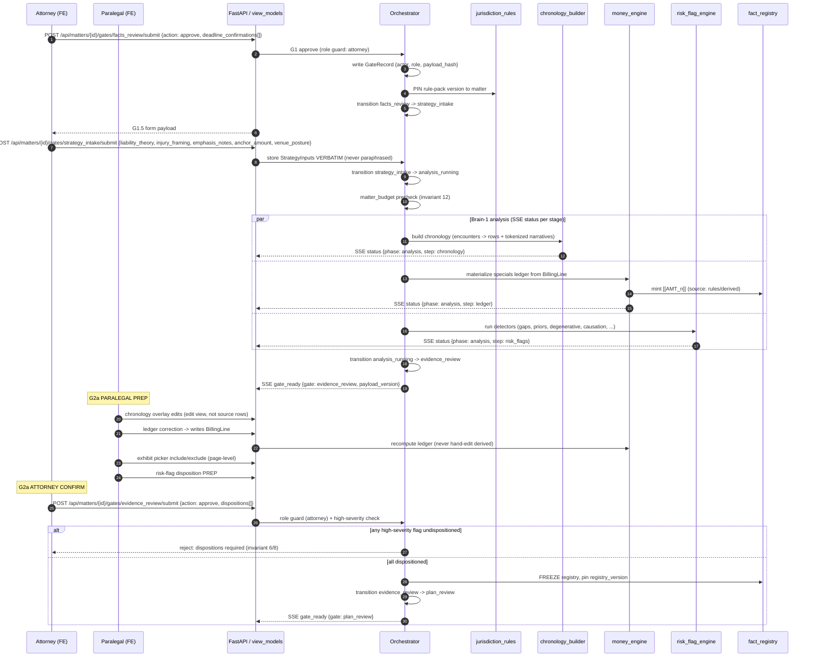

# Flow 02 — Strategy Intake to Evidence Confirm (G1 → G2a)

- **Status:** DRAFT · **Date:** 2026-07-04
- **Actors:** Attorney (G1 confirm, G1.5 intake, G2a confirm), Paralegal (G2a prep),
  Orchestrator, Brain-1 workers
- **Trigger:** Attorney approves G1 on a matter in `facts_review`
- **Preconditions:** Corpus built; `[[FACT_n]]` minted; deadlines surfaced (from
  [flow_01](./flow_01_intake_to_facts_review.md))
- **Postconditions:** Chronology, specials ledger, and risk flags materialized; high-severity
  flags dispositioned; fact registry **frozen** and `registry_version` pinned; matter in
  `plan_review`

## 1. Summary

The attorney confirms G1 — deadlines recorded, jurisdiction **rule-pack version pinned** to
the matter — then fills the G1.5 strategy form. Those inputs (liability theory, injury
framing, emphasis notes, anchor amount, venue posture) are stored **verbatim** as
`StrategyInputs`: attorney signal is never paraphrased away (the highest quality-per-hour
surface, per [`01` §4](../01_high_level_design.md)). Submitting G1.5 launches
`analysis/run`: budget-guarded Brain-1 builds the [chronology](../components/chronology_builder.md)
(rows + tokenized narratives), materializes the [specials ledger](../components/money_engine.md)
(minting `[[AMT_n]]` from billing lines), and runs the
[risk-flag detectors](../components/risk_flag_engine.md). `gate_ready {gate: evidence_review}`
opens G2a, where the **paralegal preps** (chronology overlay edits, ledger corrections that
rewrite `BillingLine` so the ledger recomputes, page-level exhibit include/exclude,
risk-flag disposition prep) and the **attorney confirms** — server-guarded, with every
high-severity flag required to be dispositioned or the confirm is rejected (invariants 6, 8).
Confirm freezes the registry, pins `registry_version`, and transitions to `plan_review`.

## 2. Diagram

Mermaid source

## 3. Step-by-step

| # | Component | Action | Boundary data | State / SSE |
|---|---|---|---|---|
| 1 | [orchestrator_gates](../components/orchestrator_gates.md) | Attorney `POST .../gates/facts_review/submit` | `{action:"approve", deadline_confirmations[], edits?}`; role guard = attorney (invariant 8) | writes `GateRecord {actor_id, actor_role, payload_hash}` |
| 2 | [jurisdiction_rules](../components/jurisdiction_rules.md) | Pin rule-pack version to matter at G1 approve | rule-pack `version` recorded on matter | deadlines now frozen against a known pack |
| 3 | [orchestrator_gates](../components/orchestrator_gates.md) | Transition | `facts_review → strategy_intake` | serves G1.5 form |
| 4 | [orchestrator_gates](../components/orchestrator_gates.md) | Attorney `POST .../gates/strategy_intake/submit` → store `StrategyInputs` **verbatim** | `{liability_theory, injury_framing, emphasis_notes, anchor_amount, venue_posture}` — no paraphrase | `strategy_intake → analysis_running` |
| 5 | [orchestrator_gates](../components/orchestrator_gates.md) | `POST /api/matters/{id}/analysis/run` after budget precheck (invariant 12) | budget cap vs projected | SSE channel opens |
| 6 | [chronology_builder](../components/chronology_builder.md) | Build chronology from merged encounters | out: rows `{date_of_service, provider, encounter_type}` + `narrative_tokenized` (tokens only) | SSE `status {step: chronology}` |
| 7 | [money_engine](../components/money_engine.md) | Materialize specials ledger from `BillingLine` (pure code) | ledger is a **derived view** — recomputable, never hand-edited (invariant 2 of `04` §2) | mints `[[AMT_n]]`; SSE `status {step: ledger}` |
| 8 | [fact_registry](../components/fact_registry.md) | Mint `[[AMT_n]]` amount tokens | `FactToken {kind:"amount", value: cents+currency, display_form, anchors[], source}` | registry gains amount tokens |
| 9 | [risk_flag_engine](../components/risk_flag_engine.md) | Run detectors | out: `RiskFlag {kind, severity, anchors[], detail}` (gaps, priors, degenerative, causation, liability, low-PD, third-party-PHI) | SSE `status {step: risk_flags}` |
| 10 | [orchestrator_gates](../components/orchestrator_gates.md) | All stages done → transition | `analysis_running → evidence_review` | SSE `gate_ready {gate: evidence_review, payload_version}` |
| 11 | [frontend_workbench](../components/frontend_workbench.md) | **Paralegal**: chronology overlay edits | overlay/edit layer over derived rows (source rows untouched — invariant 10) | overlay persisted, applied at render |
| 12 | [money_engine](../components/money_engine.md) | **Paralegal**: ledger correction → writes `BillingLine`, ledger **recomputes** | edit target = `BillingLine`, never the ledger total | `[[AMT_n]]` values refresh |
| 13 | [frontend_workbench](../components/frontend_workbench.md) | **Paralegal**: exhibit picker include/exclude (page-level) | per-page `include` flags | exhibit set staged |
| 14 | [risk_flag_engine](../components/risk_flag_engine.md) | **Paralegal**: disposition prep | proposed `disposition ∈ {address_in_letter, omit_with_rationale, need_more_records}` + rationale | prep only — attorney owns final |
| 15 | [orchestrator_gates](../components/orchestrator_gates.md) | **Attorney** `POST .../gates/evidence_review/submit` | `{action:"approve", dispositions[]}`; server role guard; **high-severity flags MUST be dispositioned** or reject (invariants 6, 8) | on reject: 4xx with required-disposition list |
| 16 | [fact_registry](../components/fact_registry.md) | On confirm: **freeze registry**, pin `registry_version` | frozen snapshot; `registry_version` recorded for downstream binding | `evidence_review → plan_review`; SSE `gate_ready {gate: plan_review}` |

## 4. Failure & rework paths

| Failure / rework | Detection point | Handling | User-visible effect |
|---|---|---|---|
| **Rework: picks changed or records added** | Paralegal changes exhibit picks or new records arrive during G2a | Back-edge `evidence_review → analysis_running`; **idempotent rebuild** — chronology/ledger/flags recomputed, overlays reapplied, conflicts surfaced | "Rebuilding analysis" status; overlays persist; conflicting edits flagged for review (see [flow_04](./flow_04_late_records_rework.md)) |
| Narrative cites unregistered claim | Chronology/section build references a fact not in the frozen registry (Tier-1 check) | Build **fails loudly** — run `error` event; no partial acceptance | Analysis run errors with the offending token; no silent drop (invariant 13/14) |
| Disposition race (paralegal ↔ attorney) | Concurrent writes to the same `RiskFlag.disposition` | Optimistic lock on flag row; loser gets a conflict | "This flag changed since you loaded it" — reload delta, redecide |
| High-severity flag left undispositioned | Server-side check at G2a confirm (step 15) | Confirm rejected; response lists the undispositioned high-severity flags | Attorney cannot advance; flag panel highlights the blockers (invariant 6) |
| Ledger hand-edit attempted | UI offers no ledger-total field; API rejects total writes | Corrections must target `BillingLine` (step 12) | Edits land on the line item; total recomputes — never a free-typed sum |

## 5. Invariants exercised

1. **Inv 8 (role-gated sign-off)** — steps 1, 15: paralegal preps; only the attorney
   approves G1/G1.5/G2a; enforced server-side.
2. **Inv 9 (attorney final + auditable)** — step 1: every gate action writes a `GateRecord`
   with actor, role, and `payload_hash`.
3. **Inv 3 (LLM never does arithmetic)** — steps 7–8, 12: the ledger is pure code; the LLM
   only ever references `[[AMT_n]]`.
4. **Inv 5 (tokenize or omit)** — steps 6, 8: chronology narratives are tokenized; amounts
   are `[[AMT_n]]`, never inline numbers.
5. **Inv 6 (adverse facts: surface always, disposition required)** — steps 9, 14–15:
   high-severity flags block confirm until dispositioned.
6. **Inv 10 (extractions / elections / derived separate; derived rebuildable)** — steps
   11–12, and the rework back-edge: overlays and `BillingLine` edits are elections; the
   ledger and chronology are derived and rebuild idempotently.
7. **Inv 12 (metered + capped)** — step 5: budget precheck before `analysis/run`.
8. **G2.5/G3 registry binding groundwork** — step 16: `registry_version` pinned at freeze so
   downstream approvals ([flow_03](./flow_03_demand_generation_to_package.md)) bind to it.

## 6. Open questions

- G1.5 preflight (v1.x): the emphasis-note classifier flags weak/unsupported framing — does
  a warning block G1.5 submit, or advise-only with an attorney override recorded in the
  `GateRecord`?
- Idempotent rebuild on the `evidence_review → analysis_running` back-edge: which paralegal
  overlays auto-reapply vs. require re-confirmation when the underlying row changed? (Cross-ref
  [flow_04](./flow_04_late_records_rework.md) "what survives rework".)
- Ledger recompute latency after a `BillingLine` correction (step 12): synchronous on submit,
  or a short SSE re-materialize so the grid doesn't block on large ledgers?
