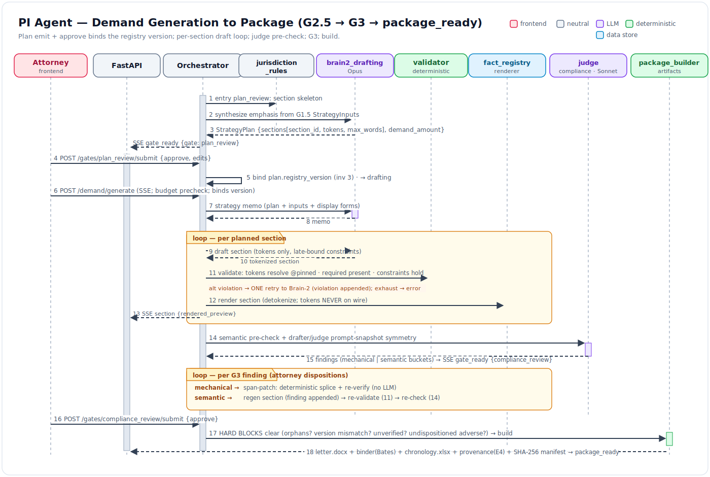

# Flow 03 — Demand Generation to Package (G2.5 → G3 → package_ready)

- **Status:** DRAFT · **Date:** 2026-07-04
- **Actors:** Attorney (G2.5 approve, G3 disposition/approve), Orchestrator, Brain-2 (Opus),
  Judge (Sonnet), deterministic core
- **Trigger:** Matter enters `plan_review` (registry frozen from
  [flow_02](./flow_02_strategy_to_evidence_confirm.md))
- **Preconditions:** Fact registry frozen with pinned `registry_version`; chronology, ledger,
  flags dispositioned; exhibit set staged
- **Postconditions:** `letter.docx` + exhibit binder + `chronology.xlsx` + provenance report
  built with a SHA-256 manifest; matter in `package_ready`

## 1. Summary

Entry to `plan_review` triggers a **`StrategyPlan` emit**: a deterministic section skeleton
from the [jurisdiction rules](../components/jurisdiction_rules.md) synthesized with Opus
emphasis from the verbatim G1.5 inputs — each `PlannedSection` carries `{section_id, purpose,
allowed/required tokens, max_words}`, plus `demand_amount` and `demand_type`. Attorney
approval **binds `plan.registry_version`** ([`04` §2](../04_data_model_and_contracts.md)
inv 3). `demand/generate` runs Brain-2: a strategy memo, then a per-section loop —
[draft](../components/brain2_drafting.md) (tokens only) → validator (tokens resolve at the
pinned version, required present, constraints hold; **one retry**, violation appended) → SSE
`section` with a **rendered** preview (detokenized via
[fact_registry](../components/fact_registry.md); tokens never on the wire, invariant 11). A
judge pre-check ([compliance_engine](../components/compliance_engine.md) semantic pass +
drafter prompt-snapshot symmetry) yields the finding list; `gate_ready {gate:
compliance_review}` opens G3. The attorney dispositions findings — **mechanical → span-patch**
(deterministic splice, re-verify), **semantic → section regen** — then approves against
**hard blocks** (orphan tokens, registry-version mismatch, unverified facts, undispositioned
adverse). Approval kicks `package_assembly`:
[package_builder](../components/package_builder.md) builds the artifacts with
Bates/bookmarks/index + a SHA-256 manifest, streaming `artifact_ready` per file, then
`package_ready`.

## 2. Diagram



<details>
<summary>Mermaid source</summary>

```mermaid
sequenceDiagram
    autonumber
    participant AT as Attorney (FE)
    participant API as FastAPI / view_models
    participant OR as Orchestrator
    participant RULES as jurisdiction_rules
    participant B2 as brain2_drafting (Opus)
    participant VAL as validator (deterministic)
    participant REG as fact_registry / renderer
    participant J as compliance_engine judge (Sonnet)
    participant PKG as package_builder

    Note over OR: entry to plan_review
    OR->>RULES: section skeleton (letter-structure requirements)
    OR->>B2: synthesize emphasis from G1.5 StrategyInputs
    B2-->>OR: StrategyPlan {sections[{section_id, purpose, allowed/required tokens, max_words}], demand_amount, demand_type}
    OR-->>API: SSE gate_ready {gate: plan_review}

    AT->>API: POST /api/matters/{id}/gates/plan_review/submit {action: approve, edits}
    API->>OR: bind plan.registry_version (04 §2 inv 3)
    OR->>OR: transition plan_review -> drafting

    AT->>API: POST /api/matters/{id}/demand/generate  (SSE opens; binds StrategyPlan.version)
    OR->>OR: matter_budget precheck (invariant 12)
    OR->>B2: strategy memo (plan + G1.5 inputs + registry display forms)
    B2-->>OR: memo

    loop per planned section
        OR->>B2: draft section (tokens only, late-bound hard constraints)
        B2-->>OR: tokenized section
        OR->>VAL: validate (tokens resolve @pinned version, required present, constraints hold)
        alt violation
            OR->>B2: ONE retry (violation appended)
            B2-->>OR: tokenized section (2nd)
            OR->>VAL: re-validate
        end
        OR->>REG: render section (detokenize)
        OR-->>API: SSE section {section_id, rendered_preview}  (tokens NEVER on wire)
    end

    OR->>J: semantic pre-check + drafter prompt-snapshot symmetry
    J-->>OR: findings (mechanical | semantic buckets)
    OR-->>API: SSE gate_ready {gate: compliance_review, findings[]}

    Note over AT: G3 disposition
    loop per finding
        alt mechanical
            AT->>API: span-patch
            OR->>OR: deterministic splice + re-verify
        else semantic
            AT->>API: regen section
            OR->>B2: regen (finding appended to constraints)
            OR->>VAL: re-validate
            OR->>J: re-check
        end
    end

    AT->>API: POST /api/matters/{id}/gates/compliance_review/submit {action: approve}
    OR->>OR: HARD BLOCKS: orphan tokens? version mismatch? unverified facts? undispositioned adverse?
    alt any hard block
        OR-->>AT: reject with blocker list
    else clear
        OR->>OR: transition compliance_review -> package_assembly
        OR->>PKG: build letter.docx + exhibit binder + chronology.xlsx + provenance report (E4)
        PKG->>PKG: manifest order, Bates, bookmarks, index; SHA-256 manifest
        PKG-->>API: SSE artifact_ready {artifact_kind, url}  (per artifact)
        OR->>OR: transition package_assembly -> package_ready
    end
```

</details>

## 3. Step-by-step

| # | Component | Action | Boundary data | State / SSE |
|---|---|---|---|---|
| 1 | [jurisdiction_rules](../components/jurisdiction_rules.md) | On `plan_review` entry: deterministic section skeleton | letter-structure requirements (e.g. time-limited-demand statutory terms) → `PlannedSection[]` shape | feeds the emit |
| 2 | [brain2_drafting](../components/brain2_drafting.md) | Opus emphasis synthesis over verbatim `StrategyInputs` | in: G1.5 inputs + registry display forms → out: `emphasis_directives[]` per section | — |
| 3 | [orchestrator_gates](../components/orchestrator_gates.md) | Emit `StrategyPlan` | `{version, registry_version, demand_amount, demand_type, sections[{section_id, purpose, allowed/required tokens, max_words}]}` | SSE `gate_ready {gate: plan_review}` |
| 4 | [orchestrator_gates](../components/orchestrator_gates.md) | Attorney `POST .../gates/plan_review/submit` (approve/edit) | `{action, edits}`; **approval binds `plan.registry_version`** (`04` §2 inv 3) | `GateRecord`; `plan_review → drafting` |
| 5 | [orchestrator_gates](../components/orchestrator_gates.md) | `POST /api/matters/{id}/demand/generate` after budget precheck; **binds `StrategyPlan.version`** | budget cap vs projected | SSE channel opens |
| 6 | [brain2_drafting](../components/brain2_drafting.md) | Strategy memo | in: plan + G1.5 inputs + registry display forms → out: memo | (no `agent_reasoning` on wire) |
| 7 | [brain2_drafting](../components/brain2_drafting.md) | Per-section draft (tokens only, late-bound hard constraints) | out: tokenized section text with `[[FACT_n]]/[[AMT_n]]/[[CITE_n]]/[[EX_n]]` | — |
| 8 | [compliance_engine](../components/compliance_engine.md) | Validate: tokens resolve @pinned version, required tokens present, constraints hold | pass/fail + violation detail | on fail → **one retry** (step 9) |
| 9 | [brain2_drafting](../components/brain2_drafting.md) | One retry with violation appended (structured-output convergence) | violation text appended to constraints | re-validate; exhaust → failure (§4) |
| 10 | [fact_registry](../components/fact_registry.md) | Render section (detokenize) | tokens → `display_form`/resolved values; **tokens never serialize** (invariant 11) | — |
| 11 | [api_and_wire](../components/api_and_wire.md) | Emit rendered section | SSE `section {section_id, rendered_preview}` | preview streams to G3 UI |
| 12 | [compliance_engine](../components/compliance_engine.md) | Judge pre-check: semantic pass + drafter/judge **prompt-snapshot symmetry** | out: `COMPLIANCE_FINDING[]` bucketed mechanical/semantic | SSE `gate_ready {gate: compliance_review, findings[]}` |
| 13 | [frontend_workbench](../components/frontend_workbench.md) | G3: attorney dispositions — mechanical → span-patch | deterministic splice into rendered span; re-verify | finding resolved, no LLM |
| 14 | [compliance_engine](../components/compliance_engine.md) | G3: semantic → section regen | finding appended to hard constraints → re-validate (step 8) → re-check (step 12) | new rendered section |
| 15 | [orchestrator_gates](../components/orchestrator_gates.md) | Attorney `POST .../gates/compliance_review/submit` approve — **hard blocks** | orphan tokens? registry-version mismatch? unverified facts? undispositioned adverse? | reject with blocker list, or `compliance_review → package_assembly` |
| 16 | [package_builder](../components/package_builder.md) | Build artifacts | `letter.docx` + exhibit binder (manifest order, Bates, bookmarks, index) + `chronology.xlsx` + provenance report (E4); **SHA-256 manifest** | SSE `artifact_ready {artifact_kind, url}` per file |
| 17 | [orchestrator_gates](../components/orchestrator_gates.md) | All artifacts built | — | `package_assembly → package_ready` |

## 4. Failure & rework paths

| Failure / rework | Detection point | Handling | User-visible effect |
|---|---|---|---|
| **Rework: strategy revised** | Attorney edits the theory at G2.5 | Back-edge `plan_review → strategy_intake` ([`01` §4](../01_high_level_design.md)); re-run analysis if inputs shifted | Routes back to G1.5; downstream stale (see [flow_04](./flow_04_late_records_rework.md)) |
| **Semantic G3 finding** | Judge flags unsupported causation / tone drift / volunteered adverse (step 12) | `compliance_review → drafting` for that section; regen, re-validate, re-check | Section "regenerating"; new preview replaces it |
| Validator exhausts retry | Section fails validation twice (steps 8–9) | Run surfaces section failure via `error`; **no silent acceptance** (invariant 13) | Attorney sees the failed section + violation; manual intervention, not a bad draft shipped |
| Judge/drafter snapshot hash mismatch | Prompt-snapshot symmetry check fails (step 12) | **Hard error** — drafter and judge must be locked to the same snapshot | Run errors; drift must be reconciled before G3 |
| Exhibit page missing at build | `package_builder` manifest pre-check (step 16) | **Fails the build** before producing a partial binder | "Binder build blocked: exhibit page N unavailable"; fix picks, rebuild |
| `[[AMT_n]]` snapshot ≠ live ledger | Build-time reconciliation vs money_engine | **Mechanical finding auto-raised** (not silent) — routes back through G3 mechanical bucket | Amount discrepancy surfaced as a fixable finding |
| Hard block at G3 approve | Orphan token / version mismatch / unverified fact / undispositioned adverse (step 15) | Approve rejected with the blocker list | Cannot advance; blockers enumerated in the panel |

## 5. Invariants exercised

1. **Inv 2 (provenance or it doesn't ship)** — step 15: orphan tokens + unverified facts are hard blocks at G3 approve.
2. **Inv 3 (LLM never does arithmetic)** — steps 7, 16 + AMT-mismatch: amounts are `[[AMT_n]]`; build reconciles vs the pure-code ledger, auto-raising a finding on drift.
3. **Inv 5 / 11 (tokenize or omit; UI displays state)** — steps 7, 10–11: sections draft in tokens; only the rendered preview crosses the wire.
4. **Inv 6 (adverse: surface always, volunteer never)** — steps 12, 15: undispositioned adverse is a hard block; volunteered adverse is a semantic finding.
5. **Inv 9 + `04` §2 inv 3 (attorney final; version binding)** — steps 4–5, 15: G2.5/G3 approvals write `GateRecord` and bind `registry_version`/`StrategyPlan.version`; mismatch at G3 is a hard block.
6. **Inv 12 (metered + capped)** — step 5: budget precheck before `demand/generate`.
7. **Inv 13 (semantic = LLM; deterministic = code)** — steps 8/13 vs 12/14: mechanical findings span-patch deterministically; semantic findings regen via the LLM.

## 6. Open questions

- `StrategyPlan` emit is deterministic-skeleton + Opus emphasis: does emphasis synthesis run
  eagerly on `plan_review` entry (pre-warming the plan) or lazily on first plan fetch, given
  the budget meter?
- Single-retry validator: on the rare double-failure, is the fallback attorney-manual-edit
  only, or a bounded third attempt behind a config flag (parked, default-off)?
- Provenance report (E4) is promoted to MVP ([`05` M6](../05_implementation_plan.md)) — is it
  built inline in `package_assembly` (step 16) or as a separately re-runnable export so it can
  refresh without a full package rebuild?
