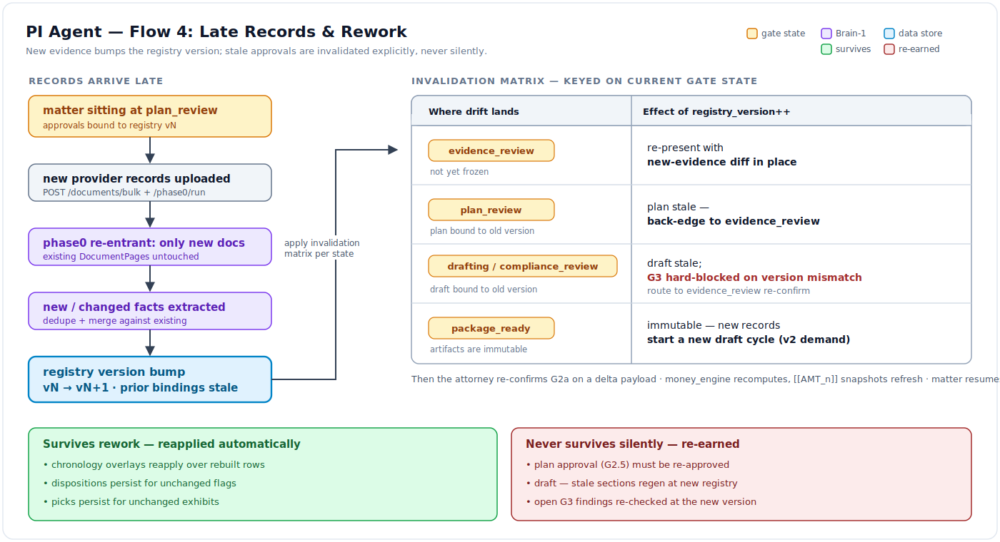
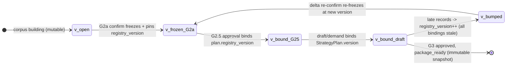

# Flow 04 — Late Records Rework (The Invalidation Cascade)

- **Status:** DRAFT · **Date:** 2026-07-04
- **Actors:** Paralegal (uploads late records), Attorney (delta re-confirm), Orchestrator,
  Brain-1 workers
- **Trigger:** New provider records arrive **after** approvals — while the matter sits in
  `plan_review` (also `drafting` / `compliance_review` / `package_ready` variants)
- **Preconditions:** A registry version was pinned at an earlier gate ([flow_02](./flow_02_strategy_to_evidence_confirm.md)
  freeze; [flow_03](./flow_03_demand_generation_to_package.md) plan/draft binding)
- **Postconditions:** Registry version bumped; stale approvals explicitly invalidated per the
  matrix; attorney re-confirms a **delta-focused** payload; matter resumes forward

## 1. Summary

Late records are the common PI case (a missing provider's file shows up). Upload re-enters
Phase 0 **re-entrantly** — only the new documents process; existing pages are untouched
([corpus_ingest](../components/corpus_ingest.md) / [corpus_extraction](../components/corpus_extraction.md)).
New/changed facts bump the [fact_registry](../components/fact_registry.md) `registry_version`,
which by construction makes prior approvals **stale** (they bound to the old version, per
[`04` §2](../04_data_model_and_contracts.md) inv 3). The [orchestrator](../components/orchestrator_gates.md)
applies its **invalidation matrix** (below) keyed on current gate state, back-edging to
`evidence_review` and hard-blocking G3 on version mismatch. The UI shows a "records changed
since approval" banner + a **diff view** (facts added/changed, flags re-fired). The attorney
re-confirms G2a on a **delta payload** — not a full re-review — the plan is re-validated with
amounts recomputed by [money_engine](../components/money_engine.md) and `[[AMT_n]]` snapshots
refreshed, and the matter resumes. What **survives** rework: chronology overlays reapply,
dispositions for unchanged flags persist, picks persist for unchanged exhibits. What **never**
survives silently: plan approval, the draft, and G3 findings.

## 2. Diagram

```mermaid
stateDiagram-v2
    direction LR
    [*] --> RECORDS_ARRIVE : new provider records uploaded

    RECORDS_ARRIVE --> phase0_reentrant : POST /documents/bulk + /phase0/run
    note right of phase0_reentrant
        ONLY new docs process
        existing DocumentPages untouched (inv 10)
    end note
    phase0_reentrant --> extract_delta : classify/OCR/extract new docs
    extract_delta --> version_bump : new/changed facts -> registry_version++

    version_bump --> INVALIDATION_MATRIX : apply by current gate state

    state INVALIDATION_MATRIX {
        [*] --> in_evidence_review
        [*] --> in_plan_review
        [*] --> in_drafting_or_compliance
        [*] --> in_package_ready

        in_evidence_review : re-present with NEW-EVIDENCE diff
        in_plan_review : plan STALE -> back-edge to evidence_review
        in_drafting_or_compliance : draft STALE -> G3 hard-blocked on version mismatch -> evidence_review re-confirm
        in_package_ready : IMMUTABLE -> start NEW draft cycle (v2 demand)
    }

    INVALIDATION_MATRIX --> delta_reconfirm : banner + diff (facts +/changed, flags re-fired)
    delta_reconfirm --> revalidate_plan : attorney re-confirms G2a (delta payload)
    revalidate_plan --> money_recompute : money_engine recomputes; [[AMT_n]] snapshots refresh
    money_recompute --> RESUME : resume forward (drafting / G3 / build)
    RESUME --> [*]
```

Mermaid source

Registry-version lifecycle (pin points):

## 3. Step-by-step

| # | Component | Action | Boundary data | State / SSE |
|---|---|---|---|---|
| 1 | [corpus_ingest](../components/corpus_ingest.md) | Paralegal uploads late records (`POST .../documents/bulk` → `POST .../phase0/run`, **re-entrant**) | new `CaseDocument` rows only; existing docs/pages untouched (invariant 10) | SSE `doc_state` for new docs only |
| 2 | [corpus_extraction](../components/corpus_extraction.md) | Extract only new documents; dedupe/merge against existing (may re-open a merged encounter) | new/changed `MedicalEncounter`/`BillingLine`; `merged_from[]` updated | extraction on delta |
| 3 | [fact_registry](../components/fact_registry.md) | New/changed facts → **`registry_version++`** | prior bindings now stale by construction (`04` §2 inv 3) | version bump event |
| 4 | [orchestrator_gates](../components/orchestrator_gates.md) | Apply **invalidation matrix** keyed on current gate state (table below) | matrix decision → target state | back-edge transition |
| 5 | [frontend_workbench](../components/frontend_workbench.md) | Show "records changed since approval" banner + **diff view** | diff: facts added/changed, flags re-fired, exhibits affected | banner + diff surface |
| 6 | [orchestrator_gates](../components/orchestrator_gates.md) | Attorney re-confirms G2a on a **delta payload** (not full re-review) | `POST .../gates/evidence_review/submit` scoped to the delta; new-high-severity flags require disposition (invariant 6) | `GateRecord`; re-freeze at new version |
| 7 | [money_engine](../components/money_engine.md) | Recompute ledger; refresh `[[AMT_n]]` snapshots | `BillingLine` delta → recomputed totals | amount tokens refreshed |
| 8 | [orchestrator_gates](../components/orchestrator_gates.md) | Plan re-validated (diff shown); resume forward | plan checked against new `registry_version` | resume to `drafting`/`compliance_review`/build |

### Invalidation matrix (by current gate state at record arrival)

| Current state | Effect of `registry_version++` | Route | Rationale |
|---|---|---|---|
| `evidence_review` | Not yet frozen | Re-present with **"new evidence" diff** in place | Still in prep; fold the delta in |
| `plan_review` | Plan bound to old version → **stale** | Back-edge → `evidence_review` | Re-confirm evidence before re-planning |
| `drafting` / `compliance_review` | Draft bound to old version → **stale**; **G3 hard-blocked on version mismatch** | Route → `evidence_review` re-confirm | Cannot ship a draft anchored to a superseded registry (invariant 2) |
| `package_ready` | Artifacts are **immutable** | New records start a **new draft cycle** (v2 demand) | Delivered package is a frozen snapshot; iterate as a new version |

### What survives / never survives rework

| Survives (reapplied) | Never survives silently (re-earned) |
|---|---|
| Chronology overlays reapply over rebuilt rows | **Plan approval** (G2.5) — must be re-approved |
| Dispositions for **unchanged** flags persist | **Draft** — stale sections regen against new registry |
| Picks persist for **unchanged** exhibits | **G3 findings** — re-checked at the new version |

## 4. Failure & rework paths

| Failure / edge | Detection point | Handling | User-visible effect |
|---|---|---|---|
| **Rework storm** (multiple record batches back-to-back) | Repeated `registry_version++` while a re-confirm is pending | **Debounce**: version bumps **coalesce** into a single pending delta until the attorney re-confirms | One consolidated "records changed" diff, not N banners; re-confirm once |
| Overlay orphaned by re-merge | A dedupe re-merge dissolves the row a chronology overlay targeted (step 2) | Overlay **parked + flagged** (not silently dropped) | "This edit no longer maps to a row" — attorney re-applies or discards |
| New high-severity flag in the delta | Detector fires on new records (step 2, 6) | Blocks the delta re-confirm until dispositioned (invariant 6) | Flag panel highlights the new blocker |
| Attorney tries to skip straight to build | Version mismatch guard at G3 (matrix row 3) | Hard block — must route through `evidence_review` re-confirm | Cannot advance; blocker names the version delta |

## 5. Invariants exercised

1. **Inv 10 (extractions / elections / derived separate; derived rebuildable)** — steps 1–3:
   re-entrant Phase 0 touches only new docs; overlays/dispositions/picks are elections that
   reapply over rebuilt derived state.
2. **`04` §2 inv 3 (version binding)** — steps 3, 4, matrix: bindings to the old
   `registry_version` are stale by construction; G3 mismatch is a hard block.
3. **Inv 2 (provenance or it doesn't ship)** — matrix row 3: a draft anchored to a superseded
   registry cannot ship.
4. **Inv 6 (adverse: surface always)** — step 6, failure row 3: new high-severity flags in the
   delta require disposition before re-confirm.
5. **Inv 3 (LLM never does arithmetic)** — step 7: amounts recompute in the ledger; `[[AMT_n]]`
   snapshots refresh from pure code, never re-typed.
6. **Inv 1 / 9 (gated copilot; attorney final + auditable)** — step 6: the delta re-confirm is
   still an attorney gate action writing a `GateRecord`; the system never auto-heals a stale
   approval.
7. **Inv 14 (diagnostics for silent wrong output)** — orphaned-overlay path: parked + flagged
   with a reason, logged, never dropped.

## 6. Open questions

- Delta-payload scoping: how is "changed" computed for re-confirm — token-set diff on the
  registry, or fact-level semantic diff (a re-extracted encounter with the same facts but a
  new anchor should ideally **not** re-trigger a full flag review)?
- Debounce window for the rework storm: fixed timer, or hold coalescing open until Phase 0 for
  the newest batch reaches a terminal state?
- `package_ready` → v2 demand: does the v2 cycle fork a new `DEMAND_DRAFT` while preserving the
  delivered v1 artifacts as an immutable prior, and how is that surfaced (version history on the
  Package surface)?
