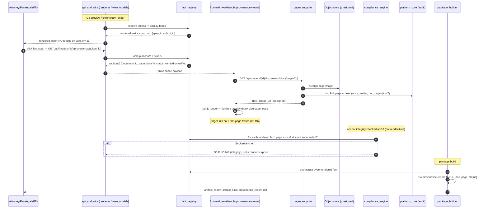

# Flow 05 — Provenance Roundtrip (Fact → Source Page, and the E4 Report)

- **Status:** DRAFT · **Date:** 2026-07-04
- **Actors:** Attorney / Paralegal (click-through in G3 preview or chronology), Renderer,
  Provenance viewer, Compliance engine, Package builder, Platform audit
- **Trigger:** A user clicks a fact span in the rendered letter/chronology, **or** the E4
  provenance report is exported at package build
- **Preconditions:** Facts minted with `anchors[]`; documents/pages in the store with image
  refs; registry rendered to spans on the wire (invariant 11)
- **Postconditions:** Source page rendered with a highlight overlay in <2s (on the 1,000-page
  fixture); or the E4 report enumerates every rendered fact → source doc/page + status; PHI
  page access audit-logged

## 1. Summary

Provenance is the guarantee that flows 01–04 all lean on: every factual assertion resolves to
a `(document, page)` anchor (invariant 2). The renderer inside
[api_and_wire](../components/api_and_wire.md) emits the letter **with a span map**
(`span_id → fact_id`); tokens themselves never serialize (invariant 11). Clicking a span in
the G3 preview or on a chronology fact calls `GET /api/matters/{id}/provenance/{token_id}`,
which returns `anchors[] {document_id, page, bbox?}` + verification status from the
[fact_registry](../components/fact_registry.md). The
[frontend_workbench](../components/frontend_workbench.md) provenance viewer fetches the page
via `GET /api/matters/{id}/documents/{doc}/pages/{n}` (text + presigned image URL), renders it
with pdf.js, and overlays the highlight — bbox if present, else page-level — targeting **<2s**
on a 1,000-page fixture ([`05` M6](../05_implementation_plan.md)). **Anchor integrity** is
checked earlier, at G3, by the [compliance_engine](../components/compliance_engine.md): page
exists and document is not superseded — a broken anchor is a **G3 finding**, not a
render-time surprise. At package build, [package_builder](../components/package_builder.md)
exports the **E4 provenance report**: every rendered fact → source doc/page + status. Every
PHI page fetch is logged to the audit trail ([platform_core](../components/platform_core.md),
invariant 7).

## 2. Diagram

Mermaid source

## 3. Step-by-step

| # | Component | Action | Boundary data | State / SSE |
|---|---|---|---|---|
| 1 | [api_and_wire](../components/api_and_wire.md) | Renderer resolves tokens via registry, emits letter **with span map** | out: rendered text + `span_map {span_id → fact_id}`; **tokens never serialize** (invariant 11) | G3 preview / chronology render |
| 2 | [frontend_workbench](../components/frontend_workbench.md) | User clicks a fact span | `span_id → fact_id (token_id)` | opens provenance viewer |
| 3 | [api_and_wire](../components/api_and_wire.md) | `GET /api/matters/{id}/provenance/{token_id}` | out: `anchors[] {document_id, page, bbox?}`, `status: verified\|unverified` (from `fact_registry`) | — |
| 4 | [frontend_workbench](../components/frontend_workbench.md) | Fetch source page: `GET /api/matters/{id}/documents/{doc}/pages/{n}` | out: `{text, image_url}` (presigned) | — |
| 5 | [platform_core](../components/platform_core.md) | **Audit-log the PHI page access** on the pages endpoint | `{actor_id, matter_id, document_id, page_no, ts}` (invariant 7) | audit row written |
| 6 | [frontend_workbench](../components/frontend_workbench.md) | pdf.js render + highlight overlay | `bbox` if present → precise box; else **page-level** highlight fallback | **<2s** target, 1,000-page fixture ([`05` M6](../05_implementation_plan.md)) |
| 7 | [compliance_engine](../components/compliance_engine.md) | **Anchor integrity at G3**: page exists, document not superseded | per rendered fact: existence + supersession check | broken anchor → **G3 finding** (not render-time) |
| 8 | [package_builder](../components/package_builder.md) | Export **E4 provenance report** at build | every rendered fact → `{document, page, status}` | SSE `artifact_ready {artifact_kind, url}` |

## 4. Failure & rework paths

| Failure | Detection point | Handling | User-visible effect |
|---|---|---|---|
| Anchor to superseded document | Compliance integrity check at G3 (step 7) | **Integrity finding** in the G3 panel; blocks approve until re-anchored/re-confirmed (ties to [flow_04](./flow_04_late_records_rework.md) supersession) | Finding: "fact anchored to superseded doc"; not a broken viewer at click time |
| Missing `bbox` on an anchor | Viewer render (step 6) | **Page-level highlight fallback** — whole page framed | Page opens highlighted at page granularity, not a box; still verifiable |
| Viewer perf breach | pdf.js render exceeds the <2s budget on large binders (step 6) | **Virtualized page list**; escalate to the **Apryse fallback decision** ([`03` §8](../03_tech_stack.md)) if pdf.js chokes on 1,000+ pages | Slow open → mitigated by virtualization; commercial viewer if it persists |
| Orphaned span (token without a live fact) | Renderer resolution (step 1) | Render a **sentinel** + log loudly (invariant 2 wire discipline); never a raw token on the wire | Sentinel marker in preview; logged for triage, nothing token-shaped leaks |
| Presigned image URL expired | Viewer image fetch (step 4) | Re-request page endpoint for a fresh presign | Transparent retry; brief reload |

## 5. Invariants exercised

1. **Inv 2 (provenance or it doesn't ship)** — steps 1, 3, 7–8: every fact carries anchors;
   orphans render as a sentinel and log; broken anchors are G3 findings; the E4 report proves
   coverage.
2. **Inv 11 (UI displays state; no invented state / tokens on wire)** — step 1: only the
   rendered text + `span_map` cross the wire; tokens never serialize; the FE echoes no
   overlays back.
3. **Inv 7 (PHI stays inside the BAA envelope; access logged)** — steps 4–5: page image is a
   presigned BAA-store fetch; every PHI page access is audit-logged.
4. **Inv 13 (semantic = LLM; deterministic = code)** — step 7: anchor integrity is a
   **deterministic** existence/supersession check in code, not an LLM judgment.
5. **Inv 1 / 9 (gated copilot; auditable)** — steps 7–8: integrity is enforced at the G3 gate
   before build; the E4 report is the durable audit artifact.

## 6. Open questions

- `bbox` capture at extraction: which extractors emit token-precise boxes vs page-level only,
  and does page-level fallback (step 6) meet the attorney's verification bar for high-stakes
  amounts (`[[AMT_n]]`) where a wrong line item matters?
- `<2s` budget ([`05` M6](../05_implementation_plan.md)): measured cold (first page of a fresh
  binder, presign + render) or warm — and is the Apryse decision ([`03` §8](../03_tech_stack.md))
  gated on the cold number?
- E4 report scope: does it enumerate **only** facts that appear in the final letter, or every
  registered fact (including omitted-with-rationale adverse facts, for the malpractice-defense
  audit trail)?
