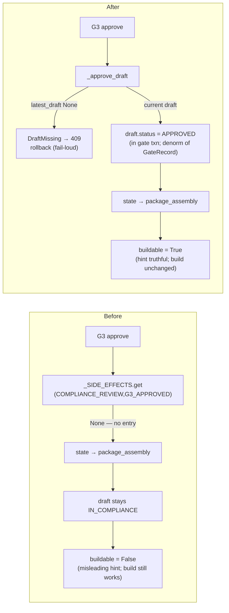

## Diff Brief

**Current behavior (before).** `DraftStatus.APPROVED` was defined and read exactly once (`view_models.package_vm.buildable`) but **never assigned** — the `(COMPLIANCE_REVIEW, G3_APPROVED)` transition ran no side effect, so a compliance-passed draft stayed `IN_COMPLIANCE` after G3 approve. `buildable` was permanently `False`, and the package-card showed "the draft is not approved yet — building will refuse" on a matter whose build actually **succeeds**.

**Why it happened (root cause, evidence-confirmed).** `_SIDE_EFFECTS` (`service.py`) had no `(COMPLIANCE_REVIEW, G3_APPROVED)` entry — the intended `DraftStatus.APPROVED` lifecycle was never wired. The build route (`drafting.py:613`) fences on `gate_state`, never on draft status, so this was a UI-truth/credibility defect, not a build-reachability defect (verify-first confirmed the package already builds).

**Observable delta.** After a G3 approve: `latest_draft(...).status == APPROVED`; `buildable` is `True` at `package_assembly`; the misleading hint no longer shows; the package still builds byte-for-byte as before.

**Why the change removes the cause (not a band-aid).** It completes the intended `DraftStatus` lifecycle in code — `_approve_draft` sets the status in the gate transaction — rather than reinterpreting `buildable` or gating the build on status. Additive; the build fence is untouched.

**Touched seams.** `_SIDE_EFFECTS` registry (producer) · `DraftMissing` refusal → gates route 409 (existing shape) · fail-visible dispatch diagnostic · `buildable` read-model (consumer, logic unchanged) · registry-bump supersession cascade (unchanged — an APPROVED draft supersedes like any other) · ADR-0018 + 3 contract docs.

**Agent judgment calls.** (1) `draft.status` is a denorm; `GateRecord` stays authoritative (no actor columns). (2) Build stays gate-state-fenced, never status-gated. (3) Fail-loud `DraftMissing` on None (unreachable normal path) over a silent skip — the silent skip *was* the bug. (4) ADR-**0018** (0013–0017 reserved by the S1 charter plan-set). (5) A permanent G3-scoped missing-side-effect diagnostic (dead on the normal path) guards the exact bug class from recurring silently.

