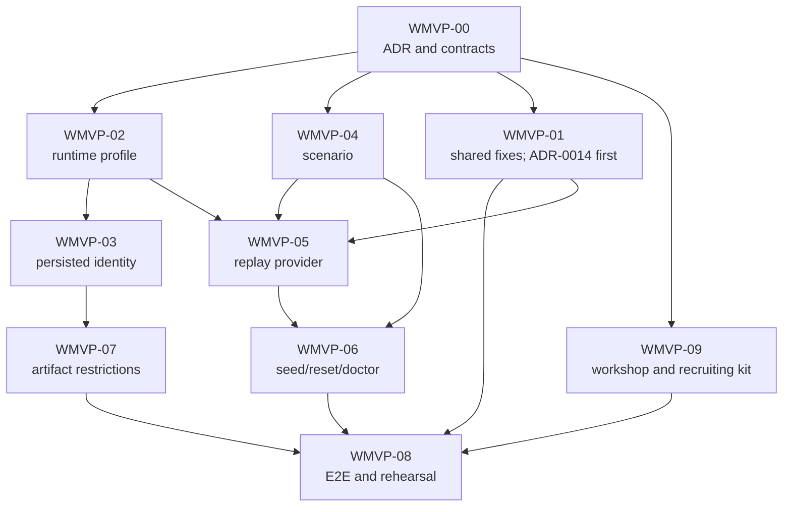

# ClarionPI Workshop MVP — Detailed Delivery Plan

Status: PLANNED  
Date: 2026-07-11  
Target: attorney-facing legal-tech workshops, using one owned synthetic Arizona matter  
Release relationship: R1 synthetic-MVP evidence only; this plan does not advance R2 live-pilot readiness  
Implementation base: `38ce67a` (`WI-2` shipped after audit plans 02 → 01 → 03 → 04 → 05)

## 1. Decision

Build a separate **Workshop MVP track**, but do not build a second product.

The workshop will run the real ClarionPI upload, registry, money, gate, analysis, drafting,
compliance, package, and provenance paths. A fail-closed runtime profile supplies only owned
synthetic records and deterministic model replay, then permanently labels the matter and every
artifact as a demonstration. It must not add a skip-gate route, fake an approval, insert
downstream rows directly, or weaken a production guard.

The first workshop version is local and offline. It is designed to answer two questions:

1. Do plaintiff-side PI attorneys understand and value the evidence-to-demand workflow?
2. Can ClarionPI recruit an Arizona-licensed plaintiff-side PI attorney for a paid, fixed-scope
   legal review and, only later, explore a deeper operating or cofounder relationship?

It is not a live-client pilot and must never be represented as one.

## 2. Current-state reconciliation

- The five audit plans are shipped, including upload-slot provenance safety, authentication
  hardening, the audited-rule-pack production gate, late-document invalidation, and frontend CI.
- `WI-2` is shipped: new matters have the narrow Arizona adult/private-party/open-demand intake
  box and creation-time scope refusals.
- `ADR-0009` and `WI-1` remain held. `package_ready` therefore does **not** mean that an attorney
  reviewed the exact final bytes that would be served.
- `WI-3` remains held for Arizona-counsel review of its six keys and wording. The Workshop MVP
  will use the as-built G2a evidence gate and will not invent a legal attestation.
- `WI-4` remains behind `WI-3` as previously sequenced. It is useful product polish, but it is
  not on this track's critical path.
- The `chronology.xlsx` second-boundary timestamp flake remains on its existing chip. Until it
  closes, the workshop may claim deterministic replay and deterministic facts, but not identical
  artifact bytes across separate builds.
- `scripts/claude-plan-review` is pre-existing and untracked. This plan does not depend on it.
- The local TMEPAgent launch entries are a convenience only. Repo-owned commands and runbooks
  are the sole supported workshop entry points.

### 2.1 Shared-product credibility defects found during planning

Four as-built gaps must be fixed in the normal product path before the demo can be credible:

1. `StrategyPlan.demand_amount_cents` is persisted and editable, but it is not minted, allocated,
   or rendered. The current `letter.docx` can show medical specials while omitting the actual
   demand figure. (Verified: set only at plan emit/edit — `backend/app/engine/brain2/plan.py:372`,
   `backend/app/engine/orchestrator/service.py:641` — and read nowhere in the tokenizer registry,
   allocator, drafter, renderer, compliance, or `package/*`.)
2. A private-party Arizona matter can still receive the conditional 180-day public-entity notice
   candidate. Deadline applicability does not yet consume the `public_entity_involved=no` intake
   answer shipped in `WI-2`. (Verified: `rules/deadlines.py::compute_deadline_candidates` takes
   only `(pack, claim_type, incident_date)` — `backend/app/api/routes/matters.py:93`.)
3. Ledger amount tokens currently carry no document anchors even though their `ledger_ref.line_ids`
   resolve to anchored billing rows. A displayed specials total can therefore lead to “no anchors”
   in provenance. (Verified: `mint_amounts` sets `anchors=[]` —
   `backend/app/engine/tokenizer/registry.py:487` — while every `BillingLine` carries a required
   page `anchor` — `backend/app/models/orm.py:420`.)
4. Exact duplicates uploaded in one batch can tie on `created_at`, after which canonical selection
   can fall through to a random UUID. A demo that highlights duplicate quarantine needs stable
   upload-ordinal ownership in Phase 0, not a lucky canonical pick. (Verified: one-transaction
   commits share the `func.now()` timestamp and the canonical sort key is `(created_at, id)` —
   `backend/app/corpus/ingest/dedup.py:115-117`.)

These are production-aligned fixes, not workshop exceptions. Each requires diagnostic evidence,
a failing regression test, the shared-path fix, and then the full verification gate.

## 3. Track boundary

The Workshop MVP is an overlay inside R1. It does not alter the canonical R0–R4 release matrix.

| Workshop evidence may establish | It cannot establish |
|---|---|
| A user understands the intake-to-demand flow | Arizona legal accuracy or legal advice |
| One synthetic scenario completes reliably | Performance on real medical records |
| The money engine reconciles the scenario to the penny | A legally appropriate demand valuation |
| Displayed source facts round-trip to source pages | General OCR or live-model quality |
| Deterministic replay exercises the real application path | Live provider quality, latency, or availability |
| Four artifacts are generated and visibly restricted | Carrier-ready or lawyer-reviewed work product |
| Attorneys value or reject the workflow | HIPAA, BAA, hosting, backup, or production readiness |
| Arizona attorneys express interest in paid review | Counsel audit, endorsement, employment, or cofounder fit |

Every workshop run is recorded as `evidence_class=workshop_synthetic` with the Git commit,
scenario version, replay-catalog version, demo-label version, run mode, duration, and whether a
recovery checkpoint was used. Workshop results cannot close legal, PHI, ethics, or live-pilot
gates.

## 4. Product flow to demonstrate

```mermaid
flowchart LR
    A["Intake preflight<br/>AZ adult private-party MVA"] --> B["Create synthetic matter"]
    B --> C["Register slots and upload<br/>manifest-approved PDFs"]
    C --> D["Phase 0<br/>classify, extract, deduplicate"]
    D --> E["G1 Facts review<br/>deadlines and corpus"]
    E --> F["G1.5 Strategy intake<br/>theory, posture, demand anchor"]
    F --> G["Analysis<br/>chronology, ledger, risks"]
    G --> H["G2a Evidence review<br/>picks and dispositions"]
    H --> I["G2.5 Plan review<br/>including demand amount"]
    I --> J["Drafting<br/>tokens-only source facts"]
    J --> K["G3 Compliance review"]
    K --> L["Package assembly<br/>four demo-labeled artifacts"]
    L --> M["Package ready for workshop inspection"]
    M --> N["Fact to record · specials to bills<br/>requested demand to operator origin"]
```

Human gate actions remain the ordinary G1, G1.5, G2a, G2.5, and G3 actions. In a workshop they are
recorded and projected as a non-lawyer operator exercising a simulated attorney-role workflow; they
are not attorney approvals. Machine states remain `corpus_processing`, `analysis_running`,
`drafting`, and `package_assembly`. No workshop event or transition is added to the state machine.

## 5. Scope

### 5.1 In scope for the first workshop

- One adult Arizona private-party rear-end MVA.
- Ordinary open demand.
- Entirely fictional people, organizations, addresses, identifiers, providers, carrier, policy,
  claim number, and records.
- Text-layer synthetic PDFs only. `OCR_ENGINE=none` is disclosed; OCR readiness is not claimed.
- Police/crash report, emergency care, imaging, physical therapy, orthopedics, itemized bills,
  carrier correspondence, and property-damage material.
- One exact duplicate to demonstrate quarantine without changing the evidence set.
- One intentional treatment gap that produces an anchored risk flag.
- Known, independently reconciled specials and a workshop-operator strategy amount.
- Deterministic replay for every model-backed stage.
- Local loopback runtime, session login, Origin CSRF, dedicated database/storage, and no network.
- DOCX demand, PDF binder, XLSX chronology, and PDF provenance report.
- Persistent UI disclosure plus permanent per-page/per-sheet artifact marking.
- A ten-minute prepared flow and a longer technical flow starting before upload.
- Structured attorney feedback and a paid-review recruitment funnel.

### 5.2 Explicitly out of scope

- Live matters, PHI, confidential facts, attendee uploads, or downloaded/sample case files.
- Public entities, minors, wrongful death, UIM, disputed coverage, time-limited demands, or
  non-Arizona law.
- OCR, handwriting, general extraction benchmarking, or live LLM calls.
- Production hosting, public signup, workshop-LAN access, analytics/session replay, or attendee
  accounts.
- Arizona-counsel approval of rules, refusal copy, attestations, demand strategy, or output.
- `WI-1` exact-served-byte approval, `WI-3` attestation, or `WI-4` visual consolidation.
- A claim that `package_ready` means “ready to send.”
- Cofounder equity, employment, ABS structure, or managing-attorney qualification decisions.

## 6. Architecture and safety model

### 6.1 Runtime profile, not a new environment

Keep environment tier and runtime capability separate:

- `APP_ENV=dev|test|staging|prod` continues to express deployment/security posture.
- Add `RUNTIME_PROFILE=standard|workshop` as a strict capability profile.
- The actual workshop uses `APP_ENV=dev`, `RUNTIME_PROFILE=workshop`.
- Workshop is supported only with `APP_ENV=dev`. Tests exercise constructed settings and explicit
  application/provider overrides; `test + workshop` is not a bootable runtime combination.
- Workshop is refused under `test`, `staging`, and `prod`; replay is refused under `standard` and
  `prod`.

Do not add `APP_ENV=demo`. Existing exact `app_env == "prod"` checks govern authentication,
cookies, CSRF, rule-pack authority, schema creation, and seeding. A fifth environment would inherit
unsafe dev behavior by omission.

### 6.2 Required workshop configuration

| Setting/capability | Required value or behavior |
|---|---|
| Bind address | `127.0.0.1` only |
| Backend launch | no reload, `--no-proxy-headers` |
| `AUTH_MODE` | `session` |
| Origin CSRF | enabled with exact localhost origins |
| Model provider | `replay` only |
| OCR provider | `none` |
| Storage | dedicated local root under the marked workshop workspace |
| Database | dedicated local workshop database; never the normal dev/staging/prod database |
| User | generated workshop operator, displayed as “simulated attorney role,” not a licensed attorney |
| Matter creation | only the active scenario's server-owned, manifest-validated matter payload; no arbitrary workshop matter or client-selected scenario identity |
| Uploads | only files and hashes in the active scenario manifest |
| Network | no external calls required or permitted by the application; replay is a pure local-catalog reader and workshop provider construction must reject every network-capable adapter/endpoint |
| Rule pack | existing non-production behavior, visibly marked counsel-unreviewed; no new bypass |

`LLM_PROVIDER` must move into validated `Settings`; it is currently read directly by provider
construction, which prevents module-construction validation of replay/live-provider combinations.

### 6.3 Persisted classification

Process environment alone is not enough. Add immutable server-stamped matter fields equivalent to:

- `matter_purpose = standard | workshop_demo`
- `demo_scenario_id`
- `demo_label_version`

The client cannot choose or edit them. Workshop `POST /matters` stamps them. Artifact sets record a
distribution class and label version. A workshop matter remains a workshop matter after restart,
data movement, or opening it from a later standard dev process.

### 6.4 Required fail-closed matrix

| Configuration or action | Expected result |
|---|---|
| `prod + workshop` | refuse during module construction |
| `test + workshop` | refuse during module construction; test via constructed settings/overrides |
| `staging + workshop` | refuse during module construction |
| `prod + replay` | refuse during module construction |
| `standard/dev + replay` | refuse during module construction |
| workshop + stub auth | refuse during module construction |
| workshop + CSRF disabled | refuse during module construction |
| workshop + Anthropic or null provider | refuse during module construction |
| workshop launcher binds `0.0.0.0` | launch-config test fails |
| workshop launcher omits `--no-proxy-headers` | launch-config test fails |
| standard profile tries to seed/reset/replay | typed refusal before mutation |
| workshop `POST /matters` payload differs from the active scenario truth | typed refusal before any matter, audit, slot, or blob write |
| altered scenario file | upload refusal; prior slot/blob state unchanged |
| altered prompt | explicit replay mismatch; no fallback and no gate advance |
| unsafe reset path/database | refusal before deletion |
| direct production build of a demo matter | refusal before cache reuse or rendering |
| demo matter opened later under standard dev | typed demo-scoped refusal before any content read (the persisted-purpose policy row below); the persisted demo identity and labels survive unchanged — never silently hidden, relabeled, or laundered into standard work |
| standard matter/artifact | no workshop marker or overlay-induced change relative to the post-WMVP-01 shared baseline |
| `prod` or `standard` profile addresses a persisted workshop matter, its source blob, or a demo artifact download | typed refusal before any content read, workflow mutation, cache lookup, or rendering; only a workshop-profile process may operate on workshop content |

Construction-time tests must prove that `--lifespan off` cannot bypass the invalid combinations.

## 7. Work plan

Estimates are engineering effort, not calendar promises. Each work item is a separate conventional
commit or small PR, runs `make test` after changes, and runs `make verify` before merge.

| ID | Work item | Depends on | Estimate |
|---|---|---:|---:|
| WMVP-00 | Charter, ADR-0013, contracts, evidence labels | — | 1–2 days |
| WMVP-01 | Shared credibility and deterministic-ordering fixes | 00; ADR-0014 before 01A | 6–10 days |
| WMVP-02 | Fail-closed runtime profile and explicit seeding | 00 | 2–4 days |
| WMVP-03 | Persisted demo identity and authoritative disclosure | 00, 02 | 3–4 days |
| WMVP-04 | Owned synthetic Arizona scenario and validator | 00 | 3–5 days |
| WMVP-05 | Strict canonical replay provider and call provenance | 02, 04 contract; 01E before catalog freeze | 3–5 days |
| WMVP-06 | Manifest-sealed upload, safe prepare/reset/doctor | 02, 04, 05 | 3–5 days |
| WMVP-07 | Permanent artifact restrictions and demo package copy | 03 | 3–5 days |
| WMVP-08 | Full E2E smoke, frontend QA, and rehearsals | 01–07; 09 kit for the manual rehearsals | 3–5 days |
| WMVP-09 | Workshop kit, feedback system, and attorney funnel | 00; content can run in parallel | 2–3 days |

Expected total: roughly 29–48 engineering days before review/contingency (the sum of the table
rows). That is approximately six to ten calendar weeks for one engineer. A three-to-five-week target requires at least two
implementation owners working the documented parallel paths plus timely reviews; quality gates, not
the date, determine exit.

### WMVP-00 — Charter and ADR-0013

**Purpose.** Make the separation from production durable before code adds a demo capability.

**Deliverables.**

- `docs/adr/0013-workshop-mvp-boundary.md`; leave `ADR-0009` reserved.
- A separate shared-product ADR for requested-demand token settlement (expected `ADR-0014` if that
  remains the next available number). Do not hide that lifecycle decision inside the workshop ADR.
- Update affected module contracts for runtime configuration, provider construction, matter
  classification, upload validation, artifact distribution policy, and runtime view model —
  plus, updated in the SAME pass as the work item that changes them (house rule, not batched
  here): `docs/module_contracts/app.engine.tokenizer.md` for WMVP-01A's amount semantic-role
  vocabulary, and `docs/module_contracts/app.rules.jurisdiction.md` for WMVP-01A/01B's pack-schema,
  fingerprint-coverage, and applicability-predicate changes (`hub-check` verifies paths only, not
  content drift — the same-pass update is the only guard).
- Add `workshop/README.md` with the synthetic-only rule and an explicit prohibition on using
  `samples/`, tests, or real case records as scenario inputs.
- Add an evidence-label schema for internal workshop run records.
- Add the Workshop MVP as an R1 overlay note in the canonical readiness memo
  (`backlog/pi/10_implementation_readiness.md`, R0–R4 matrix) without changing R2 entry or exit
  criteria.

**ADR invariants.**

- Same domain services, HTTP APIs, gates, registry, money engine, validators, package builder,
  artifact store, and provenance routes as standard operation.
- Profile controls capability, disclosure, and distribution policy only.
- No alternate transition table, auto-approval, guard weakening, direct downstream-row seed, or
  workshop-specific legal conclusion.
- Owned synthetic inputs and deterministic replay are always disclosed.
- Demo identity cannot be removed; demo artifact restriction cannot be downgraded.
- Production refuses demo providers and data loaders independently of frontend behavior.
- Rollback removes the workshop overlay and tooling; standard behavior remains compatible with the
  intentionally corrected post-WMVP-01 shared baseline.

**Acceptance.** ADR accepted; contracts and hub checks agree; no ambiguity about which R2 gates
remain open.

### WMVP-01 — Fix shared-path credibility defects

This work is not conditioned on `RUNTIME_PROFILE` and must improve standard behavior too.

For each silent wrong-output defect below, the first implementation change is structured,
secret-free diagnostic logging plus a regression that confirms the observed pre-fix state; only the
subsequent change may alter behavior. At minimum, log the plan/version and requested-demand token
allocation/render result for 01A, the matter/pack/intake applicability decision for 01B, and the
amount token, contributing line IDs, and resolved anchor count for 01C. Keep these diagnostics out
of artifact bytes and wire payloads.

#### WMVP-01A — Render the final operator-selected demand amount

- First add the required structured diagnostics and a regression proving that a plan with a
  non-null `demand_amount_cents` reaches `letter.docx` without that amount.
- Preserve the existing ability to edit `StrategyPlan.demand_amount_cents` during G2.5 review.
  (As built: the G1.5 field is `StrategyInputs.anchor_amount_cents`, copied onto
  `StrategyPlan.demand_amount_cents` at plan emit — `backend/app/engine/brain2/plan.py:372` —
  and edited via the gates `edit` action → `_apply_plan_review_edits`,
  `backend/app/engine/orchestrator/service.py:591` /
  `PlanReviewEdits.demand_amount_cents`, `backend/app/models/schemas.py:565`.)
- Reconcile the as-built affordance mismatch this flow sits on: the submit path accepts plan
  edits at `plan_review` (`_EDITABLE_GATES`, `service.py:230`), but the envelope affordance set
  (`_EDITABLE_STATES`, `backend/app/api/routes/gates.py:64`) omits `plan_review`, so
  `role_affordances.can_edit` reports `false` there today. The Save-final-amount surface must
  ship with the affordance corrected (or a dedicated route with its own affordance) plus a
  regression — the FE renders affordances, and a hidden-but-working edit path is a UX defect.
- Give amount tokens a typed semantic role (at minimum `requested_demand` versus
  `medical_specials_total`). This is a registry/system-contract change, not a workshop exception:
  introduce an explicit tagged token-origin shape in addition to page anchors. A
  `requested_demand` token is `TokenSource.ATTORNEY`, carries an immutable strategy-plan/version
  origin reference and no `ledger_ref`/`ledger_hash`, and is resolved/provenanced as a human
  election; source-derived amounts remain `TokenSource.EXTRACTOR`, ledger-pinned, and page-anchored.
  Do not overload `AmountFact`, `ledger_ref`, or a fake `PageAnchor` for the strategy election.
  Update `docs/module_contracts/app.engine.tokenizer.md` **and** `docs/system_contract.md` §2/5/10/11
  in the same WMVP-01A PR so the current “every token carries anchors” invariant becomes: every
  source-derived rendered fact carries validated page anchors, while an explicitly typed,
  non-source-derived attorney strategy token carries validated immutable origin provenance. Extend
  the audited/fingerprinted pack schema so `demand_and_deadline` requires the requested-demand role
  specifically; a generic specials `AMT` must not satisfy that requirement.
- During initial plan emit, settle the G1.5 amount as a typed `AMT` through the existing
  registry/allocation path and return a plan already bound to that settlement; do not interpolate a
  raw currency string in a prompt or renderer.
- Preserve later G2.5 amount editing through an explicit **Save final amount** action. It creates a
  new edited plan version and amount settlement while remaining at `plan_review`, then returns that
  exact refreshed plan for review. A pure amount edit does not call the model again; regeneration is
  separate and explicit.
- Define the atomic initial-emit/save transaction in the shared ADR: lock matter/plan, mint without
  committing, allocate the requested-demand token, flush, advance the owned invalidation cursor,
  freeze the resulting registry version, bind the new plan version to it, and return it. Any failure
  rolls the whole transaction back.
- Any later amount edit marks the prior settlement stale and requires another save/refresh. G2.5
  approval is a separate action that only approves the exact visible plan/version; it performs no
  mint, allocation, rebind, or other content mutation.
- Add an explicit exact-plan fence: plan emit/save returns `plan_id` and `plan_version`; G2.5 submit
  must echo `expected_plan_id` and `expected_plan_version`. Under the matter/plan lock, reject a
  mismatch with typed `409 stale_plan`. Existing `payload_version` is insufficient because an
  identical new plan can be emitted without changing registry version or gate-record count.
- G2.5 approval accepts no inline plan/amount edits. A non-empty edit payload returns typed
  `plan_save_required`; the client must save, render the returned version, and then submit a separate
  approval.
- `None` may exist during editing, but supported v1 open-demand G2.5 approval refuses it with typed
  `demand_amount_required`. Record the rejected alternatives and no-amount behavior in the shared
  ADR.
- Mark its origin honestly as a human strategy election. For a workshop matter, API/UI/provenance
  project “Workshop operator exercising the attorney-role workflow,” not “Arizona attorney.” It
  need not claim a document anchor and must not be confused with source-derived medical specials.
- Require exactly one active requested-demand token in `demand_and_deadline` and fail visibly if
  allocation/rendering omits it, duplicates it, or substitutes a different amount role.
- Add unit, demand-run, DOCX parse, API E2E, and unresolved-token regression coverage.

**Acceptance.** A $X final operator-selected demand is present exactly once where designed, matches
the integer-cent plan election, survives edits/versioning, and appears in the final DOCX with honest
human-strategy origin. The user sees the settled allocation/version before approval; approval does
not mutate it. A regression displays v1, emits identical v2 without a registry bump, and proves that
v1 approval receives `stale_plan`. A failed save leaves no token, pin, cursor, plan mutation, or gate
advance behind.

#### WMVP-01B — Respect private-party intake in deadline applicability

- First log and test the erroneous public-entity candidate for a matter created with
  `public_entity_involved=no`.
- Add a typed rule-pack applicability predicate, included in validation and the canonical pack
  fingerprint, then evaluate it against typed intake context. Do not infer legal applicability from
  prose and do not hard-code notice-of-claim suppression in Python or a workshop branch.
- `no` excludes the public-entity notice candidate; legacy `unknown` remains conservative; `yes`
  continues to be refused at new-matter intake under `WI-2`.
- Preserve ordinary Arizona limitation candidates and rule-pack pin/fingerprint behavior.
- **Pin blast radius (applies to 01A's role requirement too):** any pack-schema extension changes
  the canonical fingerprint, so every existing matter's pin intentionally strands behind the typed
  `RulePackChanged` refusal (BUS-02, `load_pack_for_pin`). That is the designed fail-closed
  behavior and is acceptable here — pre-workshop matters are dev-only data, and workshop matters
  are created only after the bump. Update the pin-boundary regressions deliberately for the new
  version; never loosen the pin check itself.
- Add rule-unit, matter-creation, G1 view-model, and pack-pin regression tests.

**Acceptance.** The workshop private-party matter shows no public-entity notice, while conservative
legacy and ordinary deadline behavior remains intact. The new predicate remains visibly
counsel-unreviewed until Arizona counsel audits the pack/version.

#### WMVP-01C — Anchor ledger totals to their bill pages

- First use the required structured diagnostics and a regression to prove that an amount token with
  `ledger_ref.line_ids` currently resolves to no anchors.
- In the tokenizer, derive a stable, de-duplicated anchor set from the referenced, anchored
  `BillingLine` rows. The money module remains the only owner of arithmetic.
- Define deterministic ordering and explicit behavior for a missing/stale line or line without a
  valid source anchor; never silently produce a trusted-looking untraceable total.
- Extend provenance lookup/report tests so a specials total retains all contributing line IDs but
  resolves to the complete stable ordered set of unique source bill pages without duplicate anchors.

**Acceptance.** Clicking the displayed specials total reaches the two unique contributing bill
pages for the workshop scenario (while retaining all 13 line IDs), and the provenance report no
longer says “no anchors” for that source-derived total.

#### WMVP-01D — Make duplicate canonical selection deterministic

- First add diagnostics and a shuffled/tied-timestamp regression proving the current UUID-dependent
  canonical selection.
- A slot ordinal is only session-local. At upload commit, lock the matter and allocate a durable,
  monotonic, matter-wide `ingest_ordinal` (or equivalent) to each committed document in slot order.
  Persist the next value/cursor so later upload sessions receive a strictly later contiguous range.
- Carry that ordinal into Phase-0 ordering. Select the earliest valid matter-wide ordinal as
  canonical and quarantine later exact copies deterministically.
- Use an explicit nullable migration/backfill policy for legacy documents. A documented legacy
  fallback may preserve old behavior, but must never be presented as deterministic when no durable
  ordinal exists.
- Preserve the audit trail and never merge distinct bytes merely because names or metadata match.
- Add SQLite and Postgres coverage for tied timestamps and repeated runs.

**Acceptance.** The same bytes uploaded in the same declared order—within one session or across
later sessions—always select the same canonical document and quarantined duplicates, independent of
UUID, timestamp tie, database, or query order. Concurrent commits allocate disjoint ranges under
Postgres.

#### WMVP-01E — Stabilize derived-row and prompt-input ordering

- First capture diagnostics from two clean, full scenario runs: ordered document, extraction-window,
  Encounter, BillingLine, RiskFlag/constraint, minted-token, and canonical prompt-hash sequences.
- Add durable source document/window/row ordinals or reviewed semantic ordering keys anywhere the
  current query can fall through from tied `created_at` values to random UUIDs. Three such sites
  are already verified: encounter→FACT mint order
  (`backend/app/engine/tokenizer/registry.py:387`), pending-document processing order
  (`backend/app/corpus/ingest/phase0.py:159`), and dedup canonical selection
  (`backend/app/corpus/ingest/dedup.py:115-117`, owned by 01D). Verified safe as built:
  chronology rows sort `date_of_service`-first (`brain1/chronology.py:381-385`); the ledger and
  risk-flag builds are order-independent by design (sorted `included_line_ids` / semantic-key
  detector ordering).
- Keep ordering ownership in the module that creates each row; do not add workshop-only sort logic
  inside replay.
- Test shuffled insertion, tied timestamps, retries, SQLite, and Postgres. Assert two independently
  created databases produce the same semantic row order and canonical prompt-hash sequence.

**Acceptance.** Two fresh end-to-end runs yield byte-identical canonical prompt-hash sequences and
the same fact/ledger/risk/token order before any replay response is selected.

#### WMVP-01F — Close or constrain the chronology flake

- Keep the existing chip and diagnostic-first policy.
- Normalize/remove openpyxl wall-clock metadata only if diagnostics confirm it as the source.
  Note: the workbook core properties are ALREADY pinned (`_PINNED_TS`,
  `backend/app/package/artifacts.py:34` applied at `:172-176`), so diagnostics should look past
  them — e.g. at the zip archive entry timestamps openpyxl writes at save time.
- Add a regression that builds across the former second boundary.
- If the fix is not complete by the workshop, validate semantic content and disclose that artifact
  hashes may differ; do not claim byte determinism.

**Acceptance for byte-hash claims.** Repeated builds across time boundaries are byte-identical.

### WMVP-02 — Fail-closed runtime profile and explicit seeding

**Design.** Add validated settings for `runtime_profile`, `llm_provider`, and
`workshop_scenario_id`. Validate combinations during module construction and lifespan, as the prod
checks do now.

**Implementation surfaces.**

- `backend/app/core/config.py`, provider construction, and `backend/app/main.py`.
- `.env.example`, repo-owned Make targets, launch-invariant tests, and configuration tests.
- The workshop provider factory accepts only the immutable local replay catalog and must not
  construct `httpx`/live-provider clients or accept a URL. Add an egress-trap test around a full
  workshop E2E run so any attempted non-loopback socket/HTTP connection fails the run (the test's
  own loopback HTTP client remains allowed); this is the executable control behind the
  offline/no-external-call claim, not merely a statement that the expected catalog path happens
  not to call Anthropic.
- When `RUNTIME_PROFILE=workshop`, suppress the normal dev-user seed and create only the generated
  Workshop operator. Preserve current standard dev/test seed behavior in this track; file the
  pre-existing staging-seed hardening as a separate shared-security chip rather than expanding the
  Workshop MVP silently.
- Store the generated local credential in an ignored mode-0600 file; never commit it or print it in
  general logs.
- Keep all replay calls behind `MeteredLLMClient`.

**Acceptance.** Every fail-closed matrix case refuses before serving a request; standard dev and
production behavior retain their existing tests; no secret enters source control.

### WMVP-03 — Persist demo identity and expose authoritative disclosure

**Backend.**

- Add immutable matter purpose/scenario/label-version fields — plus the artifact-set
  distribution-class/label-version columns below — in one hand-written Alembic migration
  (house style; this repo does not use autogenerate).
- Make that migration safe for existing data: backfill/predeclare legacy `Matter` and `ArtifactSet`
  rows as the ordinary `standard` distribution/purpose only, then enforce non-null defaults for new
  rows. A migration must never infer or mark an existing matter as a workshop demo from its name,
  storage path, or mutable environment.
- Server-stamp them at matter creation; reject client attempts to set or change them. WMVP-06 owns
  the workshop-only scenario-payload validation once WMVP-04's truth bundle exists.
- Centralize a persisted-purpose policy at the service/storage boundary. A `workshop_demo` matter
  may be read, mutated, run, rendered, or have source/artifact bytes served only by the workshop
  profile; `standard` and `prod` return a typed refusal before any blob read, artifact-set cache
  reuse, rendering, gate action, upload, or model call. Read-only metadata needed to explain the
  refusal must remain demo-labeled and contain no artifact/source bytes. Apply the same policy to
  all matter-id routes, SSE entry points, package builds/downloads, provenance lookup/blob routes,
  and background/service entry points so a new endpoint cannot bypass it.
- Add a secret-free runtime endpoint/view model: profile, data classification, execution mode,
  scenario version, counsel-review status, and authoritative disclosure text.
- Add immutable artifact distribution classification and label version.
- Project `matter_purpose` into gate-history, strategy-origin, token/provenance, and package view
  models so a workshop role action is displayed as simulation evidence, even if internal role/source
  enums remain shared with production.
- Audit workshop matter creation and package generation with the scenario/replay versions.

**Frontend.**

- Render a non-dismissible banner on the login, home, and matter-dashboard pages — the matter
  page includes the provenance viewer and package card, which today are components inside
  `app/matters/[id]/page.tsx`, not separate routes (there is no deep-linkable provenance page
  as built; if one is ever added, it inherits the banner requirement).
- Add “Synthetic demo” on the matter and “Deterministic replay” during model-backed work.
- Identify the user as “Workshop operator (simulated attorney role),” never as an Arizona attorney.
- Source all flags from the backend runtime/matter view, not `NEXT_PUBLIC_*`.

**Required banner.**

> WORKSHOP DEMO — Synthetic case and deterministic model replay. Arizona legal content has not
> been reviewed by Arizona counsel. Not for client use, legal reliance, carrier submission, or a
> live matter.

**Acceptance.** Refresh, restart, and direct deep links cannot hide the disclosure; legacy rows
migrate only to `standard`; and table-driven route/service tests prove that a standard or production
profile cannot read, mutate, run, render, cache-reuse, or download persisted workshop content.
Standard pages remain unchanged.

### WMVP-04 — Build one owned synthetic Arizona scenario

**Location.** `workshop/scenarios/az_rear_end_v1/`; never `samples/` and never runtime imports from
`backend/tests/`.

**Case design.**

- Matter: `AZ-DEMO-001 — Avery Sample v. Taylor Example`.
- Incident: February 3, 2026, in Maricopa County; adult fictional claimant stopped at a red
  light and rear-ended by an adult private driver.
- Clear but non-admitted liability; the synthetic crash report records the mechanism and a
  traffic citation. Ordinary open demand; no punitive or policy-limits theory.
- Requested demand: `7,500,000` cents (`$75,000.00`), selected by the workshop operator as a
  strategy input—not model valuation and not a source-derived fact.
- Property damage: `120,000` cents (`$1,200.00`); MMI: May 21, 2026.
- Same-day ER evaluation and cervical X-ray, followed by orthopedics, PT, MRI, and documented
  MMI with no recommended future care.
- A 42-day interval from February 24 to April 7 produces one high-severity treatment-gap flag;
  the property-damage input produces one medium low-property-damage flag.
- Itemized bills independently reconcile to `937,500` cents (`$9,375.00`).
- A fictional carrier acknowledgment and property-damage record.
- One exact duplicate bill upload; all originals have a text layer. No OCR claim in v1.

**Document contract.**

| Ordinal | File | Pages | Type | Expected result |
|---:|---|---:|---|---|
| 1 | `01_crash_report.pdf` | 2 | police report | incident, parties, location, citation |
| 2 | `02_emergency_record.pdf` | 3 | medical record | ER encounter and cervical X-ray |
| 3 | `03_orthopedic_records.pdf` | 4 | medical record | four orthopedic encounters |
| 4 | `04_physical_therapy.pdf` | 6 | medical record | six PT encounters |
| 5 | `05_mri_report.pdf` | 1 | medical record | cervical MRI encounter |
| 6 | `06_medical_bills_a.pdf` | 2 | bill | 13 billing lines across four categories |
| 7 | `07_medical_bills_b.pdf` | 2 | bill | exact copy, deterministically quarantined |
| 8 | `08_insurer_acknowledgment.pdf` | 1 | insurance correspondence | classified, not extracted |
| 9 | `09_vehicle_photos.pdf` | 2 | photo | classified, not extracted |

The upload contains 9 PDFs and 23 pages. The included evidence set has 20 source pages after the
duplicate and non-selected insurer letter are excluded from the planned seven exhibits. The binder
target is 21 pages: one index plus crash report, ER, orthopedics, PT, MRI, surviving bill, and
vehicle-photo exhibits.

**Chronology truth.**

| Date | Expected event(s) |
|---|---|
| 2026-02-03 | Two distinct anchored encounters: ER evaluation by Sonoran Emergency Group and cervical X-ray by Desert View Radiology |
| 2026-02-10 | Orthopedic evaluation |
| 2026-02-12, 02-17, 02-24 | Initial PT course |
| 2026-04-07 | Orthopedic return after 42-day treatment interval |
| 2026-04-14 | Cervical MRI |
| 2026-04-21 | Orthopedic MRI review |
| 2026-04-23, 04-30 | Resumed PT |
| 2026-05-14 | PT discharge |
| 2026-05-21 | Orthopedic MMI |

This produces 13 distinct encounters and a chronology workbook with one header plus 13 rows.

**Reconciled specials truth.**

| Category | Cents | Display |
|---|---:|---:|
| ER | 348,500 | `$3,485.00` |
| Imaging | 227,500 | `$2,275.00` |
| Orthopedics | 127,500 | `$1,275.00` |
| PT | 234,000 | `$2,340.00` |
| **Total** | **937,500** | **`$9,375.00`** |

The duplicate `CaseDocument` is dispositioned `SUPERSEDED`. Billing lines anchored to that document
remain auditable but are excluded by document resolution; individual billing rows are not described
as superseded. The included ledger remains exactly `937,500` cents.

**Readiness facts captured for research, not attestation.** Treatment reached documented MMI; no
scenario records or bills remain outstanding; no synthetic lien/reimbursement interest or wage-loss
claim exists; coverage acknowledgment exists without a dispute; no future care is recommended.
These facts may be shown to attorneys while asking how a future checklist should work, but they do
not create or satisfy `WI-3` confirmations.

The source-of-truth YAML/JSON must lock dates, identities, incident facts, diagnoses, services,
billing rows, payments/write-offs if any, ledger category, expected totals, expected risks, expected
exhibits, and source-page anchors. The exact amounts are not frozen in prose here; the scenario
validator is authoritative and must reject an unreconciled bundle.

**Bundle.**

- Structured source truth and schema.
- Deterministic document generator.
- Visible “SYNTHETIC WORKSHOP DOCUMENT — NO REAL PERSON OR CLAIM” on every source page.
- Manifest with scenario/version, synthetic declaration, filename, ordinal, page count, byte count,
  SHA-256, expected classification, expected extraction, and replay-contract version.
- Gold fact, chronology, billing, risk, exhibit, anchor, and artifact expectations.
- Independent validator and synthetic-identifier scan.

Use ReportLab deterministic/invariant output for source documents. Generation must fail if an
expected document hash or visible synthetic label changes without an intentional scenario-version
bump.

**Acceptance.**

- Manifest hashes verify; every page is visibly synthetic.
- Dates, providers, bill rows, totals, treatment gap, and exhibit references reconcile.
- Every expected source fact has a page anchor.
- Regeneration has identical bytes for source PDFs and identical structured truth.
- Repo scan proves no scenario/runtime import from `samples/` or `tests/`.
- A human review finds no real identifiers or copied demand prose.

### WMVP-05 — Add a strict canonical deterministic replay provider

The FIFO `ScriptedProvider` is test machinery and is unsafe for retries or a reusable workshop.
Create an immutable `ReplayProvider` behind the existing provider interface and
`MeteredLLMClient`.

**Replay key.**

`scenario_version + stage + model + canonicalizer_version + canonical_prompt_sha256`

Raw prompt hashes are not stable across resets because registry token IDs can differ. Canonicalize
only the typed token identifiers: map actual tokens, in their deterministic prompt order, to typed
per-request aliases; hash the otherwise byte-identical prompt; store replay responses as reviewed
templates using those aliases; then rehydrate the current real tokens before returning. Record the
raw hash too. Any unknown/ambiguous token, unexpected runtime UUID, alias collision, missing alias,
or non-token prompt change fails closed. Do not normalize legal/factual prose and do not add fuzzy
matching. A semantic prompt change requires an intentional catalog/version update and review.

The canonicalizer gets collision, ordering, round-trip, missing-token, extra-token, and “no invented
token” contract tests. Separately, shared-path ordering work in WMVP-01D must stabilize the scenario's
documents and extracted rows; replay canonicalization is not permission to tolerate nondeterministic
business output.

**Covered stages.**

- Document classification.
- Per-document extraction windows.
- The extraction merge tie-break (`extract.merge`,
  `backend/app/corpus/extraction/merge.py:43`) — a real model-backed stage on the primary path's
  possibility space. The scenario is authored so the deterministic-key merge resolves every row
  (zero tie-break calls); in replay mode an unexpected `extract.merge` call has no catalog entry
  and fails closed as a mismatch, which is the designed behavior.
- Analysis/risk labeling or disposition-assistance calls.
- Strategy memo and demand-plan generation.
- Each demand section draft and the single allowed retry.
- Semantic compliance judge and any planned correction pass.

The primary scenario's reviewed replay inventory is expected to be:

| Stage | Calls |
|---|---:|
| `phase0.classify` | 9 |
| `extract.medical` | 4 |
| `extract.bill` | 2 |
| `extract.police` | 1 |
| `chronology.narrative` | 13 |
| `analysis.risk_flags` | 1 |
| `plan.emphasis` | 1 |
| `draft.memo` | 1 |
| `draft.section` | 5 |
| `compliance.judge` | 5 |
| **Total** | **42** |

The first release has no parse retry or content retry on the primary path. Deterministic detectors,
not replay prose, own the treatment-gap and low-property-damage flags. The primary compliance replay
returns clean verdicts; a planted-finding variant is a later research scenario, not v1 scope.

**Behavior.**

- Same prompt returns the same response on every retry.
- A missing entry raises a dedicated `ReplayFixtureMismatch`, distinct from
  `ProviderNotConfigured`, so existing graceful-degradation paths cannot hide drift.
- Phase 0, analysis, plan emit, demand generation, memo, and compliance boundaries translate a
  replay mismatch into a typed JSON response or SSE `error` event. They persist the failed run,
  stage, and hashes, and they do not advance the gate. No mismatch may escape as an unexplained 500
  or torn SSE stream.
- No fallback to Anthropic or null.
- Persist `execution_source=live|replay|null` (or equivalent immutable provenance) on each
  `LlmCall`, retaining token accounting and a documented zero-cent replay cost. Persist the
  replay-attempt fields needed to make the catalog decision auditable without retaining prompt
  content: `scenario_version`, `catalog_version`, `canonicalizer_version`,
  `canonical_prompt_sha256`, `raw_prompt_sha256`, `response_sha256` when a response exists, and a
  typed outcome/mismatch reason. These fields must be written for both successful calls and
  provider-invoked failures; a missing catalog entry therefore leaves a durable failed attempt
  with the stage and both prompt hashes, rather than only MeteredLLMClient's current zero-cost
  row. Keep nullable/non-replay values explicit for existing live/null rows, and do not put
  prompt or response bodies in `LlmCall`, audit payloads, or logs. This is a schema change (the
  `llm_calls` table carries no provenance columns today — `backend/app/models/orm.py:932-945`) and
  needs its own hand-written Alembic migration plus model/schema/view-model contract updates.
- Record stage, prompt hash, response hash, scenario, catalog version, and build commit without
  logging confidential prompt content. The metered-client/provider boundary owns this write so
  every caller receives the same success/failure provenance; its transaction behavior must not
  erase the failed-attempt record when the enclosing run rolls back.
- Standard/prod cannot construct the provider.

**Acceptance.** Every expected workshop call has an audited `LlmCall`; a catalog miss also leaves
one typed failed replay-attempt record with canonical and raw prompt hashes but no prompt body;
replay is retry-safe and makes no external request; token-ID changes rehydrate safely; one-character
semantic prompt drift stops the run visibly before gate advance.

### WMVP-06 — Seal upload and add safe prepare/reset/doctor commands

**Seed through the real wire.**

1. Bootstrap the generated operator through the dedicated non-production workshop seed (there is no
   public user-provisioning API), then login through the real session endpoint with trusted Origin.
2. `POST /api/matters` using the active scenario's exact server-validated creation payload, with all
   `WI-2` flags explicitly `no`. The route server-stamps purpose/scenario/label identity and refuses
   any field mismatch before creating a row or audit event.
3. Register the ordinary upload session and server-owned ordered slots.
4. PUT each scenario PDF through the existing streamed spool and staged-blob protocol.
5. Commit through the normal upload endpoint.
6. Automated preparation stops at `empty`, `uploaded`, or `facts`; never hand-create facts, gates,
   plans, drafts, artifacts, or human gate records.

For workshop slots, persist a server-owned expected SHA-256 derived from the active manifest
(a schema addition — new `UploadSlot` column or sibling table — via its own migration).
Compute the actual hash while streaming the existing spool and reject a mismatch before promotion.
After the scenario upload commits, refuse ad hoc uploads to that workshop matter.

Before the ordinary `POST /api/matters` reaches the normal creation service, validate every
creation field against the active server-owned scenario truth: display identity, incident date,
jurisdiction, venue, claim type, and all required intake flags. The caller cannot select a scenario
or introduce arbitrary synthetic facts. A mismatch returns a typed refusal before a `Matter`, audit
event, upload slot, or blob exists. This seals the profile at its first write rather than relying
only on the later upload manifest.

**Repo-owned commands.**

- `make workshop-prepare` — generate/validate the scenario and create a dedicated marked workspace.
- `make workshop-reset` — with services stopped, reconstruct at most `empty`, `uploaded`, or
  `facts`, or restore a signed prior-human-rehearsal snapshot.
- `make workshop-up` — run backend/frontend on loopback with the strict profile.
- `make workshop-restart CHECKPOINT=showcase` — supervised stop → reset/restore → start → doctor.
- `make workshop-doctor` — report profile, bind posture, DB/storage sentinel, scenario/replay/label
  versions, workspace generation ID, operator presence, disclosure status, artifact viewer
  availability, and network independence.
- `make workshop-smoke` — validate profile, sealed inputs, and the prepared pre-approval checkpoint
  without advancing a human gate.
- `make workshop-e2e` — in an isolated disposable application configured as
  `app_env=dev, runtime_profile=workshop` with disposable database/storage roots, exercise the full
  HTTP path with a test actor, validate invariants, and destroy the database. It must not boot the
  forbidden `test + workshop` combination; its output is test evidence, never a workshop checkpoint
  or claim of human review.

**Checkpoints.** Preparation may automatically build only states that contain no simulated human
approval. Later states may be restored only from a snapshot captured after a named human rehearsal;
calling a normal endpoint from a script does not make an approval human.

- `empty`: operator exists; presenter can create the matter and upload.
- `uploaded`: committed files at `corpus_processing`.
- `facts`: Phase 0 complete at `facts_review`, with the exact duplicate quarantined but still
  pending so the presenter resolves it visibly.
- `evidence`: optional snapshot captured after a human rehearsal completed G1/G1.5; flags await
  human disposition.
- `plan`: optional snapshot captured after a human rehearsal completed G2a.
- `compliance`: optional snapshot captured after a human rehearsal completed G2.5.
- `ready`: optional snapshot captured after a human rehearsal completed G3; all four restricted
  artifacts exist, but exact-byte attorney approval remains unimplemented.

The public `raw` preset maps to `empty`; `showcase` maps to `facts`; `recovery` resolves only to a
configured, integrity-verified prior-human-rehearsal snapshot (normally `ready`). Recovery snapshots
carry `checkpoint_origin=prior_human_rehearsal`, actor, timestamp, build/scenario/replay versions,
and an integrity hash. If a presenter uses one, they say so and mark it in the run record. The preparation
tool never mints G1/G1.5/G2a/G2.5/G3 gate records. Automated E2E tests may exercise those APIs with a
test actor, but their database is never promoted into a workshop checkpoint.

Reset may operate only while backend and frontend are stopped and within one hard-coded/resolved
workshop root containing a sentinel and a matching workshop database identity. It refuses a live
health endpoint/workspace lock, symlinks/path escape, a missing or altered sentinel, standard
profile, unexpected DB URL, or any non-workshop matter. No general path argument is accepted. The
launcher stops processes, builds a replacement database/storage tree in a sibling temporary
directory, migrates and validates it, atomically swaps it into place, starts fresh processes, and
runs doctor. Every tree has a generation ID; the restarted backend must report the new ID. A failed
build leaves the previous known-good tree untouched; a failed restart reports the old/new tree state
and never continues silently. Open SQLite connections or storage objects are never expected to
survive the swap.

**Acceptance.** Altered bytes receive a typed refusal without slot/blob corruption; reset refuses
while services are live, cannot touch normal dev data, never fabricates a human gate record, and
five consecutive stop/reset/start cycles work without manual database edits.

### WMVP-07 — Permanently restrict demo artifacts

Policy derives from persisted matter purpose, not current environment variables.

**Required artifact warning.**

> SYNTHETIC WORKSHOP DEMONSTRATION — NOT FOR CLIENT USE, LEGAL RELIANCE, CARRIER SUBMISSION, OR
> CLAIM DELIVERY — NOT REVIEWED OR APPROVED BY ARIZONA COUNSEL — COUNSEL REVIEW REQUIRED BEFORE USE

**Apply to.**

- DOCX: first-page warning, repeated header/footer, and document properties.
- Binder PDF: make the existing index page the warning cover, then repeat the warning on every
  imported source page. Do not add a separate page; the scenario binder remains 21 pages.
- Chronology XLSX: visible warning and repeated print header/footer on every sheet, plus properties.
- Provenance PDF: every page.
- Filenames: prefix `DEMO_NOT_FOR_DELIVERY_`.
- Artifact manifest: `synthetic`, `workshop_only`, distribution class, scenario/replay/label versions,
  build commit, and hashes.

Package UI says “ready for workshop inspection” and “demonstration package generated,” never
“approved for service,” “ready to send,” or an equivalent. It must also state that exact-byte
attorney approval is not implemented while `ADR-0009/WI-1` remains held.

**Acceptance.** Automated parsers find the warning in all four artifact types; a normal page crop
cannot lose all demo identification; direct production build **or source/artifact-content download**
for a persisted demo matter refuses before cache reuse or storage access; relative to the
post-WMVP-01 shared baseline, standard artifacts receive no overlay-driven content change and remain
unmarked.

### WMVP-08 — E2E, frontend QA, and rehearsal

Build a workshop smoke test from the existing M5/M6 HTTP flow, using the real session/Origin
boundary and the replay provider.

**Automated assertions.**

- Normal session auth and Origin CSRF are active.
- All nine uploaded blob hashes remain paired with their declared identities; upload ordinals,
  sizes, staged swaps, duplicate quarantine, and manifest seal hold.
- The only workshop matter was created from the active scenario's exact server-owned payload;
  mutated identity, incident, jurisdiction, claim-type, venue, or intake values receive a typed
  refusal with no matter/audit/slot/blob side effect.
- Document types and page counts match the contract; no page is failed or zero-text; only the
  intended duplicate is quarantined and one copy is excluded.
- All test-actor transitions create normal simulation-classified `GateRecord`s; no guard or state
  is bypassed. Runtime preparation itself creates none of those records.
- Private-party matter has no public-entity notice candidate.
- Exactly 13 encounters have live page anchors; chronology and 13 included billing lines match gold
  truth; specials are exactly `$9,375.00`.
- The 42-day high treatment-gap and medium low-property-damage flags appear, are anchored where
  source-derived, and receive ordinary disposition/override audits.
- Seven exhibits receive the simulated `cleared` disposition through the unchanged attorney-role
  guard: crash, ER, orthopedics, PT, MRI, surviving bill, and photos. No licensed attorney made that
  demonstration disposition.
- Final operator-selected `$75,000.00` demand renders in the letter and is identified as a
  workshop-operator strategy input; the letter also contains `$9,375.00` and addresses the
  treatment interruption without overstating it.
- The specials token resolves to the complete ordered set of two unique contributing bill pages;
  its `ledger_ref.line_ids` retains all 13 included billing-line identities.
- No source-derived rendered fact lacks a valid source page.
- No unresolved token reaches a wire response or artifact.
- Model-backed stages record `LlmCall.execution_source=replay`; package assembly has no model call,
  so its run and `ArtifactSet` record scenario/replay metadata separately.
- The reviewed primary-path inventory is exactly 42 cumulative calls with no retry. A `facts`
  showcase checkpoint precomputes 16 Phase-0 calls and leaves 26 interactive calls; the run record
  reports both counts rather than implying all 42 happened live on screen.
- Binder has seven bookmarks and 21 pages; chronology has one header plus 13 encounter rows.
- Provenance source-blob reads create matching `phi_access` audit events even though the data is
  synthetic, so the real access-control path is exercised.
- All four downloadable artifacts exist, open, parse, and contain the permanent restriction.
- No outbound network call occurs.
- A test-only constructed-config flow using `app_env=dev`, `runtime_profile=workshop`, and isolated
  disposable database/storage roots reaches the package three consecutive times; it must not boot
  `APP_ENV=test + RUNTIME_PROFILE=workshop`, which remains an invalid production-equivalent profile
  combination. Its records are test evidence only. Runtime preparation reaches `facts` three times
  without any simulated human gate action.
- Standard-profile regression suite remains unchanged and green.

Use unit tests for pure scenario/config/replay logic, Postgres integration for upload/locking changes
that need it, HTTP E2E for the critical flow, artifact parsers for labeling, and Vitest for the
authoritative banner/deep-link/package language. Do not add broad browser automation solely for the
first workshop; the five timed manual rehearsals are the UI acceptance unless a browser test already
fits the repo without a new brittle dependency.

**Manual acceptance.**

- Five uninterrupted `showcase` rehearsals finish in ten minutes on the actual laptop.
- One complete `raw` rehearsal finishes with Wi-Fi disabled.
- Presenter retains at least 60 seconds of timing margin.
- No shell, DB edit, live API key, or developer intervention is required after startup.
- A non-builder can follow the runbook.
- Every async state has visible progress and a bounded, actionable error.

### WMVP-09 — Workshop kit and Arizona-attorney recruitment

**Materials.**

- Five slides: problem, workflow, trust/provenance architecture, demo, invitation.
- Ten-minute presenter script, longer technical script, and recovery cues.
- One-page scope sheet and one-page known-limitations sheet.
- Versioned attorney feedback form with an explicit “do not share client information” warning.
- Fixed-scope Arizona legal-review brief.
- Internal run record template.
- Pre-generated screenshots and a short screen recording as the final non-interactive fallback.

**Feedback instrument.** Capture role, jurisdiction, years in plaintiff PI, current demand volume,
preparation time, and tools; use anchored 1–5 ratings for chronology, ledger, risk flags, provenance,
gate burden, demand structure, and artifact utility. Ask:

- What would prevent use on a real matter?
- Which step would you remove, add, or require attorney approval on?
- Rank trust/accuracy, speed, provenance, workflow fit, and output quality.
- What did the system prepare, what would require licensed-attorney signoff in the intended
  product, and did any lawyer approve this demonstration? The correct last answer is “no.”

Keep opt-ins separate for a product interview, paid Arizona review, and later pilot discussion. Never
collect case names, documents, claim facts, or confidential information.

**Recruitment funnel.**

1. Invite workshop critique, not a cofounder commitment.
2. Run a 20-minute workflow interview.
3. Screen active Arizona status, good standing, plaintiff-side MVA experience, current practice,
   conflicts, and relevant vendor relationships.
4. Before substantive legal review, execute a written engagement naming the client entity, exact
   versioned scope, conflicts process, compensation, confidentiality/privilege treatment,
   ownership/license of review work, no-endorsement/testimonial term, no-client-data rule, and no
   reliance beyond the reviewed materials.
5. Conduct the paid, fixed-scope review of `WI-2` refusal language, the proposed `WI-3` six-topic
   checklist, `az.yaml`, one synthetic package, scope exclusions, and escalation rules.
6. Require versioned written approve/revise/reject findings with sources and review date; no blanket
   endorsement.
7. If fit is strong, use a short advisory engagement and a second synthetic package.
8. Discuss managing-attorney, founding-counsel, or cofounder relationships only afterward, under
   separate diligence and agreements.

A paid reviewer can close specific rule/copy review. That alone cannot close ethics structure,
managing-attorney hiring, BAA/PHI readiness, ABS licensing, or live-client authorization.

## 8. Ten-minute workshop script

Start from the `showcase` checkpoint at `facts_review`; explicitly say upload and deterministic
ingest ran beforehand. The longer technical version begins at `raw` and adds upload/Phase 0.

| Time | Demonstration | Required message |
|---:|---|---|
| 0:00–0:35 | Banner, scope, fictional matter | Synthetic, replayed, counsel-unreviewed, not for use |
| 0:35–1:15 | Intake flags, deadline panel, document inventory | Narrow Arizona scope; no public-entity notice |
| 1:15–2:10 | G1 facts and duplicate/exceptions | Operator exercises simulated G1; no lawyer approval |
| 2:10–2:55 | G1.5 strategy and demand anchor | Demo-operator input, not model valuation or lawyer approval |
| 2:55–4:30 | Analysis: chronology, exact ledger, gap flag | Source-derived facts and money remain reviewable |
| 4:30–5:20 | Source click and risk disposition | Treatment fact → record; specials → contributing bills |
| 5:20–6:05 | G2a evidence picks | Existing gate; no fabricated legal attestation |
| 6:05–6:50 | G2.5 demand plan and amount | Operator saves, reviews, then exercises simulated G2.5 |
| 6:50–7:55 | Drafting progress and letter preview | Replay is visible; facts enter through tokens |
| 7:55–8:45 | Compliance results and G3 | Review five clean sections/zero blockers; operator exercises simulated G3 |
| 8:45–9:35 | Four permanently marked artifacts | Package is for inspection, not service |
| 9:35–10:00 | Provenance close and feedback invitation | Ask what blocks real use and invite paid AZ review |

The “wow” sequence keeps three provenance claims distinct:

1. treatment/liability fact → token → anchor → source record;
2. `$9,375.00` specials → amount token → de-duplicated contributing bill pages; and
3. `$75,000.00` requested demand → explicit workshop-operator strategy origin (simulated attorney
   role), with no invented document anchor.

Then show the exact ledger and four-artifact package.

## 9. Operating runbook

### 9.1 Day before

- Start from the intended commit; record it.
- Install dependencies using repo instructions and ensure required local assets are cached.
- Run `make verify`.
- Run scenario generation/validation and replay-manifest validation.
- Run a full `raw` smoke and five `showcase` rehearsals.
- Run once with Wi-Fi disabled.
- Confirm browser zoom, projector resolution, downloads, and local DOCX/PDF/XLSX viewers.
- Verify `workshop-doctor`, reset refusal cases, banner, filenames, watermarks, and recovery URL.
- Prepare the screen recording/screenshots without removing disclosures.

### 9.2 Day of

- Run `make workshop-restart CHECKPOINT=showcase`; it performs the only supported stop → reset →
  fresh start → doctor sequence.
- Save the doctor output/run header and confirm the reported workspace generation changed.
- Sign in as the Workshop operator and verify banner/scenario/replay/label versions.
- Confirm the download directory is empty and ready.
- Run the same supervised `workshop-restart CHECKPOINT=showcase` between sessions; never call bare
  reset against live services and never accept attendee records.

### 9.3 Recovery order

1. Retry the visible failed stage once if the error says retry is safe.
2. Use the repo launcher to stop/start the current generation and reopen the same prepared matter.
3. Run `make workshop-restart CHECKPOINT=showcase`.
4. Run `make workshop-restart CHECKPOINT=recovery` to restore the prior-human-rehearsal snapshot,
   then disclose and record its use.
5. Use the pre-recorded flow, keeping the disclosure visible.

### 9.4 Hosted follow-on

Hosted access is not required for the first Workshop MVP and is not authorized by this plan. A later
hosted design must separately specify hardened staging, TLS, secure cookies, session auth, CSRF,
throttling, invite-only access, synthetic-only sealed uploads, isolated DB/storage, retention,
teardown, concurrency isolation, and no live model/OCR credentials. It must pass security review
before a URL is distributed.

## 10. Workshop evidence and success signals

These are learning targets, not production gates:

- At least 10 qualified attorney conversations.
- At least five current plaintiff-side PI practitioners.
- At least three Arizona-active candidates.
- Median provenance usefulness of at least 4/5.
- At least 70% correctly distinguish demo-operator simulations from the licensed-attorney signoffs
  the production workflow would require, and understand that no lawyer approved this demonstration.
- The top three blockers recur independently in at least three conversations.
- At least two Arizona attorneys agree to discuss the fixed-scope paid review.
- Every session has a versioned run/feedback record without confidential information.

After the first five qualified sessions, review feedback before adding a second scenario. Do not add
features because one attendee asks; promote only repeated problems consistent with ClarionPI's
intended production architecture.

## 11. Risks and controls

| Risk | Control |
|---|---|
| Workshop path becomes a shadow product | Same APIs/services/gates; profile only controls inputs, replay, disclosure, and distribution |
| Provisional content is mistaken for Arizona law | No `WI-3` attestation; persistent counsel-unreviewed language; paid versioned review |
| Replay is presented as live AI | Opening statement, permanent replay badge, call/run metadata |
| Seed fabricates a successful state | Automation stops before G1; later snapshots require a prior named human rehearsal and disclosure |
| Demo artifact is forwarded as a real demand | Fictional entities, every-page/sheet warning, restricted filenames and manifest |
| Someone uploads PHI | Manifest hash seal, ad hoc upload refusal, loopback-only operation, facilitator instruction |
| Reset deletes non-demo data | Dedicated sentinel/DB identity, no path parameter, fail-closed profile checks |
| One scenario creates false confidence | Evidence-class boundary and explicit single-scenario limitation |
| Package-ready implies final attorney approval | Workshop-specific wording and explicit held `ADR-0009/WI-1` limitation |
| Demand amount is missing | Shared-path WMVP-01A plus DOCX/E2E assertion |
| Private matter shows public-entity notice | Shared-path WMVP-01B plus G1/API regression |
| Money appears untraceable | Shared-path WMVP-01C plus amount-to-bill provenance test |
| Chronology hashes drift | Separate chip; no byte-determinism claim until fixed |
| Laptop/network failure | Offline replay, doctor, five rehearsals, prepared recovery, recording |
| Feedback is leading or anecdotal | Fixed rubric, practitioner metadata, comprehension check, recurrence thresholds |
| Attorney shares confidential facts | Written and spoken prohibition; no free-form case-document intake |
| Paid reviewer is treated as cofounder/legal operator | Separate staged engagements, scope, diligence, and agreements |

## 12. Exit gate — “Workshop MVP ready”

All items below must be true:

- [ ] ADR-0013 and affected module contracts are accepted.
- [ ] Demand amount renders through the typed shared path with regression coverage.
- [ ] Private-party intake suppresses the inapplicable public-entity notice candidate.
- [ ] Ledger totals resolve to contributing bill-page anchors.
- [ ] Exact-duplicate canonical selection is deterministic by owned ingest order.
- [ ] Two clean databases produce identical semantic ordering and canonical prompt-hash sequences.
- [ ] Strict profile/refusal matrix passes at module construction and runtime boundaries.
- [ ] Demo purpose/distribution identity is immutable and backend-authoritative.
- [ ] Standard and production profiles refuse every persisted-demo content read, workflow mutation,
      model run, cache reuse, render, and artifact/source download before storage access.
- [ ] Scenario/manifest/replay catalogs validate and contain no PHI or sample-derived content.
- [ ] Seed uses the real upload/action paths and reset cannot touch non-workshop data.
- [ ] Full raw smoke passes with Wi-Fi disabled and no external model/OCR key.
- [ ] Three consecutive test-only full E2E flows pass under constructed config; no resulting data
      is used as workshop evidence or a recovery snapshot.
- [ ] Five consecutive runtime stop/reset-to-`facts`/start/doctor cycles pass (matching the
      WMVP-06 acceptance).
- [ ] Five consecutive manual ten-minute rehearsals pass with at least 60 seconds margin.
- [ ] Exact scenario money, treatment gap, demand amount, and provenance assertions pass.
- [ ] All four artifacts parse, contain no unresolved tokens, and are unmistakably restricted.
- [ ] Relative to the post-WMVP-01 shared baseline, the workshop overlay adds no standard-profile
      label or behavior change.
- [ ] `make verify` is green.
- [ ] Runbook, recovery path, slides, scripts, scope/limitations sheets, feedback form, paid-review
      brief, and run-record template exist.
- [ ] The chronology chip is closed before anyone claims identical artifact hashes. If open, the
      limitation is spoken and written.
- [ ] `WI-3`, `WI-4`, `ADR-0009/WI-1`, Arizona legal audit, ethics structure, managing attorney,
      ABS license, BAA/PHI, hosting, and live-pilot requirements remain visibly open.

## 13. Sequencing and merge strategy

Recommended execution:

1. Land WMVP-00.
2. Accept the shared requested-demand ADR, then run WMVP-01 in parallel with WMVP-02.
3. Run WMVP-04 in parallel. WMVP-05 provider plumbing may begin once its interface/config contracts
   exist, but do not author/freeze the replay catalog until WMVP-01E proves stable prompt ordering.
4. Land persisted identity before artifact policy; land profile/scenario/replay before seed/reset.
5. Assemble WMVP-08 only after all shared and workshop paths are stable.
6. Draft WMVP-09 materials early, but freeze screenshots/copy only against the release candidate.
7. Tag the rehearsed commit; do not demo arbitrary `main` after last-minute changes.

Every PR is small and reversible. No Workshop MVP PR advances or rewrites the held production-track
items. If the experiment is retired, disable/remove the workshop launcher, replay catalog, and
scenario tooling; keep shared defect fixes and immutable historical demo classification.

## 14. Decisions intentionally deferred

- Exact `WI-3` keys/copy: Arizona paid reviewer, then versioned product decision.
- `WI-4` sequencing: remains behind `WI-3` until the founder explicitly changes it.
- Exact-final-bytes attorney approval: `ADR-0009/WI-1`, still held.
- Hosted workshop: separate threat model and authorization after offline evidence.
- Second scenario: only after repeated first-workshop feedback.
- Live LLM/OCR comparison: only after a separate benchmark design; never silently substituted into
  the workshop profile.
- Live matters: R2 blockers and explicit authorization, not Workshop MVP success.

## 15. First implementation queue

1. `WMVP-00` — ADR-0013 and contracts.
2. Shared requested-demand ADR (expected ADR-0014), then `WMVP-01A` diagnostics/regression/fix.
3. `WMVP-01B` — deadline applicability diagnostic/regression/fix.
4. `WMVP-01C` — ledger-anchor diagnostic/regression/fix.
5. `WMVP-01D/01E` — deterministic duplicate ownership and derived-row/prompt ordering; keep the
   chronology chip separate as 01F.
6. `WMVP-02` — strict runtime profile and seeding boundary.
7. `WMVP-04` scenario and WMVP-05 provider plumbing may overlap; replay-catalog freeze waits for
   WMVP-01E.
8. `WMVP-03`, `WMVP-06`, `WMVP-07` — identity, operation, and artifact restriction.
9. `WMVP-08` and `WMVP-09` — prove, rehearse, and take it to attorneys.
