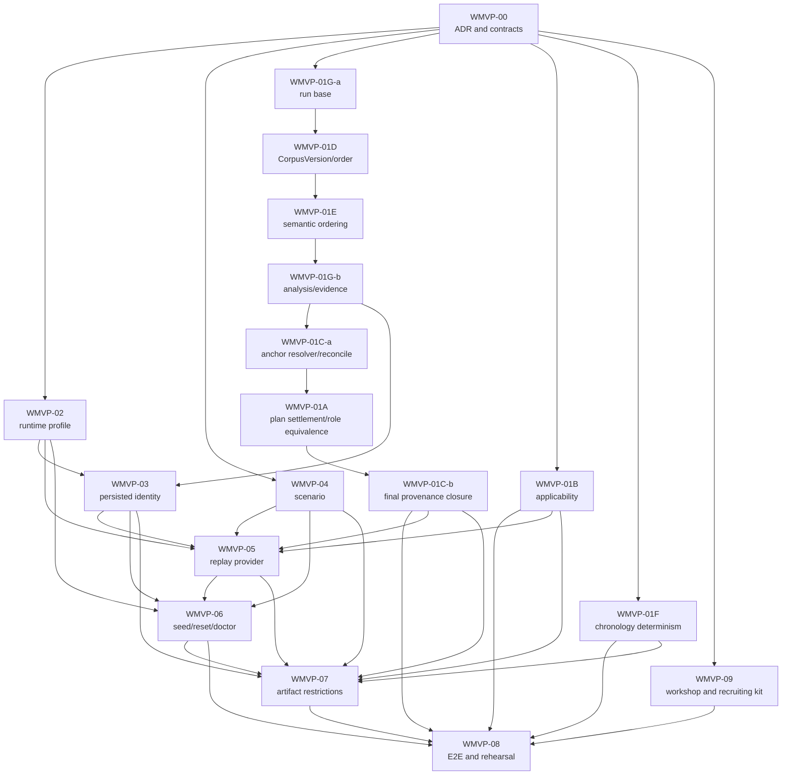

# ClarionPI Workshop MVP — Detailed Delivery Plan

Status: PLANNED  
Date: 2026-07-11  
Target: attorney-facing legal-tech workshops, using one owned synthetic Arizona matter  
Release relationship: R1 synthetic-MVP evidence only; this plan does not advance R2 live-pilot readiness  
Implementation base: `38ce67a` (`WI-2` shipped after audit plans 02 → 01 → 03 → 04 → 05)

## 1. Decision

Build a separate **Workshop MVP track**, but do not build a second product.

The workshop will run the real ClarionPI upload, registry, money, gate, analysis, drafting,
compliance, package, and provenance paths. A fail-closed runtime profile supplies only owned
synthetic records and deterministic model replay, then permanently labels the matter and every
artifact as a demonstration. It must not add a skip-gate route, fake an approval, insert
downstream rows directly, or weaken a production guard.

The first workshop version is local and offline. It is designed to answer two questions:

1. Do plaintiff-side PI attorneys understand and value the evidence-to-demand workflow?
2. Can ClarionPI recruit an Arizona-licensed plaintiff-side PI attorney for a paid, fixed-scope
   legal review and, only later, explore a deeper operating or cofounder relationship?

It is not a live-client pilot and must never be represented as one.

## 2. Current-state reconciliation

- The five audit plans are shipped, including upload-slot provenance safety, authentication
  hardening, the audited-rule-pack production gate, late-document invalidation, and frontend CI.
- `WI-2` is shipped: new matters have the narrow Arizona adult/private-party/open-demand intake
  box and creation-time scope refusals.
- `ADR-0009` and `WI-1` remain held. `package_ready` therefore does **not** mean that an attorney
  reviewed the exact final bytes that would be served.
- `WI-3` remains held for Arizona-counsel review of its six keys and wording. The Workshop MVP
  will use the as-built G2a evidence gate and will not invent a legal attestation.
- `WI-4` remains behind `WI-3` as previously sequenced. It is useful product polish, but it is
  not on this track's critical path.
- The `chronology.xlsx` second-boundary timestamp flake remains on its existing chip. Until it
  closes, the workshop may claim deterministic replay and deterministic facts, but not identical
  artifact bytes across separate builds.
- `scripts/claude-plan-review` is pre-existing and untracked. This plan does not depend on it.
- The local TMEPAgent launch entries are a convenience only. Repo-owned commands and runbooks
  are the sole supported workshop entry points.

### 2.1 Shared-product credibility defects found during planning

Five as-built gaps must be fixed in the normal product path before the demo can be credible:

1. `StrategyPlan.demand_amount_cents` is persisted and editable, but it is not minted, allocated,
   or rendered. The current `letter.docx` can show medical specials while omitting the actual
   demand figure. (Verified: set only at plan emit/edit — `backend/app/engine/brain2/plan.py:372`,
   `backend/app/engine/orchestrator/service.py:641` — and read nowhere in the tokenizer registry,
   allocator, drafter, renderer, compliance, or `package/*`.)
2. A private-party Arizona matter can still receive the conditional 180-day public-entity notice
   candidate. Deadline applicability does not yet consume the `public_entity_involved=no` intake
   answer shipped in `WI-2`. (Verified: `compute_deadline_candidates(pack, claim_type, incident_date)`
   — `backend/app/rules/deadlines.py:42` — and its only production call site passes no intake
   context — `backend/app/api/routes/matters.py:93`.)
3. Ledger amount tokens currently carry no document anchors even though their `ledger_ref.line_ids`
   resolve to anchored billing rows. A displayed specials total can therefore lead to “no anchors”
   in provenance. (Verified: `mint_amounts` sets `anchors=[]` —
   `backend/app/engine/tokenizer/registry.py:487` — while every `BillingLine` carries a required
   page `anchor` — `backend/app/models/orm.py:420`.)
4. Exact duplicates uploaded in one batch can tie on `created_at`, after which canonical selection
   can fall through to a random UUID. A demo that highlights duplicate quarantine needs stable
   upload-ordinal ownership in Phase 0, not a lucky canonical pick. (Verified: one-transaction
   commits share the `func.now()` timestamp and the canonical sort key is `(created_at, id)` —
   `backend/app/corpus/ingest/dedup.py:115-117`.)
5. G3 approval advances the gate but has no side effect that marks the exact current
   `DemandDraft` approved, while the package view requires `DraftStatus.APPROVED`; the UI can reach
   `package_assembly` with `buildable=false`, and the package route then selects numeric latest
   rather than an exact approved pointer. (Verified: `_SIDE_EFFECTS` has G2a/G2.5 only —
   `backend/app/engine/orchestrator/service.py:486-489`; `package_vm` checks approved —
   `backend/app/api/view_models.py:677-681`; `_package_stream` calls `_latest_draft` —
   `backend/app/api/routes/drafting.py:417`.)

These are production-aligned fixes, not workshop exceptions. Each requires diagnostic evidence,
a failing regression test, the shared-path fix, and then the full verification gate.

## 3. Track boundary

The Workshop MVP is an overlay inside R1. It does not alter the canonical R0–R4 release matrix.

| Workshop evidence may establish | It cannot establish |
|---|---|
| A user understands the intake-to-demand flow | Arizona legal accuracy or legal advice |
| One synthetic scenario completes reliably | Performance on real medical records |
| The money engine reconciles the scenario to the penny | A legally appropriate demand valuation |
| Displayed source facts round-trip to source pages | General OCR or live-model quality |
| Deterministic replay exercises the real application path | Live provider quality, latency, or availability |
| Four artifacts are generated and visibly restricted | Carrier-ready or lawyer-reviewed work product |
| Attorneys value or reject the workflow | HIPAA, BAA, hosting, backup, or production readiness |
| Arizona attorneys express interest in paid review | Counsel audit, endorsement, employment, or cofounder fit |

Every workshop run is recorded as `evidence_class=workshop_synthetic` with the Git commit and
toolchain fingerprint, scenario ID/version, replay-catalog version, demo-label version, run mode,
duration, and whether a recovery checkpoint was used. Workshop results cannot close legal, PHI,
ethics, or live-pilot gates.

## 4. Product flow to demonstrate

Human gate actions remain the ordinary G1, G1.5, G2a, G2.5, and G3 actions. In a workshop they are
recorded and projected as a non-lawyer operator exercising a simulated attorney-role workflow; they
are not attorney approvals. Machine states remain `corpus_processing`, `analysis_running`,
`drafting`, and `package_assembly`. No workshop event or transition is added to the state machine.

## 5. Scope

### 5.1 In scope for the first workshop

- One adult Arizona private-party rear-end MVA.
- Ordinary open demand.
- Entirely fictional people, organizations, addresses, identifiers, providers, carrier, policy,
  claim number, and records.
- Text-layer synthetic PDFs only. `OCR_ENGINE=none` is disclosed; OCR readiness is not claimed.
- Police/crash report, emergency care, imaging, physical therapy, orthopedics, itemized bills,
  carrier correspondence, and property-damage material.
- One exact duplicate to demonstrate quarantine without changing the evidence set.
- One intentional treatment gap that produces an anchored risk flag.
- Known, independently reconciled specials and a workshop-operator strategy amount.
- Deterministic replay for every model-backed stage.
- Local loopback runtime, session login, Origin CSRF, dedicated database/storage, and no network.
- DOCX demand, PDF binder, XLSX chronology, and PDF provenance report.
- Persistent UI disclosure plus permanent per-page/per-sheet artifact marking.
- A ten-minute prepared flow and a longer technical flow starting before upload.
- Structured attorney feedback and a paid-review recruitment funnel.

### 5.2 Explicitly out of scope

- Live matters, PHI, confidential facts, attendee uploads, or downloaded/sample case files.
- Public entities, minors, wrongful death, UIM, disputed coverage, time-limited demands, or
  non-Arizona law.
- OCR, handwriting, general extraction benchmarking, or live LLM calls.
- Production hosting, public signup, workshop-LAN access, analytics/session replay, or attendee
  accounts.
- Arizona-counsel approval of rules, refusal copy, attestations, demand strategy, or output.
- `WI-1` exact-served-byte approval, `WI-3` attestation, or `WI-4` visual consolidation.
- A claim that `package_ready` means “ready to send.”
- Cofounder equity, employment, ABS structure, or managing-attorney qualification decisions.

## 6. Architecture and safety model

### 6.1 Runtime profile, not a new environment

Keep environment tier and runtime capability separate:

- `APP_ENV=dev|test|staging|prod` continues to express deployment/security posture.
- Add `RUNTIME_PROFILE=standard|workshop` as a strict capability profile.
- The actual workshop uses `APP_ENV=dev`, `RUNTIME_PROFILE=workshop`.
- Workshop is supported only with `APP_ENV=dev`. Tests exercise constructed settings and explicit
  application/provider overrides; `test + workshop` is not a bootable runtime combination.
- Workshop is refused under `test`, `staging`, and `prod`; replay is refused under `standard` and
  `prod`.

Do not add `APP_ENV=demo`. Existing exact `app_env == "prod"` checks govern authentication,
cookies, CSRF, rule-pack authority, schema creation, and seeding. A fifth environment would inherit
unsafe dev behavior by omission.

### 6.2 Required workshop configuration

| Setting/capability | Required value or behavior |
|---|---|
| Bind address | `127.0.0.1` only |
| Backend launch | no reload, `--no-proxy-headers` |
| Frontend launch | locked prebuilt `next start` on `127.0.0.1:3400`; `NEXT_TELEMETRY_DISABLED=1`; local assets/fonts only |
| `AUTH_MODE` | `session` |
| Origin CSRF | enabled with the sole exact origin `http://127.0.0.1:3400` |
| Model provider | `replay` only |
| OCR provider | `none` |
| Storage | dedicated local root under the marked workshop workspace |
| Database | dedicated local workshop database; never the normal dev/staging/prod database |
| User | generated workshop operator, displayed as “simulated attorney role,” not a licensed attorney |
| Matter creation | only the active scenario's server-owned, manifest-validated matter payload; no arbitrary workshop matter or client-selected scenario identity |
| Uploads | only files and hashes in the active scenario manifest |
| Network | no external calls required or permitted by the application; replay is a pure local-catalog reader and workshop provider construction must reject every network-capable adapter/endpoint |
| Rule pack | existing non-production behavior, visibly marked counsel-unreviewed; no new bypass |

`LLM_PROVIDER` must move into validated `Settings`; it is currently read directly by provider
construction, which prevents module-construction validation of replay/live-provider combinations.

### 6.3 Persisted classification

Process environment alone is not enough. Add immutable server-stamped matter fields equivalent to:

- `matter_purpose = standard | workshop_demo`
- `demo_scenario_id`
- `demo_scenario_version`
- `demo_label_version`

The client cannot choose or edit them. Workshop `POST /api/matters` stamps them. Artifact sets record a
distribution class and label version. A workshop matter remains a workshop matter after restart,
data movement, or opening it from a later standard dev process.

### 6.4 Required fail-closed matrix

| Configuration or action | Expected result |
|---|---|
| `prod + workshop` | refuse during module construction |
| `test + workshop` | refuse during module construction; test via constructed settings/overrides |
| `staging + workshop` | refuse during module construction |
| `prod + replay` | refuse during module construction |
| `standard/dev + replay` | refuse during module construction |
| workshop + stub auth | refuse during module construction |
| workshop + CSRF disabled | refuse during module construction |
| workshop + Anthropic or null provider | refuse during module construction |
| workshop launcher binds `0.0.0.0` | launch-config test fails |
| workshop launcher omits `--no-proxy-headers` | launch-config test fails |
| standard profile tries to seed/reset/replay | typed refusal before mutation |
| workshop `POST /matters` payload differs from the active scenario truth | typed refusal before any matter, audit, slot, or blob write |
| altered scenario file | upload refusal; prior slot/blob state unchanged |
| altered prompt | explicit replay mismatch; no fallback and no gate advance |
| unsafe reset path/database | refusal before deletion |
| direct production build of a demo matter | refusal before cache reuse or rendering |
| demo matter opened later under standard dev | typed demo-scoped refusal before any content read (the persisted-purpose policy row below); the persisted demo identity and labels survive unchanged — never silently hidden, relabeled, or laundered into standard work |
| standard matter/artifact | no workshop marker/disclosure/replay-only capability or overlay-induced artifact-content change; standard flow remains valid under the reviewed shared AppServices/run/idempotency/publication contracts |
| `prod` or `standard` profile addresses a persisted workshop matter, its source blob, or a demo artifact download | typed refusal before any content read, workflow mutation, cache lookup, or rendering; only a workshop-profile process may operate on workshop content |

Construction-time tests must prove that `--lifespan off` cannot bypass the invalid combinations.

## 7. Work plan

Estimates are engineering effort, not calendar promises. Each WMVP row is a track epic; each named
sub-item or matrix-aligned boundary slice lands as a separate conventional commit/small PR, runs
`make test` after changes, and runs `make verify` before merge.

| ID | Work item | Depends on | Estimate |
|---|---|---:|---:|
| WMVP-00 | Charter, ADR-0013, contracts, evidence labels | — | 2–3 days |
| WMVP-01 | Shared credibility, corpus/evidence foundation, deterministic ordering | 00; ADR-0015; 01G-a → 01D → 01E → 01G-b → 01C-a → 01A → 01C-b; ADR-0014 before 01A | 46–70 days |
| WMVP-02 | Fail-closed runtime profile and explicit seeding | 00 | 6–10 days |
| WMVP-03 | Persisted demo identity and authoritative disclosure | 00, 02, 01G-b | 15–23 days |
| WMVP-04 | Owned synthetic Arizona scenario and validator | 00 | 6–9 days |
| WMVP-05 | Strict canonical replay provider and call provenance | 02, 03, 04 contract; completed 01A–E/01G shared baseline before catalog freeze; ADR-0016 | 20–34 days |
| WMVP-06 | Manifest-sealed upload, safe prepare/reset/doctor | 02, 03, 04, 05 | 22–34 days |
| WMVP-07 | Permanent artifact restrictions and demo package copy | 01 baseline, 03, 04, completed 05 run/provenance schema, 06, ADR-0017 | 12–18 days |
| WMVP-08 | Full E2E smoke, frontend QA, and rehearsals | 01–07; 09 kit for the manual rehearsals | 8–12 days |
| WMVP-09 | Workshop kit, feedback system, and attorney funnel | 00; content can run in parallel | 3–5 days |

Expected total: roughly 140–218 engineering days before review/contingency (the sum of the table
rows). The earlier estimates did not price immutable strategy-input provenance, app-scoped
composition, durable operation runs, safe generation publication/process ownership, pinned render
tooling, immutable plan/draft/finding and analysis generations, checkpoint sanitation/capture,
fenced cancellation, corpus/evidence version heads, evidence-session records, recoverable upload
expiry cleanup, or the full Postgres/artifact/E2E proof now made explicit. Plan on roughly
twenty-eight to forty-four calendar weeks for one implementation owner. Two experienced owners on
the documented parallel paths can target roughly eighteen to twenty-eight weeks with timely reviews;
quality gates, not the date, determine exit.

### WMVP-00 — Charter and ADR-0013

**Purpose.** Make the separation from production durable before code adds a demo capability.

**Deliverables.**

- `docs/adr/0013-workshop-mvp-boundary.md`; leave `ADR-0009` reserved.
- A separate shared-product ADR for requested-demand token settlement (expected `ADR-0014` if that
  remains the next available number). It owns election/token/plan settlement **and** the exact
  StrategyPlan ID/version FK required on every new DemandDraft; ADR-0016 later extends draft content/
  finding/G3 history without redefining that binding. Do not hide either lifecycle decision inside
  the workshop ADR.
- Separate shared-product ADRs, with final numbers assigned at creation time, for: durable operation
  ownership plus corpus/analysis generation publication (expected `ADR-0015`, accepted before the
  WMVP-01D corpus migration or WMVP-01G operation/evidence foundation); immutable demand-draft/compliance-finding
  history and exact G3 approval (expected `ADR-0016`, accepted before WMVP-05 changes those tables);
  and reserve/stage/publish artifact publication and recovery (expected `ADR-0017`, accepted before
  WMVP-07). Each names the older ADRs it extends or supersedes. None is folded into ADR-0013, and
  ADR-0009 remains untouched.
- Update affected module contracts for runtime configuration, provider construction, matter
  classification, upload validation, artifact distribution policy, and runtime view model —
  plus, updated in the SAME pass as the work item that changes them (house rule, not batched
  here): `docs/module_contracts/app.engine.tokenizer.md` for WMVP-01A's amount semantic-role
  vocabulary, and `docs/module_contracts/app.rules.jurisdiction.md` for WMVP-01A/01B's pack-schema,
  fingerprint-coverage, and applicability-predicate changes (`hub-check` verifies paths only, not
  content drift — the same-pass update is the only guard).
- Add `docs/module_contracts/app.core.matter_access.md` for the persisted capability single door and
  `docs/module_contracts/app.workshop.lifecycle.md` for scenario/workspace ownership; register both
  in `CONTRACTS.md` and the module-contract index when their packages land. Update
  `app.core.runtime`, `app.core.operation_runs`, `app.core.run_events`, `app.core.llm_telemetry`,
  `app.core.matter_budget`, `app.api.view_models`, `app.corpus.ingest`, `app.engine.brain2`,
  `app.package.builder`, and the chronology/risk contracts in the same PRs as their changed
  boundaries. Contract docs name the public symbols and forbidden imports tested in BM-17; a
  generic ADR reference is not a substitute.
- Add `workshop/README.md` with the synthetic-only rule and an explicit prohibition on using
  `samples/`, tests, or real case records as scenario inputs.
- Freeze one tenant-key rule for every WMVP migration: add/retain candidate keys on
  `Matter(firm_id,id)`, `Matter(firm_id,id,matter_purpose)`, and
  `Matter(firm_id,id,matter_purpose,demo_scenario_id,demo_scenario_version,demo_label_version)`,
  `User(firm_id,id)`, `GateRecord(firm_id,matter_id,id)`,
  `GateRecord(firm_id,matter_id,id,evidence_binding_state,result_evidence_version,result_evidence_head_sha256,result_analysis_binding_state,result_analysis_generation_id,result_evidence_registry_version)`,
  `GateRecord(firm_id,matter_id,id,result_binding_state,result_draft_id,result_draft_version,compliance_head_sha256)`,
  `StrategyInputs(firm_id,matter_id,id,version)`,
  `RequestedDemandElection(firm_id,matter_id,id,version)`,
  `CorpusVersion(firm_id,matter_id,version)`,
  `EvidenceVersion(firm_id,matter_id,version)` and
  `EvidenceVersion(firm_id,matter_id,version,head_sha256,analysis_binding_state,analysis_generation_id)`,
  `RegistryVersion(firm_id,matter_id,version)` and
  `RegistryVersion(firm_id,matter_id,version,source_operation_run_id)`,
  `StrategyPlan(firm_id,matter_id,id,version)` and
  `StrategyPlan(firm_id,matter_id,id,version,source_operation_run_id)`,
  `AnalysisGeneration(firm_id,matter_id,id)` and
  `AnalysisGeneration(firm_id,matter_id,id,result_registry_version)` and
  `AnalysisGeneration(firm_id,matter_id,id,analysis_operation_run_id,result_registry_version)`,
  `MedicalEncounter(firm_id,matter_id,id)`,
  `EncounterNarrative(firm_id,matter_id,encounter_id,analysis_generation_id)`,
  `RiskFlag(firm_id,matter_id,id)`,
  `WorkshopEvidenceRun(firm_id,id)` and `WorkshopEvidenceRun(firm_id,matter_id,id)`,
  `DemandDraft(firm_id,matter_id,id,version)`,
  `DemandDraft(firm_id,matter_id,version)`, and
  `DemandDraft(firm_id,matter_id,id,version,owning_operation_run_id)`,
  `ComplianceFinding(firm_id,matter_id,id)`,
  `ComplianceFindingRevision(firm_id,matter_id,finding_id,revision)`,
  `ComplianceFindingRevision(firm_id,matter_id,draft_id,draft_version,finding_id,revision)`,
  `ComplianceFindingRevision(firm_id,matter_id,draft_id,draft_version,finding_id,revision,source_operation_run_id)`,
  `MatterOperationRun(firm_id,matter_id,id)`,
  `MatterBudget(firm_id,matter_id)`,
  `AuditEvent(firm_id,id)`,
  `ProviderInvocation(firm_id,matter_id,attempt_id)`,
  `LlmCall(firm_id,matter_id,attempt_id)`,
  `CaseDocument(firm_id,matter_id,id)`,
  `Phase0RunDocument(firm_id,matter_id,run_id,document_id)`,
  `UploadSession(firm_id,matter_id,id)`,
  `UploadSlot(firm_id,matter_id,session_id,id)`,
  `UploadBlobAttempt(firm_id,matter_id,session_id,slot_id,id)`,
  `WorkshopScenarioSeal(firm_id,matter_id)` and
  `WorkshopScenarioSeal(firm_id,matter_id,id)`,
  `ArtifactReuseRecord(firm_id,matter_id,id,operation_run_id,artifact_set_id)`,
  and `ArtifactPublication(firm_id,matter_id,id)`/
  `ArtifactPublication(firm_id,matter_id,id,state)`/`ArtifactSet(firm_id,matter_id,id)`/
  `ArtifactSet(firm_id,matter_id,id,operation_run_id)`. Every new reference uses the full applicable candidate key:
  strategy revision→actor/gate, election→revision, plan/token→election,
  plan→exact composite G2a evidence result, draft→approved plan, gate result→plan/draft,
  budget→Matter and warning audit→AuditEvent,
  resumed run/LlmCall/PlanEmitAttempt→run,
  workshop UploadSession/operation/ProviderInvocation/GateRecord/ArtifactSet/CorpusVersion/
  EvidenceVersion→evidence run,
  corpus head/processed pointers→corpus version, evidence head/G2a result→evidence version,
  Phase0 membership→CaseDocument, analysis narrative→MedicalEncounter/generation,
  analysis child/current pointer→generation,
  carried risk flag→prior same-matter flag, Matter→current draft, seal→active/sealed session,
  slot/session→blob attempt, run→typed result plus its producing run (or an explicit typed
  preexisting/reuse result record), and
  ArtifactSet/publication→draft/G3 GateRecord/run/publication. No bare UUID FK is accepted merely because UUIDs
  are globally likely unique. Every nullable compound reference has an explicit all-null-or-all-
  present check (and Postgres `MATCH FULL` where supported) so SQLite and Postgres cannot combine
  an ID from one firm/matter with a version from another. Migration preflights refuse existing
  cross-scope or partially-null shapes before constraints land.
- In WMVP-01D's tenant-key sequence, before enabling the first Phase-0 result, preflight
  `RegistryVersion` for duplicate
  `(firm_id,matter_id,version)` identities, add that full candidate key, and bind
  Phase-0 result/progress references through it. WMVP-01G-b consumes the already-landed key for
  analysis results and `StrategyPlan.evidence_registry_version`; it does not first create a parent
  constraint required by the earlier deployable 01D head. A bare integer matter version is a fence
  value, not an FK substitute. The exact intermediate-head migration tests boot 01D with the full
  Phase-0 FK active before 01G-b exists.
- Freeze the closed session-level evidence-record contract implemented in WMVP-03; it is distinct
  from per-operation `MatterOperationRun` and is not a manually completed free-form template.
- Add the Workshop MVP as an R1 overlay note in the canonical readiness memo
  (`backlog/pi/10_implementation_readiness.md`, R0–R4 matrix) without changing R2 entry or exit
  criteria.

**ADR invariants.**

- Same domain services, workflow gates, registry, money engine, validators, package builder,
  artifact store, and provenance routes as standard operation. Reviewed shared API extensions
  (operation start/run status and publication safety) serve both profiles; the runtime/active-
  scenario endpoints are the only workshop-specific control surfaces, not a parallel workflow.
- Profile controls capability, disclosure, and distribution policy only.
- No alternate transition table, auto-approval, guard weakening, direct downstream-row seed, or
  workshop-specific legal conclusion.
- Owned synthetic inputs and deterministic replay are always disclosed.
- Demo identity cannot be removed; demo artifact restriction cannot be downgraded.
- Production refuses demo providers and data loaders independently of frontend behavior.
- Rollback removes the workshop overlay and tooling; standard flow remains functional under the
  intentionally reviewed shared safety/API contracts and receives no workshop-only semantics.

**Acceptance.** ADR accepted; contracts and hub checks agree; no ambiguity about which R2 gates
remain open.

### WMVP-01 — Fix shared-path credibility defects

This work is not conditioned on `RUNTIME_PROFILE` and must improve standard behavior too.

For each silent wrong-output defect below, the first implementation change is structured,
secret-free diagnostic logging plus a regression that confirms the observed pre-fix state; only the
subsequent change may alter behavior. At minimum, log the plan/version and requested-demand token
allocation/render result for 01A, the matter/pack/intake applicability decision for 01B, and the
amount token, contributing line IDs, and resolved anchor count for 01C. Keep these diagnostics out
of artifact bytes and wire payloads.

#### WMVP-01A — Render the final operator-selected demand amount

- First add the required structured diagnostics and a regression proving that a plan with a
  non-null `demand_amount_cents` reaches `letter.docx` without that amount.
- Preserve the existing ability to edit `StrategyPlan.demand_amount_cents` during G2.5 review.
  (As built: the G1.5 field is `StrategyInputs.anchor_amount_cents`, copied onto
  `StrategyPlan.demand_amount_cents` at plan emit — `backend/app/engine/brain2/plan.py:372` —
  and edited via the gates `edit` action → `_apply_plan_review_edits`,
  `backend/app/engine/orchestrator/service.py:591` /
  `PlanReviewEdits.demand_amount_cents`, `backend/app/models/schemas.py:565`.)
- Reconcile the as-built affordance mismatch this flow sits on: the submit path accepts plan
  edits at `plan_review` (`_EDITABLE_GATES`, `service.py:230`), but the envelope affordance set
  (`_EDITABLE_STATES`, `backend/app/api/routes/gates.py:64`) omits `plan_review`, so
  `role_affordances.can_edit` reports `false` there today. The Save-final-amount surface must
  ship with that affordance corrected plus a regression. This is a latent affordance-contract bug,
  not a currently hidden UI path: as built, `PlanReviewCard`
  (`frontend/components/plan-review-card.tsx`) does not gate its edit form on `can_edit` — it always
  renders edit/save and lets the server arbitrate, using `role_affordances` only for advisory
  `approve_blockers`. Correct it so the envelope stops reporting `can_edit=false` while the service
  accepts the edit, and so the new save-final-amount surface can render honest affordances.
- Give amount tokens a typed semantic role (`requested_demand` versus the closed medical/empty
  roles below). This is a registry/system-contract change, not a workshop exception:
  introduce an explicit tagged token-origin shape in addition to page anchors. A
  `requested_demand` token is `TokenSource.ATTORNEY`, carries an immutable
  requested-demand-election/version origin reference and no `ledger_ref`/`ledger_hash`, and is
  resolved/provenanced as a human
  election; source-derived amounts remain `TokenSource.EXTRACTOR`, ledger-pinned, and page-anchored.
  Do not overload `AmountFact`, `ledger_ref`, or a fake `PageAnchor` for the strategy election.
- Freeze the v1 `AmountRole` vocabulary as `requested_demand`, `medical_specials_total`,
  `medical_specials_paid`, `medical_specials_outstanding`, `medical_demand_basis`,
  `medical_specials_category`, and `ledger_empty`. The paid/outstanding roles are conditional live
  ledger outputs (`amounts_for_registry`, `backend/app/money/specials.py:253-275`), even though the
  first scenario does not require them. Persist non-null
  `FactToken.amount_role` in a 32-character constrained column for every `AMT` row and null for
  non-amount kinds. Add AMT-only
  `amount_provenance_state=legacy_unanchored|v1` (null for non-AMT). A requested-demand row
  has `requested_demand_election_id/version`, attorney source, empty anchors, and null ledger
  fields; a medical role has extractor source, ledger fields, null election fields, and the anchor
  policy below. Enforce those tagged alternatives with model validation and DB check constraints,
  not naming convention alone.
- For `v1`, `ledger_empty` is the sole explicit unanchored ledger alternative: extractor source,
  `value/snapshot_value_cents=0`, `status=unverified`, empty anchors, null election fields, and a
  required canonical ledger payload with `line_ids=[]`, column, and empty-ledger hash. It is always
  non-renderable and cannot appear in `required_amount_roles`. Any v1 non-empty medical role requires
  at least one valid derived anchor; any mixed/partial tagged shape is invalid.
- `legacy_unanchored` is a migration-history alternative only: it requires extractor source, a
  classified non-empty medical role, the preserved legacy ledger payload/hash/value/status, null
  election fields, and the as-built empty anchors. DB/ORM guards forbid new inserts with that tag.
  It is permanently non-renderable, non-allocatable, ineligible for required roles/current plan or
  package authority, and cannot be upgraded in place; correction is a new v1 token/version.
- In the same 01A transaction that installs the role/election columns—and before plan emit is
  enabled—extend AMT registry equivalence to include `amount_role` and the full election ID/version
  pair in addition to the pre-01A value/source/anchor/ledger/status fields. Two equal-value
  requested-demand tokens from different elections are never equivalent, and no medical role can
  alias a requested-demand row. This is part of settlement correctness, not deferred 01C-b cleanup.
- Use a hand-written migration. Backfill existing `amt:specials.grand.billed`,
  `amt:specials.grand.paid`, `amt:specials.grand.outstanding`, `amt:specials.demand_basis`, and
  category/empty rows to their closed roles from the existing source key and ledger payload;
  preflight and refuse any unclassifiable AMT instead of guessing. This migration runs only after
  WMVP-01C-a has reminted every resolvable non-empty legacy medical AMT through the page-anchor
  resolver. Fully validated anchored rows become `v1`; preserved historical unanchored rows become
  `legacy_unanchored` rather than being rewritten or deleted. The preflight requires every currently
  selectable/latest non-empty medical token to have a v1 anchored successor and refuses if any live
  registry/plan/package authority would still resolve to legacy; it does not invent anchors while
  adding the role/election columns. Historical pins/allocations may continue to describe their old
  invalidated plan but cannot authorize a new action or artifact.
  Existing plans remain explicitly unbound to an election and cannot pass the new G2.5/package
  requirement until re-emitted. Non-AMT and legacy live/null provenance stays explicit.
  Update `docs/module_contracts/app.engine.tokenizer.md` **and** `docs/system_contract.md` §2/5/10/11
  in the same WMVP-01A PR so the current “every token carries anchors” invariant becomes: every
  source-derived rendered fact carries validated page anchors, while an explicitly typed,
  non-source-derived attorney strategy token carries validated immutable origin provenance. Extend
  the audited/fingerprinted pack schema so `demand_and_deadline` requires the requested-demand role
  specifically; a generic specials `AMT` must not satisfy that requirement.
- Add duplicate-free `required_amount_roles` to each extra-forbid `LetterSectionRule`; it is valid
  only when the section also requires `TokenKind.AMOUNT` and is part of the canonical pack
  fingerprint. `demand_and_deadline` requires `requested_demand`; `damages_and_specials` requires
  `medical_demand_basis`. Allocation and every manual section edit revalidate both token kind and
  role.
- **Prerequisite ownership:** WMVP-01G-b, not 01A, versions the existing firm-scoped
  `StrategyInputs` table into append-only revisions before durable analysis or an election can cite
  it. 01A consumes and regression-tests this already-landed authority. Add non-null `version` and closed
  `provenance_state=actor_bound|legacy_unattributed`; make `created_by` and originating
  `GateRecord` identity nullable only as a tagged pair. `actor_bound` requires both through
  all-null/all-present checks and a tenant-safe composite FK; `legacy_unattributed` requires both
  null, is immutable/election-ineligible, and can be superseded only by a new actor-bound revision.
  Replace the one-row-per-matter constraint with unique `(matter_id, version)` plus composite
  firm/matter identity, and make every new G1.5 edit/approve clone the latest revision as
  `actor_bound` under the matter lock instead of mutating it. The migration creates version 1 for a
  legacy row and derives both actor and latest matching strategy-intake `GateRecord` only when that
  relationship is unambiguous; otherwise it writes the explicit legacy tag rather than inventing
  either value. The gate/current view returns the exact revision ID/version and provenance state.
  This is the
  immutable source that Phase A/C fences and election provenance mean by “strategy-input version.”
  SQLite/Postgres triggers plus ORM guards reject update/delete of every migrated or new revision;
  even actor-bound provenance metadata is insert-once. A correction is only a new locked revision,
  and direct SQL mutation tests enforce the word “append-only.”
- Add an append-only, firm-scoped `RequestedDemandElection` (frozen in shared ADR-0014) with a
  unique `(matter_id, version)`, integer cents, actor, simulation-aware actor label, and source
  strategy-input/version. A `StrategyPlan` pins its election ID/version or explicitly pins `null`
  while the amount is cleared for editing. This separates the human election from model-generated
  plan versions and removes the otherwise circular requirement for a token to reference a plan
  that cannot be persisted until after allocation. The initial election actor is the actor bound to
  the immutable amount-bearing strategy-input revision, not whoever later clicks Emit; a G2.5 Save
  final amount election is attributed to that saver. A two-user regression freezes this distinction.
- Add unique `(firm_id, matter_id, id, version)` election identity and composite foreign keys from
  both `StrategyPlan` and requested-demand `FactToken`, so an ID/version pair cannot resolve across
  firms/matters or mix two elections. Both reference columns are null together or non-null together.
  Model/service immutability guards and SQLite/Postgres triggers reject update/delete of an election
  after flush; correction is an appended version only. DB constraints plus tenant-scoped loaders
  enforce the binding even for direct service calls.
- During initial plan emit, settle the G1.5 amount as a typed `AMT` through the existing
  registry/allocation path, create the election, and return a plan already bound to that election
  and settlement; do not interpolate a raw currency string in a prompt or renderer.
- Preserve later G2.5 amount editing through an explicit **Save final amount** action. It creates a
  new edited plan version and, when non-null, a new election/amount settlement while remaining at
  `plan_review`, then returns that exact refreshed plan for review. An explicitly cleared amount
  returns a plan pinned to `null` with no requested-demand allocation; it remains editable but
  cannot be approved. A pure amount edit does not call the model again; regeneration is separate
  and explicit.
- Every other content-changing generic plan edit is immutable too: it clones and returns a new
  `StrategyPlan` version under the same expected-plan fence, reuses the current election/token
  settlement when the amount is unchanged, and never updates a prior plan row in place. The client
  must render the returned version before any later edit or approval; the pre-edit plan identity can
  no longer approve the changed content.
- Make that immutability enforceable. Add non-null `StrategyPlan.content_sha256/content_sealed_at`;
  the canonical fingerprint covers demand amount/type, ordered sections/emphasis, registry and
  evidence-registry bindings, and requested-demand election ID/version. Emit/save/edit creates and
  seals a new plan only in its atomic settlement transaction. Add closed
  `plan_origin=legacy_migrated|plan_emit_run|gate_action`: `plan_emit_run` requires the immutable
  full `source_operation_run_id`, while a save/edit plan uses its exact GateRecord result binding
  and has that operation field null. A plan-emit run's terminal result uses the run-bearing
  StrategyPlan candidate key; it cannot point at a gate-action plan or an earlier emit's plan. The offline migration preflights
  unique matter versions, fingerprints every existing plan without changing its visible content,
  and refuses a malformed binding rather than hashing an ambiguous row. SQLite/Postgres triggers
  and ORM guards reject content/binding/fingerprint update or row delete after seal. The only
  allowed metadata transitions are one-way `approved=false→true` with actor/time as a tagged unit
  and null→non-null invalidation version; neither may rewrite content, approval cannot be cleared,
  and an invalidated plan cannot be newly approved.
- Replace `DemandDraft`'s version-only plan reference with non-null `strategy_plan_id/version` and a
  full firm/matter composite FK. Migration resolves the existing version to exactly one plan or
  refuses; every new draft binds the exact sealed, approved, non-invalidated plan after verifying
  its fingerprint. A later plan cannot be substituted under the same draft identity.
- Put initial emit and save behind `app.engine.brain2.plan_settlement.emit_plan_with_settlement`
  and `.save_final_amount`, not route composition. They take the same matter row lock as
  `apply_gate_action`/`apply_registry_bump`, use a unique `(matter_id, version)` plan constraint,
  check the caller's expected current plan before mutation, and make tokenizer mint/allocation
  caller-owned (`commit=False`). Under that lock it creates/reuses the election, mints without
  committing, allocates the requested-demand token, flushes, advances the owned invalidation
  cursor through a controlled settlement reason that does **not** apply the generic
  `plan_review → evidence_review` late-document back-edge, freezes the resulting registry
  version, binds the new plan version, and returns it. Any failure rolls the whole transaction
  back.
- Initial model-backed emit must not hold the matter lock across a provider call. Phase A briefly
  locks and captures an immutable emit fence (gate state and GateRecord head/payload version,
  frozen-G2a registry/GateRecord identity, registry/cursor, equal committed/processed corpus
  versions and corpus-head hash, exact approved EvidenceVersion/head/AnalysisGeneration,
  strategy-input revision, current plan/election/approval state, pack pin/fingerprint, and canonical
  prompt hash), then releases without content mutation. Phase B
  calls the provider and durably records the `LlmCall`. Phase C reacquires the
  same lock and revalidates every fence field before the atomic settlement above. Drift returns
  typed `409 stale_emit_snapshot`, persists the honest call/failed run, and writes no election,
  plan, token, allocation, registry change, audit, or gate record. A request already stale at Phase
  A is refused before any provider call. Save-final-amount has no model phase and stays in one lock/
  transaction.
- Freeze `POST /api/matters/{matter_id}/plan/emit` around extra-forbid `PlanEmitRequest`:
  `emit_kind=initial|regenerate`, `idempotency_key`, nullable `resume_from_run_id`,
  `expected_payload_version`, equal `expected_committed_corpus_version`/
  `expected_processed_corpus_version`, exact `expected_corpus_head_sha256`, and nullable
  `expected_plan_id`/`expected_plan_version`. `initial` requires both plan fields null and no current
  plan; `regenerate` requires both and they must match the current plan. The 200 response contains
  the refreshed plan, emit-run ID, and fresh payload version. A Phase-A or Phase-C mismatch returns
  the normal frozen 409 envelope with `error=stale_emit_snapshot`, current plan identity when one
  exists, and current payload version; it returns no generated content. The FE refetches and asks
  for an explicit retry—it never auto-replays a model call.
  WMVP-01G has already landed the provider-neutral `MatterOperationRun` common
  identity/status/lease fields for Phase-0/analysis. The hand-written plan-attempt migration extends
  the closed union with `plan_emit` and its result-plan columns; it does not create nullable
  placeholder FKs to draft/finding/artifact result tables that do not exist yet. WMVP-01G-a has
  already extended `ProviderInvocation`/`LlmCall` with the provider-neutral provenance needed by
  the staged conversion: closed
  `provenance_state=legacy_unlinked|transition_unlinked|operation_linked`, globally unique opaque `attempt_id`,
  tenant/matter-safe operation-run FK, stage/outcome/execution source, and raw prompt hash.
  Migrated calls are `legacy_unlinked` with all link fields null; the temporary
  `transition_unlinked` alternative is accepted only for the remaining named call-site allowlist.
  01A removes every plan-stage allowance, so every newly invoked plan emit is `operation_linked`
  through that same door, and the new PlanEmitAttempt row uses a full composite FK to
  `LlmCall(firm_id,matter_id,attempt_id)` (pre-provider failures require that reference null).
  WMVP-05 renames/extends the linked alternative into its full live/null/replay tagged provenance;
  it does not retroactively guess fields for unlinked legacy calls.
  This avoids a forward foreign key: WMVP-05 creates `ComplianceFindingRevision` first,
  then replaces the tagged-result check/adds the remaining result columns and composite FKs,
  adds workshop/replay/build/toolchain provenance after WMVP-03 identity exists, and enables/wires
  the other run kinds. It extends rather than recreates the table.
  Persist a firm-scoped `PlanEmitAttempt` with unique `(matter_id, idempotency_key)`, request/fence
  hashes, emit kind, `running|succeeded|failed|interrupted` status, lease expiry, body-free error
  code, composite `MatterOperationRun` identity, LLM attempt ID, and terminal plan ID/version. The idempotency key is unique per matter: an
  exact terminal duplicate returns the stored plan/error without a second provider call/plan, while
  reuse with a different request hash returns typed `409 idempotency_conflict` before the provider.
  This remains synchronous JSON: ordinary browser transport loss does not cancel its FastAPI worker;
  the client explicitly re-POSTs the identical key/body to recover the stored result/run ID. Only
  process shutdown/worker failure enters the lease-expiry/cancellation reconciler.
  The attempt lookup precedes new operation-run creation: an exact duplicate returns the original
  operation-run ID/outcome, a body conflict creates no run, and only a fresh key atomically reserves
  its `PlanEmitAttempt` plus `MatterOperationRun` in Phase A.
  An unexpired running duplicate returns `409 emit_in_progress`; after lease expiry, reconciliation
  marks it `emit_interrupted` without inventing output or repeating the call, and the client must
  refetch then choose a fresh key explicitly. That retry must name the linked same-tenant/matter
  failed/aborted plan-emit run in `resume_from_run_id`; an ordinary unrelated initial/regenerate
  request leaves it null, and a running/succeeded/wrong-kind resume is refused before a call.
  Prompt/response bodies never enter this row.
  Phase A reserves the attempt and fence atomically before releasing the lock; Phase C marks it
  succeeded in the same commit as settlement or failed in the same no-business-write transaction
  as the stale/error outcome.
- Any later amount edit marks the prior settlement stale and requires another save/refresh. A
  non-amount plan regeneration reuses the current immutable election and allocation, so it may emit
  a new plan version without a registry bump; its exact-plan identity still changes. G2.5 approval
  is a separate action that only approves the exact visible plan/version; it performs no mint,
  allocation, rebind, or other content mutation.
- Add an explicit exact-plan fence: plan emit/save returns `plan_id` and `plan_version`; G2.5 submit
  must echo `expected_plan_id` and `expected_plan_version`. Under the matter/plan lock, reject a
  mismatch with typed `409 stale_plan`. Existing `payload_version` is insufficient because an
  identical new plan can be emitted without changing registry version or gate-record count.
- Extend the current-gate envelope and extra-forbid `GateSubmit` common shape with
  `expected_committed_corpus_version`, `expected_processed_corpus_version`, and
  `expected_corpus_head_sha256`. Every G1/G1.5/G2a/G2.5/G3 edit/save/approve/reject path echoes and
  rechecks that triple under the same Matter lock; committed/processed inequality or a head mismatch
  returns typed `409 stale_corpus` before a gate record, model call, or business mutation. This is
  additive to each gate's plan/draft/finding fence, not a replacement for it.
- G2.5 approval accepts no inline plan/amount edits. A non-empty edit payload returns typed
  `plan_save_required`; the client must save, render the returned version, and then submit a separate
  approval.
- Use the existing G2.5 gate submit as the single wire door and add non-transitioning
  `GateAction.SAVE_DEMAND = "save_demand"` (fits the existing 16-character action column), valid
  only at `plan_review`. Its dedicated extra-forbid
  `SaveFinalAmountEdits` requires `demand_amount_cents` even though it is nullable; omitted and
  explicit `null` are therefore distinguishable. Remove demand amount from generic
  `PlanReviewEdits` so `action=edit` remains available for other plan fields but cannot bypass the
  settlement path. Add optional top-level `expected_plan_id`/`expected_plan_version` to
  `GateSubmit`, then require both for `save_demand`, generic `edit`, and `approve` at
  `plan_review`. For approve, `edits` must be absent. Freeze the
  `409 stale_plan`, `422 plan_save_required`, and
  `422 demand_amount_required` error envelopes in API/FE contracts.
- `apply_gate_action` remains the transaction owner for save/generic edit/approve. It locks and
  validates the fence, calls the plan-settlement service with `commit=False`, writes the
  non-transitioning `GateRecord` and matching audit, commits exactly once, and only then returns the
  refreshed plan/envelope. A gate-record, audit, flush, or commit failure rolls back the complete
  election/token/registry/plan settlement. Two saves with the same fence serialize: one commits and
  the loser receives `stale_plan` with no side effect.
- Extend `GateRecord`/`GateActionResult` with nullable composite result-plan ID/version for
  plan-review `edit`, `save_demand`, and `approve`. The first successful action stores that exact immutable
  result; same-key/same-request replay loads and returns it even after later plans exist, while
  same-key/different request hash returns typed `409 idempotency_conflict` before settlement. A
  replay never returns “the current/latest plan,” re-mints an election/token, or adds a record/audit.
  Freeze `result_binding_state=not_applicable|legacy_unbound|v1_plan|v1_compliance`: unrelated
  actions are `not_applicable` with null result columns; every new plan edit/save/approve is `v1_plan` with the
  full result-plan composite FK; migrated historical plan-review actions are `legacy_unbound`
  because an in-place edit or approval target cannot generally be reconstructed honestly. Exact
  retry of a legacy-unbound record returns
  typed `409 legacy_gate_result_unavailable` with no current plan/draft substitution or mutation;
  the client refetches current gate state, and only a still-editable plan may perform a new fenced
  v1 action. DB checks prevent a new record from choosing
  the legacy tag. WMVP-05 adds the `v1_compliance` alternative with an exact result-draft composite
  FK and compliance-head hash for new G3 approvals; historical G3 records also migrate
  `legacy_unbound` rather than guessing a draft.
- `None` may exist during editing, but supported v1 open-demand G2.5 approval refuses it with typed
  `demand_amount_required`. Record the rejected alternatives and no-amount behavior in the shared
  ADR.
- Mark its origin honestly as a human strategy election. For a workshop matter, API/UI/provenance
  project “Workshop operator exercising the attorney-role workflow,” not “Arizona attorney.” It
  need not claim a document anchor and must not be confused with source-derived medical specials.
- Define “active” at the plan boundary: `demand_and_deadline` must allocate exactly one token whose
  role is `requested_demand` and whose election origin equals the exact plan's pinned election;
  no other section may allocate a second active requested-demand role. Fail visibly if manual plan
  edits, allocation, resolution, or rendering omit it, duplicate it, use a stale election, or
  substitute a different amount role.
- Carry G2a forward explicitly. The initial requested-demand registry version has the exact frozen
  G2a registry as its parent; later amount settlements chain from the prior requested-demand
  version while retaining that G2a ancestor. None re-mints or mutates EX tokens, risk/exhibit
  dispositions, picks, or the G2a `GateRecord`, and every new plan carries the
  `StrategyPlan.evidence_registry_version` column already added and required by 01G-b, distinct from
  the existing `registry_version`/`invalidated_by_registry_version` fields
  (`backend/app/models/orm.py:643-672`) — pointing to that frozen G2a registry version. G2.5
  approval validates the ancestry
  plus the exact plan/election fence; settlement failure cannot silently reopen, replace, or
  fabricate evidence approval.
- Consume the exact G2a evidence binding that WMVP-01G-b already requires on every newly emitted
  plan: `g2a_gate_record_id`, `evidence_version`, `evidence_head_sha256`, literal
  `analysis_binding_state=current_generation`, and `analysis_generation_id` use the full
  GateRecord-result composite key alongside `evidence_registry_version`.
  01A carries those fields unchanged into every save/edit/approval and its new sealed-plan
  fingerprint. It refuses a legacy-unbound G2a record or any mismatch with the current approved
  evidence binding; later evidence edits cannot be smuggled under a frozen registry integer.
- Add unit, demand-run, DOCX parse, API E2E, and unresolved-token regression coverage.

**Acceptance.** A $X final operator-selected demand is present exactly once where designed, matches
the integer-cent plan election, survives edits/versioning, and appears in the final DOCX with honest
human-strategy origin. The user sees the settled allocation/version before approval; approval does
not mutate it. A regression displays v1, emits identical v2 without a registry bump, and proves that
v1 approval receives `stale_plan`. A failed save leaves no token, pin, cursor, plan mutation, or gate
advance behind.

#### WMVP-01B — Respect private-party intake in deadline applicability

- First log and test the erroneous public-entity candidate for a matter created with
  `public_entity_involved=no`.
- Add a typed rule-pack applicability predicate, included in validation and the canonical pack
  fingerprint, then evaluate it against typed intake context. Do not infer legal applicability from
  prose and do not hard-code notice-of-claim suppression in Python or a workshop branch.
- Freeze the v1 pack shape as an extra-forbid `RuleApplicability` object with the optional key
  `public_entity_involved_in`, whose value is a non-empty, duplicate-free list of the existing
  typed `yes | no | unknown` intake values. Omission means this axis does not constrain the row;
  when both `claim_type` and the object are present they combine with logical AND. The AZ notice
  row uses `[yes, unknown]`. Unknown keys, empty/duplicate lists, wrong types, or values outside the
  enum make the pack invalid before deadline computation or matter creation.
- Close the pre-existing adjacent hole at the same loader boundary: parse `RuleRow.claim_type` as
  `ClaimType | None`, not an open string. An unknown/typo claim type is pack-invalid rather than a
  silently false applicability comparison (`loader.py:53`; `deadlines.py:30`). Include it in the
  same canonical fingerprint and negative pack-validation matrix.
- `no` therefore excludes the public-entity notice candidate; legacy/migrated missing intake maps
  explicitly to `unknown` and remains conservative; `yes` and `unknown` remain evaluable for legacy
  rows, and both are already refused at new-matter intake under `WI-2` (`check_pilot_eligibility`
  refuses any answer that is not `no` — `backend/app/rules/eligibility.py:98`).
- Applicability evaluation is pure and total over typed context. A malformed pack is
  `RulePackInvalid`; a missing required intake value is not guessed and becomes a typed
  `deadline_context_invalid` creation refusal. Either failure occurs before a matter, deadline,
  audit, upload slot, or blob write.
- Preserve ordinary Arizona limitation candidates and rule-pack pin/fingerprint behavior.
- **Pin blast radius (applies to 01A's role requirement too):** any pack-schema extension changes
  the canonical fingerprint, so every existing matter's pin intentionally strands behind the typed
  `RulePackChanged` refusal (BUS-02, `load_pack_for_pin`). That is the designed fail-closed
  behavior and is acceptable here — pre-workshop matters are dev-only data, and workshop matters
  are created only after the bump. Update the pin-boundary regressions deliberately for the new
  version; never loosen the pin check itself.
- Add rule-unit, matter-creation, G1 view-model, and pack-pin regression tests.

**Acceptance.** The workshop private-party matter shows no public-entity notice, while conservative
legacy and ordinary deadline behavior remains intact. The new predicate remains visibly
counsel-unreviewed until Arizona counsel audits the pack/version.

#### WMVP-01C — Anchor ledger totals to their bill pages

Land this item in two migration-safe slices. **01C-a precedes 01A** so 01A never installs a
non-empty-medical-role constraint over the as-built unanchored AMTs. **01C-b follows 01A** so its
final equivalence and end-to-end assertions can name the newly installed role/election columns.
These slices are one release train; no workshop matter is created between them.

- **01C-a — resolver and legacy reconciliation.** First use the required structured diagnostics and
  a regression to prove that an amount token with `ledger_ref.line_ids` currently resolves to no
  anchors. Then add a tokenizer-owned resolver that derives a stable, de-duplicated anchor set from
  the referenced, anchored `BillingLine` rows; the money module remains the only owner of arithmetic.
  It identifies the as-built medical ledger AMTs from their closed source keys/canonical ledger
  payload, without depending on the not-yet-landed `amount_role` column.
- For the current pre-01A schema, compare kind, source, value/display, canonical anchors, snapshot
  cents, canonical ledger payload/hash, and status. Equal line IDs with a previously empty or changed
  anchor set are not equivalent: the ordinary money→tokenizer→registry-bump/invalidation owner
  remints every resolvable legacy medical AMT and advances its version. Unresolvable rows remain
  visibly blocked, and the migration preflight refuses ambiguous/noncanonical source shapes instead
  of guessing. Reminting is append-only: 01C-a never updates or deletes the prior unanchored token,
  allocation, or version row. This is the anchored successor state on which 01A's role backfill
  relies; 01A tags retained old rows `legacy_unanchored` and refuses the deploy if any currently
  selectable/latest row lacks a v1 anchored successor.
- **Shared resolver invariant.** For a non-empty ledger, every referenced line must belong to the
  same firm/matter, remain included after document resolution, and carry an in-range anchor on the
  surviving canonical document. Missing, foreign, malformed, superseded, or dead references
  hard-refuse before any token, registry-version, audit, or billing-row mutation. De-duplicate page
  anchors and order them by matter ingest ordinal, then page; retain the full stable line-ID list
  separately.
- **01C-b — role-aware closure.** After 01A atomically installs role/election-aware AMT equivalence
  with the settlement path, remove the transitional pre-role compatibility branch and run the full
  medical reconciliation under the final tagged union. Prove that requested-demand elections never
  alias medical ledger rows and that a changed medical anchor set cannot reuse a role-correct but
  provenance-stale token. Cleanup never deletes, rewrites, or makes allocatable the retained
  `legacy_unanchored` history. No behavior-critical equivalence rule first appears in this cleanup
  slice.
- Preserve no-LLM operability without weakening the provenance claim: an empty-ledger zero summary
  may remain an explicitly typed `ledger_empty` bookkeeping token, but it is non-renderable and
  cannot satisfy a source-derived amount requirement or be reported as page-anchored evidence.
  Draft/package generation must fail visibly if a section requires medical specials and only that
  empty sentinel exists. Never silently produce a trusted-looking untraceable total.
- Extend billing-edit, allocation, provenance lookup/report, and artifact tests so a specials total
  retains all contributing line IDs but resolves to the complete stable ordered set of unique source
  bill pages without duplicate anchors. Workshop matters are created only after 01C-b and this
  complete reconciliation/equivalence gate are green.

**Acceptance.** Clicking the displayed specials total reaches the two unique contributing bill
pages for the workshop scenario (while retaining all 13 line IDs), and the provenance report no
longer says “no anchors” for that source-derived total.

#### WMVP-01D — Make duplicate canonical selection deterministic

- First add diagnostics and a shuffled/tied-timestamp regression proving the current UUID-dependent
  canonical selection.
- A slot ordinal is only session-local. At upload commit, lock the matter and allocate a durable,
  monotonic, matter-wide `ingest_ordinal` to each committed document in slot order.
  Persist the next value/cursor so later upload sessions receive a strictly later contiguous range.
- Treat `Matter.committed_corpus_version` as the authoritative committed **corpus-input head**, not
  merely an upload counter. Add append-only `CorpusVersion(firm_id,matter_id,version)` rows with a
  full parent-version FK, closed mutation kind, `source_state=external|operation`, nullable full
  operation-run FK required only for the operation alternative, canonical body-free delta hash,
  and chained `head_sha256`. Add `Matter.processed_corpus_version`, bind both Matter pointers through
  the full candidate key, and enforce
  `0 <= processed_corpus_version <= committed_corpus_version`. The head advances once for an upload
  commit and once for every later input-affecting transaction: manual reclassification, dedup
  resolution, active PageText replacement/re-OCR, document activation/removal if later supported,
  and each Phase-0-owned classification/page/dedup/extraction progress commit. A same-body
  idempotent retry never appends a version.
- Put all such writes behind one matter-locking `app.corpus.corpus_version.apply_corpus_mutation`
  owner. Affected `CaseDocument`, `DocumentPage`, `PageText`, `DedupDecision`, editable
  `BillingLine`, and `ChronologyRowOverlay` rows carry the applicable full
  last/created-corpus-version reference. SQLite/Postgres transition triggers plus
  ORM guards refuse a relevant insert/update/delete unless it is stamped by the newly appended
  direct successor of the locked Matter head in the same transaction. This includes changes to
  document status/type/review/dedup fields, `DocumentPage.active_text_id`, canonical billing source
  fields, and overlay content/base/status; a direct
  `reclassify_document` commit can no longer mutate `doc_type/needs_review` outside the head. The
  manual reclassification owner also leaves an extractable changed document at `ocr_done`, and a
  text replacement invalidates its derived extraction before the version is published. Phase-0
  successors name that exact run; external successors do not. A Phase-0 child CASes the last head
  it owns, so an external successor stops further child writes instead of being absorbed.
- Phase-0 admission freezes the starting corpus head and ordered member projection. Its owned
  progress may advance only through the run-linked linear successors recorded on its membership
  rows. The final matter-locked transaction verifies that no external successor entered the chain,
  advances `processed_corpus_version` to the run's exact result corpus head, applies the ordinary
  registry/gate completion, and succeeds the run atomically. Every human gate and
  plan/analysis/draft/correction/package start/final guard requires committed/processed equality
  and projects both versions plus the corpus-head hash, so a new upload, reclassification, dedup
  decision, or text revision blocks downstream work before a registry bump exists. A change and
  revert still creates two distinct heads and cannot evade an in-flight fence.
- Carry that ordinal into Phase-0 ordering. Select the earliest valid matter-wide ordinal as
  canonical and quarantine later exact copies deterministically.
- In the migration, assign every legacy document a one-time per-matter ordinal using its already
  persisted `(created_at, id)` order, stamp `ingest_ordinal_source=legacy_backfill`, initialize the
  matter cursor to `max + 1`, then enforce non-null plus unique `(matter_id, ingest_ordinal)`.
  New commits stamp `declared_upload`. This makes later behavior stable within the migrated
  database but does not retroactively claim the legacy ordinal reflects actual arrival order or
  reproduce across separately seeded databases; UI/provenance must preserve that distinction.
  Create a version-zero empty baseline for every matter. A matter with legacy documents gets one
  version-one `legacy_baseline` head over their tagged persisted projection: use `0/0` only for no
  committed documents, `1/0` when any document remains in a Phase-0 pending status, and `1/1` only
  after the existing cursor/gate/registry state passes consistency checks. An ambiguous legacy
  state is conservatively unprocessed or migration-refused, never silently marked covered. The
  migration never invents per-event history or an operation-run source.
- Preserve the audit trail and never merge distinct bytes merely because names or metadata match.
- Add SQLite and Postgres coverage for tied timestamps and repeated runs.

**Acceptance.** The same bytes uploaded in the same declared order—within one session or across
later sessions—always select the same canonical document and quarantined duplicates, independent of
UUID, timestamp tie, database, or query order. Concurrent commits allocate disjoint ranges under
Postgres.

#### WMVP-01E — Stabilize derived-row and prompt-input ordering

- First capture diagnostics from two clean, full scenario runs: ordered document, extraction-window,
  Encounter, BillingLine, RiskFlag/constraint, minted-token, and canonical prompt-hash sequences.
- Add durable source document/window/row ordinals or reviewed semantic ordering keys anywhere the
  current query can fall through from tied `created_at` values to random UUIDs or an unordered
  database result. Verified sites include encounter→FACT mint order
  (`backend/app/engine/tokenizer/registry.py:387`), pending-document processing order
  (`backend/app/corpus/ingest/phase0.py:159`), and dedup canonical selection
  (`backend/app/corpus/ingest/dedup.py:115-117`, owned by 01D), plus chronology narrative order
  (`backend/app/engine/brain1/chronology.py:_load_encounters` falls through from
  `date_of_service, created_at` to a random UUID) and the risk-label digest
  (`backend/app/engine/brain1/risk.py:_load_encounters` is unordered and its consumers preserve
  input order for same-day gaps and `E1..En` prompt blocks). The same audit must cover extraction
  merge survivor/anchor order (`backend/app/corpus/extraction/merge.py:_ordered_encounters`), hard
  constraint order (`backend/app/engine/brain2/constraints.py:build_hard_constraints`), and package
  risk/provenance order (`backend/app/package/build.py:_matter_flags`). The ledger arithmetic is
  order-independent because `included_line_ids` is sorted, but those UUIDs and the resulting
  `line_set_hash` are database identities, not cross-database semantic equality. Every ordered
  presentation, prompt, anchor list, and minted-token consumer therefore needs an explicit
  source/semantic ordering contract; cross-database assertions compare a typed semantic projection
  and canonical prompts, never raw UUIDs or identity-bearing ledger hashes.
- Keep ordering ownership in the module that creates each row; do not add workshop-only sort logic
  inside replay.
- Test shuffled insertion, tied timestamps, retries, SQLite, and Postgres. Assert two independently
  created databases produce the same semantic row order and canonical prompt-hash sequence.

**Acceptance.** Two fresh end-to-end runs yield byte-identical canonical prompt-hash sequences and
the same fact/ledger/risk/token order before any replay response is selected.

#### WMVP-01F — Close or constrain the chronology flake

- Keep the existing chip and diagnostic-first policy.
- Normalize/remove openpyxl wall-clock metadata only if diagnostics confirm it as the source.
  Note: the workbook core properties are ALREADY pinned (`_PINNED_TS`,
  `backend/app/package/artifacts.py:34` applied at `:172-176`), so diagnostics should look past
  them — e.g. at the zip archive entry timestamps openpyxl writes at save time.
- Add a regression that builds across the former second boundary.
- If the fix is not complete by the workshop, validate semantic content and disclose that artifact
  hashes may differ; do not claim byte determinism.

**Acceptance for byte-hash claims.** Repeated builds across time boundaries are byte-identical.

#### WMVP-01G — Land the durable operation/evidence foundation before plan settlement

This is the shared ADR-0015 implementation slice required by 01A; it is not workshop replay work.
Land it in two migration-safe halves. **01G-a** first creates the provider-neutral
`MatterOperationRun` identity/status/lease/owner base, ProviderInvocation, and provider-neutral
LlmCall attempt-to-run linkage plus the generic idempotent start, guarded status, owner-epoch/
heartbeat, shielded cancellation, expired-run recovery, and terminal-recorder services specified in
WMVP-05/BM-13/BM-14, with no CorpusVersion result, plan, draft, finding, artifact, or workshop-seal
FK and no newly wired route. The recorder hook is opt-in by converted operation owner during this
migration train: historical rows are `legacy_unlinked`; a new call from an explicitly enumerated,
not-yet-converted stage is truthfully `transition_unlinked` with that closed call-site tag and all
operation/invocation links null; and only a converted owner may write `operation_linked`. A code
allowlist plus DB transition check names the temporary stages—never a generic caller flag. 01D
removes the Phase-0 classification/extraction allowances and requires linkage, 01G-b removes the
analysis allowances, 01A removes the plan allowances, and WMVP-05 removes demand/correction
allowances. The final preflight proves no live provider call site remains and makes new
`transition_unlinked` inserts impossible while retaining old rows as honest history; no post-migration
call is mislabeled `legacy_unlinked` merely to keep an intermediate head bootable. **01D** then
lands CorpusVersion/order plus the standard `phase0 initial|late_documents` admission/result and
Phase0RunDocument/run-linked CorpusVersion/RegistryVersion lineage. Land 01E's chronology/risk/
package semantic ordering keys before sealing generation/evidence fingerprints. **01G-b** then lands
append-only actor-bound StrategyInputs/G1.5 revisions,
AnalysisGeneration/EncounterNarrative/generated-RiskFlag publication, EvidenceVersion plus locked
evidence-mutation/G2a binding, common corpus/evidence gate echoes, analysis results, and the
analysis-specific partial/recovery contracts specified in WMVP-05/BM-13/BM-14.

01G-a also owns the complete provider-neutral recorder/budget safety required before 01D converts
the first real call site: full-tenant MatterBudget migration/backfill, exact/indeterminate accounting
state, fresh reservation/settlement sessions, immutable invocation identity, atomic
LlmCall+actual-spend+warning settlement, controlled pre-invocation cancellation, orphan fencing,
and reservation/settlement commit-ack reconciliation. WMVP-05 later adds replay-specific hashes and
catalog fields; it does not defer this shared metering correctness past the Phase-0 conversion.

Because the existing plan-emission route remains callable between 01G-b and 01A, 01G-b also lands
`StrategyPlan.evidence_registry_version` plus the tenant-safe
G2a/EvidenceVersion/AnalysisGeneration binding columns and a closed
`legacy_unbound|v1` tag, then switches the existing emitter to require and persist the exact current
v1 G2a binding through the single full GateRecord-result composite FK on every new plan. Existing
plans migrate `legacy_unbound`; a new plan can never use
that alternative. This slice adds no requested-demand election or settlement semantics—01A later
adds those columns and carries the already-exact evidence binding into sealed plan versions. Thus
the intermediate migration head cannot create a fresh plan that a later migration would falsely
describe as legacy or have to guess-bind.

Those migrations contain no forward FK to plan/draft/finding/artifact or workshop-seal tables: 01A
extends the closed union with `plan_emit`/PlanEmitAttempt, WMVP-05 later extends it with replay
provenance plus demand/finding result tables, WMVP-06 adds the workshop-only `sealed_reconcile`
Phase-0 alternative after WorkshopScenarioSeal exists, and WMVP-07 alone wires `package_build` to
its publication owner. A schema enum may reserve a later kind only if tagged checks make it
uninsertable until its owner migration lands.

The slice migrates standard data truthfully, installs the SQLite/Postgres append-only and transition
guards, switches every narrative/risk consumer to the current/pinned generation, and closes the
evidence-edit-vs-G2a/analysis races. It does not add workshop labels, provider catalogs, immutable
draft/finding revisions, or artifact publication. `make verify` plus the pg16 integration job must
be green before 01A can consume and extend the already-landed StrategyPlan evidence binding with
requested-demand election/settlement semantics.

**Acceptance.** A first analysis starts from the version-zero evidence baseline and publishes one
current generation/head; evidence edits and corpus invalidation cannot cross G2a or operation
fences; no stale/historical generation enters a prompt, gate, provenance view, or package input.
Every intermediate migration head boots with only its owned run kinds enabled, truthfully records
unconverted calls, and rejects future reserved kinds or unbound new plans.

### WMVP-02 — Fail-closed runtime profile and explicit seeding

**Design.** Add validated settings for `runtime_profile`, `llm_provider`, and
`workshop_scenario_id`. Validate combinations during module construction and lifespan, as the prod
checks do now.

**Implementation surfaces.**

- `backend/app/core/config.py`, provider construction, and `backend/app/main.py`.
- Refactor module composition to a small `create_app`/composition owner in `app.main`: validate a
  complete immutable `Settings` first, then construct DB/storage/OCR/provider dependencies and the
  FastAPI instance. The module-level `app` calls that path once; invalid settings expose no app,
  engine, storage root, provider/client, or seed side effect. Tests may construct an isolated app
  from explicit settings/factories without mutating process-cached globals, while production keeps
  the same module entrypoint and construction-time fail-close.
- Make that isolation real below `create_app`, not only at the FastAPI edge. Add immutable
  `app.core.runtime.AppServices`/narrow config objects, attach one graph to `app.state`, resolve it
  through API dependencies, and pass the required config/service slice into corpus, engine, rules,
  auth, storage, and package owners. Audit every workshop-path `get_settings()`/global
  engine/session/storage/provider read; only the module-level default bootstrap may use the cached
  process settings. A full flow monkeypatches `get_settings` to raise after composition and runs two
  differently configured apps concurrently to prove no process-global cross-talk.
- Freeze workshop Origin configuration to the launcher-owned
  `http://127.0.0.1:3400` value. Enabled-but-wildcard, `localhost` alias, extra, non-loopback, or
  wrong-port origins are construction failures, not request-time surprises.
- A workshop database URL and storage root are derived only from the fixed workspace's validated
  current-generation record. Validate the sentinel/generation/path before constructing storage;
  then open a disposable engine only long enough to verify schema/workspace identity and that every
  row is workshop-purpose **and** matches the workspace's one active scenario ID/version/label.
  A normal-dev URL/root, missing or altered sentinel, mixed-purpose or historical-scenario DB, or
  generation mismatch disposes that engine and exposes no app/provider/seed or mutable storage
  object.
- Give that check a durable DB owner rather than relying on a path or a vacuously empty matters
  table. Each unpublished generation creates exactly one immutable
  `WorkshopWorkspaceIdentity(singleton=1, sentinel_uuid, generation_id, runtime_profile,
  scenario_id, scenario_version, manifest_sha256, label_version, schema_marker)` row tied to the
  root sentinel and generation pointer. DB checks/triggers reject missing/duplicate/update/delete;
  startup reads it through the short-lived read-only validation engine and matches every field
  before constructing `AppServices`. Recovery snapshots exclude this generation-owned row; the
  lifecycle owner creates a fresh matching identity only in the unpublished replacement DB. An
  empty/copied normal-dev DB therefore fails just as a mixed-purpose DB does.
- `.env.example`, repo-owned Make targets, launch-invariant tests, and configuration tests.
- The workshop provider factory accepts only the immutable local replay catalog and must not
  construct `httpx`/live-provider clients or accept a URL. Add an egress-trap test around a full
  workshop E2E run so any attempted non-loopback socket/HTTP connection fails the run (the test's
  own loopback HTTP client remains allowed); this is the executable control behind the
  offline/no-external-call claim, not merely a statement that the expected catalog path happens
  not to call Anthropic.
- Build the frontend during prepare from the locked dependencies and run the frozen production
  bundle with `next start`, never the dev server/reloader. Set and test
  `NEXT_TELEMETRY_DISABLED=1`; prohibit remote font/image/script/CSS imports and runtime CDN URLs.
  The supervised smoke uses repo-owned Python and Node egress-deny shims around both child
  processes (loopback only) and exercises login→matter shell; static frontend tests reject remote
  asset/network literals outside the allowlisted loopback API client. This complements, rather
  than replaces, the raw rehearsal with Wi-Fi disabled.
- When `RUNTIME_PROFILE=workshop`, suppress the normal dev-user seed and create only the generated
  Workshop operator. Preserve current standard dev/test seed behavior in this track; file the
  pre-existing staging-seed hardening as a separate shared-security chip rather than expanding the
  Workshop MVP silently.
- Close the existing auth transaction seam exercised by that operator (as built,
  `create_session`/`revoke_session` commit inside `app.core.auth` — `backend/app/core/auth.py:101`,
  `:136` — before the route's audit write, while successful-login
  `clear_account_bucket`/`prune_stale_buckets` also commit early at
  `backend/app/core/auth_throttle.py:218-232`): make all four mutations caller-owned
  (`commit=False`), write the matching login/logout audit in the same DB transaction, commit once in
  the route/service owner, and set/clear the response cookie only after commit.
  Audit/commit failure rolls back the session mutation and returns a typed error; login exposes no
  cookie or cleared/pruned throttle state, and logout leaves the still-valid prior cookie/session
  intact for an explicit retry.
  Freeze that failure as `503 auth_persistence_failed` without user/account detail.
- Add a checked-in hash-locked backend workshop dependency file plus
  `workshop/toolchain.lock.json` covering the exact Python runtime/package lock, Node/npm and the
  existing frontend lock hash, renderer image/tool versions, bundled-font hashes, and the explicit
  source paths that form the runtime/scenario/replay asset set. The lock does not embed its own Git
  commit (which would be circular): workshop install/prepare and CI consume the lock, while doctor
  records the actual `HEAD`, verifies every tracked runtime path against that commit, and refuses a
  modified or untracked executable/scenario/replay asset. The run record stores that commit plus
  the canonical toolchain-lock fingerprint, so the same commit cannot describe different runtime
  bytes. The ignored generated workspace is excluded explicitly, never by a broad dirty-tree waiver.
- Make verification a boot gate, not merely a later doctor report, while keeping producer ownership
  staged. WMVP-02 lands the immutable typed `BootAttestation` contract and fail-closed `create_app`
  consumer only; constructed tests inject a schema-valid generation/start-nonce-bound fixture to
  prove stale/missing/mismatched attestations expose no app. It does not add an interim filesystem
  producer or claim that the real workshop can boot. Until WMVP-06 lands, the repo-owned launcher
  returns typed `workshop_boot_attestation_unavailable` before binding a port. WMVP-06's authenticated
  supervisor is the sole real producer: it runs the HEAD/dirty/dependency/image/font/frontend-build
  preflight, writes mode-0600 `BOOT_ATTESTATION.json`, and only then starts/exposes either process;
  doctor re-runs and reports the checks. Every workshop operation—and especially a
  `workshop_verified` ArtifactSet—requires the matching AppServices attestation rather than trusting
  a fingerprint string supplied by a caller.
- Store the generated local credential in an ignored mode-0600 file; never commit it or print it in
  general logs.
- Keep all replay calls behind `MeteredLLMClient`.

**Acceptance.** Every fail-closed matrix case refuses before serving a request; standard dev and
production behavior retain their existing tests; no secret enters source control.

### WMVP-03 — Persist demo identity and expose authoritative disclosure

**Backend.**

- Add immutable `Matter.matter_purpose`, `demo_scenario_id`, `demo_scenario_version`, and
  `demo_label_version` fields — plus base `ArtifactSet.matter_purpose`, `distribution_class`, label, and scenario
  identity columns — in one hand-written Alembic migration (house style; this repo does not use
  autogenerate). Constrain the
  two tagged alternatives: `standard` requires every demo-only field null; `workshop_demo` requires
  all three non-null. A partial unique index on
  `(firm_id, demo_scenario_id, demo_scenario_version)` for workshop rows gives the single active
  v1 scenario one durable identity and makes concurrent/retried creation reconcilable.
- Make that migration safe for existing data: backfill/predeclare legacy `Matter` and `ArtifactSet`
  rows as the ordinary `standard` distribution/purpose only, then enforce non-null values with **no
  database default** for new rows; every creation owner must stamp the class explicitly. A default
  `standard` value could launder a missed demo stamp. A migration must never infer or mark an
  existing matter as a workshop demo from its name, storage path, or mutable environment.
- Freeze `DistributionClass = standard | workshop_restricted`. Every ArtifactSet copies immutable
  `matter_purpose` and uses a full `(firm_id,matter_id,matter_purpose)` FK to Matter. Standard
  ArtifactSets require `matter_purpose=standard` and all demo scenario/label fields null;
  workshop-restricted sets require `matter_purpose=workshop_demo`, scenario ID/version/label
  non-null, and the values equal the Matter's exact composite demo identity. Implement the
  conditional longer parent binding with the tagged check plus a composite FK/SQLite equivalent
  trigger over
  `(firm_id,matter_id,matter_purpose,scenario_id,scenario_version,label_version)`; the shorter FK
  remains active for both alternatives, so a standard row cannot bypass parent-purpose identity by
  relying on nullable demo columns.
  New demo-only replay/run/build fields added in WMVP-07 extend that tagged check. Hand-written
  SQLite/Postgres update triggers plus ORM guards reject any change to Matter purpose/scenario/label
  or an ArtifactSet's distribution/artifact identity after insert; correction is a new matter only
  where the product permits it and always a new ArtifactSet. The migration tests direct SQL update
  rejection, not only absent API routes.
- Make `MatterCreate` extra-forbid, server-stamp the purpose/scenario/label fields at matter
  creation, and reject rather than silently ignore client attempts to set or change them. WMVP-06
  owns the workshop-only scenario-payload validation and atomic `WorkshopScenarioSeal` creation
  once WMVP-04's truth bundle exists. An exact validated create retry returns the one existing
  matter; any field/body drift is always the earlier `422 scenario_manifest_mismatch` and never an
  unreachable creation-idempotency conflict. Two concurrent exact first creates serialize to one
  matter, one seal, and one creation audit.
- Keep the workshop creation door fail-closed between the WMVP-03 and WMVP-06 PRs. WMVP-03 lands
  identity schema/policy/projection, but `POST /api/matters` under the workshop profile returns
  typed `503 workshop_ingress_not_ready` with no row/audit until the active-scenario validator and
  atomic seal-creation owner are installed together in WMVP-06. Standard creation remains
  unchanged. There is no intermediate commit on `main` that can stamp an arbitrary client payload
  as a demo.
- Centralize a persisted-purpose policy at the service/storage boundary. A `workshop_demo` matter
  may be read, mutated, run, rendered, or have source/artifact bytes served only by the workshop
  profile; `standard` and `prod` return a typed refusal before any blob read, artifact-set cache
  reuse, rendering, gate action, upload, or model call. Read-only metadata needed to explain the
  refusal must remain demo-labeled and contain no artifact/source bytes. Apply the same policy to
  all matter-id routes, SSE entry points, package builds/downloads, provenance lookup/blob routes,
  and background/service entry points so a new endpoint cannot bypass it.
- Add the core-owned `app.core.matter_access.assert_matter_capability` policy
  that accepts the persisted purpose plus the requested metadata/content/mutate/run/render/blob
  capability. Routes call it before dispatch and service/storage owners call it again before side
  effects, so a missing route dependency cannot create a bypass.
- Compose a server-owned, immutable `WorkshopCapabilitySet` from installed schema markers and
  registered owners, never an environment/client flag. WMVP-03 starts with
  `ingress_ready=false, artifact_policy_ready=false`; WMVP-06 can enable ingress only when
  validator+seal creation are present, and WMVP-07 enables artifact policy only when its migration,
  overlay/render verifier, and publication owner are all present. Until then, demo package build,
  artifact list, and download return typed `503 workshop_artifact_policy_not_ready` before
  authority, reuse, render, or storage. This keeps every intermediate green commit safe even if
  WMVP-06 lands before WMVP-07.
- The policy is symmetric: a workshop process also refuses a persisted `standard` matter before
  content access or mutation. Workshop storage/DB roots are dedicated and a mixed-purpose root
  makes doctor/startup fail. It also requires a workshop matter's persisted scenario ID/version and
  label contract to equal `AppServices`' validated active identity before matter-scoped replay/
  storage/workflow use. A historical or mismatched row returns typed
  `409 demo_scenario_version_mismatch` with only restricted metadata and no provider selection,
  even if its purpose is workshop; startup/doctor normally catches the same condition globally.
  Under a standard profile, `GET /api/matters` may return only a fixed
  restricted tombstone for a demo row (`id`, `matter_purpose`, `synthetic=true`, label version, and
  typed refusal code); direct metadata GET returns that same allowlist with HTTP 403. It never
  returns names, dates, case facts, workflow state, counts, paths, tokens, or source/artifact bytes.
  All other content capabilities return `403 demo_scope_forbidden` with the same stable code and no
  content body.
- A purpose refusal writes no matter-scoped `AuditEvent` because a wrong-profile process may not
  mutate that matter. It may emit one structured, secret-free operational log containing route or
  capability, profile, purpose, firm ID, and opaque matter ID. That log occurs only after tenant
  authorization, and it may not contain names, paths, facts, prompt content, or artifact metadata.
- Enforce indirect identifiers by resolving only the minimal parent identity (`firm_id`,
  `matter_id`, `matter_purpose`) before the policy decision. This includes upload session/slot,
  document/dedup, exhibit/risk flag, compliance finding, and artifact-set routes. The guard must
  precede rule-pack authority, cache lookup, blob/storage access, matter-scoped provider/client
  selection or use, rendering, and workflow writes. Application composition may construct the
  validated local replay reader before a matter exists, but no direct service may select/use it
  without the persisted-purpose capability. Unscoped maintenance such as upload expiry joins the parent
  matter and refuses a demo row outside workshop rather than deleting its blob (as built,
  `expire_stale_sessions` deletes received-slot blobs with no `Matter` join —
  `backend/app/corpus/ingest/sessions.py:326`, `:380-382`).
- Change every direct mutation owner that currently accepts only a child ID to require a
  tenant-scoped `MatterAccessContext` (or resolve the same minimal parent itself) before it can
  write. This explicitly includes risk-flag disposition, exhibit picks, PHI disposition,
  compliance-finding action/correction, upload expiry, dedup resolution, gate action, ledger edits,
  provenance/blob reads, and package publication. Route guards are defense in depth, not the only
  enforcement. Cross-firm child IDs must be indistinguishable from missing IDs and cannot be used
  to discover a parent purpose.
- Where a required tenant-safe result/capability key is absent, add it rather than trusting an
  indirect bare UUID. In particular, backfill non-null `ComplianceFinding.matter_id` through its
  owning `DemandDraft`, preflight scope consistency, and add the composite firm/matter/draft
  constraints needed by finding action and operation-run result links.
- Add secret-free, unauthenticated `GET /api/runtime` returning extra-forbid `RuntimeView` so the
  login page can render the disclosure: fixed schema containing only profile, data classification,
  execution mode, scenario version, counsel-review status, and authoritative disclosure text;
  `Cache-Control: no-store`;
  no credential, filesystem path, matter identifier, build secret, or mutable client input.
- Add immutable artifact distribution classification and label version.
- Project `matter_purpose` into gate-history, strategy-origin, token/provenance, and package view
  models so a workshop role action is displayed as simulation evidence, even if internal role/source
  enums remain shared with production.
- Implement the promised run record as a session-level `WorkshopEvidenceRun`, distinct from each
  per-operation `MatterOperationRun`. It has a closed
  `state=running|completed|interrupted`, fixed `evidence_class=workshop_synthetic`, closed
  `record_origin=operator_session|automated_test`, closed
  `run_mode=raw|showcase|recovery|full_technical|automated_e2e`, firm/workspace-generation/start-
  nonce identity, nullable same-firm workshop Matter binding, server timestamps/duration, Git commit,
  toolchain-lock fingerprint, scenario/replay/label versions, checkpoint-used flag plus verified
  checkpoint name/origin/checksum, precomputed/interactive/total replay-call counts, operation/gate
  outcome counts, and nullable final gate/artifact-set identity. The terminal count union is explicit:
  while `running`, nullable `call_count_state` and all three call counts are null; `exact` requires all
  three non-negative counts, `total=precomputed+interactive`, and every linked ProviderInvocation
  has `integrity_state=valid` and is terminal as `settled` (one call) or
  `cancelled_preinvoke` (zero calls); `indeterminate` requires
  `state=interrupted`, at least one fenced orphan or integrity-indeterminate invocation, preserves only
  the independently verified nullable precomputed count, and requires interactive/total null. A
  completed row must be `exact`; an indeterminate row/export is diagnostic interruption evidence,
  never an accepted workshop result or checkpoint source. `operator_session` makes no claim
  that an attorney attended or that the session was a rehearsal; the separately confirmed capture
  command is the only source of prior-human-rehearsal checkpoint provenance. Tagged checks prevent
  cross-mode claims: `raw|full_technical` require no checkpoint and zero precomputed calls;
  `showcase` requires the supervisor-verified automated `facts` checkpoint/checksum and its exact 16
  precomputed calls; `recovery` requires a verified `prior_human_rehearsal` checkpoint; and
  `automated_e2e` requires the trusted constructed-test preset/origin and is never capturable.
- Add workshop-profile-only, authenticated start/finish doors and a small workbench control. Start
  accepts only an operator-selectable non-test `run_mode`, enforces one active row per workspace
  generation, and
  derives every identity/checkpoint field from `BootAttestation`, active AppServices scenario, and
  the installed generation manifest—never request strings. `record_origin` and `automated_e2e` are
  server-derived only from the trusted real-workshop versus constructed-test AppServices graph; the
  client cannot claim either. It may bind the created workshop matter
  once, exactly once. If the installed `showcase`/`recovery` checkpoint already contains a matter,
  start requires exactly one active-scenario/label-matching workshop matter and binds it atomically;
  zero, multiple, standard, or mismatched candidates refuse. A raw/empty generation requires zero
  matters and binds on the later creation transaction.
- Freeze the evidence-session wire contract rather than leaving “doors” abstract. All routes below
  are session-authenticated, workshop-profile-only, `Cache-Control: no-store`, and tenant-scoped;
  unsafe methods require the ordinary Origin CSRF boundary:

  | Method and path | Extra-forbid input | Typed result |
  |---|---|---|
  | `GET /api/workshop/evidence-runs/current` | none | `WorkshopEvidenceRunCurrentView {active, latest}` for the attested workspace generation; each member is null or the closed view below |
  | `POST /api/workshop/evidence-runs` | `StartWorkshopEvidenceRunRequest {idempotency_key, run_mode=raw|showcase|recovery|full_technical}` | 201 for a new row or 200 for an exact replay, with `WorkshopEvidenceRunView` |
  | `GET /api/workshop/evidence-runs/{run_id}` | none | the guarded `WorkshopEvidenceRunView` |
  | `POST /api/workshop/evidence-runs/{run_id}/finish` | `FinishWorkshopEvidenceRunRequest {idempotency_key, expected_run_state=running}` | 200 `WorkshopEvidenceRunFinishResult {run, export_url}` when export is done, or 202 with the same durable terminal run and null URL while export is pending |
  | `GET /api/workshop/evidence-runs/{run_id}/export` | none | the closed hash-verified JSON export only when `export_state=done`; otherwise typed `409 evidence_export_pending` |

  `WorkshopEvidenceRunView` contains only opaque run/matter IDs, closed state/mode/origin/count/
  export/result-origin tags, workspace generation/start time/duration, scenario/replay/label
  versions, checkpoint name/origin/checksum, commit/toolchain fingerprints, derived counts/outcome
  counts, final GateRecord/ArtifactSet references, body-free blocker/integrity code, and status/export
  URLs. The export adds its schema version and payload hash but no names, facts, prompts, source
  paths, artifact object keys, credentials, or operator-editable provenance.
- Persist the start idempotency key and canonical request hash under unique
  `(firm_id,workspace_generation_id,idempotency_key)`. Exact replay returns the same row; body drift
  is `409 idempotency_conflict`; a different key while a row is active is
  `409 evidence_run_in_progress` with only the existing opaque ID/status URL. Public input can never
  request `automated_e2e`, `record_origin`, checkpoint identity/counts, matter binding, commit, or
  toolchain fields. The finish owner stores its key/hash atomically with terminalization. Lookup
  precedes the `expected_run_state` check, so an exact same-key replay after commit or lost ACK
  returns the durable 200/202 result; a different key against a terminal row is
  `409 evidence_run_already_terminal`. A precommit live-owner/blocker refusal stores no fictional
  finish and lets the client retry the same key after resolving the typed blocker. An export fault
  never reopens the run: same-key finish or GET status drives the bounded pending exporter until the
  hash-verified URL becomes available.
- Interactive workshop matter creation and every upload, direct dedup/reclassification, risk
  disposition, exhibit-pick, PHI disposition, billing edit, chronology-overlay, gate, operation,
  and package write require
  exactly one matching `running` evidence session; absence or ambiguity returns typed
  `workshop_evidence_run_required` before mutation. `UploadSession`, `MatterOperationRun`,
  ProviderInvocation (and its LlmCall through that attempt), new v1 GateRecords, and any newly
  published ArtifactSet carry the full
  `(firm_id,matter_id,evidence_run_id)` reference to the bound evidence-run candidate key
  (`MATCH FULL`/all-null-or-all-present); a same-firm different-matter child is DB-invalid. Standard,
  migrated legacy, and trusted `execution_context=workshop_prepare|checkpoint_restore` rows use an
  explicit tagged null alternative. Those automation contexts are constructed only by the
  supervisor, stop before human gates, and can never become session evidence or a capture source.
  Every interactive direct evidence/corpus mutation also stamps its newly appended EvidenceVersion
  and/or CorpusVersion with that same full evidence-run reference; the mutated risk/exhibit/PHI/
  billing/overlay row points to the stamped successor through its existing last-version FK. A
  dedup/reclassification successor carries the CorpusVersion session link. This gives finish a
  durable relational inventory of direct writes rather than relying on an in-memory request guard.
  Finish refuses while an
  operation/publication is live, computes duration and outcome counts from persisted rows, derives
  interactive `LlmCall`s through the linked operation runs, and derives precomputed calls only from
  the verified checkpoint manifest; it then writes a schema-validated body-free JSON export under a
  fixed ignored evidence directory. No operator can type or edit counts, commit, toolchain, or
  checkpoint provenance.
- Freeze evidence-session concurrency, not just its DTO. Every workflow or direct evidence/corpus
  write takes locks in order
  `Matter → active WorkshopEvidenceRun → kind-owned row`, verifies the evidence row is still
  `running`, and creates its link in that transaction; SQLite/Postgres triggers reject a new
  UploadSession/GateRecord/operation/ProviderInvocation/ArtifactSet/CorpusVersion/EvidenceVersion
  link to a terminal evidence row
  (and `LlmCall` can reach it only through the same invocation). Matter creation
  performs the one-way
  null→same-firm-workshop-Matter transition under those locks. Finish locks the bound Matter then
  evidence row, proves no live operation/upload/publication or unsettled/orphaned/
  integrity-indeterminate ProviderInvocation and no in-flight gate or direct evidence/corpus
  mutation, derives
  its count/result snapshot, and terminalizes the row in one transaction. A concurrent gate start,
  operation reservation, publication, or finish therefore has one winner and cannot commit after
  the snapshot. Direct dedup, risk, pick, PHI, billing, and overlay mutation versus finish takes the
  same two leading locks, so exactly one side commits; no direct writer can land after the terminal
  snapshot. Shutdown uses the same terminalization owner rather than an independent shortcut.
  Finish must run the same full invocation settlement-tuple validator under those locks; it may not
  trust a nominal `settled+integrity_state=valid` tag without matching LlmCall, budget sequence/
  before-after cents, and warning-latch/audit truth. A contradiction enters the quarantine path and
  prevents completion. Those companion rows and the invocation result are immutable afterward, so
  an accepted terminal snapshot cannot later drift through a supported write.
  Workshop upload registration/receive/commit also verify their linked running evidence row; an
  open upload makes finish refuse. Expiry/cleanup may continue after interruption only as bounded
  recovery and cannot create a document or new evidence link.
- Provider-invocation reconciliation owns the only EvidenceRun
  `call_count_state=indeterminate` transition. After it fences an
  orphan, it first terminally reconciles/aborts the linked operation and any draft/publication/
  partial under the global locks; only in that same complete transaction may it freeze operation
  outcomes, mark the bound running session `interrupted+indeterminate`, and clear interactive/total
  counts. If it cannot complete that ordered transition, it leaves the evidence row running for the
  common shutdown owner; it never freezes a snapshot that a later abort can change. Ordinary finish
  can no longer produce `completed`. WMVP-03 owns the row/check/export schema; WMVP-05's final
  invocation conversion exercises this transition and may not add a second evidence authority.
- Make the terminal DB row the immutable evidence authority and JSON a recoverable projection.
  Finish canonicalizes the closed body-free payload, stores its SHA-256, and commits terminal state
  with `export_state=pending` before filesystem output. A bounded exporter writes a derived temp
  name under the fixed evidence directory, fsyncs/atomically renames it, verifies the hash, then
  CASes `pending→done`. DB commit failure emits no file; write/rename/crash leaves pending and is
  idempotently regenerated from the row on doctor/startup/manual retry. Only export-state completion
  may mutate a terminal row, and a workshop record is not accepted as evidence until `done`.
- Supervisor shutdown/restart first stops and joins every linked producer, then under the global
  locks terminally reconciles each linked operation/publication and every reserved ProviderInvocation,
  and verifies the full settlement tuple plus `integrity_state=valid` for every nominally terminal
  invocation (or quarantines the contradiction/orphan and the session's indeterminate count state). Only after those
  outcomes cannot change does it snapshot persisted counts/results and mark an abandoned active
  evidence row `interrupted`; export follows the same terminal-row projection, and no new session may
  start earlier. The runbook starts the record
  before matter/workflow interaction and finishes it after artifact/provenance inspection. The
  manual WMVP-09 form may add qualitative notes keyed to the opaque evidence-run ID, but cannot
  replace or mutate the system record. Automated evidence is permanently tagged and is never a
  capturable human checkpoint source.
- Audit workshop matter creation and package generation with the scenario/replay versions.

**Frontend.**

- Render a non-dismissible banner on the login, home, and matter-dashboard pages. The package
  card is rendered directly in `app/matters/[id]/page.tsx` (`page.tsx:273`); the provenance viewer
  is a standalone slide-over component (`frontend/components/provenance-viewer.tsx`) opened from
  within the matter workbench, not a separate route. Neither is a deep-linkable provenance page as
  built, so the page-level banner covers both; if a separate provenance route is ever added, it
  inherits the banner requirement.
- Add “Synthetic demo” on the matter and “Deterministic replay” during model-backed work.
- Identify the user as “Workshop operator (simulated attorney role),” never as an Arizona attorney.
- Source all flags from the backend runtime/matter view, not `NEXT_PUBLIC_*`.
- Fetch the runtime view in the root layout through a dedicated fail-visible client. In workshop
  mode, a fetch/parse failure renders the full safety warning plus “workbench unavailable” and
  disables login/navigation/workflow controls; it may never fall back to an unlabeled page. Cache
  or service-worker state cannot outlive a response (`no-store` end to end). Standard mode retains
  its existing UI only after a valid standard runtime response.
- Replace the frontend's assumption that every list row is a complete `MatterView` with a
  discriminated `MatterListItem = MatterSummary | RestrictedMatterTombstone` union. The tombstone
  branch renders only the fixed synthetic/refusal label, never dereferences a name, incident date,
  workflow state, or count, and cannot produce a matter-content link. Unknown/malformed variants
  fail closed instead of being cast into the full row shape.
- Add a typed `WorkshopRunControl` on the home/matter workbench that starts, displays, finishes, and
  exports only the server-owned active `WorkshopEvidenceRun`. In workshop mode
  `MatterCreateForm` is disabled until that control has a matching running session, sends no
  scenario/identity override fields, and renders the server-created active-scenario matter. A
  finish refusal keeps the row/control visibly running and lists only typed body-free blockers; it
  never lets the client edit counts, provenance, or terminal state.
  `frontend/lib/workshop.ts` owns the exact five endpoint/method/DTO mappings above through
  `getCurrentEvidenceRuns`, `startEvidenceRun`, `getEvidenceRun`, `finishEvidenceRun`, and
  `getEvidenceRunExport`; `WorkshopRunControl` calls only those functions. It retains one key per
  explicit start/finish gesture, consumes the original 200/201/202 durable result after transport
  recovery, and uses `current.latest`/the guarded status route after reload instead of inventing a
  row or accepting a stale client snapshot.
- Wire the existing `DocumentsPanel.runIngest`, `EvidenceWorkbench.runAnalysis`,
  `DemandGenerationCard.runDemandGeneration`, and `PackageCard.runPackageBuild` call sites—not only
  the shared helper—to retain the stable key and first durable run ID, recover a lost terminal SSE
  frame through the guarded RunView, and require an explicit user gesture for a fresh resume. Each
  component keeps progress visible while recovery is pending and cannot translate a transport
  error into workflow success or mint a replacement key on rerender.

**Required banner.**

> WORKSHOP DEMO — Synthetic case and deterministic model replay. Arizona legal content has not
> been reviewed by Arizona counsel. Not for client use, legal reliance, carrier submission, or a
> live matter.

**Acceptance.** Refresh, restart, and direct deep links cannot hide the disclosure; legacy rows
migrate only to `standard`; and table-driven route/service tests prove that a standard or production
profile cannot read, mutate, run, render, cache-reuse, or download persisted workshop content.
The WMVP-03-only intermediate state refuses workshop matter creation until WMVP-06. Standard pages
and creation remain unchanged.

### WMVP-04 — Build one owned synthetic Arizona scenario

**Location.** `workshop/scenarios/az_rear_end_v1/`; never `samples/` and never runtime imports from
`backend/tests/`.

**Case design.**

- Matter: `AZ-DEMO-001 — Avery Sample v. Taylor Example`.
- Incident: February 3, 2026, in Maricopa County; adult fictional claimant stopped at a red
  light and rear-ended by an adult private driver.
- Clear but non-admitted liability; the synthetic crash report records the mechanism and a
  traffic citation. Ordinary open demand; no punitive or policy-limits theory.
- Requested demand: `7,500,000` cents (`$75,000.00`), selected by the workshop operator as a
  strategy input—not model valuation and not a source-derived fact.
- Property damage: `120,000` cents (`$1,200.00`); MMI: May 21, 2026.
- Same-day ER evaluation and cervical X-ray, followed by orthopedics, PT, MRI, and documented
  MMI with no recommended future care.
- A 42-day interval from February 24 to April 7 produces one high-severity treatment-gap flag;
  the property-damage input produces one medium low-property-damage flag.
- Itemized bills independently reconcile to `937,500` cents (`$9,375.00`).
- A fictional carrier acknowledgment and property-damage record.
- One exact duplicate bill upload; all originals have a text layer. No OCR claim in v1.

**Document contract.**

| Ordinal | File | Pages | Type | Expected result |
|---:|---|---:|---|---|
| 1 | `01_crash_report.pdf` | 2 | police report | incident, parties, location, citation |
| 2 | `02_emergency_record.pdf` | 3 | medical record | ER encounter and cervical X-ray |
| 3 | `03_orthopedic_records.pdf` | 4 | medical record | four orthopedic encounters |
| 4 | `04_physical_therapy.pdf` | 6 | medical record | six PT encounters |
| 5 | `05_mri_report.pdf` | 1 | medical record | cervical MRI encounter |
| 6 | `06_medical_bills_a.pdf` | 2 | bill | 13 billing lines across four categories |
| 7 | `07_medical_bills_b.pdf` | 2 | bill | exact copy, deterministically quarantined |
| 8 | `08_insurer_acknowledgment.pdf` | 1 | insurance correspondence | classified, not extracted |
| 9 | `09_vehicle_photos.pdf` | 2 | photo | classified, not extracted |

The upload contains 9 PDFs and 23 pages. The included evidence set has 20 source pages after the
duplicate and non-selected insurer letter are excluded from the planned seven exhibits. The binder
target is 21 pages: one index plus crash report, ER, orthopedics, PT, MRI, surviving bill, and
vehicle-photo exhibits.

**Chronology truth.**

| Date | Expected event(s) |
|---|---|
| 2026-02-03 | Two distinct anchored encounters: ER evaluation by Sonoran Emergency Group and cervical X-ray by Desert View Radiology |
| 2026-02-10 | Orthopedic evaluation |
| 2026-02-12, 02-17, 02-24 | Initial PT course |
| 2026-04-07 | Orthopedic return after 42-day treatment interval |
| 2026-04-14 | Cervical MRI |
| 2026-04-21 | Orthopedic MRI review |
| 2026-04-23, 04-30 | Resumed PT |
| 2026-05-14 | PT discharge |
| 2026-05-21 | Orthopedic MMI |

This produces 13 distinct encounters and a chronology workbook with one header plus 13 rows.

**Reconciled specials truth.**

| Category | Cents | Display |
|---|---:|---:|
| ER | 348,500 | `$3,485.00` |
| Imaging | 227,500 | `$2,275.00` |
| Orthopedics | 127,500 | `$1,275.00` |
| PT | 234,000 | `$2,340.00` |
| **Total** | **937,500** | **`$9,375.00`** |

The duplicate `CaseDocument` is dispositioned `SUPERSEDED`. Billing lines anchored to that document
remain auditable but are excluded by document resolution; individual billing rows are not described
as superseded. The included ledger remains exactly `937,500` cents.

**Readiness facts captured for research, not attestation.** Treatment reached documented MMI; no
scenario records or bills remain outstanding; no synthetic lien/reimbursement interest or wage-loss
claim exists; coverage acknowledgment exists without a dispute; no future care is recommended.
These facts may be shown to attorneys while asking how a future checklist should work, but they do
not create or satisfy `WI-3` confirmations.

The source-of-truth YAML/JSON must lock dates, identities, incident facts, diagnoses, services,
billing rows, payments/write-offs if any, ledger category, expected totals, expected risks, expected
exhibits, and source-page anchors. The repeated prose and tables above are reviewer aids; the
versioned scenario bundle is authoritative and its validator must reject any disagreement with
those stated values or an unreconciled bundle.

**Bundle.**

- Structured source truth and schema.
- Deterministic document generator.
- Visible “SYNTHETIC WORKSHOP DOCUMENT — NO REAL PERSON OR CLAIM” on every source page.
- Manifest with scenario/version, synthetic declaration, filename, ordinal, page count, byte count,
  SHA-256, expected classification, expected extraction, and replay-contract version.
- Gold fact, chronology, billing, risk, exhibit, anchor, and artifact expectations.
- Independent validator and synthetic-identifier scan.

Use ReportLab deterministic/invariant output for source documents. Generation must fail if an
expected document hash or visible synthetic label changes without an intentional scenario-version
bump.

The bundle validator uses a closed schema and normalized relative POSIX filenames. It refuses
absolute paths, `..`/symlink escape, missing or extra files, duplicate filename/ordinal, ordinal
gaps, or a serialized manifest list not already in exact ascending ordinal order (it never silently
canonicalizes a reordered declaration), plus schema/scenario/generator/replay-contract version mismatch, size/hash/page-count mismatch,
classification mismatch, or a page lacking the visible synthetic label. Generation builds in a
sibling temporary directory, validates the entire bundle, then renames it once into an immutable
`generations/<bundle-sha256>/` directory. It publishes only a small closed-schema `ACTIVE.json`
pointer (scenario/version, generation, manifest hash) using same-directory temp-file write,
file/directory fsync, and atomic rename; it never swaps a populated directory and never uses a
symlink. Readers open only the generation named by a fully validated pointer. A crash before
pointer replacement leaves the old generation active; a crash after replacement finds the new
complete generation. Startup reconciliation validates the pointer and active generation, ignores
and safely removes only unreferenced generated siblings, and never repairs an invalid active bundle
by guessing.

**Acceptance.**

- Manifest hashes verify; every page is visibly synthetic.
- Dates, providers, bill rows, totals, treatment gap, and exhibit references reconcile.
- Every expected source fact has a page anchor.
- Regeneration has identical bytes for source PDFs and identical structured truth; failed/crashed
  generation or pointer publication leaves the prior active bundle unchanged.
- Repo scan proves no scenario/runtime import from `samples/` or `tests/`.
- A human review finds no real identifiers or copied demand prose.

### WMVP-05 — Add a strict canonical deterministic replay provider

**Implementation ownership note.** The shared operation-run/CorpusVersion/AnalysisGeneration/
EvidenceVersion foundation described in this section lands earlier as WMVP-01G-a/01D/01G-b, and plan-emit
extends it in 01A. WMVP-05 starts from those accepted schemas and owns replay provenance, remaining
`demand_generation|finding_correction` run-kind/result extensions, immutable draft/finding history,
and replay failure propagation. WMVP-07 alone enables/wires `package_build` with its publication
owner; WMVP-05 may reserve its enum value only in an insert-disabled tagged alternative. It
must not recreate or defer the 01G authorities.

The FIFO `ScriptedProvider` is test machinery and is unsafe for retries or a reusable workshop.
Create an immutable `ReplayProvider` behind the existing provider interface and
`MeteredLLMClient`.

**Replay key.**

`scenario_version + stage + model + canonicalizer_version + canonical_prompt_sha256`

Raw prompt hashes are not stable across resets because registry token IDs can differ. Canonicalize
only the typed token identifiers: map actual tokens, in their deterministic prompt order, to typed
per-request aliases; hash the otherwise byte-identical prompt; store replay responses as reviewed
templates using those aliases; then rehydrate the current real tokens before returning. Record the
raw hash too. Any unknown/ambiguous token, unexpected runtime UUID, alias collision, missing alias,
or non-token prompt change fails closed. Do not normalize legal/factual prose and do not add fuzzy
matching. A semantic prompt change requires an intentional catalog/version update and review.

Extend the provider contract with a body-free, typed execution envelope. Successful
`CompletionResult` carries optional `LlmExecutionProvenance` (`execution_source`, scenario/catalog/
canonicalizer versions, raw/canonical prompt hashes, response hash, outcome, opaque `attempt_id`);
live/null values are explicit. `ReplayFixtureMismatch` carries the same tagged envelope without a
response body/hash plus a closed mismatch-reason enum: raw hash is always present after invocation,
canonical hash is present only if canonicalization completed, and catalog miss therefore has both.
`MeteredLLMClient`, not individual engines, consumes
that shape. The replay catalog itself is a closed, immutable schema and rejects duplicate keys,
unknown stages/models, version disagreement, malformed templates, or response aliases that cannot
round-trip before the provider is served.

Resolve the catalog only from the fixed repo-owned active scenario/version—never a client path,
URL, or arbitrary environment path—and load/validate it during application composition before the
app/provider is exposed. Missing/unreadable file, invalid JSON/schema, empty catalog, manifest/
configured catalog-version disagreement, or entry validation failure raises typed
`ReplayCatalogInvalid` at construction with no app or partial provider.

The canonicalizer gets collision, ordering, round-trip, missing-token, extra-token, and “no invented
token” contract tests. Separately, the completed WMVP-01A–E/01G shared baseline must stabilize the
scenario's applicability, document/extracted-row order, evidence/generation bindings, and anchored
amount semantics before catalog hashes freeze; replay canonicalization is not permission to tolerate
nondeterministic or provenance-stale business output. WMVP-01F remains the separately disclosed
artifact-byte issue and is not hidden inside prompt-catalog approval.

**Covered stages.**

- Document classification.
- Per-document extraction windows.
- The extraction merge tie-break (`extract.merge`,
  `backend/app/corpus/extraction/merge.py:43`) — a real model-backed stage on the primary path's
  possibility space. The scenario is authored so the deterministic-key merge resolves every row
  (zero tie-break calls); in replay mode an unexpected `extract.merge` call has no catalog entry
  and fails closed as a mismatch, which is the designed behavior.
- Analysis/risk labeling or disposition-assistance calls.
- Strategy memo and demand-plan generation.
- Each demand section draft and the single allowed retry.
- Semantic compliance judge and any planned correction pass.

The primary scenario's reviewed replay inventory is expected to be:

| Stage | Calls |
|---|---:|
| `phase0.classify` | 9 |
| `extract.medical` | 4 |
| `extract.bill` | 2 |
| `extract.police` | 1 |
| `chronology.narrative` | 13 |
| `analysis.risk_flags` | 1 |
| `plan.emphasis` | 1 |
| `draft.memo` | 1 |
| `draft.section` | 5 |
| `compliance.judge` | 5 |
| **Total** | **42** |

The first release has no parse retry or content retry on the primary path. Deterministic detectors,
not replay prose, own the treatment-gap and low-property-damage flags. The primary compliance replay
returns clean verdicts; a planted-finding variant is a later research scenario, not v1 scope.

**Behavior.**

- Same prompt returns the same response on every retry.
- A missing entry raises a dedicated `ReplayFixtureMismatch`, distinct from
  `ProviderNotConfigured`, so existing graceful-degradation paths cannot hide drift.
- Phase 0, analysis, plan emit, demand generation, memo, and compliance boundaries translate a
  replay mismatch into a typed JSON response or SSE `error` event. They persist the failed run,
  stage, and hashes, and they do not advance the gate. No mismatch may escape as an unexplained 500
  or torn SSE stream.
- Audit every existing graceful-degradation catch explicitly. `ReplayFixtureMismatch` must bypass
  classification's `other` queue, extraction/merge skip-resume, chronology narrative skip,
  risk `llm_skipped`, plan-emphasis empty fallback, memo empty fallback, and compliance
  `JudgeUnavailable`; only `ProviderNotConfigured`/`BudgetExceededError` (the documented live
  failures each site catches today) retain those semantics. Cover finding regeneration and re-verification as independent producer/consumer
  boundaries too.
- Freeze the stable wire code as `replay_fixture_mismatch`. REST returns the normal typed error
  envelope; SSE emits exactly one terminal `error` event containing that code, stage, and opaque
  run ID but no hashes/prompt content, and never emits a later terminal `status:completed` frame or
  `gate_ready` event (`completed` is a `status`-frame state, not an SSE event name — the wire event
  vocabulary is `SseEvent`, `backend/app/models/enums.py:376-385`, emitted via
  `backend/app/api/sse_utils.py:29`). A demand
  mismatch leaves any diagnostic partial draft explicitly failed/non-current; a correction mismatch
  keeps the prior current draft and the finding unresolved, never re-verified.
- Close the adjacent exact-G2a input race before relying on any frozen evidence approval. Add
  append-only `EvidenceVersion(firm_id,matter_id,version)` with a full parent FK, closed
  `source_state=baseline|external|analysis_run|generation_invalidation`, nullable matching
  analysis-run FK required only for that source, canonical delta hash, and chained `head_sha256`;
  `Matter.current_evidence_version` points through that full key. Its closed
  `analysis_binding_state=pre_analysis|current_generation|generation_invalidated` requires an exact
  AnalysisGeneration only for `current_generation`. Matter creation atomically creates version zero
  as an empty `baseline+pre_analysis`; migration creates an honest equivalent or a current-
  generation version only when the legacy generation/decision projection is unambiguous.
  The evidence head deliberately versions only independently mutable review inputs: current-
  generation risk disposition status, actor/role/rationale and carry/source attribution; exhibit
  picks/PHI dispositions; chronology overlay identity/content/status; and the exact CorpusVersion
  of the last billing edit. Corpus/registry heads,
  BillingLine source values, and generated narrative/risk content remain separately pinned by the
  corpus/registry/AnalysisGeneration tuple and are not duplicated into this hash.
- Put risk disposition, exhibit-pick, exhibit-PHI, billing-edit, and chronology-overlay writes
  behind one caller-owned evidence-mutation protocol. Each endpoint takes the Matter lock first,
  rechecks `evidence_review`, extra-forbid validates the echoed expected evidence version/head, and
  appends exactly one EvidenceVersion with the mutation/audit in one commit. A stale writer returns
  typed `409 stale_evidence_head`; direct owners stop committing internally. Risk/pick/PHI changes
  affect only the evidence head. Billing and overlay changes also use the corpus-mutation owner in
  that same lock/transaction because they change downstream source inputs; BillingLine's canonical
  provider/date/code/cents/category/reconciliation/anchor fields and the overlay's base hash/edited
  fields/status are included in the tagged corpus projection. The evidence delta records the exact
  newly created billing-edit CorpusVersion or overlay projection; it does not copy mutable money
  rows into a second authority.
- Stamp every affected RiskFlag/Exhibit/ChronologyRowOverlay/BillingLine row with the full
  `last_evidence_version` key (and the dual last-corpus key where required). SQLite/Postgres
  transition triggers and ORM guards reject an evidence-relevant insert/update/delete unless the
  stamp advances to the newly appended direct EvidenceVersion successor in the same Matter-locked
  transaction. CorpusVersion and EvidenceVersion themselves are append-only; only inserting the
  next legal successor is allowed. A rationale-only, actor/role-only, or carry-attribution change is
  therefore a real head change, not invisible metadata. Billing/overlay commits prove both heads
  advance atomically or neither does.
- A successful billing/overlay mutation returns its updated preview plus
  `corpus_reconcile_required=true`, the fresh corpus/evidence heads, and no claim that existing AMT
  tokens or analysis are current. The workbench requires an explicit corpus reconciliation
  operation (`phase0 late_documents` for standard or the sealed workshop mode below) before G2a.
  That run makes no provider call when no document is pending: overlay-only
  change reconciles processed=head without a registry bump or analysis invalidation; a billing edit
  recomputes the money-owned ledger, remints/repins changed AMTs, applies the ordinary registry
  invalidation, and requires the normal analysis rerun before returning to evidence review. The
  edited total must reach a new pinned token and eventual draft; the old token cannot remain frozen
  behind a new displayed ledger.
- Analysis admission freezes the current evidence version/head. Its final transaction stales the
  prior generation, publishes the new generation, carries only unchanged dispositions, appends an
  `analysis_run` EvidenceVersion over the resulting projection, moves the Matter generation and
  evidence pointers, advances the gate, and succeeds the run atomically. Every narrative/risk
  consumer—G2a view/guards, Brain-2 prompts/constraints, package builder, provenance API/report, and
  artifact renderers—loads only through the exact pointed or downstream-pinned generation/evidence
  head; no query over all matter flags or max IDs is permitted.
- Any corpus/registry invalidation that stales or clears the current AnalysisGeneration appends a
  `generation_invalidation` EvidenceVersion with a null generation binding in that same transaction,
  carrying forward only still-valid human review inputs. Ordinary corpus successors that neither
  change those inputs nor invalidate the generation do not move the evidence head. An overlay-only
  zero-call reconcile therefore leaves its just-written evidence head current; billing reconcile
  appends the invalidated head, and the required analysis rerun appends the next current-generation
  head. This narrow lifecycle keeps the evidence pointer truthful without making every Phase-0
  status transition rewrite an unrelated review hash.
- The G2a view projects, and confirm must echo, exact analysis-generation ID, EvidenceVersion, and
  evidence-head hash plus the common corpus triple. Under the Matter lock, G2a rechecks the whole
  projection and writes `evidence_binding_state=v1`, `result_evidence_version`,
  `result_evidence_head_sha256`, literal
  `result_analysis_binding_state=current_generation`, `result_analysis_generation_id`, and
  `result_evidence_registry_version` on a new GateRecord; historical G2a records migrate
  `legacy_unbound`, never guessed. The v1 GateRecord is relationally bound, not merely shape-checked:
  one full FK maps its evidence version/head/binding-state/generation tuple to
  `EvidenceVersion(firm_id,matter_id,version,head_sha256,analysis_binding_state,analysis_generation_id)`,
  a second maps generation ID plus evidence registry version to
  `AnalysisGeneration(firm_id,matter_id,id,result_registry_version)`, and the registry value also
  maps through `RegistryVersion(firm_id,matter_id,version)`. Thus a real evidence-version or
  generation ID cannot be paired with a fabricated head, binding state, generation, or registry.
  `StrategyPlan` copies all of those fields—including the `current_generation` literal—and uses one
  full composite FK to the complete GateRecord result candidate key, not a GateRecord ID plus
  independently trusted FKs. Every later plan/draft/package fence inherits that binding. A
  legacy-unbound approval cannot authorize a new plan. Concurrent evidence edit versus G2a confirm
  or analysis start has one winner: if the gate transition wins, the edit's locked state recheck
  refuses; if the edit wins, the stale submit/start refuses before
  record/run/provider/business writes.
- Preserve the present one-shot/no-journal SSE contract for v1, but give every top-level operation a
  real durable owner. Complete and wire the shared, firm/matter-scoped `MatterOperationRun`
  foundation introduced by WMVP-01G-a, extending it in the `LlmCall`-provenance migration with
  workshop provenance and all remaining consumers. It uses closed
  `RunKind = phase0 | analysis | plan_emit | demand_generation |
  finding_correction | package_build` and `RunStatus = running | succeeded | failed | aborted`.
  Migration staging enables only kinds whose owners/results already exist: 01D enables Phase-0,
  01G-b enables analysis, 01A enables plan-emit, WMVP-05 enables demand/finding, and WMVP-07 atomically
  enables package-build with reserve/stage/publish. Until that last migration, the existing standard
  package path remains unchanged and workshop package capability is refused; no half-wired package
  run can be inserted.
  Persist opaque ID, actor, start/finish/business-commit timestamps, body-free request hash/
  idempotency key when the endpoint has one, attempt number, nullable `resumed_from_run_id`,
  lease expiry/heartbeat, derived nullable
  `concurrency_group=phase0|analysis|plan|drafting|package` (`plan_emit` also keeps its specialized
  attempt/fence),
  closed `integrity_state=valid|indeterminate`, body-free error code/stage, and closed nullable
  result columns—never a
  polymorphic JSON reference—covering result gate state/registry version, analysis-generation ID,
  plan ID/version, draft
  ID/version, immutable finding-revision ID/revision, correction-result compliance-head hash plus
  non-negative open-blocking count, artifact-set ID, and nullable artifact-reuse-record ID. A correction result uses
  one composite foreign key over
  `(firm_id,matter_id,result_draft_id,result_draft_version,result_finding_id,result_finding_revision)`
  to the append-only `ComplianceFindingRevision` row produced by that action, never two unrelated
  draft/finding references, the mutable logical finding head, or a non-FK revision snapshot. Check constraints allow only the columns owned by
  that run kind, and every resource ID uses a tenant-safe composite foreign key. Persist scenario
  ID/version, replay-catalog version, build commit, and toolchain fingerprint. That extension also
  snapshots `matter_purpose` through a composite FK to the parent: workshop runs require all
  scenario/replay/build/toolchain fields and exact Matter/AppServices matches, while standard runs
  require scenario/replay fields null. Enforce
  composite firm/matter identity and terminal immutability in DB/model/service checks; no terminal
  run can return to running or change outcome. The integrity reconciler alone may move
  `valid→indeterminate` when durable relational truth contradicts that frozen outcome; it can never
  move the flag back or rewrite the result.
- Make producer ownership relational as well as tenant-safe. Newly run-produced RegistryVersion,
  AnalysisGeneration, StrategyPlan, DemandDraft, ComplianceFindingRevision, and ArtifactSet rows
  store an immutable full operation-run reference and expose the run-bearing candidate keys frozen
  in WMVP-00. A succeeded analysis maps its own `id` plus result generation/registry through one
  FK to the generation's analysis run and result registry; plan emit maps its own ID with the result
  plan; demand maps its own ID with the result draft; and finding correction maps its own ID with
  the exact result revision. A content correction additionally owns its clone draft; a non-content
  action intentionally retains the prior draft but still proves ownership through its new result
  revision. These FKs cannot be satisfied by a same-matter row produced by an earlier run.
- Phase-0 has a closed `result_registry_ownership_state=run_authored|preexisting`. `run_authored`
  maps the run ID through
  `RegistryVersion(firm_id,matter_id,version,source_operation_run_id)`; `preexisting` is allowed only
  when this run minted no registry successor and the result equals the exact current registry
  pointer admitted/revalidated by its final fence. Package has the parallel
  `result_artifact_origin=created|reused`: `created` maps run ID through
  `ArtifactSet(firm_id,matter_id,id,operation_run_id)` and requires the reuse-record result null;
  `reused` requires both artifact-set and reuse-record result IDs and maps
  `(firm_id,matter_id,result_artifact_reuse_record_id,id,result_artifact_set_id)` through the full
  `ArtifactReuseRecord(firm_id,matter_id,id,operation_run_id,artifact_set_id)` key. The reuse
  record and audit commit with run success; the historical set retains its original producing run
  and evidence session.
- SQLite and Postgres succeeded-transition triggers are the final side-door guard. In the same
  statement/transaction they require the Matter's current gate and exact result pointers to equal
  the run snapshot, enforce the per-kind producer FK/tag above, and reject a direct SQL transition
  that pairs run R2 with R1's same-matter registry, generation, plan, draft, revision, or created
  ArtifactSet. For a reused package result they require R2's exact reuse record instead. The
  service finalizer performs the same checks for typed errors, but it is not the only enforcement.
- Freeze row-shape checks. `running` has `started_at`, a live owner token/monotonic lease epoch and
  expiry, but no finish/business-commit/error/result. `succeeded` has ordered finish and
  business-commit timestamps, no error, and exactly the result columns required by its run kind
  (Phase 0 gate state plus composite-FK registry version; analysis additionally its current
  generation; plan ID/version; demand draft ID/version;
  correction finding plus draft/compliance-head/open-blocking count, or package ArtifactSet).
  A package result also requires the closed origin tag above and the reuse-record ID exactly for
  `reused`, never for `created`.
  `failed` has finish plus a closed
  body-free error code/stage and no terminal result/business-commit; `aborted` has finish plus a
  closed abort reason and no result/business-commit. Explicit checks enforce timestamp order,
  compatible result tags, all-null/all-present FK groups, and immutable terminal rows in SQLite and
  Postgres. A partial unique index on `(firm_id,matter_id,concurrency_group)` while `running` permits
  only one Phase-0, analysis, plan-emit, drafting/correction, or package owner even when callers
  race with different idempotency keys. Plan-emit reserves its attempt and run under the matter
  lock; a different fresh key against a live plan group returns `409 emit_in_progress` with the
  existing opaque run ID and creates no loser attempt/run or provider call.
  Orthogonally, `integrity_state=valid` requires null integrity code/time and the ordinary status
  shape above. `integrity_state=indeterminate` requires
  `integrity_error_code=operation_commit_indeterminate`, `quarantined_at`, and cleared owner/lease;
  it preserves the observed status/timestamps/result columns for diagnosis but can never run,
  succeed, fail, abort, resume, expire-reconcile, serve a result, or move back to valid. A second
  partial unique index treats an indeterminate row as occupying its matter/concurrency group until
  explicit integrity repair outside this plan. `OperationRunView` projects only the integrity tag,
  body-free code, and guarded observed status—not a usable result URL. Existing rows migrate valid;
  SQLite/Postgres checks and triggers enforce the tagged union and one-way quarantine.
  A single operation-integrity guard runs under the Matter lock before every gate action, operation/
  result serve, artifact list/download/reuse, WorkshopEvidenceRun finish, and snapshot capture. Any
  relevant indeterminate run returns `409 operation_integrity_indeterminate` before content/storage,
  new run/gate/audit, export, or checkpoint side effects—even if an observed current pointer or gate
  had advanced before the contradiction was discovered.
- `app.core.operation_runs` owns lifecycle transitions. After auth/capability checks it commits the
  initial `running` row in a short transaction (atomically with an endpoint's fresh durable
  idempotency reservation when one exists); exact/conflicting duplicates are resolved before that
  insert. The owning domain transaction marks it `succeeded`
  in the same commit as the gate/current business state or complete `ArtifactSet`. A business
  failure first rolls back the active unit, then the core failure recorder marks the run `failed`
  after verifying/reusing any independently settled provider-attempt/LlmCall/budget tuple and with
  stage-owned failed-partial reconciliation in one fresh short transaction. It never inserts or
  transitions that invocation a second time. Previously committed, run-fenced diagnostic checkpoints are never
  mistaken for current business success. `LlmCall`, per-window
  `ExtractionRun`, `PlanEmitAttempt`, and generated `ArtifactSet` rows reference the top-level run
  through tenant-safe composite keys. Existing child statuses remain child detail, not substitutes
  for the operation outcome; add `DraftStatus.failed` only for a diagnostic partial demand or
  correction clone that is explicitly non-current.
- A thrown commit is not proof of rollback. If initial-run reservation commit raises or loses its
  acknowledgement, close the original session and fresh-read the run/idempotency key under the
  Matter/evidence locks before any provider/business/storage call: an exact durable `running`
  reservation proceeds with that run ID, proven absence returns typed
  `503 operation_run_persistence_failed`, and an impossible partial is quarantined. Apply the same
  fresh-session reconciler after every non-package atomic business/success commit. Under
  `Matter → active WorkshopEvidenceRun when present → MatterOperationRun → kind result` locks, an
  exact `business result/current pointer/gate + run=succeeded` tuple is preserved and returned from
  durable truth; a still-running run with no published result proves noncommit and is terminalized by
  its kind-specific failure/partial owner; a split or mismatched result moves the run one-way to
  `integrity_state=indeterminate` with `operation_commit_indeterminate` and blocks gates, serving,
  retry, evidence completion, and checkpoint capture pending integrity repair. No handler reports a
  failed operation merely because the client did not receive the success commit acknowledgement.
  A failed terminal-recorder transaction is reconciled by the same rule and never fabricates
  success.
  On startup or explicit re-POST, the lifecycle owner locks an expired `running` lease, proves no
  completed business/result reference exists, runs the kind-specific partial reconciler in the same
  transaction (including sealing an owned draft/correction clone failed), and marks it `aborted`;
  it never auto-restarts work.
  The plan-emit attempt reconciles to `interrupted` while its linked operation run reconciles to
  `aborted`.
- Lease expiry alone is not permission for an old worker to write. Every owner receives an opaque
  token plus monotonic epoch, heartbeats with a compare-and-swap during long provider/render work,
  and must lock/revalidate `running + owner + epoch + unexpired` in the same transaction as **each**
  child/business commit. Recovery atomically advances the epoch and terminally aborts the expired
  run before a fresh attempt starts. A late provider response may still be recorded honestly as an
  immutable `LlmCall` linked to the old run, but the stale token cannot write a fact, draft,
  finding, gate/current state, ArtifactSet, domain audit, or success transition; the only audit
  exception is the atomic budget-warning event inside that LlmCall's metering tuple. Package publication also
  carries its separate reservation fencing token below.
- Cancellation before the business/success commit first stops and joins the stage producer, then
  runs a shielded rollback/close (invalidate on rollback failure) of the original request session.
  An application-owned shield opens a fresh session, reacquires the Matter/evidence/run locks,
  rechecks durable truth, reconciles any stage-owned partial, and marks the operation `aborted` in
  one commit. A second cancellation cannot interrupt that terminal transaction. It retains any
  honest, already committed `LlmCall` linked to the run but creates one only when a real provider
  invocation supplied an `attempt_id`; cancellation before a call never fabricates one. If the
  fresh check finds the atomic business plus `run=succeeded` commit already durable, cancellation
  cannot rewrite history to `aborted`: the run remains succeeded and the lost terminal frame is a
  transport-delivery fault only. If rollback/abort recording itself fails, the run remains visibly
  expired/recoverable `running` for the normal fenced startup/re-POST reconciler; no code emits a
  fictional aborted/succeeded terminal outcome. Explicit re-POST uses the owning stage's
  idempotent resume/reconciliation contract and records a new attempt linked by
  `resumed_from_run_id`; it never silently resumes an unknown in-memory generator. A package run
  that already owns an `ArtifactPublication` additionally follows WMVP-07's fenced cancellation
  protocol; the generic abort path may not strand that publication in `building`.
- Add extra-forbid common start fields to Phase-0, analysis, demand, correction, and package
  operation requests: `idempotency_key`, nullable `resume_from_run_id`, and the stage's exact
  expected workflow/payload/registry/plan/draft/policy fence. Store a canonical request hash and
  unique `(firm_id,matter_id,run_kind,idempotency_key)`. Lookup precedes run creation. For the
  streaming Phase-0/analysis/demand/package starts, exact running duplicates return
  `409 operation_in_progress` and exact terminal duplicates return
  `409 operation_already_terminal`; both expose only the original run ID/status URL. The synchronous
  finding-action exception follows its frozen JSON contract below: an exact running duplicate is
  `409 operation_in_progress`, while an exact terminal same-body re-POST returns the stored immutable
  success result with 200 (or the stored typed terminal failure) and original run ID; it does not
  create a run or tell the client that a status-only response is the action result. Changed-body
  reuse returns `409 idempotency_conflict` with no run for every transport. Under the matter lock, reconcile an expired
  owner and check the active concurrency group before inserting; a different fresh key racing a
  live owner returns `409 operation_in_progress` with that existing run and creates no loser row or
  provider call. A retry uses a fresh key and must explicitly
  name a same-tenant/matter/kind terminal `failed|aborted` run; the new row links it through
  `resumed_from_run_id` and revalidates the current stage fence. It never replays an SSE journal or
  chooses an in-memory attempt implicitly.

  Freeze those request variants rather than leaving “exact fence” abstract:

  | Run kind | Required expected fields in addition to common key/resume |
  |---|---|
  | `phase0` | `run_mode=initial|late_documents|sealed_reconcile`, exact current `gate_state`, `payload_version`, `registry_version`, `invalidation_cursor`, `committed_corpus_version`, `processed_corpus_version`, `corpus_head_sha256`, committed/pending document counts, server-projected full-corpus fingerprint, and pending-subset fingerprint. The fingerprints use an ordered tagged projection for every committed document: ID, ordinal/source, `verified_v1+sha256+byte_count` or `legacy_unhashed`, status, type/review/dedup fields, current dedup-resolution head, and every active PageText ID/content hash. No storage read occurs. The admitted target is the starting committed head; only recorded run-linked direct successors may produce the result head. `initial` requires `gate_state=corpus_processing`. `late_documents` is standard-only, requires one of the nine post-corpus states plus pending documents, `processed < committed`, or a lagging invalidation cursor, and preserves the ordinary `phase0_completion` re-analysis/invalidation/new-cycle matrix. `sealed_reconcile` is workshop-only after the initial run: it requires exact `sealed_upload_session_id`, `scenario_seal_id`, and `manifest_sha256`, byte-identical sealed membership with zero pending documents, `processed < committed`, and a complete successor chain whose external mutation kinds are only `dedup_resolution|billing_edit|chronology_overlay`; it makes no provider call and applies the same completion matrix. Workshop ad-hoc upload, added/removed membership, reclassification/text replacement, ordinary `late_documents`, or any unrecognized successor refuses before a run. Standard forbids all three scenario/seal fields and `sealed_reconcile`; workshop `initial` requires them. |
  | `analysis` | `run_mode=already_running|request_rerun`, `payload_version`, `registry_version`, `invalidation_cursor`, equal `committed_corpus_version=processed_corpus_version`, exact `corpus_head_sha256`, exact current EvidenceVersion/head, and exact actor-bound `strategy_inputs_id/version`. `already_running` requires `gate_state=analysis_running`; `request_rerun` requires `gate_state=evidence_review` plus `rerun_event=picks_changed`, and atomically writes that audited back-edge with the run reservation. |
  | `demand_generation` | `gate_state=drafting`, `payload_version`, `registry_version`, `evidence_registry_version`, equal committed/processed corpus versions plus exact corpus-head hash, exact sealed `plan_id/version/content_sha256`, and nullable-pair `current_draft_id/version` |
  | `finding_correction` | `gate_state=compliance_review`, `payload_version`, `registry_version`, equal committed/processed corpus versions plus exact corpus-head hash, exact current `draft_id/version`, exact current `finding_id/revision`, and finding status; the pair resolves to an immutable `ComplianceFindingRevision` under the matter lock |
  | `package_build` | `gate_state=package_assembly`, `payload_version`, `registry_version`, `invalidation_cursor`, equal committed/processed corpus versions plus exact corpus-head hash, exact current approved sealed `draft_id/version/content_sha256`, exact `v1_compliance` G3 GateRecord ID plus its approved `compliance_head_sha256`, and server-projected `artifact_policy_fingerprint` |

  The package run persists its GateRecord binding through the same full composite candidate key
  (binding state + result draft + compliance head), not as an ID and independently trusted hash.

  Admission is not the only check. Persist every field above in a closed typed admission-fence union
  on the run (nullable columns plus per-kind/mode checks, never an opaque request JSON); the request
  hash is only its idempotency digest. Run-owned child commits may CAS only explicit progress fields
  such as processed-member count and resulting composite-FK registry version, in the same
  transaction as that child output. For Phase-0, immutable run-membership rows freeze each starting
  document ID/ordinal/tagged content identity/status and a canonical semantic-input digest covering
  type/review/dedup resolution plus active PageText identities/hashes. Every run-owned change CASes
  its prior row/head and records the new digest/status/corpus-version successor under the run token;
  an external reclassify, dedup decision, text replacement, upload, or even change-then-revert has a
  non-run corpus successor and loses that CAS. Add nullable, tenant-safe
  `RegistryVersion.source_operation_run_id`; a registry version minted by Phase-0/analysis requires
  that link, and each run progress update accepts only the exact parent→child chain authored by that
  same run. Legacy/non-operation versions retain an explicit null alternative. Thus final comparison
  means “original immutable inputs plus this run's recorded transitions,” not impossible equality to
  mutable pending/status/registry fields. Every child/business commit first checks the run token/epoch,
  and every final-success transaction takes locks in the global order
  `Matter → active WorkshopEvidenceRun when present → MatterOperationRun → kind-owned row`,
  recomputes server truth, and compares the full
  admission fence plus recorded owned progress. Unexplained drift terminally fails the run with
  body-free `operation_fence_drift` and emits no success/gate-ready frame; honest `LlmCall`s remain.

  Freeze the per-kind final/partial behavior:

  | Run kind | Final revalidation and stale treatment |
  |---|---|
  | `phase0` | Reservation freezes ordered membership, exact tagged byte identity, semantic-input digest, and starting status. Child commits process only those members through recorded CAS transitions and append only direct run-linked CorpusVersion successors. Final success requires no added/removed member or external corpus successor, every admitted pending member at its recorded terminal projection, unchanged external gate/cursor heads, and registry/corpus lineages consisting only of this run's recorded successors. It atomically sets processed to the result corpus head. An upload, reclassify, dedup resolution, active-text replacement, or external registry change after reservation fails the run with already committed facts/run-authored versions retained as honest resumable progress, but no processed/cursor/gate/run success; a fresh explicit run includes the new projection and reconciles all progress. |
  | `analysis` | Final success rechecks gate/payload/cursor/strategy revision after all providers and accepts only RegistryVersion successors whose source is this analysis run; a concurrent Phase-0 lineage is external drift. Replace in-place narrative/current-risk publication with an `AnalysisGeneration`: append-only `EncounterNarrative` rows and generated `RiskFlag`s bind to a building generation/run, while `Matter.current_analysis_generation_id` points only to a successful exact-registry generation. The final transaction marks it current, sets the pointer, advances the gate, and succeeds the run. Drift marks the generation stale/non-current and fails the run; G2a views/guards never read building/stale output. Migration groups existing narrative/risk output into an explicit `legacy_imported` generation when its gate/registry is unambiguous, otherwise leaves it stale and requires rerun—never a fabricated successful operation. |
  | `demand_generation` | Keep the owned draft non-current through compliance as specified below. Final success rechecks the complete plan/registry/evidence/gate fence and atomically publishes the sealed draft/findings/pointer/gate/run. Drift seals the partial failed and publishes none of them. |
  | `finding_correction` | Recheck the exact Matter draft pointer, finding revision/status, registry, gate, and run owner before any head swap. Drift seals a content clone failed (or writes nothing for a non-content action), appends no revision, and leaves pointer/head exactly as decided by the concurrent winner. |
  | `plan_emit` / `package_build` | Use the already specified Phase-C snapshot fence and reserve/render/publish fence respectively; they are not exceptions to owner-token checks. |

  Freeze the analysis owner rather than leaving “generation” abstract. `AnalysisGeneration` stores
  firm/matter/id, `provenance_state=legacy_imported|run_bound`, nullable composite analysis-run ID,
  exact strategy-input revision, start/result RegistryVersion FKs, content fingerprint, timestamps,
  and `state=building|current|stale` plus nullable invalidating version/reason. `run_bound+building`
  requires a live matching analysis run and immutable start fence; only the final transaction may
  set result registry/fingerprint and move `building→current`. Define `content_sha256` only over
  immutable generated output (ordered narrative identities/content hashes plus risk semantic keys,
  generated severity/kind/anchors/source inputs), explicitly excluding later human disposition,
  actor, rationale, and carry-attribution fields. The final publication transaction first stales
  any prior current generation, then sets the new generation current and swaps the Matter pointer;
  all three changes plus gate/run success are atomic. A partial unique constraint allows one current
  generation per matter, and `Matter.current_analysis_generation_id` is a deferrable same-tenant
  pointer to that row. `building→stale` and `current→stale` are the only other transitions;
  stale is terminal. Failed/aborted/expired-run reconciliation makes a building generation stale
  before terminalizing the run, while registry invalidation stales the current generation and
  clears the Matter pointer atomically.

  Convert `MedicalEncounter.narrative_tokenized` from mutable derived content into append-only
  `EncounterNarrative` rows keyed by encounter+generation; migration copies and verifies the old
  projection before readers switch and the mutable source column is removed. Add
  generation ID, non-null canonical `semantic_key_sha256`, and nullable `carried_from_flag_id` to
  generated `RiskFlag` rows, unique per generation+semantic key. The key covers detector/rule
  version, kind, severity, canonical anchors/source inputs, and other evidence-defining content—not
  a random row ID. A new generation always creates a new flag row. If and only if the semantic key
  matches an unchanged prior-current flag, copy its disposition and actor/role/rationale with
  `carry_state=carried_unchanged`; keep the old row and its original per-flag audit event bound to
  the old generation. `carried_from_flag_id` uses the full
  `RiskFlag(firm_id,matter_id,id)` FK. Do not attach the old matter-wide G2a GateRecord as though it
  authored one flag, and do not add an AuditEvent FK that cannot enforce matter/flag identity.
  Instead tag `carry_attribution=source_flag_audit_preserved` when the same-matter source flag has an
  unambiguous `risk.disposition_flag` event; otherwise preserve actor/role/rationale and tag
  `carry_attribution=legacy_unknown`. Changed/new flags start open with
  `carry_state=new_or_changed`, and removed flags
  are simply absent. Disposition mutation is allowed only on a flag in the pointed current
  generation through the existing guarded action; after a generation becomes stale, its rows are
  historical and immutable. G2a, Brain-2, package, provenance, and every narrative/risk consumer
  resolve through the Matter pointer or an exact downstream-pinned generation; never query all
  matter rows, max generation, or unbound partial rows.

  The offline migration creates `legacy_imported` generations, moves narratives, computes risk
  semantic keys, and preserves existing disposition actor/rationale/audit references. A matter with
  an unambiguous completed analysis gate/registry gets one current pointer; an in-progress or
  contradictory legacy shape becomes stale/no-pointer and requires rerun. It never fabricates a
  successful `MatterOperationRun`. This preserves standard late-document re-entrancy and BUS-05's
  unchanged-disposition rule while preventing partial or stale analysis output from becoming
  reviewable.

  Replace mutable finding history with an immutable logical-root/revision shape. Reduce
  `ComplianceFinding` to tenant/matter-scoped logical identity, created time, and a locked
  `current_revision` pointer; move draft ID/version, section/check identity, bucket, severity,
  detail, anchors/span, status/disposition (including `disposition_by` and override reason), action
  time, and action provenance onto append-only
  `ComplianceFindingRevision(firm_id,matter_id,finding_id,revision)`. Every finding action appends a
  full revision and advances the root pointer atomically; revision update/delete is rejected by ORM
  guards and SQLite/Postgres triggers. Freeze
  `revision_origin=engine_generated|actor_action|legacy_migrated`: `actor_action` requires a
  tenant-safe **action-actor** reference, action code, and the finding-action operation run; engine
  revisions require those action fields null plus their demand/correction generating run; legacy
  revisions preserve any existing, preflighted
  `disposition_by`/override state exactly but carry null action-actor/time with an explicit
  unknown-legacy marker and null operation source rather than inventing who performed the historical
  transition. The source operation link is immutable and participates in the run-bearing revision
  candidate key. The root's
  non-null composite current pointer and each revision's root FK are deferrable; root+revision 1
  creation inserts the root with pointer 1, inserts the revision, and validates both at commit.
  Later triggers permit only `current_revision = prior + 1` after that exact immutable row exists.
  Migration preflights finding→draft→matter and any disposition actor scope, copies every visible
  field to `legacy_migrated` revision 1, verifies the projected view is unchanged, then drops the
  old mutable columns. A run result references the exact revision row, so later disposition or
  correction cannot rewrite or invalidate earlier history. Compliance views, guard counts, and
  package authority resolve only current root revisions whose draft identity equals
  `Matter.current_draft_id/version`; historical open revisions cannot block or satisfy a later
  draft.

  Make draft identity/currentness relational before enabling that history. Preflight and add unique
  `(firm_id,matter_id,version)`; duplicate versions or more than one as-built non-superseded eligible
  draft refuse migration rather than choosing a winner. Add nullable, all-null/all-present
  `Matter.current_draft_id/version` with a deferrable composite FK to the same firm/matter draft.
  Triggers require the pointer target to be sealed and `validated|in_compliance|approved`, enforce
  at most one such current draft per matter, and forbid every loader/guard/package owner from
  falling back to numeric `latest`. Demand/correction success swaps the pointer atomically;
  registry invalidation supersedes the pointed draft and clears the pointer in the same locked
  transaction; failure never changes it. The offline migration fingerprints every existing
  non-drafting draft, points to the sole existing eligible non-superseded row, and turns an
  abandoned legacy `drafting` row into sealed `failed` with no pointer. Any contradictory status or
  partial pointer refuses migration.

  Add independent `DemandDraft.content_sha256/content_sealed_at` over the memo plus the canonical,
  explicit sort-order serialization of every content-bearing `DraftSection` field, and a composite
  owning-operation-run link for new drafts. An unsealed `drafting` row is never current, requires a
  live `demand_generation|finding_correction` run owner, and accepts section commits only after the
  same run token/epoch fence used for other business writes. Once sealed, DB/ORM guards reject
  draft-content or section insert/update/delete. Lifecycle metadata may move only
  `drafting→in_compliance|failed`, `validated→in_compliance|superseded`,
  `in_compliance→approved|superseded`, and `approved→superseded`;
  `failed|superseded` are terminal. `validated` remains only as a sealed legacy/explicit
  pre-compliance state, not the committed success of the v1 combined demand run.

  Keep the initial draft owned and unsealed through section validation **and** the compliance judge;
  provider calls may commit honest `LlmCall`s, and fenced section checkpoints may persist, but no
  draft/finding becomes current. One final transaction inserts the initial finding roots/revisions,
  seals `drafting→in_compliance`, sets the Matter pointer, advances the gate, and marks the demand
  run succeeded. A pre-final mismatch/cancel/failure uses the fresh failure transaction to seal any
  owned partial `drafting→failed` and terminalize the run, with no current pointer or finding head.
  If that recorder fails or the process crashes after a section commit, expired-run recovery fences
  the stale owner and atomically seals its partial failed **before** aborting the run; a terminal run
  may never own an unsealed draft.

  A correction that can change prose never edits a sealed `DemandDraft` or `DraftSection` in place.
  Under the matter/run/finding locks, create an unsealed non-current clone at a fresh matter-unique
  version, copy every section, apply the patch/regeneration and full re-verification only there, and
  prepare revisions for every carried or touched finding (plus roots/revision 1 for new findings).
  On success, one transaction seals the clone directly as `in_compliance`, supersedes the former
  current draft, swaps the Matter pointer, advances all affected finding heads, and succeeds the run
  through the six-column draft+finding-revision result FK plus the canonical post-action
  compliance-head hash and non-negative open-blocking count. Non-content accept/override stores the
  same immutable head/count snapshot with its result revision. Failure seals any persisted clone failed
  and writes no finding revision/head/pointer change, leaving the prior draft/head current and
  byte-for-byte unchanged. Non-content accept/override appends a finding revision against the same
  sealed draft and does not fabricate a draft version. All patch, regenerate, accept, and override
  requests use `RunKind=finding_correction`; the name is the closed v1 wire vocabulary for the full
  finding-action owner, including a no-provider disposition.
  Keep `POST /api/findings/{finding_id}/action` synchronous JSON. Its extra-forbid request adds the
  common idempotency/resume and exact finding/draft/corpus fence; its 200 response returns the exact
  immutable result revision/draft projection, stored result compliance-head hash/open-blocking
  count, and operation-run ID.
  Same-key same-body replay returns that stored result after transport loss, and changed-body reuse
  conflicts before a revision/provider call. The frontend `findingAction` mutation retains that key
  until it receives or explicitly recovers the terminal result; it never interprets this endpoint as
  an SSE stream. A later finding action cannot change a prior run's replayed count/head; the client
  separately refetches current compliance state after consuming that exact historical response.

  Close the adjacent as-built G3 seam in the same shared draft-lifecycle change. First add
  secret-free diagnostics and a regression proving that G3 currently advances to
  `package_assembly` without setting the draft to `approved` (leaving `package_vm.buildable=false`).
  The compliance view projects the exact current draft ID/version plus a canonical
  `compliance_head_sha256` over the ordered current finding ID/revision/status set. G3 approve must
  echo all three plus the common committed/processed corpus versions and corpus-head hash in
  extra-forbid `GateSubmit`; under the matter lock it rejects stale corpus/draft/head, evaluates
  blockers only from current revisions on that draft, and atomically performs
  `in_compliance→approved`, gate transition, a `v1_compliance` GateRecord bound to that full
  draft identity/head hash, and audit. It changes no sealed content or
  finding revision. Approval racing a correction serializes: the winner commits, and the loser gets
  `409 stale_compliance_head` or `wrong_gate_state` with no partial mutation. Package authority
  requires that exact approved sealed draft/head, not merely the highest numeric draft version.

  Every request model is extra-forbid; literal state, positive version, nullable-pair,
  same-tenant/matter, current-revision, and resume-kind/status checks happen under the matter lock
  before a provider/storage/business write. Analysis rerun's
  `evidence_review→analysis_running` transition, audit, active-run uniqueness check, and run insert
  are one commit, replacing the route's current commit-before-stream gap. The API gate/package views
  project these body-free values so the client never derives them from prose or private paths.
- Add authenticated, tenant- and persisted-purpose-guarded
  `GET /api/matters/{matter_id}/runs/{run_id}` with `Cache-Control: no-store` and extra-forbid
  `OperationRunView`: opaque ID, kind/status, attempt number, nullable resumed-from ID,
  start/finish timestamps, integrity state/body-free integrity code, body-free error code/stage, and
  the closed terminal result references only when integrity is valid.
  It exposes no prompt/response/hash, path, credential, or unrestricted matter content; a
  cross-tenant/wrong-purpose run is undiscoverable/refused before lookup detail. This is the sole
  result-recovery source after transport loss for the four one-shot SSE operations. Synchronous
  plan emit and finding action recover their exact historical result by same-key/same-body re-POST;
  the guarded run view remains a body-free diagnostic/status fallback and is not a substitute for
  their stored JSON result.
- Every operation response/frame **after a durable reservation exists** carries that same opaque
  run ID. Schema/auth/capability/idempotency-conflict/initial-run-commit refusals before reservation
  are intentionally run-ID-free (an ordinary request correlation ID may appear only in logs). Move the
  wire-neutral `RunEvent`/payload vocabulary into a core/model-owned module; the existing streaming
  Phase-0/analysis/demand/package producers yield typed events and never formatted SSE strings. API routes alone call
  `app.api.sse_utils` to serialize them. This removes the existing runtime-to-API imports in
  `corpus/ingest/phase0.py`, `engine/analysis.py`, and `engine/brain2/generate.py` and makes the
  no-API-import rule in BM-17 executable. Plan emit and finding action remain their as-built
  synchronous JSON transports: their domain owners return typed result/error objects plus run ID,
  and the API alone serializes JSON. This plan does not pretend a browser disconnect cancels a
  FastAPI sync worker or silently migrate those clients to SSE.
- The frontend treats malformed or empty JSON for a known event as a terminal protocol error; it
  never accepts the raw string as successful event data (a shared-path frontend contract change:
  as built, `parseSseFrame` falls back to the raw string — `frontend/lib/sse.ts:59-60`). It keeps
  the run ID for a safe status refetch after transport loss and never infers failure merely because
  the terminal success frame was not delivered.
- Update the shared frontend operation client to generate one key per explicit user start, send the
  exact stage fence/resume lineage, retain the returned run ID, and handle
  `operation_in_progress|operation_already_terminal` from one-shot SSE starts only by fetching the
  server-provided guarded status URL. It never auto-generates a retry key, resumes a failed run without user action, or
  treats a 409/status fetch as a successful SSE payload. For synchronous plan/finding JSON, transport
  loss keeps the original key/request; an explicit same-key re-POST recovers the exact stored
  outcome/run ID without a second provider/action, while a changed body conflicts. Process shutdown
  or worker death—not ordinary client disconnect—uses the run lease/partial reconciler.
- No fallback to Anthropic or null.
- Persist `execution_source=live|replay|null` as immutable provenance on each
  `LlmCall`, retaining token accounting and a documented zero-cent replay cost. Finalize the closed
  `provenance_state=legacy_unlinked|transition_unlinked|operation_linked_v1`: rows already tagged
  `operation_linked` by the 01D/01G-b/01A converters preflight into `operation_linked_v1` using their
  recorded truthful live/null fields, while older `legacy_unlinked` rows require every new
  provenance/link field null. Historical `transition_unlinked` rows retain their exact closed
  call-site tag, but the migration first proves that every live demand/finding and earlier provider
  call site is converted, then removes the last allowlist entry and DB permission to insert another;
  each v1 provider invocation requires a globally unique opaque `attempt_id`, a tenant/matter-safe
  operation-run link, stage/outcome, execution source, and `raw_prompt_sha256`. Replay v1 also
  requires scenario ID/version, catalog/canonicalizer versions, and the typed mismatch reason when
  failed. `canonical_prompt_sha256` is required only after canonicalization succeeds, and
  `response_sha256` only after a valid response exists. Thus a catalog miss has both prompt hashes,
  while an unknown/ambiguous token, alias collision, or unexpected runtime UUID before successful
  canonicalization truthfully has raw hash only. Live/null tagged alternatives require replay-only
  fields null. Budget/no-provider rejection before an invocation writes no fake attempt row.
  All-null/all-present checks, outcome-dependent hashes, unique attempt ID, composite run FK, and
  update/delete rejection enforce the union. Do not put prompt or response bodies in `LlmCall`,
  audit payloads, or logs. This is a schema change (the
  `llm_calls` table carries no provenance columns today — `backend/app/models/orm.py:932-945`) and
  needs its own hand-written Alembic migration plus model/schema/view-model contract updates.
- Record stage, prompt hash, response hash, scenario ID/version, catalog version, operation-run ID,
  and build/toolchain fingerprint without logging confidential prompt content.
  `MeteredLLMClient` owns one typed, opaque `attempt_id`/failure envelope for every provider
  invocation, but it no longer mutates `LlmCall` or `MatterBudget` on the caller's business session.
  The stage owner first reaches a declared checkpoint with no uncommitted business **or budget** row.
  A fresh short reservation transaction then locks in global order
  `Matter → active WorkshopEvidenceRun when present → MatterOperationRun → MatterBudget →
  ProviderInvocation`, creates or
  loads the budget by full `(firm_id,matter_id)` identity, refuses a capped or
  `budget_accounting_state=indeterminate` budget, and inserts `ProviderInvocation(reserved)` before
  provider entry. The immutable reservation freezes attempt, firm/matter/run/evidence identities,
  stage, model, execution source, raw prompt hash, and invocation owner/epoch; no caller-supplied
  partial identity or cross-firm direct-service lookup is accepted. A reservation commit exception
  is reconciled in a fresh session before provider entry: an exact reserved row resumes under its
  frozen owner; proven absence returns `503 telemetry_persistence_failed` with no call; an impossible
  partial blocks. Orthogonally, every invocation starts with
  `integrity_state=valid` and null integrity code/time. Only the reconciler may make the one-way
  transition to `integrity_state=indeterminate`, which requires body-free
  `integrity_error_code=settlement_commit_indeterminate` and `quarantined_at`, preserves the
  observed invocation state/result fields for diagnosis, and can never return to valid. A
  controlled cancellation after an acknowledged reservation but before provider
  entry CASes `reserved→cancelled_preinvoke`, records zero calls/cost and no `LlmCall`, and preserves
  exact count/budget state. Only a crash that cannot prove whether entry occurred becomes orphaned.
- Result/failure settlement uses another fresh short transaction and the same locks. It CASes the
  exact reservation and atomically: inserts the matching unique-attempt `LlmCall`; applies actual
  integer-cent cost through the money-owned budget service; increments a monotonic budget settlement
  sequence; records before/after cents on the invocation (`after=before+cost`); flips the one-shot
  warning latch and inserts/stores the full-firm-key `budget_warning` AuditEvent only when that exact
  settlement crosses 80%; and moves the invocation to `settled`. Replay success and a typed
  pre-dispatch/replay failure settle exact zero; ambiguous live failures use the indeterminate-cost
  rule below. A caller business rollback
  cannot erase this tuple, and a settlement commit fault cannot leave a call without its actual
  spend/warning or spend twice because attempt ID, settlement sequence, and the reserved→settled CAS
  are unique. `LlmCall`/invocation gain closed `cost_state=exact|indeterminate`; exact requires the
  integer-cent provider result, while indeterminate stores only a disclosed lower bound.
  `MatterBudget` gains closed `budget_accounting_state=exact|indeterminate`; when exact,
  `spent_cents` is the sum of the immutable exact-cost settled-call ledger, not an advisory counter.
  A live timeout/error after possible dispatch is a settled call with indeterminate cost and
  atomically makes the budget indeterminate; only a typed adapter/replay failure that proves no
  charge may settle exact zero. Thus provider exceptions are never assumed free merely because no
  response arrived.
- The hand-written budget migration preflights every legacy `(firm,matter)` row against the full
  existing `LlmCall.cost_cents` ledger and warning latch/audit history. It creates/adds the composite
  key/FK and marks `exact` only when row, sum, and warning truth reconcile; a missing budget with
  legacy calls, sum mismatch, or ambiguous warning becomes `indeterminate` and blocks calls. It does
  not rewrite spend or invent a warning event/actor to make old data look exact.
- A commit exception or lost acknowledgement is not classified as recorder failure from the thrown
  exception alone. Close the recorder session and reconcile by attempt ID in a fresh one under the
  same locks. An exact `settled + LlmCall + budget before/after/sequence + warning-latch/audit` tuple
  matching the frozen reservation is accepted idempotently. A provably still-reserved attempt may be
  settled once from the in-process immutable result envelope; if that envelope was lost with the
  process, recovery must orphan it rather than call the provider again. Any partial/mismatched tuple
  moves the invocation one-way to `integrity_state=indeterminate`; it is never guessed into a
  zero-cost call. If the observed invocation is still `reserved` and provider-entry uncertainty is
  being terminalized, the same transaction may also move it to
  `orphaned(reason=settlement_commit_indeterminate)`. If it is already nominally terminal
  (`settled|cancelled_preinvoke|orphaned`), reconciliation preserves that observed state rather than
  attempting an illegal terminal-state rewrite. Under the global locks the quarantine also makes
  any contradicted MatterBudget accounting `indeterminate` with the stored spend as a lower bound,
  integrity-quarantines or terminally reconciles the linked operation/partial, and makes the linked
  evidence session `interrupted+call_count_state=indeterminate`. It blocks future settlement,
  provider admission, evidence completion/export/checkpoint capture, and every downstream consumer
  even when the observed invocation state says `settled`.
- Telemetry settlement is the narrow exception to the rule that business children need a live run
  owner: a still-reserved invocation may settle honestly after its linked operation has become
  `failed|aborted`, provided the invocation has not been orphaned and any linked WorkshopEvidenceRun
  remains running. It writes no fact/draft/finding/gate/artifact/audit other than its metering tuple.
  Settlement versus orphan/integrity recovery locks the same invocation: if settlement wins, the exact call
  and cost persist; if orphaning wins, a late response cannot append. No settlement may occur after
  the evidence row is terminal or when invocation integrity is indeterminate. Every other child/business commit still requires
  `run=running + owner + epoch + unexpired lease`.
- Only the fenced recovery owner may mark a reserved invocation orphaned: either the settlement
  owner after the provider has returned and it has closed/reconciled the ambiguous recorder, or the
  supervisor/lease reconciler after stopping/joining the worker or proving its process generation
  dead. Under the global locks it first
  terminally reconciles the linked operation and any owned draft/publication/partial; in the same
  transaction it then freezes the operation-outcome snapshot and terminalizes the bound evidence
  session `interrupted+call_count_state=indeterminate`. It may instead leave the evidence row running
  until common shutdown performs that complete ordered transition; it may never freeze counts while
  the linked operation can still change. Because a crash may be before provider entry or after a
  real call, an orphan is never counted as zero or one. For a live/network provider, possible vendor
  cost also atomically changes the budget to `indeterminate`, treats stored spend as a lower bound,
  and blocks every future call until a separately audited billing reconciliation restores exactness.
  For the local replay provider, vendor cost is provably zero so budget state may remain exact for
  an ordinary entry-uncertain orphan, but a contradictory settlement tuple still makes accounting
  indeterminate because relational spend truth—not vendor price—is unknown. Completed evidence
  requires every invocation to have `integrity_state=valid` and be settled or explicitly
  `cancelled_preinvoke`; an orphaned or integrity-indeterminate session/export is never accepted
  evidence or a checkpoint source. The only ordinary invocation-state mutation is owner-fenced
  `reserved→settled|cancelled_preinvoke|orphaned`; terminal rows reject state/result update or
  delete in ORM and SQLite/Postgres triggers. The sole terminal-row exception is the reconciler's
  one-way `integrity_state=valid→indeterminate` transition, which cannot alter the observed
  state/result tuple.
- On a replay mismatch, `MeteredLLMClient` first settles exactly one failed `LlmCall` plus its exact
  zero-cost budget tuple through the protocol above; the top-level boundary then rolls back its
  business unit and calls the core run-failure recorder, which verifies that immutable attempt tuple
  and atomically reconciles any partial plus the failed run without touching telemetry again. No
  boundary may emit the terminal error before both recorders commit/reconcile; a proven
  noncommit becomes fail-visible `503 telemetry_persistence_failed`, while an acknowledged exact
  tuple is returned from durable truth. Every top-level boundary produces no gate/current output or
  artifact; an SSE sends at most that one terminal error and no prompt/hash content.
- Standard/prod cannot construct the replay provider; standard live-provider composition remains
  behind the same metered reservation/settlement and budget protocol.

**Acceptance.** Every expected workshop call has an audited `LlmCall`; a catalog miss also leaves
one typed failed replay-attempt record with canonical and raw prompt hashes but no prompt body;
replay is retry-safe and makes no external request; token-ID changes rehydrate safely; one-character
semantic prompt drift stops the run visibly before gate advance.

### WMVP-06 — Seal upload and add safe prepare/reset/doctor commands

**Seed through the real wire.**

1. Bootstrap the generated operator through the dedicated non-production workshop seed (there is no
   public user-provisioning API), then login through the real session endpoint with trusted Origin.
2. After authentication, the workshop-only, read-only
   `GET /api/workshop/active-scenario/intake` returns the closed, server-owned creation DTO and its
   version (no paths or source content). The frontend offers one “Create synthetic scenario” action,
   with no editable case fields, and `POST /api/matters` sends that DTO through the ordinary matter
   route with all `WI-2` flags explicitly `no`. The route revalidates it against server truth,
   server-stamps purpose/scenario/label identity, and refuses any mismatch before a row or audit.
3. Register the ordinary upload session and server-owned ordered slots.
4. PUT each scenario PDF through the existing streamed spool and staged-blob protocol.
5. Commit through the normal upload endpoint.
6. Automated preparation stops at `empty`, `uploaded`, or `facts`; never hand-create facts, gates,
   plans, drafts, artifacts, or human gate records.

Add nullable, 64-lowercase-hex-constrained `UploadSlot.expected_sha256` plus
`UploadSlot.received_sha256` and a closed
`content_identity_state=legacy_unhashed|verified_v1` in the hand-written ingress migration.
`expected_sha256` remains workshop-only and server-owned: workshop registration requires it from
the active manifest, while every standard request and every client body must omit it. All newly
registered standard and workshop slots start `verified_v1`; every successful PUT computes the
actual hash and byte count while streaming the existing spool before promotion. Workshop
additionally compares actual to expected and rejects a mismatch. A durable success stamps the
received identity only through the reconciled swap protocol below.
Thus standard uploads gain byte identity without inventing an expected digest or reading storage
during later operation admission.

Add `CaseDocument.content_identity_state=legacy_unhashed|verified_v1`, nullable constrained
`content_sha256`, and nullable non-negative `byte_count`. Tagged checks require both values for
`verified_v1` and both null for `legacy_unhashed`. Upload commit copies the received hash/count from
the tenant-safe slot relation into the new document in the same transaction as its corpus version;
it never trusts registration metadata for the digest. Existing committed documents and already-
received slots migrate to `legacy_unhashed` rather than being silently vouched for. An existing
unreceived slot may upgrade once to `verified_v1` when its next PUT actually streams the bytes.
Phase-0 membership represents a legacy document with an explicit tagged `legacy_unhashed` sentinel
plus its durable document identity/ordinal/status, and represents a verified document with the
stored SHA-256/count. This honestly provides weaker replacement detection for untouched legacy
blobs; an optional separately reviewed offline backfill may stream and verify them, but request
admission and the workshop path never perform storage hashing.

First add secret-free attempt/state diagnostics and an injected lost-commit-ack regression proving
whether the as-built broad exception path can roll back a blob after `received=true` committed; do
not change behavior until that trace confirms it. Then replace the in-memory-only ambiguity with
firm/matter-scoped `UploadBlobAttempt`: full session/slot FKs, opaque attempt ID, actual hash/count,
prior received identity, derived staging/backup keys, owner token/epoch/lease,
`reserved|promoted|committed|rolled_back|indeterminate` state, and bounded cleanup state. Slot
registration adds/backfills `UploadSlot.matter_id` through its session and enforces
`UploadSlot(firm,matter,session,id)`. The attempt's candidate key includes that entire slot identity,
and `Slot.current_attempt` uses the full deferrable/MATCH-FULL reverse reference; DB checks permit
exactly one live attempt per slot, reject cross-session/slot substitution, and make committed
identity agree with the slot.

The receive owner reserves/commits the attempt before promotion, uses only attempt-derived storage
handles, promotes under its fenced owner, then commits `slot received + actual identity + attempt
committed` atomically. A normal acknowledged commit finalizes the storage handle. A commit exception,
connection loss, or cancellation never calls rollback blindly: it closes the original session and
reconciles in a fresh one. A committed attempt whose slot/hash/count match keeps/finalizes the new
blob; a proven noncommitted attempt whose slot retains the prior identity rolls the handle back and
marks it rolled back. A crash between storage promotion and the promoted-state commit is resolved
from the deterministic stage/backup marker and recorded hashes. Any mismatched DB/storage shape is
marked `indeterminate`, preserves both recoverable objects, and blocks slot PUT, session commit,
expiry cleanup, Phase-0 admission, reset, and snapshot with typed `upload_blob_indeterminate` until
the bounded recovery owner proves one identity. No exact retry can delete bytes referenced by a
committed slot/document.

Freeze the receive/expiry interlock with one order for both profiles:
`Matter → active WorkshopEvidenceRun when present → WorkshopScenarioSeal when present →
UploadSession → UploadSlot → UploadBlobAttempt`. The storage promotion door locks the slot/attempt,
rechecks `session=open + current_attempt + reserved + owner token/epoch + unexpired lease`, and holds
that fence across the bounded promotion before recording `promoted`; the final receive transaction
reacquires the same order and rechecks the evidence session, open upload session, slot/current
attempt, owner/epoch/lease, and promoted marker before it may atomically commit slot identity plus
`attempt=committed`. Expiry may not terminalize the session while any attempt is live
`reserved|promoted`: an unexpired owner returns `upload_receive_in_progress`, while an expired owner
must first be fenced/taken over and reconciled to `committed|rolled_back|indeterminate`. An
indeterminate attempt blocks expiry; session expiry and its blob cleanup proceed only after every
attempt is terminal and its attempt-owned promote/rollback/finalize cleanup is complete. A stale
receiver therefore cannot promote after expiry wins, commit into an expired session, or race a
session cleanup delete.

Compute the actual hash while streaming and reject any expected-hash mismatch before promotion.
After the scenario upload commits, refuse ad hoc uploads to that workshop matter.
Make `UploadRegister` and `UploadFileDecl` extra-forbid so client-owned hashes, ordinals, purpose,
or unrecognized identity fields are rejected rather than silently ignored.

The same migration creates firm-scoped, unique-one-per-matter `WorkshopScenarioSeal`
with scenario ID/version, manifest version/hash, `unregistered | active | sealed` state, separate
active/sealed session IDs, canonical creation-request SHA-256, and sealed timestamp. Tagged DB
checks require: `unregistered` has neither session nor timestamp; `active` has only an active
session; `sealed` has only the historical sealed-session ID plus timestamp. Both session references
use `(firm_id,matter_id,session_id)` FKs. SQLite/Postgres transition triggers allow only
`unregistered→active→sealed` and `active→unregistered` on the service's verified no-committed-
document expiry path; sealed and scenario/manifest/request identity are immutable.
The workshop matter-creation service creates its initial
`unregistered` seal atomically with the `Matter` and creation audit after exact server-truth
validation; invalid intake writes neither, and registration treats a missing seal as an integrity
failure rather than inventing one. The scenario partial-unique constraint plus request hash makes
an exact valid POST retry return that same matter/seal, while any changed field has already failed
server-truth validation with `scenario_manifest_mismatch`; concurrent first creation produces one
matter/seal/audit on real Postgres. Registration locks this pre-existing
row: a byte-identical retry resumes the one active unexpired session, conflicting/second registration refuses, expiry returns to
`unregistered` only when no document committed, and successful commit atomically seals it with the
ordinary session/document transaction. Restart cannot forget the seal. Enforce expected size/hash
inside corpus-owned `receive_slot_blob` (`backend/app/corpus/ingest/sessions.py:212`) — hash while
streaming into the staging file (today a plain `copyfileobj` in `stage_fileobj`,
`backend/app/core/storage.py:196-197`) and refuse before promotion, not only in the API spool
route — so direct service callers cannot bypass it. Hash mismatch or retry preserves the prior
received/blob state and cleans only the new temporary spool.
Freeze the wire failures as `422 scenario_manifest_mismatch`, `422 slot_hash_mismatch`,
`409 scenario_session_conflict`, and `409 scenario_upload_sealed`; each uses the existing typed
error envelope and exposes identifiers/expected byte counts only, never filesystem paths or source
content.

Repair expiry ordering for standard and workshop sessions in this same upload-lifecycle change.
Add closed `expiry_cleanup_state=none|pending|running|done` plus bounded owner/epoch/lease fields to
`UploadSession`; open/committed sessions require `none`, while expired sessions require
pending/running/done. Under the full Matter→evidence-run→seal→session→slot→attempt order above,
expiry first verifies no committed document, no live/indeterminate attempt, all attempt cleanup
complete, and the persisted-purpose capability; then it atomically marks the session expired, moves
an active workshop seal to `unregistered`, sets cleanup pending, and writes its audit. It commits
**before** any object deletion. Audit/flush/commit failure therefore leaves the session/seal
open/active and every received blob intact.

After that commit, a bounded cleanup worker CAS-claims the session token/epoch, derives only its
slot-owned object keys, deletes them idempotently, and marks cleanup done in a short transaction.
A delete fault or process crash leaves recoverable pending/running state; startup, registration,
reset, and the expiry command reconcile an expired lease before proceeding. A new registration and
checkpoint capture refuse while cleanup for that matter is incomplete. No retry can commit an
expired session or create a document pointing to a deleted blob, and no cleanup API accepts a
caller path/prefix. This replaces the as-built delete-before-session/audit-commit ordering.

Before the ordinary `POST /api/matters` reaches the normal creation service, validate every
creation field against the active server-owned scenario truth: display identity, incident date,
jurisdiction, venue, claim type, and all required intake flags. The caller cannot select a scenario
or introduce arbitrary synthetic facts. A mismatch returns a typed refusal before a `Matter`, audit
event, upload slot, or blob exists. This seals the profile at its first write rather than relying
only on the later upload manifest.

WMVP-06 also implements the authenticated supervisor as the sole real producer of the WMVP-02
`BootAttestation` contract. Its preflight/attestation commit completes before either child is
started, and `workshop-up` remains disabled until this producer and the matching consumer schema are
installed together.

**Repo-owned commands.**

- `make workshop-prepare` — generate/validate the scenario and create a dedicated marked workspace.
- `make workshop-reset` — with services stopped, reconstruct at most `empty`, `uploaded`, or
  `facts`, or restore an integrity-verified prior-human-rehearsal snapshot.
- `make workshop-up` — run backend/frontend on loopback with the strict profile.
- `make workshop-down` — stop only the authenticated supervisor's verified current-generation
  child process group; already-stopped is idempotent, while foreign port/process ownership refuses.
- `make workshop-checkpoint-capture NAME=recovery REHEARSAL=<slug>` — after an actual named manual
  rehearsal and `workshop-down`, capture/register a quiescent prior-human snapshot. `NAME` and
  `REHEARSAL` are closed safe slugs used only below the fixed checkpoint root, never paths; the
  command refuses CI/non-interactive use and requires a typed operational confirmation that this
  was a human-operated rehearsal (not a legal approval). It derives the simulated operator actor
  and completed gate history from the current DB. `NAME` is only the caller-chosen registered slug
  (so `recovery` is a valid example); immutable metadata separately records the validator-derived
  `source_state=evidence|plan|compliance|ready`. WMVP-06 initially permits only derived source states
  `evidence|plan|compliance`; `ready` returns typed `workshop_ready_capture_not_installed` without
  reading a not-yet-owned publication table. WMVP-07 atomically extends the validator/quiescence
  schema and enables `ready` only with its ArtifactPublication/ArtifactSet/evidence-run checks. The
  command cannot promote an E2E/test workspace or an automated pre-approval preset.
- `make workshop-relaunch` — under the command lock, authenticated down → up → doctor of the same
  CURRENT generation without reset, pointer change, or checkpoint mutation.
- `make workshop-restart CHECKPOINT=showcase` — supervised stop → reset/restore → start → doctor.
- `make workshop-doctor` — report profile, bind posture, DB/storage sentinel, scenario/replay/label
  versions, workspace generation ID, operator presence, disclosure status, artifact viewer
  availability, network independence, source-tree cleanliness, and the exact Python/Node/npm/
  renderer/font/toolchain fingerprint from `workshop/toolchain.lock.json`.
- `make workshop-smoke` — validate profile, sealed inputs, and the prepared pre-approval checkpoint
  without advancing a human gate.
- `make workshop-e2e` — in an isolated disposable application configured as
  `app_env=dev, runtime_profile=workshop` with disposable database/storage roots, exercise the full
  HTTP path with a test actor, validate invariants, and destroy the database. It must not boot the
  forbidden `test + workshop` combination; its output is test evidence, never a workshop checkpoint
  or claim of human review.

**Checkpoints.** Preparation may automatically build only states that contain no simulated human
approval. Later states may be restored only from a snapshot captured after a named human rehearsal;
calling a normal endpoint from a script does not make an approval human.

- `empty`: operator exists; presenter can create the matter and upload.
- `uploaded`: committed files at `corpus_processing`.
- `facts`: Phase 0 complete at `facts_review`, with the exact duplicate quarantined but still
  pending so the presenter resolves it visibly.
- `evidence`: optional snapshot captured only at `gate_state=evidence_review` after the human G1 and
  G1.5 records and a succeeded analysis run. It requires equal committed/processed corpus heads,
  an exact current AnalysisGeneration plus `current_generation` EvidenceVersion/head/registry
  binding, no G2a record, and flags still awaiting the intended human dispositions.
- `plan`: optional snapshot captured only at `gate_state=plan_review` after a v1 G2a confirmation.
  It requires the exact current G2a GateRecord/evidence composite, equal corpus heads, no approved
  G2.5 plan transition, no current draft, and no later operation/publication authority.
- `compliance`: optional snapshot captured only at `gate_state=compliance_review` after the human
  G2.5 approval **and** the succeeded demand/compliance-judge run. It requires the exact approved
  sealed StrategyPlan, current sealed `in_compliance` DemandDraft, current immutable finding heads
  and compliance-head hash, equal corpus heads, no G3 approval, and no package publication/set.
- `ready`: optional snapshot captured only at `gate_state=package_ready` after v1 G3 and a succeeded
  package run. It requires the exact approved sealed draft/G3 compliance head, a valid published
  ArtifactPublication and complete restricted ArtifactSet linked to that run/evidence history, and
  no operation/provider/publication integrity quarantine. Exact-byte attorney approval remains
  unimplemented.

Capture derives exactly one source state from those mutually exclusive predicates and refuses a
caller-supplied state. A wrong gate, stale corpus/evidence/registry head, missing or extra gate
record, non-current generation/plan/draft/finding head, live/failed run, or partial/indeterminate
publication makes the snapshot ineligible; it is never relabeled to the nearest earlier state.

The public `raw` preset maps to `empty`; `showcase` maps to `facts`; `recovery` resolves only to a
configured, integrity-verified prior-human-rehearsal snapshot (normally `ready`). Recovery snapshots
carry `checkpoint_origin=prior_human_rehearsal`, actor, timestamp, build/scenario/replay versions,
quiescence/sanitization schema versions, and a SHA-256 checksum stored in the fixed mode-restricted
workspace manifest. This is an
accidental-corruption check, not a signature or authenticity claim; hostile local-workstation
tampering is outside the offline workshop threat model and would require a separately designed key
boundary. If a presenter uses one, they say so and mark it in the run record. The preparation
tool never mints G1/G1.5/G2a/G2.5/G3 gate records. Automated E2E tests may exercise those APIs with a
test actor, but their database is never promoted into a workshop checkpoint.

The `facts` checkpoint deliberately preserves the duplicate decision as pending. Resolving it is an
external corpus mutation, so the response sets `corpus_reconcile_required=true` and disables G1.
The workbench then presents/runs an explicit idempotent `phase0 sealed_reconcile` operation with
visible zero-model-call progress. That narrow workshop mode proves the manifest-sealed document set
is unchanged and permits only dedup/billing/overlay head drift; it remints any affected ledger
state, sets processed=head, and stays at `facts_review` before enabling G1. It cannot authorize an
ad-hoc upload or reclassification. This does not alter the truthful 16 precomputed/26 interactive
replay-call inventory.

Snapshot capture is a lifecycle operation, not a raw database copy. It requires the authenticated
supervisor to have stopped both services and holds the command plus workspace lifetime locks while
it takes a transactionally consistent database/storage image. It derives and binds exactly one
same-workspace-generation, same-matter `operator_session` WorkshopEvidenceRun; that row must be
`completed`, `call_count_state=exact`, `export_state=done`, and have a verified payload/export hash.
An interrupted row is ineligible even when its counts happen to be exact; zero/multiple, automated,
wrong-generation, pending-export, or indeterminate rows refuse, and the checkpoint manifest records
the accepted evidence-run ID and payload hash. The capture validator also refuses unless
every upload/seal session is terminal, every `UploadBlobAttempt` is
`committed|rolled_back` with attempt cleanup done (none is
`reserved|promoted|indeterminate` and no attempt owner/lease is live), every `MatterOperationRun` and
`PlanEmitAttempt` is terminal, every expired upload session has `expiry_cleanup_state=done`, every artifact publication is
`published|abandoned` with `cleanup=done`, no lease/owner token is
live, no `DemandDraft` remains unsealed/`drafting`, every terminal run/result and current
draft/finding head resolves through its full composite
FK, every sealed-draft fingerprint verifies, and every referenced blob exists at its recorded hash.
The ArtifactPublication/ready-state clauses are a WMVP-07 validator extension installed in the same
migration/capability flip as the publication owner; WMVP-06 never treats an absent table as an empty
set or enables ready capture early.
The CLI additionally refuses unsafe names, missing interactive confirmation, an automated/test
workspace, or a state outside the allowed post-human set with `snapshot_name_invalid`,
`snapshot_human_confirmation_required`, `snapshot_origin_not_human_rehearsal`, or
`snapshot_state_not_capturable`. Startup/doctor/capture first run the fenced attempt reconciler for
safe committed/rolled-back leftovers; they never relabel an indeterminate split to make a snapshot
pass. Exact body-free quiescence refusal codes are `snapshot_services_running`, `snapshot_active_upload`,
`snapshot_upload_attempt_unsettled`,
`snapshot_active_operation`, `snapshot_active_publication`, `snapshot_cleanup_incomplete`, and
`snapshot_terminal_integrity_failed`; EvidenceRun failures use
`snapshot_evidence_run_ineligible`. Capture writes no partial archive or manifest on refusal.

Volatile authority and generation state is never checkpoint authority. The canonical snapshot
payload excludes `AuthSession` rows, login-throttle buckets, supervisor/control nonces and PID/port
records, `BOOT_ATTESTATION.json`, and `WorkshopWorkspaceIdentity`; it retains referenced user rows
only so historical actor FKs remain valid. Restore first expands into an unaddressable candidate,
verifies the checksum/schema and the same terminal/quiescence invariants, then defensively deletes
any legacy auth-session/throttle state, rotates the operator password hash to a newly generated
mode-0600 credential, and creates a fresh single-row workspace identity for the candidate
generation. Old cookies and credentials therefore never cross a restore. The activation nonce and
boot attestation are newly minted by the lifecycle/start protocols, not copied or inferred. The
restore manifest records the closed sanitization actions (`restored_auth_session`,
`restored_throttle_bucket`, `rotated_operator_credential`) and their counts without values. An
unsupported sanitization schema or any active/business-integrity row refuses activation rather than
being rewritten into a plausible terminal result; failure removes only the unaddressable candidate
and leaves CURRENT/LAST_GOOD unchanged.

Reset may operate only while backend and frontend are stopped and within one hard-coded/resolved
workshop root containing a sentinel and a matching workshop database identity. It refuses a live
health endpoint/workspace lock, symlinks/path escape, a missing or altered sentinel, standard
profile, unexpected DB URL, or any non-workshop matter. No general path argument is accepted. The
launcher stops processes, builds a replacement database/storage tree under immutable
`generations/<generation-id>/`, migrates and validates it, and creates the matching one-row DB
identity. It never attempts an atomic replacement of a populated directory and never uses a
symlink.

Generation activation is a durable journal, not a single lossy pointer. The fixed metadata root
contains closed-schema, sentinel-bound `CURRENT.json`, `LAST_GOOD.json`, and `ACTIVATION.json`, each
written by same-directory temp write, file/directory fsync, and atomic rename. A prepare/reset
transaction records transaction ID, candidate, previous CURRENT/LAST_GOOD, hashes, command kind,
and a mode-0600 resume nonce. Successful bare `workshop-prepare`/`workshop-reset` ends intentionally
at durable `awaiting_start` **without changing CURRENT**; `workshop-up` may consume only that exact
validated nonce under the command lock. `workshop-restart` performs the same handoff internally.
Activation then publishes CURRENT=candidate and advances the journal to `current_published`;
backend/frontend resolve DB/storage only through that validated pointer. Only after startup and
doctor attest the candidate generation/DB identity does
the launcher publish LAST_GOOD=candidate and mark/clear the journal `complete`. A failed startup or
doctor uses the journal's persisted previous known-good identity—not process memory—to republish
CURRENT, start/doctor it, and exit non-zero with both IDs. Failed rollback leaves processes stopped
and all immutable generations/journal evidence intact.

Crash reconciliation is deterministic: no journal requires CURRENT=LAST_GOOD and a fully matching
generation; an incomplete `prepared` transaction leaves the old pointer active, while a valid
`awaiting_start` is an intentional stopped state that only explicit `workshop-up`/restart may
consume; `current_published` without a durable
doctor/LAST_GOOD commit rolls back to the recorded prior known-good; if LAST_GOOD already equals
candidate, that pointer is the durable post-doctor commit and reconciliation finalizes/clears the
journal even when its phase still says `current_published`. Corrupt, inconsistent, missing, or unknown pointers/journal/
DB identity fail closed rather than selecting the newest directory. Cleanup removes only
unreferenced known-generation siblings after a successful reconciliation. It never runs smoke or
continues on an unhealthy generation. Open SQLite connections or storage objects are never
expected to survive a pointer change.
For the first prepare, the journal records explicit uninitialized CURRENT/LAST_GOOD and ends at
`awaiting_start`; first `workshop-up` consumes it. Failure before the first doctor clears CURRENT
back to the closed `uninitialized` state and leaves the candidate only for diagnosis—there is no
fictitious LAST_GOOD fallback.

All lifecycle commands first serialize on a fixed `command.lock`; restart holds it across the
entire stop → reset → start → doctor sequence. One repo-owned supervisor separately owns the
backend/frontend lifetime `run.lock`. `workshop-up`, while holding the command lock, starts a
supervisor that acquires the run lock before binding both loopback ports/starting children and
exposes a fixed mode-0600 Unix control socket authenticated by a per-generation mode-0600 nonce.
`workshop-restart` holds the command lock while asking that verified supervisor to stop its own
children, waits for the run lock/ports to release, publishes/reset generations, then starts and
doctors a new supervisor before releasing the command lock. PID files are diagnostics only: no
command sends a signal to a PID read from disk. The supervisor verifies child start tokens,
executables, workspace root, generation, and port ownership before it terminates them. A missing or
unauthenticated supervisor with a live health endpoint, held port, stale/PID-reused record, or
competing start/reset makes the command refuse without mutation. The socket/nonce is never logged;
signal/timeout escalation is confined to the supervisor's already verified child process group.

The workspace lifecycle and supervisor protocol are owned by a new `backend/app/workshop/` package with a module contract;
Make targets are thin wrappers. The ignored mode-0600 operator credential is part of the sealed
workspace metadata. `prepare` creates it in the replacement tree and publishes it only with a
successfully migrated/seeded tree. Ordinary `empty|uploaded|facts` reconstruction copies and
verifies the current credential into the new tree so it remains stable across rehearsal resets;
the prior-human snapshot restore path instead follows the mandatory credential rotation above and
publishes the new credential file plus password hash only with the candidate generation. A fresh
`prepare --rotate-credential` also performs an explicit rotation. Existing wrong-mode, mismatched,
partial, or symlinked credential
files make prepare/doctor fail; failure removes only unpublished temporary credentials. No command
accepts a general root/path or shell-fragment argument.

**Acceptance.** Altered bytes receive a typed refusal without slot/blob corruption; reset refuses
while services are live, cannot touch normal dev data, never fabricates a human gate record, and
five consecutive stop/reset/start cycles work without manual database edits.

### WMVP-07 — Permanently restrict demo artifacts

This slice depends on WMVP-03's EvidenceRun row/check/export owner as integrated by WMVP-06's
supervisor, workspace, and checkpoint owners. In the
same migration/capability flip that enables `package_build`, it extends EvidenceRun finish and
shutdown reconciliation to include ArtifactPublication/result links and cleanup, extends checkpoint
capture/restore/doctor with the publication/set invariants below, and only then enables the `ready`
checkpoint alternative. There is no interim package path whose result can evade the session snapshot
or be captured as a ready checkpoint without publication validation.

Policy derives from persisted matter purpose, not current environment variables.

**Required artifact warning.**

> SYNTHETIC WORKSHOP DEMONSTRATION — NOT FOR CLIENT USE, LEGAL RELIANCE, CARRIER SUBMISSION, OR
> CLAIM DELIVERY — NOT REVIEWED OR APPROVED BY ARIZONA COUNSEL — COUNSEL REVIEW REQUIRED BEFORE USE

**Apply to.**

- DOCX: first-page warning, repeated header/footer, and document properties.
- Binder PDF: make the existing index page the warning cover, then repeat the warning on every
  imported source page. Do not add a separate page; the scenario binder remains 21 pages.
- Chronology XLSX: visible warning and repeated print header/footer on every sheet, plus properties.
- Provenance PDF: every page.
- Filenames: prefix `DEMO_NOT_FOR_DELIVERY_`.
- Artifact manifest: `synthetic`, `workshop_only`, distribution class, scenario ID/version,
  replay/label versions, operation-run ID, exact G3 approval/compliance-head identity,
  build/toolchain fingerprint, and hashes.

Complete distribution identity as first-class `ArtifactSet` columns (WMVP-03 lands the base
distribution/label/scenario fields; this migration adds the replay/run/build/policy fields):
  `matter_purpose`, `distribution_class`, `label_version`, `scenario_id`, `scenario_version`,
  `replay_catalog_version`, `operation_run_id`, `build_commit`, `toolchain_fingerprint`, and a
  canonical `artifact_policy_fingerprint`, plus non-legacy
  `approved_draft_content_sha256`, `approved_g3_gate_record_id`,
  `approved_g3_binding_state`, and
  `approved_compliance_head_sha256`, plus closed
`build_provenance_state=legacy_unattested|standard_unattested|workshop_verified` and nullable
`publication_id/publication_state`. Backfill legacy rows to
`distribution_class=standard, build_provenance_state=legacy_unattested` with explicit nullable
demo-only and publication-link fields. `legacy_unattested` requires both publication fields null;
every newly built `standard_unattested|workshop_verified` set requires
  `publication_id=id, publication_state=published`. Every new set and reservation stores literal
  `approved_g3_binding_state=v1_compliance` and uses one full composite FK to the matching GateRecord
  candidate key: ArtifactSet maps its existing `draft_id/draft_version`, while ArtifactPublication
  maps frozen `approved_draft_id/approved_draft_version`; both include firm/matter, G3 ID/binding
  state, and `approved_compliance_head_sha256`. Direct SQL therefore cannot pair a real gate ID with a
  fabricated draft/head snapshot; the set's approved content hash must also equal its ordinary draft
  binding.
  legacy rows have the entire approval/publication group null and are reuse-ineligible. Extend the
  reuse identity from `(matter, draft, registry)` to exact
  `(matter,draft_id/version/content_sha256,registry,g3_gate_record_id,compliance_head_sha256,
  policy_fingerprint)`, and validate all persisted
columns against the matter/runtime before the reuse fast path. The per-artifact JSON
(`ArtifactSet.artifacts`, today `[{kind, object_key, sha256, byte_count}]` —
`backend/app/models/orm.py:925`) keeps only kind, object key, the new restricted display filename,
SHA-256, and byte count; the API view projects the owning set's immutable distribution fields
rather than duplicating mutable JSON claims.

The canonical policy fingerprint covers distribution/label/scenario/replay identity, warning-copy
and overlay algorithm versions, build-provenance state, build commit, and toolchain fingerprint
(including explicit null sentinels). Every new set requires a tenant-safe operation-run link.
`workshop_verified` is valid only for `workshop_restricted` and requires exact non-null scenario,
replay, build commit, and boot-attested (then doctor-reported) toolchain identity matching the
Matter/AppServices.
`standard_unattested` requires `distribution_class=standard` and null demo/replay fields; its
build/toolchain fields are optional informational values and may never be presented as workshop-
locked evidence. Migrated `legacy_unattested` sets are standard-only, immutable, and ineligible for
post-migration reuse until rebuilt. Any changed input rebuilds; there is no “close enough” reuse.
G3 authority is a build-input fence rather than mutable policy: changing/replaying/substituting the
approval record or compliance head cannot reuse an otherwise byte-identical draft/set.

An exact reuse does not mutate the prior set: in one short transaction it inserts one immutable
`ArtifactReuseRecord` with full current package-run, historical ArtifactSet, current evidence-run,
and policy/approval identity, writes the matching reuse audit, and marks the new package operation
run succeeded through that record's composite candidate key. A same-matter set alone is not enough
to satisfy the reused result alternative. Evidence-session identity is intentionally not
artifact-content policy: a set created in an earlier session retains its original evidence-run FK.
The current `WorkshopEvidenceRun`
records
`artifact_result_origin=created_in_session|reused_historical|checkpoint_historical` plus that set.
The first two require the current package-operation result; `checkpoint_historical` is permitted
only for a verified recovery checkpoint, requires its name/checksum, and requires the current
package-run reference null. Gate outcome uses the parallel
`gate_result_origin=performed_in_session|checkpoint_historical`, so inspection of a ready recovery
snapshot never fabricates a current GateRecord/run. The record never claims historical bytes or
gate actions were produced in-session. A stale/
mismatched set is refused before any success transition and proceeds to a new unique publication
only after the matter lock is held.

Close the existing multi-object publication gap in the package owner for both standard and demo
sets with an explicit reserve → render/stage → publish protocol; do not pretend a row lock survives
a committed intent transaction.

1. **Reserve.** After the purpose guard, lock the matter, validate authority/current approved sealed
   draft and its content hash, the exact current `v1_compliance` G3 GateRecord/result draft plus
   compliance-head hash, registry, committed/processed corpus equality and head hash, distribution policy, and exact
   reuse. A reusable set completes the new operation run as described above. Otherwise mint the
   final `ArtifactSet`/publication UUID and commit a
   firm/matter-scoped `ArtifactPublication` reservation with a unique-one-active-per-matter partial
   index, frozen build-fence hash that includes both corpus versions/head hash **and** the approved
   draft/G3/compliance-head tuple, derived final/staging prefixes, policy fingerprint, operation run,
   opaque owner token, monotonic fencing epoch, heartbeat/lease expiry,
   `building | published | abandoned` state, and
   `none | pending | running | done` cleanup status/lease, plus orthogonal
   `integrity_state=valid|indeterminate`. Then release the row lock. A concurrent
   builder is normally stopped by the active package concurrency group before a new run; a direct
   service race that reaches this reservation returns typed `409 package_build_in_progress` and
   creates/retains no second running owner, render, or storage access. Publication ID is the reserved
   future ArtifactSet ID. The reservation stores the full tenant-safe G3 FK plus approved
   draft/content/head snapshot; `ArtifactPublication.published_set_id` stays null while building or
   abandoned; there is no forward FK to a row that does not yet exist. At publish, the new
   ArtifactSet's `(firm,matter,publication_id,publication_state=published)` has a deferrable
   composite FK to `ArtifactPublication(firm,matter,id,state)`, while the Publication sets
   `published_set_id=id` through a deferrable composite FK back to
   `ArtifactSet(firm,matter,id)`. Checks require the set/publication/reserved ID to be identical.
   The circular pair is created and validated only in the final transaction, so SQLite and
   Postgres both reject a committed `published` reservation without its matching complete set or a
   new unlinked set; existing `legacy_unattested` sets remain the sole truthful unlinked alternative.
2. **Render/stage.** Build all bytes without a DB row lock, compute the final restricted filenames/
   hashes/counts, and call a new storage-owned `stage_artifact_publication(publication_id, kind,
   fileobj, owner_token, fencing_epoch)` door. For each bounded stage write, that service locks the
   Publication row, revalidates/heartbeats `building + owner + epoch + unexpired`, holds that row
   lock across the storage write, and refuses a stale owner before writing. Recovery therefore
   either waits for and cleans a completed stage write or wins first and prevents the old writer;
   an expired-but-still-running renderer cannot write after cleanup. A lightweight owner task
   renews the same token/epoch lease during CPU rendering; loss of that compare-and-swap cancels the
   render and the worker must revalidate before its first stage write. The door derives deterministic
   publication-scoped staging keys and never accepts a caller path/prefix. Final keys are collision-free
   `firms/<firm-id>/matters/<matter-id>/artifact-sets/<set-id>/<kind>`; the current
   `v<draft>.<registry>/<filename>` shape is forbidden because a policy rebuild could overwrite an
   older immutable set.
3. **Publish.** Reacquire the matter lock and revalidate every frozen fence field—including the
   exact current approved draft content, G3 GateRecord/result, and compliance head—plus the active
   reservation/owner/epoch/lease. Drift atomically fails the operation run, abandons the
   reservation, and publishes no set. Otherwise promote the
   four deterministic handles in fixed artifact-kind order, then insert `ArtifactSet`/audit, mark
   the publication `published, cleanup=pending`, and mark the operation run `succeeded` in one DB
   commit. After commit, finalize/delete publication staging and use a short compare-and-swap to
   mark cleanup done; a crash immediately after success therefore leaves a durable pending marker.
   On a known pre-commit render/promote/flush failure, roll back the business transaction/handles in
   reverse order and mark the intent `abandoned` with cleanup pending or done in a fresh transaction.
   A commit exception, timeout, or lost acknowledgement is not proof of rollback: close the original
   session and reconcile by publication ID in a fresh session. A complete circular
   `published + ArtifactSet + run=succeeded` tuple preserves final bytes and resumes published-
   staging cleanup; a proven `building` row with no set may be abandoned/aborted and cleaned. Any
   impossible split atomically quarantines both Publication and linked operation run as
   `integrity_state=indeterminate` with `publication_commit_indeterminate`, preserves every object,
   blocks serving/deletion/retry/evidence/checkpoint, and requires integrity recovery. Finalize staging handles
   only after the success commit. A post-commit finalize fault keeps the immutable set/run valid,
   leaves cleanup pending, and never reports a failed build after durable success.

Cancellation is an owned publication transition. Before the publish commit, the package worker
catches disconnect/task cancellation and cancels/joins its renderer or bounded stage writer. Its
first shielded step rolls back and closes/invalidate-on-failure the **original request session** to
release any interrupted publish transaction and locks; that session is used for no further read or
write. Only then does an application-owned task open a fresh session and inspect durable truth under
the matter plus Publication locks. If the atomic publish already committed, it preserves the linked
set/run success and treats the disconnect as transport loss. If its token/epoch still owns
`building`, one transaction advances the publication to `abandoned, cleanup=pending` and the linked
operation run to `aborted`; only after that commit does a separately shielded bounded cleanup
claim/delete the derived staging and unpublished final prefix (including any partially promoted
handles) and mark cleanup done. A stage write
already holding the Publication lock finishes or rolls back before terminalization, so cancellation
cannot interrupt the terminal DB transaction or race a delete with an unfenced writer. If ownership
has already changed, the stale worker writes neither row nor storage and the recovery owner performs
the same linked terminalization. A process crash during the shield is handled by startup/lease
recovery; ordinary request cancellation itself may leave `abandoned, cleanup=pending` after a
cleanup fault, but never `building`. Explicit retry first claims that cleanup and cannot reserve/
render until it is done. Cancellation after the atomic
`published + ArtifactSet + run=succeeded` commit preserves success and lets publication cleanup
continue independently, exactly like transport loss after other business commits.

Stale recovery also has an owned protocol. Under the matter and Publication row locks it
compare-and-swaps an expired `building` intent by advancing the fencing epoch and atomically setting
`abandoned/cleanup=pending` **and** its still-running linked operation run to `aborted`, or verifies
that the linked run is already terminal before claiming an existing pending cleanup lease, then
commits before touching storage. The package/storage owner exposes only
`cleanup_abandoned_artifact_publication(publication_id)` (deterministically deletes that unpublished
staging **and** final prefix) and `cleanup_published_artifact_staging(publication_id)` (staging only);
there is no general caller-supplied prefix delete. It marks cleanup done in a final short
transaction. A new reservation waits for this cleanup terminal state. A crash in render, promotion,
DB commit, or cleanup therefore leaves a durable owner and bounded derived keys, while retries and
concurrent builders yield one complete set and never alter an earlier set.

DB checks/triggers freeze legal combinations and transitions: `building` has null
`published_set_id`, no ArtifactSet, and cleanup `none`; `abandoned` has null `published_set_id`, no
ArtifactSet, and cleanup pending/running/done; `published` has `published_set_id=id`, the matching
complete linked ArtifactSet, and cleanup pending/running/done (normal is done). Reservation ID,
prefixes, policy/fence, approved draft/G3/compliance-head tuple, run, and fencing epoch history are
immutable except for the owned
lease/terminal transition CAS. Cleanup running requires its own owner/lease and can move only to
done or back to pending after expiry. Valid rows follow those state shapes. Indeterminate requires a
body-free integrity code/time, clears active owner/cleanup leases, preserves observed state/keys, and
is one-way immutable; it is not eligible for stale recovery or cleanup until an out-of-band integrity
repair resolves both it and the linked run.

At download, compare the stored bytes against the owning manifest's SHA-256 and byte count before
returning them. Mismatch returns typed `409 artifact_integrity_failure`, serves no bytes, and writes
no successful-download audit. The display filename and manifest hash/count always describe the
restricted bytes actually downloaded, not an unmarked pre-overlay intermediate.
Before artifact list/current-package serve, download, reuse, render, or publish, also resolve the
set/publication's full tenant-safe G3 GateRecord and verify its immutable `v1_compliance` result
draft/head equals the stored approved tuple. Current-package/reuse additionally requires that tuple
to remain the matter's current package authority. A missing, legacy-unbound, cross-tenant,
substituted, head-drifted, or change-then-revert approval returns
`409 artifact_approval_integrity_failure` before storage/cache/audit success; a historical endpoint,
if retained, may serve only after proving its own immutable approval tuple and labeling it
historical—it never substitutes the current G3 record.

Make the crop claim executable rather than subjective. Each rendered PDF/DOCX page and each XLSX
print page has short `DEMO — NOT FOR USE` marks in the top band, bottom band, and a central diagonal
watermark. Raster tests probe the top 20%, central 60%, and bottom 20% separately and require a
detectable mark in each probe; this is the v1 definition of surviving an ordinary page crop. The
full legal warning remains parseable in the document/page text. Record a named post-WMVP-01
standard baseline from synthetic fixtures before overlay work: byte hashes for artifacts whose
determinism gate is green, and normalized parsed structure/content for `chronology.xlsx` while
WMVP-01F remains open. Standard regression compares by the mode recorded in that baseline and may
upgrade chronology to a byte hash only after 01F closes; it never weakens the workshop warning
checks or claims byte equality prematurely.

Own the visual verifier instead of relying on whatever happens to be installed on the host. A
repo-owned render script runs the exact digest-pinned workshop render image recorded in
`workshop/toolchain.lock.json`: headless LibreOffice converts DOCX/XLSX to PDF, Poppler renders
every PDF page to PNG, and fontconfig is restricted to the bundled hash-pinned Noto fonts. CI and
`workshop-doctor` require that image digest/tool versions/font hashes and reject a host fallback.
Every Docker/Podman invocation uses `--network=none` (or the reviewed runtime-equivalent) and no
privileged/host network; the render script fails if the installed engine cannot enforce that mode.
This container boundary is tested independently because process-level Python/Node socket shims do
not constrain a child container.
The verifier checks page counts, text extraction, workbook print areas, three-band raster marks,
binder bookmarks, and filenames against the manifest; the image must already be cached for the
offline workshop.

Package UI says “ready for workshop inspection” and “demonstration package generated,” never
“approved for service,” “ready to send,” or an equivalent. It must also state that exact-byte
attorney approval is not implemented while `ADR-0009/WI-1` remains held.

**Acceptance.** Automated parsers find the warning in all four artifact types; a normal page crop
cannot lose all demo identification; direct production build **or source/artifact-content download**
for a persisted demo matter refuses before cache reuse or storage access; relative to the
post-WMVP-01 shared baseline, standard artifacts receive no overlay-driven content change and remain
unmarked. A policy-changing rebuild publishes a new set/prefix while the prior set's keys, hashes,
and bytes remain unchanged; concurrent builders and crash recovery never expose a partial set.

### WMVP-08 — E2E, frontend QA, and rehearsal

Build a workshop smoke test from the existing M5/M6 HTTP flow, using the real session/Origin
boundary and the replay provider.

**Automated assertions.**

- Normal session auth and Origin CSRF are active.
- All nine uploaded blob hashes remain paired with their declared identities; upload ordinals,
  sizes, staged swaps, duplicate quarantine, and manifest seal hold.
- The only workshop matter was created from the active scenario's exact server-owned payload;
  mutated identity, incident, jurisdiction, claim-type, venue, or intake values receive a typed
  refusal with no matter/audit/slot/blob side effect.
- Document types and page counts match the contract; no document or extraction window is `failed`
  and no page flags `zero_text` (pages have no failed status of their own — `DocumentPage.zero_text`,
  `backend/app/models/orm.py:255`); only the intended duplicate is quarantined and one copy is
  excluded.
- All test-actor transitions create normal simulation-classified `GateRecord`s; no guard or state
  is bypassed. Runtime preparation itself creates none of those records.
- Private-party matter has no public-entity notice candidate.
- Exactly 13 encounters have live page anchors; chronology and 13 included billing lines match gold
  truth; specials are exactly `$9,375.00`.
- The 42-day high treatment-gap and medium low-property-damage flags appear, are anchored where
  source-derived, and receive ordinary disposition/override audits.
- Seven exhibits are picked through the unchanged attorney-role guard: crash, ER, orthopedics, PT,
  MRI, surviving bill, and photos. A pick is include/exclude page lists with no status field
  (`PUT /api/matters/{matter_id}/exhibits`, `backend/app/api/routes/evidence.py:185`); the simulated
  `cleared` is each exhibit's PHI disposition (`PhiDisposition.CLEARED`,
  `backend/app/models/enums.py:263`, via `POST /api/exhibits/{exhibit_id}/phi`). No licensed
  attorney made those demonstration dispositions.
- Final operator-selected `$75,000.00` demand renders in the letter and is identified as a
  workshop-operator strategy input; the letter also contains `$9,375.00` and addresses the
  treatment interruption without overstating it.
- The specials token resolves to the complete ordered set of two unique contributing bill pages;
  its `ledger_ref.line_ids` retains all 13 included billing-line identities.
- No source-derived rendered fact lacks a valid source page.
- No unresolved token reaches a wire response or artifact.
- Model-backed stages record `LlmCall.execution_source=replay`; package assembly has no model call,
  so its `MatterOperationRun` and `ArtifactSet` record scenario ID/version, replay version,
  build commit, and toolchain fingerprint separately.
- The reviewed primary-path inventory is exactly 42 cumulative calls with no retry. A `facts`
  showcase checkpoint precomputes 16 Phase-0 calls and leaves 26 interactive calls; the run record
  reports both counts rather than implying all 42 happened live on screen. The visible post-
  checkpoint duplicate reconciliation makes zero provider calls and is reported separately.
- The replay manifest freezes the full ordered `(ordinal, stage, model, canonical prompt hash)`
  vector, not only per-stage totals. All three disposable E2E runs must match that vector exactly;
  package assembly must leave the vector and `LlmCall` count unchanged.
- Binder has seven bookmarks and 21 pages; chronology has one header plus 13 encounter rows.
- Provenance source-blob reads create matching `phi_access` audit events even though the data is
  synthetic, so the real access-control path is exercised.
- All four downloadable artifacts exist, open, parse, and contain the permanent restriction.
- No outbound network call occurs.
- Every SSE request has exactly one durable operation outcome. Success emits the terminal
  `status:completed` frame only after durable business/run state and never after `error`; mismatch
  or protocol failure records no `gate_ready` or false completion. A pre-commit disconnect records
  `aborted`; a disconnect after the success commit leaves `succeeded`, and the frontend refetches
  the run instead of overwriting it from transport state.
- A test-only constructed-config flow using `app_env=dev`, `runtime_profile=workshop`, and isolated
  disposable database/storage roots reaches the package three consecutive times; it must not boot
  `APP_ENV=test + RUNTIME_PROFILE=workshop`, which remains an invalid production-equivalent profile
  combination. Its records are test evidence only. Runtime preparation reaches `facts` three times
  without any simulated human gate action.
- Build each disposable run through the explicit `create_app` composition seam with fresh settings,
  session/storage roots, provider/catalog, and dependency graph; destroy those roots afterward and
  assert no process-cached provider/engine/storage object leaked between runs. After composition,
  monkeypatch the process-global settings accessor to raise and run two differently configured apps
  concurrently; both full flows must retain only their own service graph and roots.
- Standard-profile regression remains green after explicit caller updates for the reviewed shared
  AppServices, operation-start/run-status, and artifact-publication contracts; it receives no
  workshop disclosure, replay provider, persisted-purpose restriction, or overlay content.

Use unit tests for pure scenario/config/replay logic, Postgres integration for upload/locking changes
that need it, HTTP E2E for the critical flow, artifact parsers for labeling, and Vitest for the
authoritative banner/deep-link/package language. Do not add broad browser automation solely for the
first workshop; the five timed manual rehearsals are the UI acceptance unless a browser test already
fits the repo without a new brittle dependency.

**Manual acceptance.**

- Five uninterrupted `showcase` rehearsals finish in ten minutes on the actual laptop.
- One complete `raw` rehearsal finishes with Wi-Fi disabled.
- Presenter retains at least 60 seconds of timing margin.
- No shell, DB edit, live API key, or developer intervention is required after startup.
- A non-builder can follow the runbook.
- Every async state has visible progress and a bounded, actionable error.

### WMVP-09 — Workshop kit and Arizona-attorney recruitment

**Materials.**

- Five slides: problem, workflow, trust/provenance architecture, demo, invitation.
- Ten-minute presenter script, longer technical script, and recovery cues.
- One-page scope sheet and one-page known-limitations sheet.
- Versioned attorney feedback form with an explicit “do not share client information” warning.
- Fixed-scope Arizona legal-review brief.
- Generated WorkshopEvidenceRun schema/view/export plus a separate qualitative session-notes form.
- Pre-generated screenshots and a short screen recording as the final non-interactive fallback.

**Feedback instrument.** Capture role, jurisdiction, years in plaintiff PI, current demand volume,
preparation time, and tools; use anchored 1–5 ratings for chronology, ledger, risk flags, provenance,
gate burden, demand structure, and artifact utility. Ask:

- What would prevent use on a real matter?
- Which step would you remove, add, or require attorney approval on?
- Rank trust/accuracy, speed, provenance, workflow fit, and output quality.
- What did the system prepare, what would require licensed-attorney signoff in the intended
  product, and did any lawyer approve this demonstration? The correct last answer is “no.”

Keep opt-ins separate for a product interview, paid Arizona review, and later pilot discussion. Never
collect case names, documents, claim facts, or confidential information.

**Recruitment funnel.**

1. Invite workshop critique, not a cofounder commitment.
2. Run a 20-minute workflow interview.
3. Screen active Arizona status, good standing, plaintiff-side MVA experience, current practice,
   conflicts, and relevant vendor relationships.
4. Before substantive legal review, execute a written engagement naming the client entity, exact
   versioned scope, conflicts process, compensation, confidentiality/privilege treatment,
   ownership/license of review work, no-endorsement/testimonial term, no-client-data rule, and no
   reliance beyond the reviewed materials.
5. Conduct the paid, fixed-scope review of `WI-2` refusal language, the proposed `WI-3` six-topic
   checklist, `az.yaml`, one synthetic package, scope exclusions, and escalation rules.
6. Require versioned written approve/revise/reject findings with sources and review date; no blanket
   endorsement.
7. If fit is strong, use a short advisory engagement and a second synthetic package.
8. Discuss managing-attorney, founding-counsel, or cofounder relationships only afterward, under
   separate diligence and agreements.

A paid reviewer can close specific rule/copy review. That alone cannot close ethics structure,
managing-attorney hiring, BAA/PHI readiness, ABS licensing, or live-client authorization.

## 8. Canonical boundary/adversarial matrix

This is cross-boundary work. The following matrix is the pre-code completeness floor for schema,
configuration, auth, capability, upload/concurrency, rule/money/token, provider/telemetry, SSE,
artifact, filesystem, and import seams. `H`, `N`, `E`, `R/T`, and `S` below mean happy, negative,
edge, retry/fallback/terminal, and observable/forbidden-side-effect axes. Every populated axis names
an exact deterministic test identifier; parameter IDs in brackets are part of the identifier.
When one fully qualified parameterized pytest node is followed by a list of bracketed IDs, each
exact node is that same file/function plus the stated bracketed ID; no shorthand function or
placeholder is implied. Frontend identifiers use `file > describe > test` as the exact Vitest name.
Implementation PRs must add the named focused test red before behavior, record the intended red
reason, then run the same node green and finish with `make verify`. Tests use synthetic data only.
Postgres/concurrency nodes follow the repo's existing integration convention —
`pytest.mark.integration`, auto-skipped unless `DATABASE_URL` is Postgres (precedent
`backend/tests/corpus/test_upload_session_concurrency.py:45`), excluded from the fast `make test`
suite (`Makefile:11` runs `-m "not integration"`).

The matrix is canonical rather than illustrative: a new implementation path must map to an
existing row before code. Under the material-gap rule, a late omitted seam/axis that changes a
contract, owner/order decision, failure semantics, producer/consumer pair, or forbidden-side-effect
coverage invalidates this attestation and requires a newly reviewed plan slug; a weak assertion or
missing case inside an already-reviewed row is fixed test-first in place. No implementation may
relabel a material gap as a minor test detail.

### BM-01 — Runtime profile → validated composition → served app/provider

- **Path/owner/sink.** Environment/config source → `app.core.config.Settings` plus
  `validate_runtime_settings` → validated workspace pointer → `app.main.create_app` plus immutable
  `AppServices` composition → DB/storage/OCR/provider/FastAPI construction and loopback launcher.
  Configuration rejection precedes every sink.
- **H.** The sole allowed `dev + workshop + session + CSRF + replay + OCR none` composition and
  local replay-reader construction through a constructed immutable attestation fixture:
  `backend/tests/workshop/test_workshop_config.py::test_dev_workshop_replay_session_configuration_passes_with_constructed_attestation`;
  `backend/tests/workshop/test_replay_provider.py::test_workshop_provider_factory_never_constructs_httpx_or_live_provider`;
  `backend/tests/workshop/test_app_services.py::test_two_concurrent_apps_keep_distinct_config_db_storage_and_replay_graphs`.
- **N.** Exact forbidden matrix:
  `backend/tests/workshop/test_workshop_config.py::test_invalid_profile_combination_refuses_at_module_construction[prod-workshop]`,
  `[test-workshop]`, `[staging-workshop]`, `[standard-replay]`, `[prod-replay]`,
  `[workshop-stub-auth]`, `[workshop-csrf-off]`, `[workshop-null]`, `[workshop-anthropic]`, and
  `[workshop-ocr]`. Workspace/config identity failures use
  `backend/tests/workshop/test_workshop_config.py::test_workspace_identity_refuses_before_app[...]`
  with IDs `normal-dev-db`, `normal-dev-storage`, `missing-sentinel`, `altered-sentinel`,
  `mixed-purpose-db`, `historical-scenario-matter`, `label-mismatch`, and `generation-mismatch`.
  Boot-attestation failures use
  `backend/tests/workshop/test_workshop_config.py::test_boot_attestation_refuses_before_app[...]`
  with IDs `missing`, `stale-start-nonce`, `wrong-generation`, `dirty-runtime`, `toolchain-drift`,
  `renderer-missing`, and `frontend-build-mismatch`;
  `backend/tests/test_workshop_launch_config.py::test_launcher_refuses_before_bind_until_supervisor_attestation_producer_is_installed`.
- **E.** Blank/unknown values, URL-bearing replay configuration, wildcard bind, reload, and proxy
  headers:
  `backend/tests/workshop/test_workshop_config.py::test_unknown_blank_or_url_runtime_values_are_refused`;
  `backend/tests/workshop/test_workshop_config.py::test_origin_allowlist_must_be_exact[...]` with
  IDs `wildcard`, `extra-origin`, `nonloopback`, `wrong-port`, and `localhost-alias`;
  `backend/tests/test_workshop_launch_config.py::test_workshop_launch_is_loopback_no_reload_and_no_proxy_headers`;
  `backend/tests/test_workshop_launch_config.py::test_workshop_launch_refuses_wildcard_bind`;
  `backend/tests/test_workshop_launch_config.py::test_frontend_uses_prebuilt_next_start_with_telemetry_disabled_and_local_assets_only`;
  `backend/tests/workshop/test_render_container.py::test_pinned_render_invocation_requires_network_none_and_refuses_engine_without_isolation`.
- **R/T.** Construction has no retry/fallback because exposing a partially composed app is unsafe;
  a corrected process is restarted from scratch. Prove `--lifespan off` cannot bypass it with
  `backend/tests/workshop/test_workshop_config.py::test_lifespan_off_cannot_bypass_workshop_validation`.
- **S.** Static configuration refusal constructs no engine or sink. Workspace/schema identity
  checks may construct only the explicitly allowed read-only validation engine; it performs zero
  writes, is always disposed, and never becomes the retained AppServices engine. No refusal exposes
  an app, mutable storage root, retained engine, HTTP client/provider, seed user, credential, or
  request:
  `backend/tests/workshop/test_workshop_config.py::test_static_invalid_configuration_constructs_no_engine_sink_or_app`;
  `backend/tests/workshop/test_workshop_config.py::test_workspace_identity_refusal_disposes_readonly_validation_engine_with_zero_writes_and_exposes_no_app`.
  After successful construction, lower layers may not consult cached process settings:
  `backend/tests/workshop/test_app_services.py::test_full_flow_works_when_global_settings_accessor_raises`.

### BM-02 — Generated operator/runtime view → session/CSRF → fail-visible frontend

- **Path/owner/sink.** Sealed workspace credential + validated profile → workshop seed/auth and
  public fixed runtime DTO → session cookie/Origin middleware → root-layout disclosure, login, and
  simulated-role UI.
- **H.** `backend/tests/workshop/test_operator_seed.py::test_workshop_startup_seeds_only_generated_operator`;
  `backend/tests/api/test_workshop_auth.py::test_workshop_login_requires_trusted_origin_and_sets_server_session_cookie`;
  `backend/tests/api/test_workshop_auth.py::test_workshop_logout_commits_revocation_and_audit_once_before_clearing_cookie`;
  `backend/tests/api/test_runtime_api.py::test_runtime_view_is_public_secret_free_no_store_and_backend_authoritative`;
  `frontend/__tests__/components/runtime-disclosure.test.tsx > runtime disclosure > renders the exact warning on login home and direct matter shells`.
- **N.** Standard/prod seed refusal and untrusted Origin:
  `backend/tests/workshop/test_operator_seed.py::test_workshop_seed_refuses_before_user_or_credential_write[standard]`,
  `[prod]`; `backend/tests/api/test_workshop_auth.py::test_workshop_login_missing_or_untrusted_origin_creates_no_session_or_audit`.
  Auth persistence pairing is covered by
  `backend/tests/api/test_workshop_auth.py::test_login_audit_failure_rolls_back_session_and_sets_no_cookie`
  and `backend/tests/api/test_workshop_auth.py::test_logout_audit_failure_rolls_back_revocation_and_keeps_cookie_valid`;
  commit-failure pairing uses
  `backend/tests/api/test_workshop_auth.py::test_login_commit_failure_preserves_session_absence_throttle_buckets_and_cookie_absence`
  and `backend/tests/api/test_workshop_auth.py::test_logout_commit_failure_preserves_valid_session_and_cookie`.
- **E.** Wrong mode/symlink/mismatched credential, secret-field regression, standard runtime, and
  operator label:
  `backend/tests/workshop/test_operator_seed.py::test_operator_credential_refuses_unsafe_file_state`;
  `backend/tests/api/test_runtime_api.py::test_runtime_view_schema_rejects_secret_or_matter_fields`;
  `backend/tests/api/test_runtime_api.py::test_standard_runtime_view_contains_no_demo_claim`;
  `backend/tests/api/test_workshop_auth.py::test_workshop_me_identifies_simulated_attorney_role`.
  Successful login proves session creation, account-bucket clear, stale-bucket prune, and audit are
  one transaction with
  `backend/tests/api/test_workshop_auth.py::test_login_commits_session_throttle_mutations_and_audit_once`.
- **R/T.** Seed retry is idempotent; ordinary preset reset retains the credential while recovery
  restore rotates it; runtime fetch/parse failure is terminal for the UI rather than an unlabeled
  fallback:
  `backend/tests/workshop/test_operator_seed.py::test_operator_seed_retry_is_idempotent`;
  `backend/tests/workshop/test_operator_seed.py::test_ordinary_preset_reset_preserves_verified_operator_credential`;
  `backend/tests/workshop/test_operator_seed.py::test_recovery_restore_rotates_password_and_mode_0600_credential_atomically`;
  `frontend/__tests__/components/runtime-disclosure.test.tsx > runtime disclosure > blocks controls with safety copy when runtime fetch or parse fails`.
- **S.** No extra dev users, credential log, client-visible secret, unlabeled demo page, or enabled
  workflow control on disclosure failure:
  `backend/tests/workshop/test_operator_seed.py::test_operator_seed_failure_rolls_back_user_and_unpublished_credential`;
  `frontend/__tests__/components/runtime-disclosure.test.tsx > runtime disclosure > never falls back to NEXT_PUBLIC or stale cached identity`.

### BM-03 — Persisted matter purpose → capability policy → routes/services/storage

- **Path/owner/sink.** `Matter`/`ArtifactSet` migration and server-stamped purpose → core-owned
  `assert_matter_capability` plus minimal parent lookup → every direct/indirect route and service →
  metadata, model, workflow, cache, render, blob, and artifact sinks.
- **H.** Legacy backfill and valid symmetric access:
  `backend/tests/models/test_workshop_identity_migration.py::test_legacy_rows_backfill_standard_only`;
  `backend/tests/core/test_demo_purpose_policy.py::test_matching_profile_and_purpose_grants_named_capability`.
- **N.** Every route case uses
  `backend/tests/api/test_demo_purpose_policy.py::test_wrong_profile_refuses_demo_route_before_sink[...]`
  with IDs `matter-get`, `gate-get`, `gate-submit`, `upload-register`, `upload-resume`, `slot-put`,
  `upload-commit`, `documents-list`, `pages-list`, `reclassify`, `dedup-list`, `dedup-resolve`,
  `ingest-run`, `analysis-run`, `flag-disposition`, `exhibit-pick`, `phi-disposition`, `manifest`,
  `billing-edit`, `billing-lines`, `chronology-overlay`, `plan-emit`, `demand-generate`,
  `finding-action`, `run-status`, `package-build`, `artifacts-list`, `artifact-download`, `document-blob`,
  `token-provenance`, and `active-scenario-intake`, parameterized for `standard-to-demo` and
  `prod-to-demo`; the symmetric direction is covered by
  `backend/tests/api/test_demo_purpose_policy.py::test_workshop_profile_refuses_standard_route_before_sink[...]`
  over the same content/mutate/run/render/blob capabilities.
- **E.** Client identity injection/mutation, list tombstone, indirect IDs, expiry maintenance, and
  refusal precedence:
  `backend/tests/api/test_workshop_matters.py::test_client_cannot_set_or_mutate_demo_identity`;
  `backend/tests/models/test_workshop_identity_migration.py::test_matter_purpose_has_no_default_and_identity_update_is_rejected[sqlite]`;
  `backend/tests/models/test_workshop_identity_migration.py::test_matter_purpose_has_no_default_and_identity_update_is_rejected[postgres]`;
  `backend/tests/api/test_demo_purpose_policy.py::test_standard_list_and_get_return_only_restricted_tombstone_allowlist`;
  `frontend/__tests__/components/matter-list.test.tsx > restricted tombstone > renders the discriminated allowlist without full-matter field access or link`;
  `backend/tests/api/test_demo_purpose_policy.py::test_indirect_identifier_resolves_minimal_parent_before_refusal`;
  `backend/tests/api/test_demo_purpose_policy.py::test_cross_tenant_direct_and_indirect_ids_never_disclose_parent_or_purpose`;
  `backend/tests/core/test_demo_purpose_policy.py::test_active_scenario_or_label_mismatch_refuses_before_provider_storage_or_workflow`;
  `backend/tests/core/test_demo_purpose_policy.py::test_upload_expiry_refuses_demo_blob_mutation_outside_workshop`;
  `backend/tests/core/test_demo_purpose_policy.py::test_demo_refusal_precedes_pack_authority_cache_and_storage`.
- **R/T.** Repeated denial is stable and side-effect free; no alternate guard/fallback may mask it:
  `backend/tests/core/test_demo_purpose_policy.py::test_policy_retry_repeats_same_refusal_without_state_change`.
- **S.** Direct-call coverage uses
  `backend/tests/core/test_demo_purpose_policy.py::test_wrong_profile_refuses_demo_service_before_sink[...]`
  with IDs `register-upload`, `receive-slot`, `commit-upload`, `expire-upload`, `phase0`,
  `phase0-completion`, `list-documents`, `reclassify`, `resolve-dedup`, `build-ledger`,
  `edit-ledger`, `build-chronology`, `apply-chronology-overlay`, `analysis`, `gate-action`,
  `flag-disposition`, `exhibit-pick`, `phi-disposition`, `registry-bump`, `build-manifest`,
  `plan-emit`, `demand-run`, `finding-action`, `finding-correction`,
  `run-status`, `provenance-lookup`, `source-blob-read`, `package-build`, and `artifact-download`. Every case
  asserts no storage/cache/provider/render
  call, workflow/audit write, gate/completion event, artifact, or relabeling; the only permitted
  operational log is verified body-free by
  `backend/tests/core/test_demo_purpose_policy.py::test_refusal_log_uses_only_allowlisted_operational_fields`.
  The same service matrix runs in both directions and across firms, and
  `backend/tests/core/test_demo_purpose_policy.py::test_guarded_services_require_tenant_scoped_matter_access_context`
  prevents a child-ID-only signature from reappearing.

### BM-04 — Scenario truth/manifest → validated intake/generator → matter/source bundle

- **Path/owner/sink.** Versioned closed scenario truth → workshop validator, immutable bundle
  generation, and atomic `ACTIVE.json` pointer → authenticated active-intake DTO/ordinary
  matter-create service → one matter plus initial seal.
- **H.** `backend/tests/workshop/test_scenario_bundle.py::test_generated_scenario_bytes_match_sealed_manifest`;
  `backend/tests/api/test_workshop_matters.py::test_active_scenario_intake_round_trips_to_server_stamped_demo_matter`.
- **N.** The intake producer itself requires an authenticated workshop session and exposes only the
  closed DTO:
  `backend/tests/api/test_workshop_matters.py::test_active_scenario_intake_requires_session_and_workshop_profile`;
  `backend/tests/api/test_workshop_matters.py::test_active_scenario_intake_contains_no_path_source_bytes_or_extra_fields`.
  Bundle/input failures use
  `backend/tests/workshop/test_scenario_bundle.py::test_manifest_rejects_invalid_bundle[...]`
  with IDs `missing-file`, `extra-file`, `path-escape`, `symlink`, `duplicate-filename`,
  `duplicate-ordinal`, `ordinal-gap`, `serialized-order`, `schema-version`, `scenario-version`, `size-mismatch`,
  `sha256-mismatch`, `page-count-mismatch`, `classification-mismatch`,
  `replay-contract-mismatch`, and `missing-page-label`; intake drift uses
  `backend/tests/api/test_workshop_matters.py::test_scenario_payload_mismatch_has_no_side_effect[...]`
  with IDs `display-name`, `incident-date`, `jurisdiction`, `venue`, `claim-type`, `public-entity`,
  `minor`, `wrongful-death`, `coverage-dispute`, `client-purpose`, and `scenario-version`.
- **E.** Empty bundle, extra request keys, wrong manifest order, real-identifier/copy scan, and a
  byte change without version bump:
  `backend/tests/workshop/test_scenario_bundle.py::test_empty_or_extra_key_bundle_is_invalid`;
  `backend/tests/api/test_workshop_matters.py::test_create_rejects_extra_demo_identity_instead_of_ignoring_it`;
  `backend/tests/workshop/test_scenario_bundle.py::test_generation_requires_version_bump_when_bytes_change`;
  `backend/tests/workshop/test_scenario_bundle.py::test_synthetic_identifier_and_demand_prose_scan_is_clean`;
  `backend/tests/api/test_workshop_matters.py::test_exact_create_retry_returns_one_matter_seal_and_audit`;
  `backend/tests/api/test_workshop_matters.py::test_changed_body_always_returns_manifest_mismatch_before_retry_lookup`;
  `backend/tests/api/test_workshop_matters.py::test_identity_only_intermediate_release_keeps_workshop_creation_not_ready_and_side_effect_free`.
- **R/T.** Regeneration is byte-idempotent; failed/crashed builds and pointer publication preserve
  the prior active bundle; concurrent first matter creation yields one identity on Postgres:
  `backend/tests/workshop/test_scenario_bundle.py::test_regeneration_is_identical_and_failed_generation_preserves_active_pointer`;
  `backend/tests/workshop/test_scenario_bundle.py::test_crash_before_or_after_active_pointer_rename_reconciles_without_guessing`;
  `backend/tests/api/test_workshop_matter_concurrency.py::test_concurrent_first_create_has_one_matter_seal_and_audit`.
- **S.** Invalid intake creates no matter, seal, audit, session, slot, key, or blob; invalid generation
  publishes no partial file:
  `backend/tests/api/test_workshop_matters.py::test_scenario_payload_refusal_writes_no_matter_seal_audit_slot_or_blob`.

### BM-05 — Manifest slots/seal → streamed hash validator → staged blob/document

- **Path/owner/sink.** Scenario manifest + `WorkshopScenarioSeal` → corpus registration and
  `receive_slot_blob` size/hash owner → spool/staged swap → received slot, committed document,
  sealed matter.
- **H.** `backend/tests/corpus/test_workshop_uploads.py::test_registration_mints_manifest_ordered_server_owned_slots`;
  `backend/tests/corpus/test_workshop_uploads.py::test_hash_match_promotes_once_and_commit_seals_scenario`;
  `backend/tests/corpus/test_upload_sessions.py::test_new_standard_and_workshop_puts_persist_actual_hash_count_and_commit_verified_document_identity`;
  `backend/tests/corpus/test_upload_expiry.py::test_expiry_commits_session_seal_audit_before_bounded_blob_cleanup_and_finishes_done`;
  `backend/tests/api/test_workshop_matters.py::test_matter_creation_atomically_creates_unregistered_scenario_seal`.
- **N.** Missing/extra/duplicate/reordered identity, client hash injection, content mismatch, and
  post-seal upload:
  `backend/tests/corpus/test_workshop_uploads.py::test_registration_refuses_manifest_drift[...]`
  with IDs `missing`, `extra`, `duplicate`, `reordered`, `size`, `name`;
  `backend/tests/corpus/test_workshop_uploads.py::test_request_rejects_client_owned_hash`;
  `backend/tests/corpus/test_upload_sessions.py::test_standard_registration_refuses_expected_or_received_hash_injection`;
  `backend/tests/corpus/test_workshop_uploads.py::test_registration_refuses_missing_or_foreign_scenario_seal_without_creating_one`;
  `backend/tests/corpus/test_workshop_uploads.py::test_hash_mismatch_preserves_unreceived_slot_and_blob`;
  `backend/tests/corpus/test_workshop_uploads.py::test_ad_hoc_upload_refuses_after_durable_seal`.
- **E.** Re-PUT over a received slot, tagged legacy identity, concurrent/duplicate registration,
  restart, and expiry:
  `backend/tests/models/test_workshop_ingress_migration.py::test_legacy_received_slots_and_documents_are_unhashed_while_unreceived_slot_can_upgrade_once`;
  `backend/tests/models/test_workshop_ingress_migration.py::test_seal_state_session_timestamp_and_identity_transitions_are_db_constrained[sqlite]`;
  `backend/tests/models/test_workshop_ingress_migration.py::test_seal_state_session_timestamp_and_identity_transitions_are_db_constrained[postgres]`;
  `backend/tests/corpus/test_workshop_uploads.py::test_hash_mismatch_reput_preserves_prior_received_blob`;
  `backend/tests/corpus/test_upload_receive_attempt.py::test_crash_before_promote_after_promote_and_after_commit_reconciles_without_identity_corruption[...]`
  with IDs `before-promote`, `after-promote`, and `after-commit`;
  `backend/tests/models/test_upload_receive_attempt_keys.py::test_full_slot_session_attempt_key_accepts_exact_link_and_rejects_cross_slot_cross_session_or_partial_current_pointer[...]`
  with IDs `sqlite` and `postgres`;
  `backend/tests/corpus/test_workshop_uploads.py::test_duplicate_registration_resumes_only_identical_active_session`;
  `backend/tests/corpus/test_workshop_uploads.py::test_concurrent_registration_has_one_active_session`;
  `backend/tests/corpus/test_workshop_uploads.py::test_seal_survives_restart_and_expired_session_obeys_state`.
  Expiry recovery uses
  `backend/tests/corpus/test_upload_expiry.py::test_delete_failure_or_crash_leaves_recoverable_pending_and_blocks_registration_checkpoint`;
  `backend/tests/corpus/test_upload_expiry.py::test_expired_cleanup_retry_is_idempotent_and_never_accepts_caller_key_or_prefix`.
  Cross-tenant indirect access is covered by
  `backend/tests/corpus/test_workshop_uploads.py::test_other_firm_cannot_discover_resume_put_expire_or_commit_sealed_session`.
  Real Postgres slot/session races use
  `backend/tests/corpus/test_workshop_upload_concurrency.py::test_concurrent_matching_put_promotes_one_blob_and_one_received_transition`;
  `backend/tests/corpus/test_workshop_upload_concurrency.py::test_concurrent_conflicting_put_preserves_valid_prior_blob`;
  `backend/tests/corpus/test_workshop_upload_concurrency.py::test_concurrent_commit_seals_once_without_duplicate_document_or_audit`.
- **R/T.** Correct retry after mismatch succeeds exactly once; failed commit leaves seal active and
  is resumable:
  `backend/tests/corpus/test_workshop_uploads.py::test_correct_retry_after_hash_mismatch_succeeds_once`;
  `backend/tests/corpus/test_workshop_uploads.py::test_commit_retry_is_idempotent_and_seals_once`;
  `backend/tests/corpus/test_upload_expiry_concurrency.py::test_postgres_expiry_vs_receive_or_commit_has_one_fenced_winner_and_never_deletes_committed_document_bytes[...]`
  with IDs `after-reserve`, `during-promote`, `before-slot-commit`, and `commit`;
  `backend/tests/corpus/test_upload_expiry_concurrency.py::test_receive_rechecks_open_session_current_attempt_owner_epoch_at_promote_and_final_commit[...]`
  with IDs `session-expired`, `attempt-replaced`, `owner-changed`, and `epoch-advanced`;
  `backend/tests/corpus/test_upload_expiry_concurrency.py::test_stale_cleanup_epoch_after_takeover_cannot_delete_or_mark_done`.
  Receive-commit ambiguity uses
  `backend/tests/corpus/test_upload_receive_attempt.py::test_post_durable_commit_ack_loss_keeps_matching_blob_slot_and_attempt_then_finalizes`;
  `backend/tests/corpus/test_upload_receive_attempt.py::test_proven_rollback_restores_prior_blob_and_retry_can_succeed`.
- **S.** Refusal has no stage/promote/finalize, slot transition, prior-blob replacement, document,
  audit, or leaked spool; commit failure rolls back seal/session/document/slot links:
  `backend/tests/corpus/test_workshop_uploads.py::test_hash_refusal_has_no_sink_side_effect_and_logs_no_content`;
  `backend/tests/corpus/test_workshop_uploads.py::test_commit_failure_rolls_back_seal_documents_links_and_audit`;
  `backend/tests/corpus/test_upload_expiry.py::test_expiry_audit_flush_or_commit_failure_preserves_open_session_active_seal_and_every_blob[...]`
  with IDs `audit`, `flush`, and `commit`;
  `backend/tests/corpus/test_upload_expiry.py::test_cleanup_delete_fault_never_reopens_or_creates_document_and_remains_retryable`;
  `backend/tests/corpus/test_upload_receive_attempt.py::test_impossible_db_storage_split_blocks_put_commit_expiry_phase0_reset_and_snapshot_without_deleting_either_copy`.

### BM-06 — Declared upload order → matter cursor → dedup/Phase-0/document order

- **Path/owner/sink.** Slot ordinal/tagged byte identity and locked matter cursor →
  upload-session/corpus-mutation owner → non-null `CaseDocument.ingest_ordinal`/source plus
  append-only CorpusVersion head → fenced Phase-0 membership/result head, document listing, and
  exact-dedup canonical.
- **H.** `backend/tests/corpus/test_upload_sessions.py::test_commit_allocates_contiguous_matter_ordinals_in_slot_order`;
  `backend/tests/corpus/test_upload_sessions.py::test_commit_advances_corpus_head_once_and_idempotent_retry_does_not`;
  `backend/tests/corpus/test_phase0.py::test_success_advances_processed_to_exact_run_owned_result_corpus_head`;
  `backend/tests/corpus/test_phase0.py::test_facts_review_dedup_resolution_requires_explicit_zero_call_reconcile_then_stays_facts_review`;
  `backend/tests/corpus/test_dedup.py::test_exact_duplicate_canonical_is_lowest_matter_ordinal`.
- **N.** Commit failure/constraint conflict:
  `backend/tests/corpus/test_upload_sessions.py::test_ordinal_commit_failure_rolls_back_cursor_documents_links_session_and_audit`.
- **E.** Legacy backfill/source label, later session, tied timestamps/shuffled UUIDs, and real
  Postgres concurrency:
  `backend/tests/models/test_ingest_ordinal_migration.py::test_legacy_backfill_is_non_null_unique_and_labeled`;
  `backend/tests/models/test_corpus_version_migration.py::test_legacy_empty_pending_complete_and_ambiguous_baselines_are_truthfully_tagged`;
  `backend/tests/models/test_corpus_version_guards.py::test_corpus_version_update_delete_or_nonnext_append_is_rejected_but_legal_successor_passes[...]`
  with IDs `sqlite` and `postgres`;
  `backend/tests/models/test_corpus_version_guards.py::test_unstamped_wrong_head_nonsuccessor_or_cross_matter_corpus_mutation_is_rejected[...]`
  with IDs `case-document-sqlite`, `case-document-postgres`, `document-page-sqlite`,
  `document-page-postgres`, `page-text-sqlite`, `page-text-postgres`,
  `dedup-decision-sqlite`, `dedup-decision-postgres`, `billing-line-sqlite`,
  `billing-line-postgres`, `chronology-overlay-sqlite`, and `chronology-overlay-postgres`;
  `backend/tests/models/test_corpus_version_guards.py::test_legal_stamped_direct_successor_passes_but_orm_side_door_is_rejected[...]`
  with IDs `case-document`, `document-page`, `page-text`, `dedup-decision`, `billing-line`, and
  `chronology-overlay`;
  `backend/tests/corpus/test_phase0_admission.py::test_verified_standard_and_tagged_legacy_membership_fingerprints_are_stable_without_storage_read`;
  `backend/tests/corpus/test_phase0_admission.py::test_mixed_verified_and_legacy_projection_hash_is_ordered_tagged_and_deterministic`;
  `backend/tests/corpus/test_upload_sessions.py::test_later_session_receives_strictly_later_range`;
  `backend/tests/corpus/test_phase0.py::test_pending_order_uses_ingest_ordinal_despite_timestamp_uuid_ties`;
  `backend/tests/corpus/test_ingest_ordinal_concurrency.py::test_postgres_commits_allocate_disjoint_contiguous_ranges`.
- **R/T.** Phase-0/commit retry preserves one document set, one decision, and the same canonical;
  external mutations cannot enter a run-owned head chain:
  `backend/tests/corpus/test_dedup.py::test_retry_preserves_canonical_and_single_pending_decision`;
  `backend/tests/corpus/test_phase0_operation_concurrency.py::test_reclassify_during_phase0_creates_external_head_and_stales_run_before_more_child_or_final_writes[postgres]`;
  `backend/tests/corpus/test_phase0_operation_concurrency.py::test_dedup_or_active_text_mutation_during_phase0_stales_owned_chain[...]`
  with IDs `dedup-resolution` and `active-text`.
- **S.** No UUID-dependent deterministic claim for legacy source, no merge of distinct bytes, and
  no cursor/head advance on failure or storage read/hash during request admission:
  `backend/tests/corpus/test_documents_api.py::test_document_order_projects_legacy_backfill_label_without_arrival_claim`;
  `backend/tests/corpus/test_dedup.py::test_same_name_distinct_bytes_never_merge`;
  `backend/tests/corpus/test_dedup.py::test_canonical_diagnostic_records_ordinals_and_tie_without_content`;
  `backend/tests/corpus/test_phase0_admission.py::test_admission_uses_persisted_identity_and_never_opens_blob_storage`.

### BM-07 — Persisted rows → semantic ordering → prompts/tokens/provenance

- **Path/owner/sink.** Document/window/row source ordinals or reviewed semantic keys → corpus,
  chronology, risk, constraint, tokenizer, and package owners → canonical prompt vector, stable
  presentation, token allocation, anchor order, and provenance.
- **H.** `backend/tests/workshop/test_deterministic_ordering.py::test_two_fresh_databases_have_identical_semantic_and_prompt_sequences[sqlite]`
  and `[postgres]`.
- **N.** Missing/duplicate source-order invariant refuses before replay/provider or artifact:
  `backend/tests/workshop/test_deterministic_ordering.py::test_invalid_source_order_refuses_before_provider_or_artifact`.
- **E.** Exact consumers:
  `backend/tests/workshop/test_deterministic_ordering.py::test_registry_fact_allocation_uses_source_order`;
  `backend/tests/workshop/test_deterministic_ordering.py::test_merge_survivor_and_anchor_union_ignore_uuid_timestamp_ties`;
  `backend/tests/workshop/test_deterministic_ordering.py::test_same_day_chronology_and_narrative_order_is_semantic`;
  `backend/tests/workshop/test_deterministic_ordering.py::test_risk_prompt_and_constraint_order_ignore_row_ids`;
  `backend/tests/workshop/test_deterministic_ordering.py::test_package_risk_provenance_order_is_semantic`; and
  `backend/tests/workshop/test_deterministic_ordering.py::test_amount_anchor_order_is_document_ordinal_then_page`.
- **R/T.** Shuffled insertion, tied timestamps, extraction retry/resume, and independent rebuild
  produce the identical semantic projection/canonical prompt vector:
  `backend/tests/workshop/test_deterministic_ordering.py::test_shuffle_tie_retry_resume_preserves_order_and_call_vector`.
- **S.** Raw UUID and identity-bearing ledger hashes are excluded only from the typed comparison,
  never normalized inside legal/factual prompt prose; unexpected call order stops before catalog
  response:
  `backend/tests/workshop/test_deterministic_ordering.py::test_comparison_ignores_only_declared_identity_fields`;
  `backend/tests/workshop/test_deterministic_ordering.py::test_unexpected_order_has_no_replay_fallback_or_business_write`;
  `backend/tests/workshop/test_deterministic_ordering.py::test_ordering_diagnostic_records_semantic_keys_and_prompt_hashes_without_content`.

### BM-08 — Typed intake/rule pack → applicability/pin → deadlines/G1

- **Path/owner/sink.** Typed intake + audited/fingerprinted `RuleApplicability` → rules loader and
  pure deadline evaluator → persisted candidates → facts-review VM/G1 guard.
- **H.** `backend/tests/rules/test_deadlines.py::test_private_party_no_excludes_notice_and_keeps_ordinary_sol`;
  `backend/tests/api/test_matters.py::test_create_private_party_persists_only_applicable_deadlines`;
  `backend/tests/api/test_gates_api.py::test_facts_review_private_party_omits_public_entity_notice`.
- **N.** `backend/tests/rules/test_deadlines.py::test_invalid_applicability_predicate_fails_pack_validation[...]`
  with IDs `unknown-key`, `empty-list`, `duplicate-value`, `wrong-type`, `unknown-value`;
  `backend/tests/rules/test_deadlines.py::test_unknown_or_typo_claim_type_fails_closed_pack_validation`;
  `backend/tests/api/test_matters.py::test_deadline_context_invalid_writes_no_matter_or_audit`;
  `backend/tests/api/test_matters.py::test_malformed_applicability_pack_refuses_creation_without_matter_deadline_or_audit`.
- **E.** Unknown/yes and combined claim-type behavior:
  `backend/tests/rules/test_deadlines.py::test_legacy_unknown_keeps_public_entity_notice_candidate`;
  `backend/tests/rules/test_deadlines.py::test_yes_keeps_notice_for_legacy_rule_evaluation`;
  `backend/tests/rules/test_deadlines.py::test_claim_type_and_intake_predicates_combine_with_and`.
- **R/T.** Pack/pin change has no fallback and refuses all pinned consumers before writes:
  `backend/tests/rules/test_pack_authority.py::test_fingerprint_tracks_applicability_and_amount_role`;
  `backend/tests/api/test_rule_pack_pin_boundaries.py::test_applicability_pack_change_refuses_pinned_consumers_before_writes`;
  `backend/tests/api/test_rule_pack_pin_boundaries.py::test_amount_role_pack_change_refuses_pinned_consumers_before_writes`.
- **S.** No hard-coded workshop suppression, guessed value, matter/deadline/audit/slot/blob write,
  or loosened pin:
  `backend/tests/rules/test_deadlines.py::test_applicability_diagnostic_records_only_pack_and_typed_decision`.

### BM-09 — Plan/election input → locked settlement → exact-plan save/approval

- **Path/owner/sink.** G1.5 amount/current plan fence → `app.engine.brain2.plan_settlement` under
  matter lock → election, token allocation, registry cursor/freeze, `StrategyPlan` → G2.5 API/FE.
- **H.** `backend/tests/engine/test_plan_settlement.py::test_initial_emit_atomically_elects_mints_allocates_freezes_and_binds`;
  `backend/tests/engine/test_strategy_inputs.py::test_g15_edit_and_approval_append_immutable_actor_bound_revisions`;
  `backend/tests/engine/test_plan_settlement.py::test_initial_settlement_preserves_g2a_evidence_registry_tokens_dispositions_and_gate_record`;
  `backend/tests/engine/test_plan_settlement.py::test_final_amount_save_uses_no_model_and_returns_exact_plan`;
  `backend/tests/api/test_drafting_api.py::test_generic_plan_edit_creates_new_version_and_returns_refreshed_plan`;
  `backend/tests/api/test_drafting_api.py::test_save_final_amount_returns_refreshed_plan_and_stays_plan_review`;
  `backend/tests/api/test_drafting_api.py::test_approve_exact_plan_stamps_only_echoed_id_and_version`.
- **N.** Emit/save rollback, null approval, inline edit approval, and stale exact plan:
  `backend/tests/engine/test_plan_settlement.py::test_emit_failure_rolls_back_every_settlement_side_effect`;
  `backend/tests/engine/test_plan_settlement.py::test_save_failure_rolls_back_every_settlement_side_effect`;
  `backend/tests/api/test_drafting_api.py::test_approve_refuses_null_with_demand_amount_required_and_writes_nothing`;
  `backend/tests/api/test_drafting_api.py::test_approve_refuses_inline_edits_with_plan_save_required_and_writes_nothing`;
  `backend/tests/api/test_drafting_api.py::test_generic_plan_edit_cannot_change_demand_amount_or_bypass_settlement`;
  `backend/tests/api/test_drafting_api.py::test_pre_edit_plan_identity_cannot_approve_post_edit_content`;
  `backend/tests/api/test_drafting_api.py::test_save_gate_record_or_audit_failure_rolls_back_entire_settlement`;
  `backend/tests/api/test_drafting_api.py::test_plan_emit_stale_snapshot_returns_frozen_409_and_no_business_write`;
  `backend/tests/api/test_drafting_api.py::test_approve_refuses_stale_plan_even_when_payload_version_matches`;
  `backend/tests/engine/test_plan_settlement.py::test_g2a_ancestry_refuses_without_settlement_write[...]`
  with IDs `null-evidence-version`, `foreign-evidence-version`, `wrong-gate-record`,
  `broken-parent-chain`, and `nonfrozen-registry`.
- **E.** Explicit null versus omitted, non-amount v2 without registry bump, unique versions, and
  affordance/wire:
  `backend/tests/models/test_strategy_inputs_migration.py::test_legacy_revision_is_actor_bound_only_when_gate_attribution_is_unambiguous_otherwise_tagged_unattributed`;
  `backend/tests/models/test_strategy_inputs_migration.py::test_legacy_unattributed_revision_is_immutable_and_election_ineligible`;
  `backend/tests/models/test_strategy_inputs_migration.py::test_strategy_input_revision_rejects_update_or_delete_via_orm_and_direct_sql[sqlite]`;
  `backend/tests/models/test_strategy_inputs_migration.py::test_strategy_input_revision_rejects_update_or_delete_via_orm_and_direct_sql[postgres]`;
  `backend/tests/models/test_requested_demand_election_migration.py::test_legacy_plans_are_unbound_with_null_evidence_pin_and_new_constraints_hold`;
  `backend/tests/models/test_requested_demand_election_migration.py::test_election_update_or_delete_is_rejected[sqlite-postgres]`;
  `backend/tests/models/test_strategy_plan_seal_migration.py::test_existing_plan_content_is_fingerprinted_and_lifecycle_metadata_is_tagged`;
  `backend/tests/models/test_strategy_plan_seal_migration.py::test_sealed_plan_content_binding_update_or_delete_is_rejected[sqlite]`;
  `backend/tests/models/test_strategy_plan_seal_migration.py::test_sealed_plan_content_binding_update_or_delete_is_rejected[postgres]`;
  `backend/tests/models/test_strategy_plan_seal_migration.py::test_draft_requires_exact_same_tenant_approved_plan_id_and_version`;
  `backend/tests/models/test_plan_emit_attempt_migration.py::test_emit_attempt_is_firm_scoped_unique_body_free_and_terminally_constrained`;
  `backend/tests/models/test_gate_result_binding_migration.py::test_legacy_plan_and_g3_actions_are_unbound_and_exact_retry_never_substitutes_current_result`;
  `backend/tests/api/test_drafting_api.py::test_save_distinguishes_required_null_from_omitted_amount`;
  `backend/tests/models/test_m5_tables_smoke.py::test_save_demand_action_fits_gate_record_and_round_trips`;
  `backend/tests/engine/test_plan_settlement.py::test_non_amount_regeneration_reuses_election_without_registry_bump`;
  `backend/tests/api/test_gates_api.py::test_plan_review_affordance_matches_service_editability`;
  `backend/tests/api/test_drafting_api.py::test_plan_emit_request_freezes_initial_and_regenerate_fences`;
  `backend/tests/api/test_gates_api.py::test_current_gate_projects_corpus_triple_and_every_gate_submit_requires_exact_echo`;
  `backend/tests/engine/test_plan_settlement.py::test_initial_election_actor_is_source_revision_actor_not_later_emitter`;
  `backend/tests/api/test_drafting_api.py::test_gate_save_and_edit_replay_return_original_result_plan_after_later_versions`;
  `backend/tests/api/test_drafting_api.py::test_gate_idempotency_key_changed_body_conflicts_without_record_audit_or_settlement`;
  `frontend/__tests__/lib/gates.test.tsx > submitGate body shape > freezes emit save edit and exact-plan approval shapes`.
- **R/T.** Postgres lock order/races:
  `backend/tests/engine/test_plan_settlement_concurrency.py::test_late_bump_wins_before_save_and_forces_evidence_review`;
  `backend/tests/engine/test_plan_settlement_concurrency.py::test_save_wins_then_late_bump_invalidates_saved_plan`;
  `backend/tests/engine/test_plan_settlement_concurrency.py::test_sequential_emits_get_distinct_monotonic_versions`;
  `backend/tests/engine/test_plan_settlement_concurrency.py::test_concurrent_emits_one_settles_and_loser_is_stale_without_side_effect`;
  `backend/tests/engine/test_plan_settlement_concurrency.py::test_concurrent_saves_one_commits_and_loser_is_stale_without_side_effect`;
  `backend/tests/engine/test_plan_settlement_concurrency.py::test_stale_approval_race_writes_no_gate_record_or_audit`;
  `backend/tests/engine/test_plan_settlement_concurrency.py::test_corpus_head_change_during_emit_or_g25_approval_returns_stale_without_settlement_or_gate_write[...]`
  with IDs `phase-c` and `approve`;
  `backend/tests/engine/test_plan_settlement_concurrency.py::test_late_bump_during_provider_call_returns_stale_emit_snapshot`;
  `backend/tests/engine/test_plan_settlement_concurrency.py::test_phase_c_refuses_every_fence_drift_during_provider_call[...]`
  with IDs `gate-approve`, `gate-reject`, `strategy-edit`, `plan-save`, `plan-edit`,
  `g2a-gate-record`, `registry-cursor`, `pack-pin`, and `approval-state`;
  `backend/tests/api/test_drafting_api.py::test_plan_emit_idempotent_retry_replays_outcome_without_second_call`;
  `backend/tests/api/test_drafting_api.py::test_plan_emit_idempotency_key_reuse_with_changed_body_refuses_before_call`;
  `backend/tests/api/test_drafting_api.py::test_unexpired_emit_duplicate_returns_in_progress_without_second_call`;
  `backend/tests/api/test_drafting_api.py::test_expired_emit_attempt_requires_fresh_key_and_explicit_aborted_run_lineage_without_auto_call`;
  `backend/tests/engine/test_plan_settlement_concurrency.py::test_same_gate_key_exact_replay_after_concurrent_later_plan_has_no_new_side_effect`.
- **S.** Phase-A stale requests, amount saves, and approval refusals make no model call. Once an
  initial emit has invoked the provider, a later Phase-C settlement failure retains the honest
  `LlmCall` and failed run but writes no election, plan, token, allocation, registry change, audit,
  or gate record/advance. Controlled settlement never takes the generic late-document back-edge:
  `backend/tests/engine/test_plan_settlement.py::test_controlled_settlement_avoids_generic_plan_review_back_edge`;
  `backend/tests/engine/test_plan_settlement.py::test_post_provider_settlement_failure_keeps_call_and_failed_run_only`;
  `backend/tests/engine/test_plan_settlement.py::test_requested_demand_diagnostic_records_plan_election_allocation_without_content`;
  `frontend/__tests__/components/plan-review-card.test.tsx > PlanReviewCard > requires save refreshed render and clean form before approval`;
  `frontend/__tests__/components/plan-review-card.test.tsx > PlanReviewCard > generic edit renders refreshed version before approval`;
  `frontend/__tests__/components/plan-review-card.test.tsx > PlanReviewCard > stale_plan refetches and requires renewed review`;
  `frontend/__tests__/components/plan-review-card.test.tsx > PlanReviewCard > stale_emit_snapshot refetches and requires explicit retry`;
  `frontend/__tests__/components/plan-review-card.test.tsx > PlanReviewCard > emit in progress or interrupted never auto calls and requires explicit recovery`.

### BM-10 — Amount role/election → allocator/resolver → draft/DOCX/provenance

- **Path/owner/sink.** `RequestedDemandElection` and typed amount role/origin → tokenizer + pack
  role validator + Brain-2 allocator/resolver → demand section, DOCX, provenance API/report/UI.
- **H.** `backend/tests/engine/test_registry_amounts.py::test_requested_demand_is_attorney_sourced_election_bound_and_unanchored`;
  `backend/tests/engine/test_demand_generation.py::test_requested_demand_renders_once_and_matches_integer_cents`;
  `backend/tests/package/test_artifacts.py::test_letter_docx_contains_requested_demand_exactly_once`.
- **N.** Missing/duplicate/wrong/stale role and generic specials substitution:
  `backend/tests/rules/test_letter_structure.py::test_required_amount_roles_validation[...]`
  with IDs `unknown-role`, `duplicate-role`, `role-without-amount-kind`,
  `ledger-empty-forbidden`, `requested-demand-missing-from-demand-section`, and
  `medical-basis-missing-from-damages-section`;
  `backend/tests/engine/test_plan_emit.py::test_requested_demand_contract_refuses_without_plan_write[...]`
  with IDs `missing`, `duplicate`, `wrong-role`, `stale-election`, `foreign-election`,
  `wrong-section`;
  `backend/tests/engine/test_plan_emit.py::test_generic_specials_cannot_satisfy_requested_demand_role`.
- **E.** Origin change is not idempotent; manual section edit cannot evade validation; human origin
  has no fake anchor/ledger fields:
  `backend/tests/models/test_amount_role_migration.py::test_known_legacy_amounts_backfill_closed_roles_and_unknown_refuses`;
  `backend/tests/models/test_amount_role_migration.py::test_amount_role_origin_check_constraints_reject_mixed_shapes`;
  `backend/tests/models/test_amount_role_migration.py::test_ledger_empty_shape_is_unverified_unanchored_and_nonrenderable`;
  `backend/tests/models/test_requested_demand_election.py::test_composite_binding_refuses_cross_firm_matter_id_or_version`;
  `backend/tests/models/test_requested_demand_election.py::test_election_is_append_only_and_rejects_update_or_delete`;
  `backend/tests/engine/test_registry_amounts.py::test_requested_demand_origin_change_is_not_idempotent`;
  `backend/tests/engine/test_plan_emit.py::test_manual_section_edit_revalidates_amount_role`;
  `backend/tests/api/test_provenance_api.py::test_requested_demand_projects_human_election_and_no_page_claim`.
- **R/T.** Draft retry uses the same resolved allocation; contract failure never completes a
  draft/artifact:
  `backend/tests/engine/test_demand_generation.py::test_retry_reuses_exact_requested_demand_settlement`;
  `backend/tests/engine/test_demand_generation.py::test_amount_contract_failure_has_no_completed_draft_gate_ready_or_artifact`.
- **S.** No raw interpolation, fake anchor, ledger field, model call on amount-only save, unresolved
  token, false Arizona-attorney label, or wrong rendered bytes:
  `backend/tests/package/test_provenance.py::test_requested_demand_report_labels_workshop_operator_origin`;
  `frontend/__tests__/components/provenance-viewer.test.tsx > ProvenanceViewer > renders human election without source-page claim`.

### BM-11 — Specials ledger lines → amount anchors → provenance/package

- **Path/owner/sink.** Money-owned included line IDs/total → tokenizer line/anchor validator →
  stable deduped pages plus retained line IDs → provenance API/report and rendered specials.
- **H.** `backend/tests/engine/test_registry_amounts.py::test_medical_role_derives_stable_unique_anchors_from_lines[...]`
  with IDs `medical_specials_total`, `medical_specials_paid`, `medical_specials_outstanding`,
  `medical_demand_basis`, and `medical_specials_category`;
  `backend/tests/engine/test_registry_amounts.py::test_billing_edit_reconcile_remints_new_amount_token_reanalyzes_and_reaches_plan_draft`;
  `backend/tests/api/test_provenance_api.py::test_specials_returns_all_line_ids_and_two_unique_bill_pages`.
- **N.** `backend/tests/engine/test_registry_amounts.py::test_specials_anchor_failure_rolls_back_without_token_or_version[...]`
  with IDs `missing-line`, `foreign-line`, `malformed-anchor`, `dead-page`, `superseded-document`.
- **E.** Input order/page duplicates and empty ledger:
  `backend/tests/engine/test_registry_amounts.py::test_specials_anchor_order_ignores_line_id_input_and_dedupes_pages`;
  `backend/tests/engine/test_registry_amounts.py::test_empty_ledger_token_is_nonrenderable_and_cannot_satisfy_amount_requirement`;
  `backend/tests/models/test_amount_role_migration.py::test_historical_unanchored_amt_is_legacy_nonrenderable_but_v1_successor_is_current[...]`
  with IDs `sqlite` and `postgres`;
  `backend/tests/models/test_amount_role_migration.py::test_migration_refuses_current_or_allocatable_legacy_unanchored_without_v1_successor[...]`
  with IDs `sqlite` and `postgres`;
  `backend/tests/models/test_amount_role_migration.py::test_direct_new_legacy_unanchored_insert_or_in_place_upgrade_is_rejected[...]`
  with IDs `sqlite` and `postgres`.
- **R/T.** Re-mint with equivalent lines is idempotent; changed line set creates a new pinned
  settlement; there is no fallback to unanchored trusted output:
  `backend/tests/engine/test_registry_amounts.py::test_specials_retry_is_idempotent_but_changed_lines_repin`;
  `backend/tests/engine/test_registry_amounts.py::test_preexisting_unanchored_same_line_set_remints_anchored`;
  `backend/tests/engine/test_registry_amounts.py::test_same_line_ids_changed_anchor_set_repins`;
  `backend/tests/engine/test_evidence_input_concurrency.py::test_billing_edit_vs_analysis_or_demand_has_one_head_winner_and_no_old_amount_success[...]`
  with IDs `analysis` and `demand`.
- **S.** No fabricated/dropped/duplicate page, lost line ID, billing mutation, PHI-access audit for
  metadata-only resolution, partial token/version, or `(no anchors)` source-derived report:
  `backend/tests/package/test_provenance.py::test_specials_report_lists_unique_pages_and_never_no_anchors`;
  `backend/tests/engine/test_registry_amounts.py::test_specials_resolution_has_no_billing_or_phi_side_effect`;
  `backend/tests/engine/test_registry_amounts.py::test_amount_anchor_diagnostic_records_line_ids_and_anchor_count_without_content`;
  `backend/tests/engine/test_registry_amounts.py::test_amount_equivalence_includes_role_source_origin_ledger_and_canonical_anchors`.

### BM-12 — Canonical prompt → replay catalog/provider → typed response/mismatch

- **Path/owner/sink.** Ordered typed prompt/tokens → strict canonicalizer and closed catalog →
  `ReplayProvider` behind metered door → rehydrated `CompletionResult` or
  `ReplayFixtureMismatch` envelope.
- **H.** `backend/tests/workshop/test_replay_canonicalizer.py::test_token_alias_round_trip_preserves_repeated_identity`;
  `backend/tests/workshop/test_replay_canonicalizer.py::test_canonical_hash_is_stable_across_runtime_token_ids`;
  `backend/tests/workshop/test_replay_provider.py::test_same_key_returns_identical_non_fifo_response`.
- **N.** `backend/tests/workshop/test_replay_canonicalizer.py::test_invalid_prompt_or_response_alias_refuses[...]`
  with IDs `unknown-token`, `ambiguous-token`, `alias-collision`, `missing-alias`, `extra-alias`,
  `invented-response-token`, `unexpected-runtime-uuid`; and
  `backend/tests/workshop/test_replay_catalog.py::test_invalid_catalog_entry_refuses[...]` with IDs
  `duplicate-key`, `unknown-stage`, `unknown-model`, `wrong-scenario`, `wrong-canonicalizer`,
  `malformed-template`.
  Catalog-reader/startup failures use
  `backend/tests/workshop/test_replay_catalog.py::test_catalog_load_refuses_before_provider_or_app[...]`
  with IDs `missing`, `unreadable`, `invalid-json`, `invalid-schema`, `empty`,
  `configured-version-mismatch`, and `manifest-version-mismatch`.
- **E.** Empty output and one-character non-token drift are mismatches; typed token-ID changes
  rehydrate:
  `backend/tests/workshop/test_replay_provider.py::test_empty_or_one_character_semantic_drift_is_mismatch`;
  `backend/tests/workshop/test_replay_provider.py::test_runtime_token_id_change_rehydrates_without_prose_normalization`.
- **R/T.** Same key is retry-safe; missing key is terminal and cannot fall back to null/Anthropic:
  `backend/tests/workshop/test_replay_provider.py::test_retry_returns_same_response_and_attempt_identity_changes`;
  `backend/tests/workshop/test_replay_provider.py::test_catalog_miss_never_falls_back_or_constructs_network_provider`.
- **S.** No external request, fuzzy/legal normalization, invented token, catalog mutation, business
  write, or success on mismatch:
  `backend/tests/workshop/test_replay_provider.py::test_mismatch_has_no_network_catalog_or_business_side_effect`.

### BM-13 — Operation admission/provider attempt → fenced durable run → terminal result

- **Path/owner/sink.** Typed admission/owned-progress fence plus
  `LlmExecutionProvenance`/mismatch envelope → `MeteredLLMClient`, kind owner, and
  `app.core.operation_runs`/idempotent post-rollback recorder → linked `MatterOperationRun`,
  `LlmCall`, analysis/draft/finding terminal result, budget, and audit-safe metadata.
- **H.** `backend/tests/workshop/test_replay_telemetry.py::test_success_records_complete_provenance_zero_cost_and_response_hash`;
  `backend/tests/core/test_provider_budget_settlement.py::test_live_success_atomically_settles_invocation_call_actual_spend_sequence_and_one_warning_audit`;
  `backend/tests/core/test_operation_runs.py::test_success_commits_business_state_and_terminal_run_atomically[...]`
  with IDs `phase0`, `analysis`, `plan-emit`, `demand`, `finding-correction`, and `package`;
  `backend/tests/engine/test_analysis_generation.py::test_success_atomically_stales_prior_generation_publishes_exact_result_pointer_advances_gate_and_succeeds_run`;
  `backend/tests/engine/test_evidence_head.py::test_analysis_publish_appends_exact_evidence_head_and_g2a_pins_it_atomically`;
  `backend/tests/engine/test_evidence_head.py::test_first_analysis_admits_from_version_zero_preanalysis_and_publishes_first_current_generation_head`;
  `backend/tests/engine/test_draft_lifecycle.py::test_demand_final_commit_seals_in_compliance_findings_current_pointer_gate_and_run_atomically`;
  `backend/tests/engine/test_compliance_correction_history.py::test_noncontent_action_appends_one_revision_and_succeeds_run_without_draft_or_call[...]`
  with IDs `accept` and `override`;
  `backend/tests/engine/test_draft_lifecycle.py::test_g3_approval_stamps_exact_sealed_current_draft_with_gate_record_and_audit_atomically`;
  `backend/tests/api/test_operation_runs.py::test_guarded_run_view_returns_body_free_terminal_status_and_typed_result`.
- **N.** Budget rejection and telemetry recorder failure:
  `backend/tests/workshop/test_replay_telemetry.py::test_budget_rejection_calls_no_provider_and_writes_no_attempt`;
  `backend/tests/core/test_provider_invocation.py::test_reservation_never_commits_pending_caller_business_row_or_uses_shared_session`;
  `backend/tests/core/test_provider_budget_settlement.py::test_budget_reservation_and_settlement_require_full_firm_matter_identity_and_reject_cross_firm_direct_call`;
  `backend/tests/core/test_provider_budget_settlement.py::test_indeterminate_live_orphan_blocks_future_provider_before_entry_and_never_presents_spend_as_exact`;
  `backend/tests/workshop/test_replay_telemetry.py::test_failure_recorder_error_is_distinct_and_never_reports_catalog_completion`;
  `backend/tests/core/test_operation_runs.py::test_initial_run_commit_prewrite_failure_returns_typed_503_before_any_sink`;
  `backend/tests/core/test_operation_runs.py::test_initial_run_commit_ack_loss_fresh_reads_exact_reservation_before_any_sink`;
  `backend/tests/core/test_operation_runs.py::test_nonpackage_success_commit_outcome_reconciles_prewrite_failure_or_ack_loss[...]`
  with IDs `phase0-prewrite`, `phase0-ack-lost`, `analysis-prewrite`, `analysis-ack-lost`,
  `plan-emit-prewrite`, `plan-emit-ack-lost`, `demand-prewrite`, `demand-ack-lost`,
  `finding-correction-prewrite`, and `finding-correction-ack-lost`;
  `backend/tests/core/test_operation_runs.py::test_impossible_business_run_split_is_integrity_quarantined_and_blocks_every_downstream_sink[...]`
  with IDs `gate`, `run-result`, `artifact-list`, `artifact-download`, `artifact-reuse`,
  `evidence-finish`, and `checkpoint-capture`;
  `backend/tests/engine/test_compliance_correction_history.py::test_noncontent_action_audit_flush_or_commit_fault_rolls_back_revision_head_run_and_audit[...]`
  with IDs `audit`, `flush`, and `commit`;
  `backend/tests/core/test_operation_runs.py::test_invalid_or_cross_tenant_run_linkage_is_refused`;
  `backend/tests/engine/test_draft_lifecycle.py::test_g3_stale_draft_or_compliance_head_writes_nothing[...]`
  with IDs `corpus-version`, `corpus-head`, `draft-id`, `draft-version`, `finding-revision`, and
  `finding-status`;
  `backend/tests/engine/test_analysis_generation.py::test_g2a_reads_only_pointed_current_generation_and_never_building_stale_or_max_id`;
  `backend/tests/api/test_evidence_api.py::test_stale_evidence_mutation_or_g2a_echo_refuses_before_business_audit_gate_or_run_write`;
  `backend/tests/engine/test_evidence_head.py::test_billing_or_overlay_dual_head_commit_failure_rolls_back_corpus_evidence_rows_and_audit[...]`
  with IDs `billing` and `overlay`;
  `backend/tests/api/test_operation_runs.py::test_pre_reservation_refusal_has_no_run_row_or_run_id[...]`
  with IDs `schema`, `auth`, `capability`, `idempotency-conflict`, and `initial-commit`.
- **E.** Legacy migration/nullability, no body retention, opaque unique attempt IDs, and closed run
  transitions:
  `backend/tests/models/test_replay_llm_call_migration.py::test_legacy_live_and_null_rows_load_with_explicit_nullable_provenance`;
  `backend/tests/models/test_matter_budget_migration.py::test_legacy_budget_is_exact_only_when_full_call_sum_and_warning_truth_reconcile[...]`
  with IDs `exact-sqlite`, `exact-postgres`, `missing-budget-with-calls-sqlite`,
  `missing-budget-with-calls-postgres`, `sum-mismatch-sqlite`, `sum-mismatch-postgres`,
  `ambiguous-warning-sqlite`, and `ambiguous-warning-postgres`;
  `backend/tests/models/test_replay_llm_call_migration.py::test_v1_attempt_run_source_outcome_and_hash_tagged_union_rejects_invalid_shapes`;
  `backend/tests/models/test_provider_invocation.py::test_reservation_settlement_cancelled_preinvoke_orphan_and_llmcall_budget_shapes_are_closed_and_immutable`;
  `backend/tests/models/test_provider_invocation.py::test_terminal_invocation_integrity_quarantine_is_one_way_and_preserves_observed_state_result[...]`
  with IDs `settled-sqlite`, `settled-postgres`, `cancelled-sqlite`, and `cancelled-postgres`;
  `backend/tests/core/test_provider_invocation_recovery.py::test_settled_tuple_contradiction_quarantines_invocation_budget_run_and_evidence_without_terminal_state_rewrite[...]`
  with IDs `missing-call`, `budget-sequence`, `warning-latch`, and `commit-ack-partial`;
  `backend/tests/core/test_provider_invocation_recovery.py::test_before_or_after_provider_crash_forces_interrupted_indeterminate_and_blocks_completion_export_checkpoint[...]`
  with IDs `before-entry` and `after-response-before-settlement`;
  `backend/tests/core/test_provider_invocation.py::test_fresh_reservation_and_settlement_sessions_do_not_race_open_sqlite_business_transaction`;
  `backend/tests/workshop/test_replay_telemetry.py::test_precanonicalization_failure_persists_unique_attempt_and_raw_hash_only`;
  `backend/tests/workshop/test_replay_telemetry.py::test_catalog_miss_persists_both_prompt_hashes_and_no_response_hash`;
  `backend/tests/models/test_operation_run_migration.py::test_run_kinds_statuses_and_composite_links_are_closed`;
  `backend/tests/models/test_operation_run_migration.py::test_plan_emit_foundation_precedes_workshop_replay_extension_without_forward_fk`;
  `backend/tests/models/test_operation_run_migration.py::test_each_migration_head_boots_and_only_owned_run_kinds_and_provider_links_are_insertable[...]`
  with IDs `01g-a-transition`, `01d-phase0`, `01e-order`, `01g-b-analysis-plan-binding`,
  `01c-a-anchor`, `01a-plan-role-equivalence`, `01c-b-final`, `05-demand-finding`,
  `06-sealed-reconcile`, and `07-package`;
  `backend/tests/models/test_operation_run_migration.py::test_each_staged_head_has_no_forward_fk_and_rejects_every_future_owned_result`;
  `backend/tests/models/test_operation_run_migration.py::test_final_head_forbids_new_transition_unlinked_call_from_every_stage`;
  `backend/tests/models/test_compliance_revision_migration.py::test_existing_findings_migrate_to_tenant_scoped_revision_one_and_current_head`;
  `backend/tests/models/test_compliance_revision_migration.py::test_legacy_disposition_actor_override_reason_and_visible_state_survive_revision_migration`;
  `backend/tests/models/test_compliance_revision_migration.py::test_draft_migration_seals_content_populates_exact_current_pointer_and_refuses_duplicate_or_ambiguous_heads`;
  `backend/tests/models/test_compliance_revision_migration.py::test_current_draft_pointer_rejects_partial_cross_tenant_unsealed_failed_or_superseded_target[sqlite]`;
  `backend/tests/models/test_compliance_revision_migration.py::test_current_draft_pointer_rejects_partial_cross_tenant_unsealed_failed_or_superseded_target[postgres]`;
  `backend/tests/models/test_compliance_revision_migration.py::test_sealed_draft_sections_fingerprint_and_finding_revisions_reject_update_or_delete[sqlite]`;
  `backend/tests/models/test_compliance_revision_migration.py::test_sealed_draft_sections_fingerprint_and_finding_revisions_reject_update_or_delete[postgres]`;
  `backend/tests/models/test_analysis_generation_migration.py::test_legacy_narratives_and_flags_migrate_to_explicit_current_or_stale_generation_without_fake_run`;
  `backend/tests/models/test_evidence_version_migration.py::test_legacy_g2a_is_unbound_and_new_head_parent_source_and_gate_binding_shapes_are_closed`;
  `backend/tests/models/test_evidence_version_migration.py::test_g2a_gate_full_parent_fks_reject_real_evidence_or_generation_ids_with_false_head_binding_generation_or_registry[...]`
  with IDs `sqlite` and `postgres`;
  `backend/tests/models/test_evidence_version_migration.py::test_strategy_plan_full_g2a_candidate_fk_rejects_real_gate_id_with_false_version_head_binding_generation_or_registry[...]`
  with IDs `sqlite` and `postgres`;
  `backend/tests/models/test_operation_run_migration.py::test_phase0_document_and_analysis_narrative_parent_fks_are_full_tenant_matter_keys[...]`
  with IDs `document-sqlite`, `document-postgres`, `encounter-sqlite`, and `encounter-postgres`;
  `backend/tests/models/test_evidence_version_migration.py::test_every_matter_gets_truthful_preanalysis_invalidated_or_current_generation_baseline`;
  `backend/tests/models/test_evidence_version_guards.py::test_evidence_version_update_delete_or_nonnext_append_is_rejected_but_legal_successor_passes[...]`
  with IDs `sqlite` and `postgres`;
  `backend/tests/models/test_evidence_version_guards.py::test_unstamped_risk_pick_or_phi_mutation_delete_is_rejected[...]`
  with IDs `risk-sqlite`, `risk-postgres`, `pick-sqlite`, `pick-postgres`, `phi-sqlite`, and
  `phi-postgres`;
  `backend/tests/models/test_analysis_generation_migration.py::test_carried_flag_source_is_tenant_safe_and_audit_attribution_is_preserved_or_truthfully_legacy_unknown`;
  `backend/tests/models/test_analysis_generation_guards.py::test_generation_one_way_transitions_pointer_and_content_seal_are_db_constrained[...]`
  with IDs `sqlite` and `postgres`;
  `backend/tests/models/test_analysis_generation_guards.py::test_narrative_and_generated_risk_content_update_or_delete_is_rejected[...]`
  with IDs `narrative-sqlite`, `narrative-postgres`, `risk-sqlite`, and `risk-postgres`;
  `backend/tests/models/test_analysis_generation_guards.py::test_only_current_generation_disposition_fields_can_change_and_stale_rejects[...]`
  with IDs `sqlite` and `postgres`;
  `backend/tests/engine/test_analysis_generation.py::test_generation_content_hash_covers_generated_output_but_not_later_human_disposition`;
  `backend/tests/workshop/test_replay_telemetry.py::test_telemetry_never_persists_prompt_or_response_body`;
  `backend/tests/workshop/test_replay_telemetry.py::test_duplicate_failure_handler_is_idempotent_by_attempt_id`;
  `backend/tests/core/test_operation_runs.py::test_terminal_run_is_immutable_and_resume_links_new_attempt`;
  `backend/tests/core/test_operation_runs.py::test_expired_running_lease_reconciles_to_aborted_without_auto_restart`;
  `backend/tests/core/test_operation_runs.py::test_run_status_error_result_and_timestamp_tagged_shapes_reject_invalid_rows`;
  `backend/tests/core/test_operation_runs.py::test_integrity_indeterminate_shape_is_one_way_immutable_and_occupies_concurrency_group[sqlite]`;
  `backend/tests/core/test_operation_runs.py::test_integrity_indeterminate_shape_is_one_way_immutable_and_occupies_concurrency_group[postgres]`;
  `backend/tests/core/test_operation_runs.py::test_later_finding_revision_does_not_change_or_break_prior_correction_run_result`;
  `backend/tests/core/test_operation_runs.py::test_correction_result_rejects_draft_and_finding_revision_from_different_versions`;
  `backend/tests/core/test_operation_runs.py::test_finding_result_requires_revision_compliance_head_and_nonnegative_open_count_as_one_tagged_shape`;
  `backend/tests/models/test_operation_run_results.py::test_succeeded_run_rejects_same_matter_result_owned_by_another_run[...]`
  with IDs `phase0-run-authored-sqlite`, `phase0-run-authored-postgres`, `analysis-sqlite`,
  `analysis-postgres`, `plan-sqlite`, `plan-postgres`, `demand-sqlite`, `demand-postgres`,
  `correction-content-sqlite`, `correction-content-postgres`,
  `correction-noncontent-sqlite`, `correction-noncontent-postgres`, `package-created-sqlite`, and
  `package-created-postgres`;
  `backend/tests/models/test_operation_run_results.py::test_phase0_preexisting_registry_result_requires_no_authored_successor_and_exact_current_pointer[...]`
  with IDs `sqlite` and `postgres`;
  `backend/tests/models/test_operation_run_results.py::test_reused_package_result_requires_current_run_owned_reuse_record_and_preserves_historical_set_owner[...]`
  with IDs `sqlite` and `postgres`;
  `backend/tests/api/test_operation_runs.py::test_each_run_kind_requires_exact_extra_forbid_fence_shape[...]`
  with IDs `phase0-initial-standard`, `phase0-initial-workshop`, `phase0-late-standard`,
  `phase0-sealed-reconcile-workshop`, `phase0-late-workshop-refused`,
  `phase0-sealed-reconcile-standard-refused`, `phase0-sealed-membership-drift-refused`, `analysis`,
  `demand`, `finding-correction`, and `package`;
  `frontend/__tests__/lib/gates.test.tsx > compliance approval > sends exact current draft and compliance head and handles stale refetch`.
- **R/T.** Provider retry records one row per invocation; mismatch survives enclosing business
  rollback because rollback precedes the fresh recorder transaction:
  `backend/tests/workshop/test_replay_telemetry.py::test_retry_records_one_attempt_per_provider_invocation`;
  `backend/tests/core/test_provider_invocation.py::test_reservation_commit_ack_loss_reconciles_before_provider_and_cancel_after_reserve_records_exact_no_call`;
  `backend/tests/core/test_provider_budget_settlement.py::test_caller_business_rollback_cannot_erase_settled_call_spend_or_warning`;
  `backend/tests/core/test_provider_budget_settlement.py::test_settlement_commit_fault_is_atomic_and_exact_retry_charges_once[...]`
  with IDs `flush`, `commit-prewrite`, and `commit-ack-lost`;
  `backend/tests/core/test_provider_budget_settlement.py::test_live_timeout_after_possible_dispatch_settles_call_with_indeterminate_cost_and_blocks_budget`;
  `backend/tests/core/test_provider_invocation_concurrency.py::test_late_response_after_run_abort_settles_only_if_it_wins_invocation_lock_before_orphan[postgres]`;
  `backend/tests/core/test_provider_invocation_concurrency.py::test_orphan_during_running_operation_aborts_partial_before_freezing_indeterminate_evidence_counts[postgres]`;
  `backend/tests/workshop/test_replay_telemetry.py::test_late_response_settles_reserved_invocation_before_evidence_finish_can_snapshot_count`;
  `backend/tests/workshop/test_replay_telemetry.py::test_failed_attempt_survives_enclosing_transaction_rollback[sqlite]`
  and `backend/tests/workshop/test_replay_telemetry.py::test_failed_attempt_survives_enclosing_transaction_rollback[postgres]`;
  `backend/tests/engine/test_compliance_correction_history.py::test_correction_clones_and_seals_new_draft_and_appends_finding_revisions`;
  `backend/tests/engine/test_compliance_correction_history.py::test_sequential_corrections_preserve_prior_draft_fingerprint_sections_revisions_and_run_results`;
  `backend/tests/api/test_drafting_api.py::test_same_key_finding_replay_after_later_revision_returns_original_stored_revision_head_and_open_count`;
  `frontend/__tests__/lib/drafting.test.ts > findingAction recovery > renders stored historical result then refetches current compliance after later action`;
  `backend/tests/engine/test_compliance_correction_history.py::test_failed_correction_seals_clone_failed_and_keeps_prior_draft_and_finding_heads_current`;
  `backend/tests/engine/test_draft_lifecycle.py::test_judge_mismatch_or_cancel_after_section_checkpoints_seals_failed_without_current_findings_gate_or_success[...]`
  with IDs `mismatch`, `cancel`, and `final-commit-failure`;
  `backend/tests/engine/test_draft_lifecycle.py::test_expired_demand_owner_recovery_seals_partial_failed_before_aborting_run_and_fences_late_worker`;
  `backend/tests/engine/test_draft_lifecycle.py::test_failure_recorder_fault_never_exposes_drafting_as_current_and_expiry_reconciles_it`;
  `backend/tests/engine/test_analysis_generation.py::test_failed_aborted_or_expired_analysis_stales_partial_and_never_moves_current_pointer[...]`
  with IDs `failed`, `aborted`, and `expired`;
  `backend/tests/engine/test_analysis_generation.py::test_unchanged_flag_carries_disposition_actor_rationale_and_source_event_but_changed_flag_reopens`;
  `backend/tests/engine/test_analysis_generation.py::test_registry_invalidation_stales_current_and_clears_pointer_atomically`;
  `backend/tests/engine/test_evidence_input_concurrency.py::test_each_evidence_mutation_vs_g2a_confirm_or_analysis_start_has_one_locked_winner[...]`
  with IDs `risk`, `pick`, `phi`, `billing`, and `overlay`;
  `backend/tests/engine/test_evidence_head.py::test_billing_edit_reconcile_invalidation_rerun_moves_heads_in_truthful_order`;
  `backend/tests/engine/test_evidence_head.py::test_overlay_edit_zero_call_reconcile_keeps_same_current_generation_evidence_head`;
  `backend/tests/engine/test_evidence_head.py::test_rationale_actor_role_or_carry_attribution_only_change_advances_head[...]`
  with IDs `rationale`, `actor-role`, and `carry-attribution`;
  `backend/tests/engine/test_draft_lifecycle_concurrency.py::test_g3_approval_vs_correction_has_one_winner_and_no_partial_state[postgres]`;
  `backend/tests/corpus/test_phase0_operation_concurrency.py::test_upload_commit_after_admission_fails_final_fence_without_gate_or_cursor_success_until_new_document_processed[postgres]`;
  `backend/tests/engine/test_operation_final_fences.py::test_external_corpus_head_drift_vs_final_publication_has_no_stale_success[...]`
  with IDs `upload-vs-analysis`, `reclassify-vs-analysis`, `upload-vs-demand`,
  `upload-vs-correction`, and `upload-vs-package`;
  `backend/tests/engine/test_operation_final_fences.py::test_late_phase0_registry_progress_vs_analysis_final_has_one_current_generation_and_stale_run_no_gate_advance[postgres]`;
  `backend/tests/engine/test_operation_final_fences.py::test_late_phase0_registry_progress_vs_demand_or_correction_final_has_no_stale_current_draft_or_finding_head[...]`
  with IDs `demand` and `correction`;
  `backend/tests/core/test_operation_run_concurrency.py::test_expired_owner_epoch_cannot_commit_child_or_success_after_takeover[postgres]`;
  `backend/tests/core/test_operation_run_concurrency.py::test_different_fresh_keys_create_one_active_owner_and_no_loser_call[...]`
  with IDs `phase0`, `analysis`, `drafting-vs-drafting`, `drafting-vs-correction`, and `package`.
- **S.** No erased/duplicate failure, replay charge, prompt/response in DB/audit/log, spend on a
  denied/cancelled-preinvoke call, undercounted known post-entry cost, deceptively exact unknown live
  cost, or emitted terminal error before recorder reconciliation:
  `backend/tests/workshop/test_replay_telemetry.py::test_failure_commits_before_terminal_error_and_has_no_forbidden_fields`;
  `backend/tests/core/test_operation_runs.py::test_run_record_contains_only_allowlisted_body_free_provenance`;
  `backend/tests/engine/test_analysis_generation_consumers.py::test_plan_constraints_package_and_provenance_use_only_pinned_generation_and_never_historical_flags_or_narratives`.

### BM-14 — Replay failure → engine boundary → REST/SSE/frontend terminal state

- **Path/owner/sink.** Real replay miss/exception → streaming classification, extraction/merge,
  chronology/risk, demand, and package owners yielding wire-neutral `RunEvent`, or synchronous
  plan/finding owners returning typed JSON results/errors → API-only transport serialization →
  frontend state and gate/run persistence.
- **H.** Successful stream ordering:
  `backend/tests/workshop/test_replay_boundaries.py::test_successful_stream_has_one_completed_after_durable_state[...]`
  with IDs `phase0`, `analysis`, `demand`, and `package`;
  `backend/tests/api/test_drafting_api.py::test_plan_emit_rest_returns_only_after_provider_attempt_and_atomic_settlement_are_durable`;
  `backend/tests/api/test_drafting_api.py::test_finding_action_rest_returns_exact_revision_run_and_count_after_atomic_settlement`.
- **N.** Producer/consumer pairs use
  `backend/tests/workshop/test_replay_boundaries.py::test_mismatch_is_typed_terminal_without_false_success[...]`
  with IDs `phase0.classify`, `extract.medical`, `extract.bill`, `extract.police`, `extract.merge`,
  `chronology.narrative`, `analysis.risk_flags`, `plan.emphasis`, `draft.memo`, `draft.section`,
  `compliance.judge`, `finding.regen-drafter`, and `finding.regen-reverify-judge`.
  Recorder-failure producer/consumer pairing uses
  `backend/tests/workshop/test_replay_boundaries.py::test_telemetry_persistence_failure_is_typed_terminal_without_business_success[...]`
  with IDs `phase0`, `analysis`, `plan-emit`, `demand`, and `finding-correction`.
- **E.** Empty/malformed known SSE frame and partial draft/correction state:
  `frontend/__tests__/lib/sse.test.ts > parseSseFrame > rejects empty or malformed JSON for known events`;
  `backend/tests/workshop/test_replay_boundaries.py::test_demand_mismatch_leaves_partial_draft_failed_and_noncurrent`;
  `backend/tests/workshop/test_replay_boundaries.py::test_compliance_judge_mismatch_after_sections_seals_failed_run_without_current_draft_findings_or_gate`;
  `backend/tests/workshop/test_replay_boundaries.py::test_correction_mismatch_seals_clone_failed_and_keeps_prior_draft_fingerprint_and_finding_revision_current`.
- **R/T.** Disconnect/cancellation and explicit re-POST:
  `backend/tests/workshop/test_sse_abort.py::test_disconnect_before_business_commit_persists_aborted_rolls_back_and_never_fabricates_attempt[...]`
  with IDs `phase0`, `analysis`, `demand`, and `package`;
  `backend/tests/workshop/test_sse_abort.py::test_second_cancel_or_fault_during_rollback_abort_recording_never_strands_partial_or_emits_terminal_fiction[...]`
  with IDs `phase0-rollback`, `phase0-abort-commit`, `analysis-rollback`,
  `analysis-abort-commit`, `demand-rollback`, and `demand-abort-commit`;
  `backend/tests/workshop/test_sse_abort.py::test_package_disconnect_after_reservation_atomically_abandons_owner_aborts_run_and_bounds_cleanup[...]`
  with IDs `render`, `stage-write`, `after-stage`, `before-publish`, and `during-publish`;
  `backend/tests/workshop/test_sse_abort.py::test_package_cancel_at_publish_boundary_closes_original_session_then_reconciles_truthfully[...]`
  with IDs `promote`, `flush`, `precommit`, `commit-ack-lost`, and `postcommit`;
  `backend/tests/workshop/test_sse_abort.py::test_disconnect_after_provider_before_business_commit_keeps_honest_call_and_aborts_run[...]`
  with IDs `phase0`, `analysis`, and `demand`;
  `backend/tests/workshop/test_sse_abort.py::test_disconnect_after_business_and_run_commit_preserves_succeeded[...]`
  with IDs `phase0`, `analysis`, `demand`, and `package`;
  `backend/tests/workshop/test_sse_abort.py::test_explicit_repost_resumes_idempotently_without_journal[...]`
  with IDs `phase0`, `analysis`, `demand`, and `package`;
  `backend/tests/api/test_drafting_api.py::test_plan_emit_transport_loss_does_not_cancel_sync_worker_and_same_key_recovers_exact_result[...]`
  with IDs `before-provider-response`, `after-provider-before-settlement`, and `after-settlement`;
  `backend/tests/api/test_drafting_api.py::test_finding_action_transport_loss_does_not_cancel_sync_worker_and_same_key_recovers_exact_result[...]`
  with IDs `patch`, `regen`, `accept`, and `override`;
  `backend/tests/api/test_drafting_api.py::test_sync_plan_or_finding_worker_death_reconciles_lease_partial_and_requires_explicit_fresh_resume[...]`
  with IDs `plan-emit` and `finding-correction`.
  Common request/idempotency/status behavior uses
  `backend/tests/api/test_operation_runs.py::test_operation_start_idempotency_and_explicit_resume[...]`
  with IDs `running-duplicate`, `terminal-duplicate`, `changed-body`, `wrong-kind-resume`,
  `cross-tenant-resume`, `stale-fence`, and `fresh-resume`.
  SSE journal replay is N/A because v1 deliberately retains the current one-shot contract; abort
  and re-POST are the tested recovery.
- **S.** Every mismatch case asserts durable failed attempt/run, stable code, unchanged gate, no
  graceful fallback, `gate_ready`, later `completed`, approved/current plan/draft/finding, artifact,
  raw hash, or prompt. All frames use the owning run ID, and only API modules format SSE:
  `backend/tests/workshop/test_replay_boundaries.py::test_streaming_domain_producers_yield_typed_events_and_api_formats_wire_frames`;
  `backend/tests/api/test_drafting_api.py::test_sync_plan_and_finding_domains_return_typed_objects_and_api_alone_formats_json`.
  Client pairing:
  `frontend/__tests__/lib/sse.test.ts > workshop terminal state > error or precommit abort never reports completion or gate readiness`;
  `frontend/__tests__/lib/sse.test.ts > workshop terminal state > transport loss refetches durable run instead of inventing failure`;
  `frontend/__tests__/lib/operation-client.test.ts > operation start > sends stable key exact fence and explicit resume only on user retry`;
  `frontend/__tests__/lib/operation-client.test.ts > operation start > in-progress or terminal 409 fetches guarded RunView and never auto-reposts`;
  `frontend/__tests__/components/documents-panel.test.tsx > DocumentsPanel operation recovery > runIngest retains key and durable run id through lost terminal frame`;
  `frontend/__tests__/components/evidence-workbench.test.tsx > EvidenceWorkbench operation recovery > runAnalysis refetches guarded truth and requires explicit fresh resume`;
  `frontend/__tests__/components/demand-generation-card.test.tsx > DemandGenerationCard operation recovery > runDemandGeneration never turns transport loss into gate readiness`;
  `frontend/__tests__/components/package-card.test.tsx > PackageCard operation recovery > runPackageBuild retains published durable outcome without duplicate build`;
  `frontend/__tests__/components/matter-create.test.tsx > workshop creation > requires running evidence session and sends no scenario identity overrides`;
  `frontend/__tests__/components/workshop-run-control.test.tsx > WorkshopRunControl > start finish refusal recovery and export render only server-owned evidence state`.

### BM-15 — Workspace/checkpoint input → safe lifecycle owner → installed generation

- **Path/owner/sink.** Fixed root/sentinel/CURRENT+LAST_GOOD+activation journal/DB identity/checkpoint/snapshot →
  `app.workshop` supervisor/lifecycle validator/lock → immutable generation build/migrate/validate,
  atomic `CURRENT.json` publication, verified start/doctor/rollback
  → dedicated DB/storage/credential tree.
- **H.** `backend/tests/workshop/test_workspace_lifecycle.py::test_prepare_and_bare_reset_stage_validated_awaiting_start_without_changing_current`;
  `backend/tests/workshop/test_workspace_lifecycle.py::test_up_consumes_matching_awaiting_start_then_changes_generation_and_backend_reports_it`;
  `backend/tests/workshop/test_workspace_lifecycle.py::test_generation_db_has_exact_matching_immutable_workspace_identity`;
  `backend/tests/workshop/test_supervisor.py::test_supervisor_owns_children_ports_lifetime_lock_and_authenticated_control_socket`;
  `backend/tests/workshop/test_supervisor.py::test_supervisor_preflight_mints_generation_start_bound_boot_attestation_before_children`;
  `backend/tests/workshop/test_supervisor.py::test_down_then_up_relaunches_same_generation_and_doctors_without_pointer_change`;
  `backend/tests/workshop/test_checkpoints.py::test_quiescent_capture_command_and_sanitized_restore_preserve_business_history_with_fresh_authority`.
- **N.** `backend/tests/workshop/test_workspace_lifecycle.py::test_reset_refuses_before_mutation[...]`
  with IDs `live-health`, `workspace-lock`, `missing-sentinel`, `altered-sentinel`,
  `standard-profile`, `unexpected-database-url`, `non-workshop-matter`, `root-symlink`,
  `path-escape`, `general-path-argument`, `invalid-checkpoint`, `unauthenticated-control-socket`,
  `held-port-without-supervisor`, `stale-or-reused-pid`, `missing-db-identity`,
  `duplicate-db-identity`, `db-sentinel-mismatch`, `db-scenario-mismatch`, and
  `db-generation-mismatch`, `missing-awaiting-start-nonce`, `wrong-awaiting-start-nonce`, and
  `stale-awaiting-start-nonce`.
- **E.** Concurrent reset/start; invalid/foreign/test snapshot; credential, generation, and
  toolchain mismatch:
  `backend/tests/workshop/test_workspace_lifecycle.py::test_concurrent_reset_has_one_lock_owner`;
  `backend/tests/workshop/test_workspace_lifecycle.py::test_concurrent_start_and_reset_serialize_without_pointer_or_process_split_brain`;
  `backend/tests/workshop/test_checkpoints.py::test_recovery_refuses_invalid_snapshot[...]` with
  IDs `bad-hash`, `wrong-version`, `wrong-origin`, `test-e2e`, `missing-actor`,
  `unsupported-sanitization-schema`, `active-upload`, `active-operation`, `active-publication`,
  `upload-attempt-unsettled`, `evidence-run-ineligible`, `cleanup-incomplete`, and
  `terminal-integrity-failed`;
  `backend/tests/workshop/test_checkpoints.py::test_capture_refuses_nonquiescent_source_without_archive[...]`
  with IDs `services-running`, `active-upload`, `active-operation`, `active-publication`,
  `upload-attempt-reserved`, `upload-attempt-promoted`, `upload-attempt-indeterminate`,
  `upload-attempt-live-lease`, `cleanup-incomplete`, and `terminal-integrity-failed`;
  `backend/tests/workshop/test_checkpoints.py::test_capture_requires_one_completed_exact_exported_same_generation_operator_evidence_run[...]`
  with IDs `missing`, `multiple`, `automated`, `wrong-generation`, `interrupted-exact`,
  `indeterminate`, `export-pending`, and `hash-mismatch`;
  `backend/tests/workshop/test_checkpoints.py::test_doctor_reconciles_only_safe_terminal_upload_attempt_leftovers_before_capture`;
  `backend/tests/workshop/test_checkpoints.py::test_capture_command_refuses_unsafe_or_nonhuman_origin[...]`
  with IDs `invalid-name`, `invalid-rehearsal`, `noninteractive`, `missing-confirmation`,
  `test-e2e`, `automated-preset`, and `pre-human-state`;
  `backend/tests/workshop/test_checkpoints.py::test_capture_derives_and_accepts_exact_checkpoint_source_predicate[...]`
  with IDs `evidence`, `plan`, `compliance`, and `ready`;
  `backend/tests/workshop/test_checkpoints.py::test_capture_refuses_wrong_gate_head_or_authority_for_derived_source_state[...]`
  with IDs `evidence-analysis-running`, `evidence-no-current-generation`, `evidence-stale-head`,
  `plan-no-v1-g2a`, `plan-wrong-evidence-binding`, `plan-has-g25`,
  `compliance-drafting`, `compliance-demand-run-live`, `compliance-wrong-draft-head`,
  `compliance-has-g3`, `ready-package-assembly`, `ready-no-publication`,
  `ready-partial-set`, and `ready-integrity-indeterminate`;
  `backend/tests/workshop/test_checkpoints.py::test_capture_name_is_independent_safe_slug_and_cannot_override_derived_source_state`;
  `backend/tests/workshop/test_workspace_lifecycle.py::test_doctor_refuses_credential_generation_or_toolchain_mismatch`;
  `backend/tests/workshop/test_supervisor.py::test_pid_reuse_or_foreign_port_owner_is_never_signaled`.
  `backend/tests/workshop/test_supervisor.py::test_down_refuses_foreign_or_unauthenticated_owner_and_is_idempotent_when_known_stopped`.
  Ignored-file and argument/rotation contracts are covered by
  `backend/tests/workshop/test_workspace_lifecycle.py::test_credential_path_is_gitignored_mode_0600_and_never_logged`;
  `backend/tests/workshop/test_workspace_lifecycle.py::test_rotate_credential_atomically_invalidates_prior_login`;
  `backend/tests/workshop/test_workspace_lifecycle.py::test_shell_fragment_argument_refuses_before_process_or_filesystem_mutation`.
- **R/T.** Failed/crashed build or pointer write preserves old; failed start/doctor republishes and
  re-doctors old; failed rollback stops everything and preserves both trees:
  `backend/tests/workshop/test_workspace_lifecycle.py::test_failed_build_preserves_known_good_tree`;
  `backend/tests/workshop/test_workspace_lifecycle.py::test_activation_journal_reconciles_crash_at_each_phase[...]`
  with IDs `prepared`, `awaiting-start`, `first-bootstrap-awaiting-start`, `current-renamed`,
  `journal-current-published`, `doctor-before-last-good`,
  `last-good-renamed`, and `complete-before-clear`;
  `backend/tests/workshop/test_workspace_lifecycle.py::test_bare_reset_awaiting_start_is_consumed_once_by_explicit_up_not_crash_recovery`;
  `backend/tests/workshop/test_workspace_lifecycle.py::test_failed_restart_rolls_back_and_reports_both_generations`;
  `backend/tests/workshop/test_workspace_lifecycle.py::test_failed_rollback_leaves_processes_stopped_and_both_trees`.
- **S.** Empty/uploaded/facts automation creates no human gate/disposition/plan/draft/artifact;
  test E2E is never promotable; no outside deletion, path escape, credential log, smoke on unhealthy
  state, arbitrary-PID signal, host-toolchain fallback, or silent continuation:
  `backend/tests/workshop/test_checkpoints.py::test_automated_checkpoint_has_no_human_or_downstream_state[...]`
  with IDs `empty`, `uploaded`, `facts`;
  `backend/tests/workshop/test_checkpoints.py::test_snapshot_excludes_generation_and_authority_state_and_records_closed_sanitization_counts`;
  `backend/tests/workshop/test_checkpoints.py::test_restore_invalidates_old_cookie_and_password_clears_throttles_and_mints_new_workspace_identity`;
  `backend/tests/workshop/test_checkpoints.py::test_restore_never_reanimates_upload_run_attempt_or_publication_owner`;
  `backend/tests/workshop/test_checkpoints.py::test_capture_arguments_are_slugs_not_paths_and_registered_recovery_resolves_only_fixed_root`;
  `backend/tests/workshop/test_restart_cycles.py::test_five_stop_reset_start_doctor_cycles_need_no_manual_edit`.

### BM-16 — Persisted demo identity → artifact policy/render/reuse → bytes/download

- **Path/owner/sink.** Matter purpose + exact approved draft/G3 GateRecord/compliance head + artifact
  policy fingerprint → guarded package builder before authority/reuse → four renderers/manifest/
  storage → list/download response.
- **H.** `backend/tests/workshop/test_demo_artifacts.py::test_warning_is_parseable_on_every_page[...]`
  with IDs `letter-docx`, `binder-pdf`, `chronology-xlsx`, `provenance-pdf`;
  `backend/tests/workshop/test_demo_artifacts.py::test_artifact_set_records_immutable_distribution_scenario_replay_label_run_build_toolchain_and_exact_g3_authority`;
  `backend/tests/workshop/test_demo_artifacts.py::test_reserve_stage_publish_links_publication_set_run_and_four_objects_atomically`.
- **N.** Wrong-profile direct build/download and policy mismatch:
  `backend/tests/workshop/test_demo_artifacts.py::test_demo_build_refusal_calls_no_authority_cache_render_or_storage`;
  `backend/tests/workshop/test_demo_artifacts.py::test_demo_download_refusal_calls_no_storage_get`;
  `backend/tests/workshop/test_demo_artifacts.py::test_reuse_refuses_distribution_or_policy_identity_mismatch`;
  `backend/tests/workshop/test_demo_artifacts.py::test_package_refuses_noncurrent_unsealed_or_unapproved_draft_and_compliance_head_before_reuse_render_or_storage[...]`
  with IDs `pointer-null`, `wrong-draft`, `drafting`, `failed`, `in-compliance`, and
  `head-mismatch`;
  `backend/tests/workshop/test_demo_artifacts.py::test_package_and_download_refuse_invalid_g3_authority_before_cache_or_storage[...]`
  with IDs `missing-gate`, `legacy-unbound`, `wrong-action`, `wrong-result-draft`, `wrong-content-hash`,
  `wrong-compliance-head`, `cross-tenant-gate`, and `same-firm-cross-matter-gate`;
  `backend/tests/workshop/test_demo_artifacts.py::test_pre_wmvp07_capability_refuses_demo_build_list_and_download_before_every_sink`;
  `backend/tests/workshop/test_demo_artifacts.py::test_workshop_verified_build_refuses_missing_or_mismatched_boot_attestation_before_reuse_or_render`;
  `backend/tests/workshop/test_demo_artifacts.py::test_active_publication_returns_in_progress_without_loser_run_render_or_storage`;
  `backend/tests/workshop/test_demo_artifacts.py::test_storage_cleanup_api_rejects_caller_prefix_or_path`.
- **E.** Crop probes, filenames, binder count/bookmarks, legacy metadata, and unresolved sentinel:
  `backend/tests/models/test_artifact_distribution_migration.py::test_legacy_sets_backfill_standard_and_demo_fields_are_constrained`;
  `backend/tests/models/test_artifact_distribution_migration.py::test_artifact_set_full_parent_purpose_and_demo_identity_reject_real_matter_with_false_purpose_scenario_or_label[...]`
  with IDs `standard-sqlite`, `standard-postgres`, `workshop-sqlite`, and `workshop-postgres`;
  `backend/tests/models/test_artifact_distribution_migration.py::test_legacy_set_is_truthfully_unlinked_but_every_new_set_requires_published_publication_pair`;
  `backend/tests/models/test_artifact_distribution_migration.py::test_legacy_approval_is_null_and_reuse_ineligible_while_new_set_and_publication_require_full_v1_g3_tuple[...]`
  with IDs `sqlite` and `postgres`;
  `backend/tests/models/test_artifact_publication.py::test_set_publication_and_package_run_full_g3_candidate_fk_rejects_real_id_with_false_binding_draft_or_head[...]`
  with IDs `set-sqlite`, `set-postgres`, `publication-sqlite`, `publication-postgres`,
  `run-sqlite`, and `run-postgres`;
  `backend/tests/models/test_artifact_distribution_migration.py::test_new_distribution_has_no_default_and_identity_update_is_rejected[sqlite]`;
  `backend/tests/models/test_artifact_distribution_migration.py::test_new_distribution_has_no_default_and_identity_update_is_rejected[postgres]`;
  `backend/tests/models/test_artifact_publication.py::test_publication_state_cleanup_reserved_set_and_result_shapes_are_db_constrained`;
  `backend/tests/models/test_artifact_publication.py::test_publication_integrity_indeterminate_is_one_way_blocks_cleanup_and_quarantines_linked_run[...]`
  with IDs `sqlite` and `postgres`;
  `backend/tests/models/test_artifact_publication.py::test_direct_published_transition_without_matching_set_fails_at_commit[sqlite]`;
  `backend/tests/models/test_artifact_publication.py::test_direct_published_transition_without_matching_set_fails_at_commit[postgres]`;
  `backend/tests/workshop/test_demo_artifacts.py::test_demo_mark_survives_defined_crop_probes[...]`
  with the four artifact IDs above;
  `backend/tests/workshop/test_demo_artifacts.py::test_binder_overlay_preserves_21_pages_and_seven_bookmarks`;
  `backend/tests/workshop/test_demo_artifacts.py::test_filename_prefix_matches_manifest_storage_and_content_disposition`;
  `backend/tests/workshop/test_demo_artifacts.py::test_all_artifacts_parse_without_token_or_unresolved_sentinel`.
  Pinned visual-toolchain enforcement uses
  `backend/tests/workshop/test_demo_artifacts.py::test_visual_verifier_uses_locked_image_libreoffice_poppler_and_fonts_without_host_fallback`.
  Chronology-flake characterization uses
  `backend/tests/package/test_artifacts.py::test_chronology_diagnostic_reports_differing_zip_entries_without_phi`.
- **R/T.** Identical policy may reuse immutably; changed label/scenario/replay/build fingerprint must
  rebuild under a distinct key; render failure publishes no set/object:
  `backend/tests/workshop/test_demo_artifacts.py::test_reuse_requires_exact_policy_and_g3_approval_fingerprint`;
  `backend/tests/workshop/test_demo_artifacts.py::test_equal_draft_registry_policy_with_different_g3_or_compliance_head_never_reuses`;
  `backend/tests/workshop/test_demo_artifacts.py::test_cross_evidence_session_reuse_preserves_source_set_origin_and_records_current_historical_use`;
  `backend/tests/workshop/test_demo_artifacts.py::test_render_failure_publishes_no_artifact_set_or_object`;
  `backend/tests/workshop/test_demo_artifacts.py::test_artifact_publication_failure_leaves_no_set_or_final_object[...]`
  with IDs `letter-put`, `binder-put`, `chronology-put`, `provenance-put`, `artifact-set-commit`;
  `backend/tests/workshop/test_demo_artifacts.py::test_retry_after_partial_publication_yields_one_complete_set`;
  `backend/tests/workshop/test_demo_artifact_concurrency.py::test_postgres_concurrent_builders_publish_one_complete_set`;
  `backend/tests/workshop/test_demo_artifact_concurrency.py::test_slow_owner_heartbeat_prevents_reap_and_expired_owner_epoch_cannot_stage_or_publish_after_cleanup`;
  `backend/tests/workshop/test_demo_artifact_concurrency.py::test_publish_fence_drift_abandons_cleans_and_terminally_fails_run[...]`
  with IDs `g3-record`, `g3-result-draft`, `compliance-head`, `approval-change-then-revert`, and
  `corpus-policy`;
  `backend/tests/workshop/test_demo_artifacts.py::test_stale_unpublished_intent_cleans_unique_prefix_then_retries`;
  `backend/tests/workshop/test_demo_artifacts.py::test_policy_change_uses_new_set_prefix_and_preserves_prior_set_bytes`;
  `backend/tests/workshop/test_demo_artifacts.py::test_postcommit_finalize_fault_keeps_published_set_and_recovery_is_idempotent`;
  `backend/tests/workshop/test_demo_artifacts.py::test_lost_commit_ack_reconciles_durable_published_tuple_without_deleting_final_bytes`;
  `backend/tests/workshop/test_demo_artifacts.py::test_impossible_publication_commit_split_blocks_serve_delete_and_retry_as_indeterminate`;
  `backend/tests/workshop/test_demo_artifacts.py::test_precommit_failure_reconciles_building_without_set_then_abandons_and_cleans`;
  `backend/tests/workshop/test_demo_artifacts.py::test_cancelled_publication_has_no_set_or_building_owner_and_retry_finishes_cleanup_before_render`;
  `backend/tests/workshop/test_demo_artifact_concurrency.py::test_cancel_waits_for_fenced_stage_write_then_cleanup_cannot_race_old_writer`;
  `backend/tests/workshop/test_demo_artifacts.py::test_stale_publication_recovery_abandons_and_aborts_linked_run_in_one_transaction`.
- **S.** Standard output remains the named post-WMVP-01 baseline and unmarked; demo UI never says
  ready/send/approved and states exact-byte approval is absent:
  `backend/tests/workshop/test_demo_artifacts.py::test_standard_outputs_match_declared_post_wmvp01_baseline_mode`;
  `backend/tests/workshop/test_demo_artifacts.py::test_download_hash_and_byte_count_match_restricted_bytes`;
  `backend/tests/workshop/test_demo_artifacts.py::test_artifact_approval_integrity_mismatch_serves_no_bytes_or_success_audit`;
  `backend/tests/workshop/test_demo_artifacts.py::test_integrity_mismatch_serves_no_bytes_or_success_audit`;
  `backend/tests/workshop/test_demo_artifacts.py::test_cleanup_distinguishes_abandoned_final_prefix_from_published_staging_only`;
  `frontend/__tests__/components/package-card.test.tsx > workshop package > says inspection and demonstration never ready to send`.

### BM-17 — Shared modules/contracts → clean imports → all consumers

- **Path/owner/sink.** New/changed core, workshop, corpus, engine, rules, money, package, model, API,
  and frontend surfaces → module contracts/ADRs/facades → clean process imports and hub/architecture
  gates.
- **H.** `backend/tests/workshop/test_clean_imports.py::test_workshop_modules_import_in_fresh_process_without_api_or_test_dependency`;
  `backend/tests/test_hub_check.py::test_workshop_contracts_and_repo_tree_are_in_sync`.
- **N.** Forbidden runtime imports:
  `backend/tests/workshop/test_clean_imports.py::test_runtime_never_imports_samples_tests_or_api_from_owned_modules`;
  `backend/tests/workshop/test_clean_imports.py::test_phase0_analysis_and_demand_producers_do_not_import_api_sse_formatter`.
- **E.** Cached/import-warmed state and standard facade compatibility:
  `backend/tests/workshop/test_clean_imports.py::test_cold_and_warm_imports_expose_same_public_facades`;
  `backend/tests/workshop/test_clean_imports.py::test_standard_flow_uses_reviewed_shared_contracts_without_workshop_labels_or_restrictions`;
  `backend/tests/corpus/test_phase0_operation_contract.py::test_standard_late_documents_preserve_reanalysis_invalidation_and_package_ready_new_cycle_matrix`;
  `backend/tests/workshop/test_app_services.py::test_domain_services_use_explicit_app_graph_when_global_accessors_raise`;
  `backend/tests/workshop/test_run_events.py::test_domain_run_events_are_wire_neutral_and_only_api_serializes_sse`;
  `backend/tests/models/test_workshop_tenant_keys.py::test_all_new_composite_references_reject_partial_cross_firm_and_cross_matter_shapes_on_sqlite_and_postgres`.
- **R/T.** Import cycles have no runtime fallback; a fresh subprocess must either import cleanly or
  fail the test before app construction:
  `backend/tests/workshop/test_clean_imports.py::test_import_cycle_or_partial_module_never_exposes_app`.
- **S.** No boundary breach, side-door provider, currency arithmetic outside money, generated-file
  hand edit, or contract drift; exact command `make hub-check` plus
  `backend/tests/workshop/test_clean_imports.py::test_provider_and_money_ownership_have_no_new_side_door`.

### BM-18 — Full isolated HTTP flow → gates/package → workshop evidence

- **Path/owner/sink.** Fresh explicit app composition + sealed scenario + session/Origin + replay →
  ordinary intake/upload/Phase-0/G1/G1.5/G2a/G2.5/G3 → restricted artifacts/provenance/run record.
- **H.** `backend/tests/workshop/test_workshop_e2e.py::test_full_http_flow_reaches_restricted_package[run-1]`,
  `backend/tests/workshop/test_workshop_e2e.py::test_full_http_flow_reaches_restricted_package[run-2]`,
  `backend/tests/workshop/test_workshop_e2e.py::test_full_http_flow_reaches_restricted_package[run-3]`;
  `backend/tests/workshop/test_workshop_e2e.py::test_full_flow_matches_gold_facts_money_risks_exhibits_and_provenance`;
  `backend/tests/workshop/test_evidence_run.py::test_finish_derives_closed_session_record_identity_duration_counts_checkpoint_and_result_links`;
  `backend/tests/api/test_workshop_evidence_runs.py::test_start_current_get_finish_and_export_match_frozen_methods_paths_dtos_and_statuses`;
  `frontend/__tests__/lib/workshop.test.ts > evidence run client > maps the five frozen methods paths statuses and closed DTOs`;
  `frontend/__tests__/components/workshop-run-control.test.tsx > WorkshopRunControl > start display finish pending export and download follow durable server truth`.
- **N.** Forbidden profile and egress:
  `backend/tests/workshop/test_workshop_e2e.py::test_test_plus_workshop_cannot_boot`;
  `backend/tests/workshop/test_workshop_e2e.py::test_full_flow_egress_trap_allows_loopback_and_refuses_external_connections`;
  `backend/tests/workshop/test_workshop_e2e.py::test_supervised_backend_and_next_smoke_deny_dns_nonloopback_and_remote_assets`;
  `backend/tests/workshop/test_workshop_e2e.py::test_full_flow_render_verifier_runs_pinned_container_with_network_none`;
  `backend/tests/workshop/test_evidence_run.py::test_client_cannot_supply_or_edit_identity_counts_commit_toolchain_checkpoint_or_result`;
  `backend/tests/workshop/test_evidence_run.py::test_start_finish_refuse_unauthenticated_standard_wrong_profile_or_missing_boot_attestation_without_row_or_export`;
  `backend/tests/api/test_workshop_evidence_runs.py::test_wire_refuses_extra_fields_csrf_wrong_profile_cross_tenant_and_client_owned_provenance_before_row_or_export[...]`
  with IDs `start-extra`, `finish-extra`, `csrf`, `standard`, `wrong-profile`, `cross-tenant`,
  `automated-mode`, `record-origin`, `checkpoint`, `counts`, `matter`, `commit`, and `toolchain`;
  `backend/tests/workshop/test_evidence_run.py::test_interactive_workshop_write_without_exact_running_evidence_session_refuses_before_every_sink[...]`
  with IDs `matter`, `upload`, `dedup`, `reclassify`, `risk`, `pick`, `phi`, `billing`, `overlay`,
  `gate`, `operation`, and `package`;
  `backend/tests/workshop/test_evidence_run.py::test_provider_invocation_and_llmcall_reject_same_firm_matter_but_wrong_or_terminal_evidence_session`;
  `backend/tests/workshop/test_evidence_run.py::test_finish_refuses_live_upload_operation_gate_or_publication_without_snapshot_or_state_change[...]`
  with IDs `upload`, `operation`, `provider-invocation`, `provider-integrity`,
  `provider-settled-tuple-contradiction`, `dedup`, `risk`,
  `pick`, `phi`, `billing`, `overlay`, `gate`, and `publication`;
  `backend/tests/models/test_evidence_run_links.py::test_direct_corpus_or_evidence_version_link_rejects_wrong_matter_terminal_session_and_postsnapshot_insert[...]`
  with IDs `corpus-sqlite`, `corpus-postgres`, `evidence-sqlite`, and `evidence-postgres`;
  `frontend/__tests__/workshop/network-boundary.test.ts > workshop build > contains no remote runtime asset or telemetry path`.
- **E.** Exact ordered 42-call vector, facts checkpoint 16/zero human gates, PHI audit on synthetic
  blob reads, and three fresh roots:
  `backend/tests/workshop/test_workshop_e2e.py::test_full_flow_has_exact_42_call_stage_hash_vector_and_zero_retries`;
  `backend/tests/workshop/test_workshop_e2e.py::test_facts_checkpoint_has_16_calls_and_zero_human_gate_records[run-1]`,
  `backend/tests/workshop/test_workshop_e2e.py::test_facts_checkpoint_has_16_calls_and_zero_human_gate_records[run-2]`,
  `backend/tests/workshop/test_workshop_e2e.py::test_facts_checkpoint_has_16_calls_and_zero_human_gate_records[run-3]`;
  `backend/tests/workshop/test_workshop_e2e.py::test_showcase_duplicate_resolution_blocks_g1_until_zero_call_phase0_reconcile_then_preserves_16_plus_26_inventory`;
  `backend/tests/workshop/test_workshop_e2e.py::test_source_blob_reads_create_matching_phi_access_audits`;
  `backend/tests/workshop/test_workshop_e2e.py::test_each_run_uses_and_destroys_fresh_composition_roots`;
  `backend/tests/workshop/test_workshop_e2e.py::test_run_and_artifact_evidence_match_source_commit_clean_tree_and_toolchain_lock`;
  `backend/tests/workshop/test_evidence_run.py::test_showcase_counts_derive_16_checkpoint_plus_26_linked_interactive_calls_and_zero_call_reconcile`;
  `backend/tests/workshop/test_evidence_run.py::test_completed_export_requires_exact_count_tag_valid_invocation_integrity_and_sum_while_quarantine_is_interrupted_indeterminate_without_interactive_or_total`;
  `backend/tests/workshop/test_evidence_run.py::test_automated_origin_cannot_become_rehearsal_or_checkpoint_source`;
  `backend/tests/workshop/test_evidence_run.py::test_run_mode_checkpoint_origin_and_precomputed_count_tagged_shapes_reject_cross_mode_claims[...]`
  with IDs `raw-checkpoint`, `technical-checkpoint`, `showcase-no-facts`,
  `showcase-wrong-count`, `recovery-not-human`, and `e2e-nontest`;
  `backend/tests/workshop/test_evidence_run.py::test_matter_binding_and_child_links_are_once_same_matter_and_reject_rebind_cross_tenant_or_same_firm_cross_matter`;
  `backend/tests/workshop/test_evidence_run.py::test_showcase_and_recovery_start_bind_exact_checkpoint_matter_while_raw_binds_only_on_create`;
  `backend/tests/workshop/test_evidence_run.py::test_ready_recovery_finish_records_checkpoint_historical_gate_and_set_without_fabricated_current_action_or_run`;
  `backend/tests/api/test_workshop_evidence_runs.py::test_view_and_export_are_schema_closed_body_free_no_store_and_export_requires_done_hash`;
  `backend/tests/workshop/test_evidence_run_concurrency.py::test_postgres_concurrent_start_creates_one_active_evidence_row`.
- **R/T.** Three complete runs and three runtime preparations prove idempotent recovery; every SSE
  has one terminal success and no error:
  `backend/tests/workshop/test_workshop_e2e.py::test_every_stream_has_one_terminal_success_after_durable_state`;
  `backend/tests/workshop/test_evidence_run.py::test_shutdown_marks_active_record_interrupted_and_restart_allows_one_new_run`;
  `backend/tests/workshop/test_evidence_run.py::test_shutdown_joins_and_terminally_reconciles_provider_operation_and_publication_before_freezing_interrupted_counts`;
  `backend/tests/api/test_workshop_evidence_runs.py::test_start_and_finish_idempotency_commit_ack_loss_and_export_pending_recover_from_durable_truth[...]`
  with IDs `start-exact`, `start-body-drift`, `different-active-key`, `finish-exact`,
  `finish-commit-ack-lost`, `different-terminal-key`, `precommit-blocker`, and `export-pending`;
  `frontend/__tests__/components/workshop-run-control.test.tsx > WorkshopRunControl > transport loss and reload retain keys use current latest and never invent terminal success`;
  `backend/tests/workshop/test_evidence_run_concurrency.py::test_finish_vs_workflow_writer_has_one_locked_winner_and_no_postsnapshot_link[...]`
  with IDs `upload`, `dedup`, `reclassify`, `risk`, `pick`, `phi`, `billing`, `overlay`, `gate`,
  `operation`, `late-llm-recorder`, and `publication`;
  `backend/tests/workshop/test_evidence_run.py::test_export_commit_write_rename_or_finalize_failure_is_truthful_and_idempotently_recovers[...]`
  with IDs `db-commit`, `write`, `rename`, and `finalize`.
- **S.** Package assembly's model-call axis is N/A because the live builder has no provider seam;
  assert unchanged `LlmCall` count plus separate artifact replay metadata with
  `backend/tests/workshop/test_workshop_e2e.py::test_package_build_adds_no_llm_call_but_records_replay_metadata`.
  The full flow also asserts no bypassed guard, unresolved/unanchored source fact, external call,
  false licensed-attorney label, unmarked artifact, leaked disposable root, or changed standard
  behavior: `backend/tests/workshop/test_workshop_e2e.py::test_full_flow_has_no_forbidden_side_effect_or_claim`;
  `backend/tests/workshop/test_evidence_run.py::test_export_is_schema_closed_body_free_and_not_a_manual_template`.

## 9. Ten-minute workshop slot (nine-minute scripted path)

Start from the `showcase` checkpoint at `facts_review`; explicitly say upload and deterministic
ingest ran beforehand. The longer technical version begins at `raw` and adds upload/Phase 0. The
scripted path ends at 9:00; the final minute is a measured recovery/Q&A reserve, not another planned
demo step. A rehearsal that uses that reserve to finish scripted actions fails the 60-second-margin
exit gate.

| Time | Demonstration | Required message |
|---:|---|---|
| 0:00–0:30 | Banner, scope, fictional matter | Synthetic, replayed, counsel-unreviewed, not for use |
| 0:30–1:05 | Intake flags, deadline panel, document inventory | Narrow Arizona scope; no public-entity notice |
| 1:05–1:55 | Resolve duplicate, zero-call reconcile, then G1 facts | Reconcile is explicit and makes no model call; operator exercises simulated G1, not lawyer approval |
| 1:55–2:35 | G1.5 strategy and demand anchor | Demo-operator input, not model valuation or lawyer approval |
| 2:35–4:00 | Analysis: chronology, exact ledger, gap flag | Source-derived facts and money remain reviewable |
| 4:00–4:45 | Source click and risk disposition | Treatment fact → record; specials → contributing bills |
| 4:45–5:25 | G2a evidence picks | Existing gate; no fabricated legal attestation |
| 5:25–6:05 | G2.5 demand plan and amount | Operator saves, reviews, then exercises simulated G2.5 |
| 6:05–7:00 | Drafting progress and letter preview | Replay is visible; facts enter through tokens |
| 7:00–7:45 | Compliance results and G3 | Review five clean sections/zero blockers; operator exercises simulated G3 |
| 7:45–8:30 | Four permanently marked artifacts | Package is for inspection, not service |
| 8:30–9:00 | Provenance close and feedback invitation | Ask what blocks real use and invite paid AZ review |

The “wow” sequence keeps three provenance claims distinct:

1. treatment/liability fact → token → anchor → source record;
2. `$9,375.00` specials → amount token → de-duplicated contributing bill pages; and
3. `$75,000.00` requested demand → explicit workshop-operator strategy origin (simulated attorney
   role), with no invented document anchor.

Then show the exact ledger and four-artifact package.

## 10. Operating runbook

### 10.1 Day before

- Start from the intended commit; record it.
- Install dependencies using repo instructions and ensure required local assets are cached.
- Run `make verify`.
- Run scenario generation/validation and replay-manifest validation.
- Run a full `raw` smoke and five `showcase` rehearsals.
- After one named manual rehearsal reaches `ready`, run `make workshop-down`, then
  `make workshop-checkpoint-capture NAME=recovery REHEARSAL=<safe-slug>` and complete its
  interactive operational confirmation. Restart `showcase`; never use an E2E database as recovery.
- Run once with Wi-Fi disabled.
- Confirm browser zoom, projector resolution, downloads, and local DOCX/PDF/XLSX viewers.
- Verify `workshop-doctor`, reset refusal cases, banner, filenames, watermarks, and recovery URL.
- Prepare the screen recording/screenshots without removing disclosures.

### 10.2 Day of

- Run `make workshop-restart CHECKPOINT=showcase`; it performs the only supported stop → reset →
  fresh start → doctor sequence.
- Save the doctor output/run header and confirm the reported workspace generation changed.
- Sign in as the Workshop operator and verify banner/scenario/replay/label versions.
- Confirm the download directory is empty and ready.
- Run the same supervised `workshop-restart CHECKPOINT=showcase` between sessions; never call bare
  reset against live services and never accept attendee records.

### 10.3 Recovery order

1. Retry the visible failed stage once if the error says retry is safe.
2. Run `make workshop-relaunch` to stop/start the current generation and reopen the same prepared
   matter without changing its checkpoint.
3. Run `make workshop-restart CHECKPOINT=showcase`.
4. Run `make workshop-restart CHECKPOINT=recovery` to restore the prior-human-rehearsal snapshot,
   then disclose and record its use.
5. Use the pre-recorded flow, keeping the disclosure visible.

### 10.4 Hosted follow-on

Hosted access is not required for the first Workshop MVP and is not authorized by this plan. A later
hosted design must separately specify hardened staging, TLS, secure cookies, session auth, CSRF,
throttling, invite-only access, synthetic-only sealed uploads, isolated DB/storage, retention,
teardown, concurrency isolation, and no live model/OCR credentials. It must pass security review
before a URL is distributed.

## 11. Workshop evidence and success signals

These are learning targets, not production gates:

- At least 10 qualified attorney conversations.
- At least five current plaintiff-side PI practitioners.
- At least three Arizona-active candidates.
- Median provenance usefulness of at least 4/5.
- At least 70% correctly distinguish demo-operator simulations from the licensed-attorney signoffs
  the production workflow would require, and understand that no lawyer approved this demonstration.
- The top three blockers recur independently in at least three conversations.
- At least two Arizona attorneys agree to discuss the fixed-scope paid review.
- Every session has a versioned run/feedback record without confidential information.

After the first five qualified sessions, review feedback before adding a second scenario. Do not add
features because one attendee asks; promote only repeated problems consistent with ClarionPI's
intended production architecture.

## 12. Risks and controls

| Risk | Control |
|---|---|
| Workshop path becomes a shadow product | Same APIs/services/gates; profile only controls inputs, replay, disclosure, and distribution |
| Provisional content is mistaken for Arizona law | No `WI-3` attestation; persistent counsel-unreviewed language; paid versioned review |
| Replay is presented as live AI | Opening statement, permanent replay badge, call/run metadata |
| Seed fabricates a successful state | Automation stops before G1; later snapshots require a prior named human rehearsal and disclosure |
| Demo artifact is forwarded as a real demand | Fictional entities, every-page/sheet warning, restricted filenames and manifest |
| Someone uploads PHI | Manifest hash seal, ad hoc upload refusal, loopback-only operation, facilitator instruction |
| Reset deletes non-demo data | Dedicated sentinel/DB identity, no path parameter, fail-closed profile checks |
| One scenario creates false confidence | Evidence-class boundary and explicit single-scenario limitation |
| Package-ready implies final attorney approval | Workshop-specific wording and explicit held `ADR-0009/WI-1` limitation |
| Demand amount is missing | Shared-path WMVP-01A plus DOCX/E2E assertion |
| Private matter shows public-entity notice | Shared-path WMVP-01B plus G1/API regression |
| Money appears untraceable | Shared-path WMVP-01C plus amount-to-bill provenance test |
| Chronology hashes drift | Separate chip; no byte-determinism claim until fixed |
| Laptop/network failure | Offline replay, doctor, five rehearsals, prepared recovery, recording |
| Feedback is leading or anecdotal | Fixed rubric, practitioner metadata, comprehension check, recurrence thresholds |
| Attorney shares confidential facts | Written and spoken prohibition; no free-form case-document intake |
| Paid reviewer is treated as cofounder/legal operator | Separate staged engagements, scope, diligence, and agreements |

## 13. Exit gate — “Workshop MVP ready”

All items below must be true:

- [ ] ADR-0013, the four shared ADRs expected at ADR-0014–0017, and affected module contracts are
      accepted; ADR-0009 remains reserved and held.
- [ ] Demand amount renders through the typed shared path with regression coverage.
- [ ] Strategy inputs/elections/plans are append-only or content-sealed at the DB boundary; every
      draft binds the exact approved plan, and G3 approves the exact sealed current draft/finding
      head atomically before package authority can pass.
- [ ] Private-party intake suppresses the inapplicable public-entity notice candidate.
- [ ] Ledger totals resolve to contributing bill-page anchors.
- [ ] Exact-duplicate canonical selection is deterministic by owned ingest order.
- [ ] Two clean databases produce identical semantic ordering and canonical prompt-hash sequences.
- [ ] Strict profile/refusal matrix passes at module construction and runtime boundaries.
- [ ] Two concurrently composed apps stay isolated after the global settings accessor is disabled;
      workshop lower layers use only their explicit `AppServices` graph.
- [ ] Demo purpose/distribution identity is immutable and backend-authoritative.
- [ ] Standard and production profiles refuse every persisted-demo content read, workflow mutation,
      model run, cache reuse, render, and artifact/source download before storage access.
- [ ] Scenario/manifest/replay catalogs validate and contain no PHI or sample-derived content.
- [ ] Seed uses the real upload/action paths and reset cannot touch non-workshop data.
- [ ] A repo-owned interactive command captures only a quiescent named-human rehearsal; restore
      strips sessions/throttles/generation authority, rotates the operator credential, and never
      reanimates an upload/run/publication owner.
- [ ] Scenario/workspace publication uses immutable generations plus validated atomic pointer
      files; the authenticated supervisor owns processes/ports and never signals an unverified PID.
- [ ] Doctor and CI match the checked-in backend/frontend/render/font toolchain locks and a clean
      tracked runtime tree; no host-renderer fallback is accepted.
- [ ] On the exact rehearsed commit, GitHub Actions `verify / integration` is green against the
      `pgvector/pgvector:pg16` service, running
      `cd backend && .venv/bin/pytest -q -m integration`; `make verify` alone is not accepted because
      it deliberately excludes these Postgres lock/trigger/concurrency nodes.
- [ ] Full raw smoke passes with Wi-Fi disabled and no external model/OCR key.
- [ ] Every accepted manual workshop session finishes one immutable `WorkshopEvidenceRun` with
      `call_count_state=exact`, settled invocation-derived counts/result links, and a hash-verified
      body-free export; interrupted/indeterminate rows are visibly ineligible and never checkpointed.
- [ ] Three consecutive test-only full E2E flows pass under constructed config; no resulting data
      is used as workshop evidence or a recovery snapshot.
- [ ] Five consecutive runtime stop/reset-to-`facts`/start/doctor cycles pass (matching the
      WMVP-06 acceptance).
- [ ] Five consecutive manual ten-minute rehearsals pass with at least 60 seconds margin.
- [ ] Exact scenario money, treatment gap, demand amount, and provenance assertions pass.
- [ ] Every top-level operation has a terminal immutable `MatterOperationRun`; pre-commit abort and
      post-commit transport-loss tests preserve the true durable outcome. Final success revalidates
      the full owned-transition fence; late-document races cannot publish stale analysis, draft,
      finding, gate, cursor, or package state.
- [ ] Every provider reservation is settled or explicitly cancelled before entry; LlmCall, actual
      integer-cent budget delta, and one-shot warning audit commit/reconcile as one tuple. No
      operation, provider invocation, budget, upload attempt, publication, or evidence record
      remains indeterminate.
- [ ] Analysis narratives/flags publish only through a successful exact-registry generation, and
      demand/correction failures seal their partial drafts non-current without rewriting history.
- [ ] All four artifacts parse, contain no unresolved tokens, and are unmistakably restricted.
- [ ] Artifact publication uses unique set-owned keys and stale-intent recovery; a policy rebuild
      cannot overwrite bytes referenced by any prior immutable set, and cancellation terminalizes
      its linked run/publication before bounded cleanup. Every new set/publication/package run pins
      the exact full-key `v1_compliance` G3 GateRecord, approved draft content, and compliance head.
- [ ] Relative to the declared shared-contract baseline, standard matters receive no workshop
      label/disclosure/replay-only restriction or overlay artifact-content change; reviewed shared
      run/idempotency/publication API changes are covered explicitly rather than denied.
- [ ] `make verify` is green.
- [ ] Runbook, recovery path, slides, scripts, scope/limitations sheets, feedback form, paid-review
      brief, generated evidence-record view/export, and separate qualitative notes form exist.
- [ ] The chronology chip is closed before anyone claims identical artifact hashes. If open, the
      limitation is spoken and written.
- [ ] `WI-3`, `WI-4`, `ADR-0009/WI-1`, Arizona legal audit, ethics structure, managing attorney,
      ABS license, BAA/PHI, hosting, and live-pilot requirements remain visibly open.

## 14. Sequencing and merge strategy

Recommended execution:

1. Land WMVP-00.
2. Accept ADR-0015, then land WMVP-01G-a, WMVP-01D, WMVP-01E, WMVP-01G-b, and WMVP-01C-a in that
   order. Run WMVP-02, WMVP-04, WMVP-01B, and WMVP-01F in parallel where their files do not overlap.
3. Accept ADR-0014 and land WMVP-01A only after 01G-b and 01C-a are green; its plan/run FKs may not
   point forward to a later migration. 01A atomically installs requested-demand role/election
   equivalence before enabling settlement. Land WMVP-01C-b immediately afterward to remove the
   transitional pre-role branch and close the complete medical-provenance baseline.
4. Land WMVP-03 only after WMVP-02 and 01G-b. WMVP-05 provider-interface plumbing may begin once its
   config contracts exist, but persisted workshop provenance waits for WMVP-03. Accept ADR-0016
   before its draft/compliance migrations, and do not freeze the replay catalog until the completed
   WMVP-01A–E/01G shared baseline (including 01B and both 01C slices) is green. WMVP-01F is not a
   catalog dependency; if its byte fix remains open, the artifact baseline stays explicitly semantic.
5. Land persisted identity before artifact policy and seed/reset; artifact policy also waits for
   the WMVP-01 baseline plus scenario/replay metadata contracts. Land profile/scenario/replay before
   seed/reset. Accept ADR-0017 before WMVP-07, and land WMVP-06 before WMVP-07 so publication extends
   the already-owned EvidenceRun/checkpoint lifecycle atomically.
6. Assemble WMVP-08 only after all shared and workshop paths are stable.
7. Draft WMVP-09 materials early, but freeze screenshots/copy only against the release candidate.
8. Tag the rehearsed commit; do not demo arbitrary `main` after last-minute changes.

Every PR is small and reversible. No Workshop MVP PR advances or rewrites the held production-track
items. If the experiment is retired, disable/remove the workshop launcher, replay catalog, and
scenario tooling; keep shared defect fixes and immutable historical demo classification.

## 15. Decisions intentionally deferred

- Exact `WI-3` keys/copy: Arizona paid reviewer, then versioned product decision.
- `WI-4` sequencing: remains behind `WI-3` until the founder explicitly changes it.
- Exact-final-bytes attorney approval: `ADR-0009/WI-1`, still held.
- Hosted workshop: separate threat model and authorization after offline evidence.
- Second scenario: only after repeated first-workshop feedback.
- Live LLM/OCR comparison: only after a separate benchmark design; never silently substituted into
  the workshop profile.
- Live matters: R2 blockers and explicit authorization, not Workshop MVP success.

## 16. First implementation queue

1. `WMVP-00` — ADR-0013 and contracts.
2. Durable-operation/corpus-publication ADR (expected ADR-0015), then `WMVP-01G-a`, `WMVP-01D`,
   `WMVP-01E`, `WMVP-01G-b`, and `WMVP-01C-a`; run their diagnostic/regression/guard slices before
   final migrations.
3. Requested-demand ADR (expected ADR-0014), then `WMVP-01A`, then `WMVP-01C-b`.
4. `WMVP-01B/01F` may run alongside the foundation where files do not overlap; keep the chronology
   chip's byte-hash claim separate until its diagnostic closes.
5. `WMVP-02` and `WMVP-04` may run in parallel with those shared slices.
6. `WMVP-03` follows both WMVP-02 and 01G.
7. Non-persistent WMVP-05 provider-interface work may overlap; the WMVP-05
   run-provenance migration waits for WMVP-03 and the immutable draft/compliance ADR (expected
   ADR-0016), and replay-catalog freeze waits for the completed WMVP-01A–E/01G shared baseline,
   including WMVP-01B and both WMVP-01C slices (but not the separately disclosed 01F byte fix).
8. Complete `WMVP-05`, then `WMVP-06`; accept the artifact-publication ADR (expected ADR-0017), then start
   `WMVP-07` only after WMVP-06, WMVP-01's baseline, WMVP-04, and the completed WMVP-05
   operation/provenance/draft-history schema — not merely its metadata contract.
9. `WMVP-08` and `WMVP-09` — prove, rehearse, and take it to attorneys.
