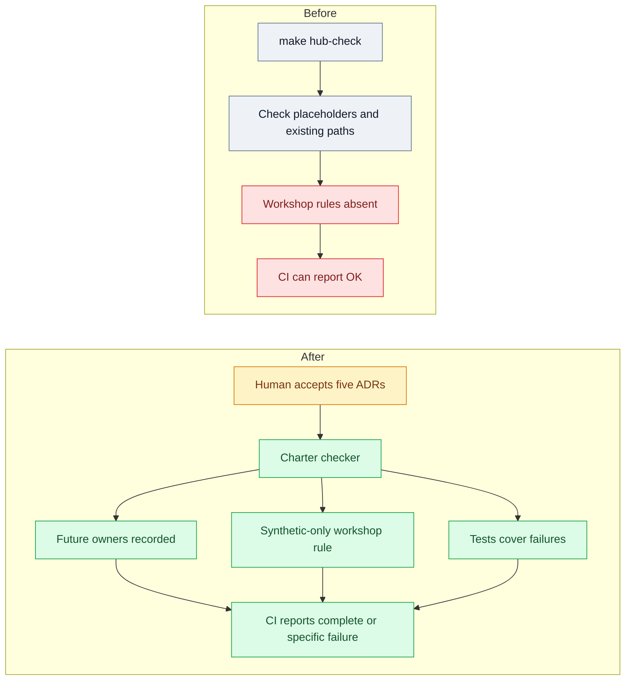

# Change brief — freeze the Workshop MVP charter and contracts
Brief: workshop_mvp_plan_set_s1_charter_contracts · plan 18bbbed85abf · 2026-07-17

## How it works today

- `hub_check.py` checks only unfilled `AGENTS.md` placeholders and that listed paths and contract documents exist (`scripts/hub_check.py:37-49`, `86-124`).
- `make verify` includes that check; its current success result covers only those conditions (`Makefile:13-17`, `28-29`).
- Synthetic development data is permitted today, while a live-firm pilot requires legal, staffing, business, and BAA evidence (`backlog/pi/10_implementation_readiness.md:21-36`).

## Why the problem happens

- No current check requires the five proposed architecture decision records (ADRs), workshop source rule, future-owner declarations, or separation from live-pilot evidence (`scripts/hub_check.py:37-124`).
- The table rejects nonexistent paths, so it cannot safely record planned modules before their code and contract document arrive (`scripts/hub_check.py:94-106`, `CONTRACTS.md:3-7`).
- Continuous integration (CI) can therefore report success while those protections are missing (`Makefile:13-17`, `scripts/hub_check.py:111-124`).

## What will change

- Add ADR-0013 through ADR-0017 and checks for their ownership, required workshop documents, and the reserved ADR-0009 (`workshop_mvp_plan_set_s1_charter_contracts.md:241-252`).
- Record two planned owners outside the existing table, then require code, contract document, and table row together when each module arrives (`workshop_mvp_plan_set_s1_charter_contracts.md:59-72`).
- Add focused hub-check tests and record future tenant-key requirements without changing the database schema (`workshop_mvp_plan_set_s1_charter_contracts.md:160-163`, `241-253`).

## Why this fix solves it

- The checker will turn missing charter material and incomplete module creation into a specific failed command, rather than an unnoticed documentation gap (`workshop_mvp_plan_set_s1_charter_contracts.md:228-245`).
- Keeping planned owners out of the existing table preserves its promise that every listed path exists (`scripts/hub_check.py:94-108`, `workshop_mvp_plan_set_s1_charter_contracts.md:248-250`).

## What it touches

- `scripts/hub_check.py` and new `backend/tests/test_hub.py` for the expanded checks and failure cases (`scripts/hub_check.py:37-128`).
- Five ADR files, `CONTRACTS.md`, `docs/system_contract.md`, and the module-contract index (`docs/adr/0010-pre-auth-security-tables.md:6-9`, `docs/system_contract.md:22-30`).
- The readiness memo and new `workshop/README.md` for the owned-synthetic-only rule (`backlog/pi/10_implementation_readiness.md:26-36`).

## Calls we made without asking you

- S1 records future database requirements but does not add database constraints or migrations (`workshop_mvp_plan_set_s1_charter_contracts.md:160-163`).
- The two planned modules remain declarations until all three implementation pieces arrive (`workshop_mvp_plan_set_s1_charter_contracts.md:65-72`).

## The picture

