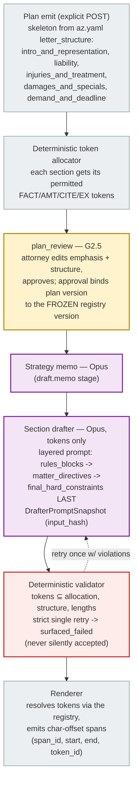
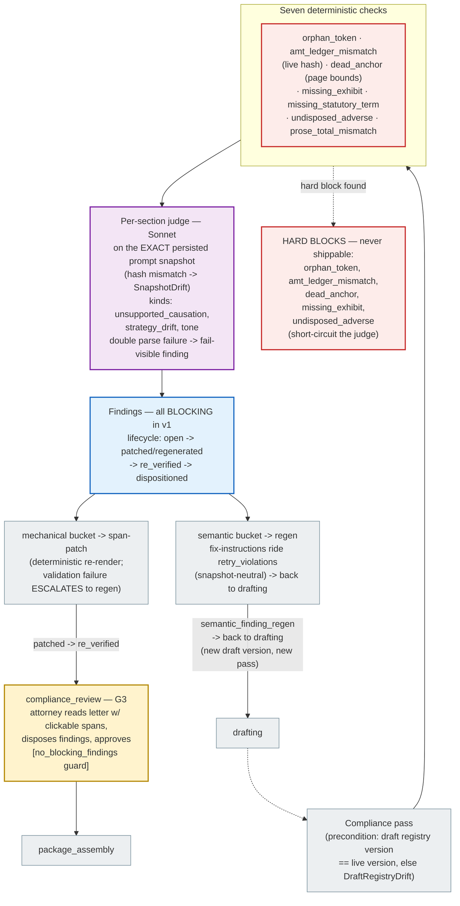

# Demand Generation — Plan (G2.5), Tokens-Only Drafting, Compliance (G3)

The only place an LLM writes prose the client will send — so it is the most
constrained place in the system. Brain-2 drafts **against tokens**, its exact
prompt is snapshotted, and a compliance panel re-verifies everything before the
attorney sees a letter (`backend/app/engine/brain2/`,
`backend/app/engine/compliance/`).

## Plan → draft (G2.5 → drafting)

## Compliance pass → G3

## The two symmetry locks

- **Drafter ↔ judge:** the judge evaluates the *persisted* `DrafterPromptSnapshot`
  (matched by `input_hash`), so it judges exactly what the drafter was told —
  a drifted prompt is a `SnapshotDrift` error, not a silently wrong verdict.
- **Mechanical ↔ semantic routing is conservative:** only the four enumerated
  mechanical kinds (`amt_ledger_mismatch`, `missing_exhibit`,
  `missing_statutory_term`, `prose_total_mismatch`) are span-patch-routable;
  every other kind defaults to regeneration (`compliance/engine.py::bucket_for`).

## What the attorney sees

Sections stream over SSE `section` events as they validate; the G3 panel shows
the rendered letter with every cited span clickable (the spans emitted by the
renderer power the [provenance round-trip](provenance_roundtrip.md)). Draft
lifecycle: `drafting → validated → in_compliance → approved`; a re-draft after
drift is a **new version**, never an overwrite (`superseded`).
