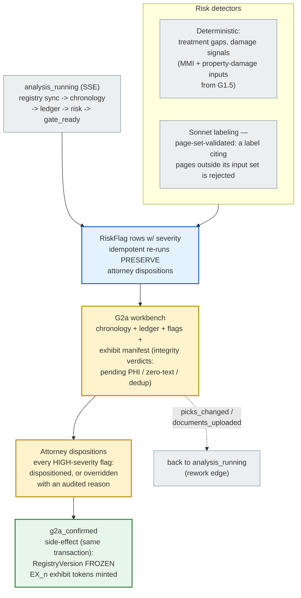

# Evidence Review (G2a) — Risk Flags, Exhibits, and the Freeze

After strategy intake, the analysis run assembles everything the attorney needs
to judge the case's evidentiary posture — then G2a approval **freezes the
registry version**, pinning exactly which facts the plan, draft, and package
are allowed to cite (`backend/app/engine/brain1/analysis.py`,
`backend/app/engine/brain1/risk.py`).

## Why the freeze matters

- Everything downstream carries the pinned version: G2.5 approval binds the
  plan to it (`registry_version_match` guard), the drafter's prompt snapshot
  embeds it, every compliance pass asserts it, and the `ArtifactSet` is keyed
  by it. A late record can't silently change what an approved letter says —
  it bumps the version and the invalidation matrix sends the matter back to
  this gate.
- **Dispositions are the product**, not friction: a treatment-gap flag the
  attorney disposes with a reason becomes ammunition (the reason feeds the
  provenance report's "adverse facts considered" part; an undisposed adverse
  fact is a G3 hard block — `undisposed_adverse`).
- Exhibit selection here is what the binder builds from: excluded pages
  (e.g. PHI the firm won't produce) are recorded per exhibit and honored
  byte-for-byte at package time.

## Failure honesty

- Detector re-runs are idempotent — re-running analysis after new documents
  keeps prior attorney dispositions attached to the surviving flags.
- If the LLM labeler is offline (`LLM_PROVIDER=null`), deterministic detectors
  still run; labeling degrades to unlabeled flags rather than fabricated ones
  (skip-not-guess).
