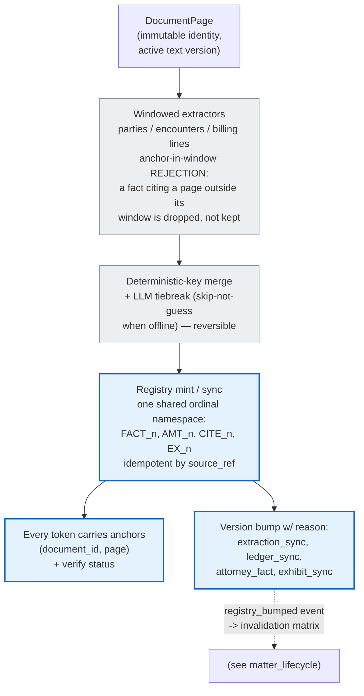
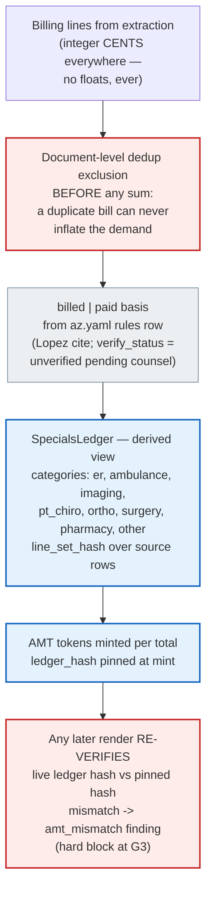

# Fact Registry & Money — from Page to Token to Ledger

The registry is the system's spine: every assertable fact becomes a **token**
with a source anchor, and every dollar figure is re-derivable from source rows.
Brain-2 later drafts *against tokens only* — it never sees a raw name, date, or
amount it could distort (`backend/app/engine/tokenizer/registry.py`,
`backend/app/money/`).

## Facts: page → token

## Money: bills → specials ledger → AMT tokens

## Token render outcomes (what downstream consumers get)

`resolve_for_render` returns one outcome per token — the letter renderer, the
compliance checks, and the provenance endpoint all speak this vocabulary:

| Outcome | Meaning | Downstream effect |
| --- | --- | --- |
| `ok` | resolves at the current registry version | renders the display form |
| `orphan` | token not in the registry | renders the sentinel `[UNRESOLVED FACT]` (deliberately not token-shaped) + `orphan_token` hard block |
| `amt_mismatch` | ledger changed since mint | `amt_ledger_mismatch` hard block |
| `unverified` / `disputed` | fact exists but isn't attorney-verified / is contested | surfaced at gates; the letter can't ship around a hard block |

## Wire discipline

Nothing token-shaped ever serializes: the API sends bare ids (`FACT_3`), and
`wire_guard.scan_wire_payload` scans every response — a leak **raises in dev**
(500) and scrubs-to-sentinel + logs in prod. Attorney edits at G1 land as
`attorney_fact` registry entries with their own version bump, never as silent
mutations. Chronology narratives are built tokens-only and rendered through the
same resolver (`app/engine/brain1/`).
