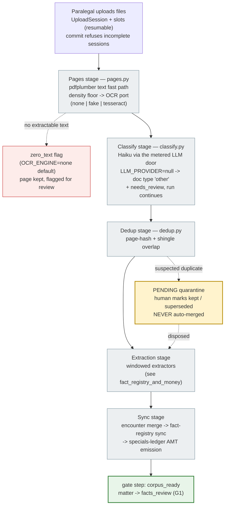

# Intake & Phase 0 — from Upload to `corpus_ready`

A paralegal drags in the records corpus; Phase 0 turns it into classified,
deduplicated, extracted pages without losing or inventing anything. The run is
**re-entrant and resumable**: a crashed or interrupted run picks up where each
document stopped (`backend/app/corpus/ingest/phase0.py`).

## Where documents can be, and what the UI sees

- Progress streams over SSE with the closed vocabulary only: `status`,
  `doc_state`, `gate_ready`, `budget_warning`, `error` — there are **no
  internal-reasoning events** by design (`app/models/enums.py::SseEvent`).
- A poison document (corrupt PDF) is marked `failed` and surfaced; it never
  crashes the run or blocks the other documents.
- A document that already finished OCR re-enters at the extraction stage only —
  stages never redo committed work.
- **Late documents after `corpus_ready`** raise the `documents_uploaded` event:
  from `evidence_review` the matter reworks to `analysis_running`; later than
  that, the registry bump cascade applies (see
  [matter_lifecycle](matter_lifecycle.md)).

## Trust properties

- Page identity is immutable: re-OCR **appends** a new `PageText` and moves the
  `active_text_id` pointer — the original extraction is never overwritten.
- Every run writes a per-matter JSON-line log (`app/core/matter_logs.py`), so
  "what happened to this document" is always answerable after the fact.
- Dedup never destroys: suspected duplicates are quarantined for a human
  decision, and the losing copy is marked `superseded`, not deleted.
