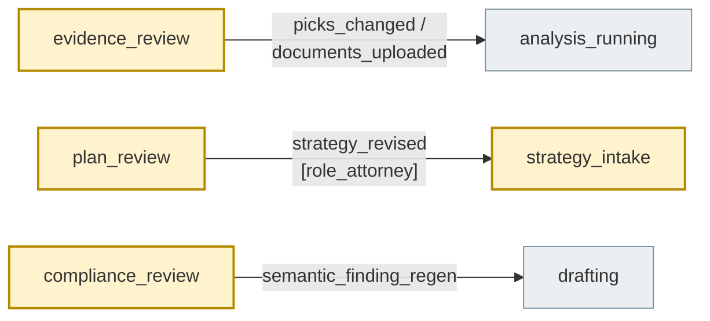

# Matter Lifecycle — the Gate Machine

One matter moves through **ten states**: four run automatically (gray), five are
attorney gates (amber), and `package_ready` is terminal and immutable. Every
edge below is a row in `backend/app/engine/orchestrator/machine.py::TRANSITIONS`;
guards are named in brackets and evaluated by `guards.evaluate` (a failed gate
returns **all** failed guards, not just the first).

## Forward path

```mermaid
flowchart TB
    cp["corpus_processing<br/>Phase 0: pages, classify,<br/>dedup, extract, sync"]:::auto
    fr["facts_review — G1<br/>attorney confirms parties,<br/>dates, SOL deadlines"]:::gate
    si["strategy_intake — G1.5<br/>attorney sets theory, MMI,<br/>property damage, targets"]:::gate
    ar["analysis_running<br/>chronology, ledger,<br/>risk detectors"]:::auto
    er["evidence_review — G2a<br/>attorney disposes risk flags,<br/>confirms exhibits"]:::gate
    pr["plan_review — G2.5<br/>attorney edits + approves<br/>the strategy plan"]:::gate
    dr["drafting<br/>Brain-2 writes sections<br/>(tokens only)"]:::auto
    cr["compliance_review — G3<br/>attorney disposes findings,<br/>approves the letter"]:::gate
    pa["package_assembly<br/>docx, binder, xlsx,<br/>provenance report"]:::auto
    rdy["package_ready<br/>immutable ArtifactSet"]:::terminal

    cp -- "corpus_ready" --> fr
    fr -- "g1_approved<br/>[role_attorney, deadlines_confirmed]" --> si
    si -- "g15_submitted<br/>[role_attorney, budget_available]" --> ar
    ar -- "analysis_complete" --> er
    er -- "g2a_confirmed<br/>[role_attorney, high_severity_dispositioned_or_override]<br/>side-effect: registry version FROZEN" --> pr
    pr -- "g25_approved<br/>[role_attorney, registry_version_match, budget_available]<br/>side-effect: plan version bound" --> dr
    dr -- "draft_complete" --> cr
    cr -- "g3_approved<br/>[role_attorney, registry_version_match, no_blocking_findings]" --> pa
    pa -- "artifacts_built" --> rdy

    classDef gate fill:#fff3cd,stroke:#b58900,stroke-width:2px,color:#333
    classDef auto fill:#eceff1,stroke:#78909c,color:#333
    classDef terminal fill:#e8f5e9,stroke:#2e7d32,stroke-width:2px,color:#333
```

## Rework edges (attorney-driven do-overs)

## What a `registry_bumped` invalidates

Late records or fact edits bump the registry version. The machine answers "what
does that stale-date?" per state (flow_04's invalidation matrix, encoded as
edges):

| While in | On `registry_bumped` | Why |
| --- | --- | --- |
| `plan_review`, `drafting`, `compliance_review` | **cascade → `evidence_review`** | plan/draft cite a stale registry; attorney re-confirms the evidence delta |
| `corpus_processing`, `analysis_running`, `package_assembly` | self-loop (absorb) | a running build folds the new facts in |
| `facts_review`, `strategy_intake` | self-loop (pre-freeze) | nothing approved yet exists to invalidate |
| `evidence_review` | self-loop (re-present) | the gate re-renders at the new version |
| `package_ready` | **refused** (`IllegalTransition`) | the package is immutable — new records start a new draft cycle |

## Rules that make the gates trustworthy

- **Idempotency:** every gate submit carries a client key; replays return the
  recorded outcome, never a second transition
  (`orchestrator/idempotency.py`).
- **Stale-payload refusal:** submits carry `payload_version` (registry version +
  gate-record count); a mismatch is a typed `409 stale_payload_version`, so an
  attorney never approves a screen older than the data.
- **Overrides are audited:** where a guard allows override
  (`high_severity_dispositioned_or_override`), the override requires a reason
  and lands in the append-only audit log.
- The frontend keys system states on the running-job signal (SSE `status` /
  `gate_ready` events) — `auto_states` in `machine.py` is the authoritative
  list.
