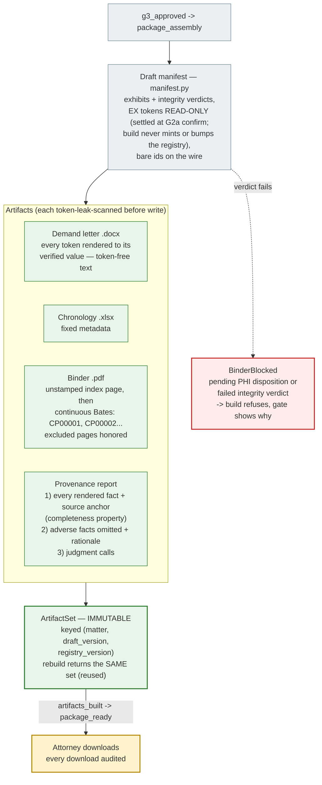

# Package Assembly — Byte-Deterministic Artifacts

G3 approval triggers an automatic build of the deliverable set. The build is
**byte-deterministic** — same matter, same draft version, same registry version
produce sha256-identical files — so "which exact package did we send" is always
answerable (`backend/app/package/`).

## How byte-determinism is achieved

- reportlab `invariant=1`, a pinned pypdf writer `_ID`, and fixed docx/xlsx
  metadata (no timestamps, no random UUIDs) — the whole set hashes stably.
- Storage keys are versioned: `matters/{id}/artifacts/v{draft}.{registry}/...` —
  a new draft or registry version is a **new keyspace**, never an overwrite.

## Business meaning

- `package_ready` is terminal: a `registry_bumped` there is *refused* — late
  records start a new draft cycle rather than mutating a package that may
  already be in an adjuster's inbox.
- The provenance report is the malpractice-defense artifact: it proves every
  asserted fact traces to a source page, and that adverse facts were seen and
  weighed (the attorney's G2a disposition reasons), not missed.
- The letter itself contains **no tokens and no sentinels** — an
  `ArtifactTokenLeak` or an unresolved fact fails the build loudly instead of
  shipping a placeholder to an adjuster.

## BUS-05: settlement, fences, and the replacement cycle

- **EX tokens settle at G2a confirm**, inside the gate-action transaction
  (`service._settle_exhibits_then_freeze`): mint → advance the invalidation cursor →
  FREEZE the settled version. Package assembly consumes settled tokens read-only
  (`build_draft_manifest(require_settled_tokens=True)`) and fails typed
  (`exhibit_tokens_unsettled`) if a pick changed after settlement. The manifest GET is
  read-only at every gate — no write-on-GET mint exists.
- **Completion fence:** immediately before `artifacts_built` advances, the stream re-locks
  the matter and requires the gate still `package_assembly`, the draft non-superseded, and
  draft/matter registry equality — a registry-bump invalidation that won the race leaves
  the built set as immutable HISTORICAL output (`draft_registry_drift` error, no advance).
- **Replacement cycle:** at `package_ready` with a newer registry, the package view flags
  `new_cycle_required`; the attorney's `start_cycle` gate action
  (`new_cycle_started` edge, guarded `role_attorney` +
  `registry_newer_than_packaged_draft`) re-enters `evidence_review` without touching any
  prior artifact bytes or rows.
