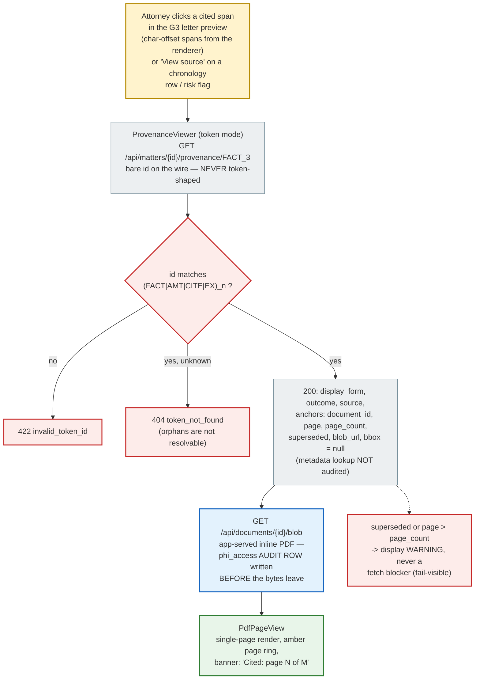

# Provenance Round-Trip — Click a Sentence, See the Source, Leave a Trail

The trust feature: any cited span in the letter (and any chronology row or risk
flag) opens the exact source page, highlighted, in a slide-over — and every
byte of PHI served writes an audit row. As built at M6
(`backend/app/api/routes/provenance.py`, `frontend/components/provenance-viewer.tsx`;
decisions in `docs/adr/0008-m6-provenance-decisions.md`).

## The audit rule (invariant 7)

- **Byte access is audited; metadata is not.** Fetching a document page writes
  a `phi_access` row per fetch, before the response body. Resolving a token to
  its anchors reveals no PHI and is deliberately unaudited — so the audit log
  measures actual PHI exposure, not UI chatter.
- PDFs are **app-served, never presigned** (ADR-0008 §1 — a presigned URL is
  unauditable egress; the design suite's presigned-image variant was rejected).

## Frontend discipline

- `blobUrlFor` in `frontend/lib/provenance.ts` is the **single sanctioned URL
  constructor**; token mode consumes the server's `blob_url` verbatim. No
  component assembles a document URL by hand.
- Highlights are **page-level only**: `bbox` is reserved in the wire shape and
  stays `null` until the S1 OCR/coordinates vendor lands — the UI never fakes
  precision it doesn't have.
- The pdf.js worker ships as a same-origin bundler asset (no CDN), and blob
  fetches ride the session cookie (`withCredentials`) so the audit row carries
  the real user.

## Integrity backstops (Tier-1, `backend/tests/evals/test_tier1_anchor_integrity.py`)

- **E2:** every minted token's anchors round-trip 100% within page bounds on
  the gold fixture.
- **E3:** a dead anchor (page beyond the document) is *detected at G3* as a
  `dead_anchor` hard block — never silently hidden at render.
- The full token → provenance → blob loop measures ~45 ms server-side; the
  M6 exit test proves audit rows land 1:1 with blob fetches over the real app.
